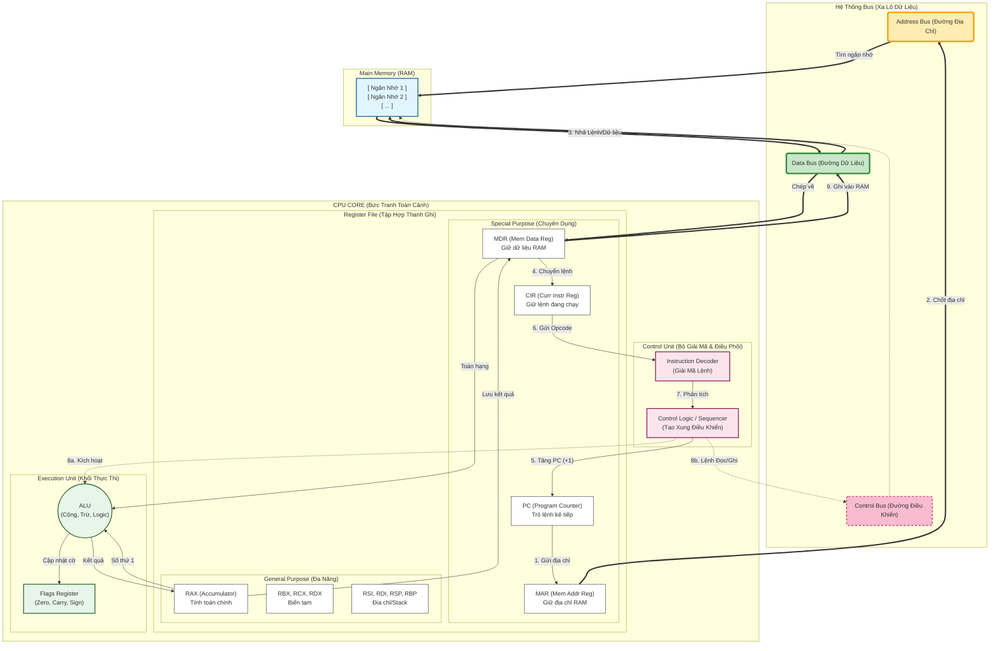
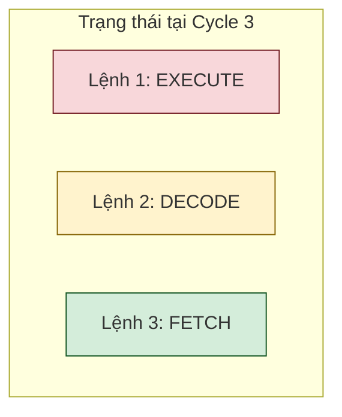
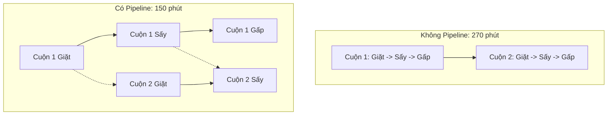
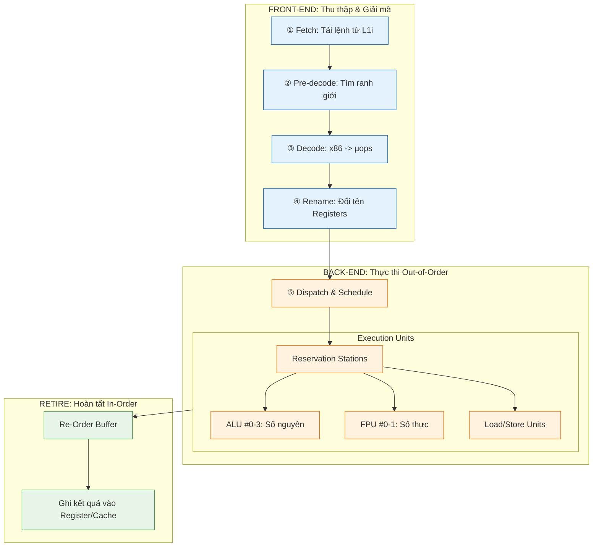
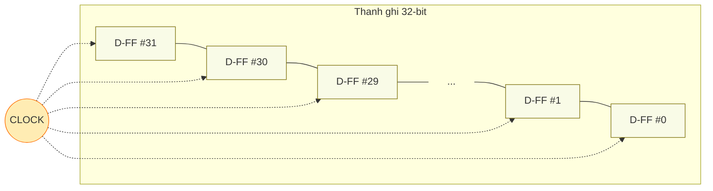
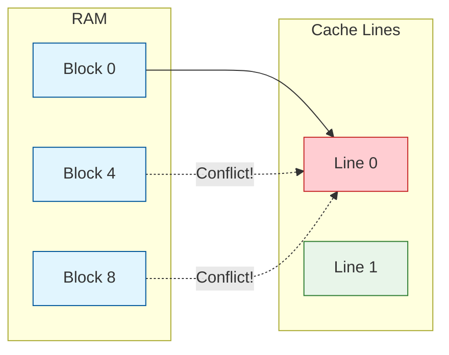
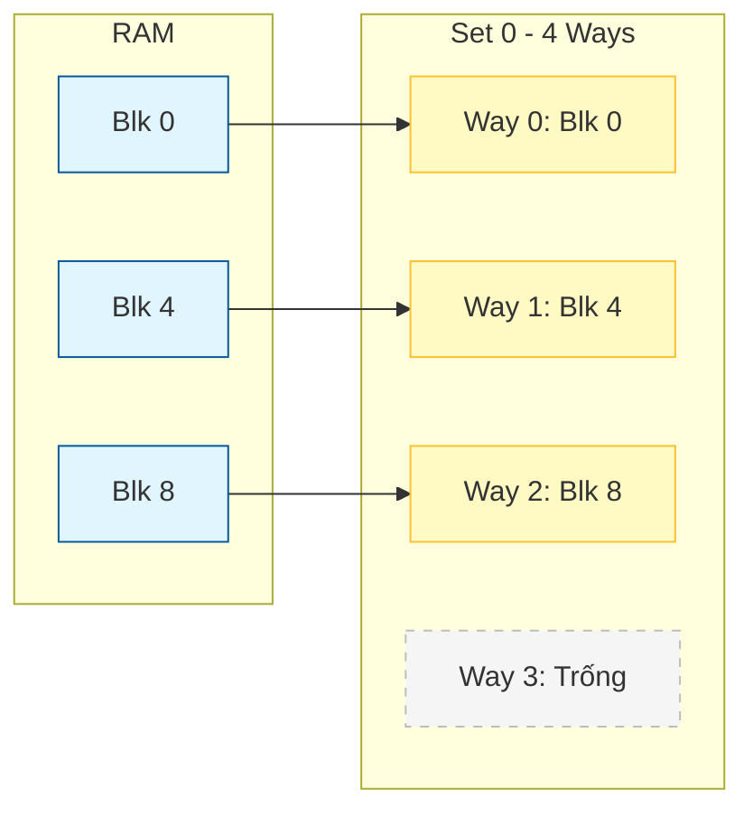


# Mục Lục

- [Chapter 0: Bảng chữ cái của Máy tính (Assembly Primer)](#chapter-0-bảng-chữ-cái-của-máy-tính-assembly-primer)
  - [1. Cấu trúc chương trình (.text vs .data) — Deep Dive](#1-cấu-trúc-chương-trình-text-vs-data-—-deep-dive)
  - [2. ISA (CISC vs RISC) — Bản hợp đồng Software-Hardware](#2-isa-cisc-vs-risc-—-bản-hợp-đồng-software-hardware)
  - [3. Giải phẫu một câu lệnh (Opcode & Operands)](#3-giải-phẫu-một-câu-lệnh-opcode--operands)
  - [4. Các nhóm lệnh cơ bản & Cách truy cập bộ nhớ](#4-các-nhóm-lệnh-cơ-bản--cách-truy-cập-bộ-nhớ)
  - [5. Ví dụ thực chiến: Từ C# sang Assembly](#5-ví-dụ-thực-chiến-từ-c-sang-assembly)
- [Chương 1: Transistor & Logic Gates — Từ Electron đến Tính toán](#chương-1-transistor--logic-gates-—-từ-electron-đến-tính-toán)
  - [1. Chất bán dẫn — Vật liệu nền tảng](#1-chất-bán-dẫn-—-vật-liệu-nền-tảng)
  - [2. MOSFET — Transistor hiện đại](#2-mosfet-—-transistor-hiện-đại)
  - [3. Từ Transistor → Logic Gates (Cổng Logic)](#3-từ-transistor--logic-gates-cổng-logic)
  - [4. Xây dựng mạch Tính toán & ALU (Arithmetic Logic Unit)](#4-xây-dựng-mạch-tính-toán--alu-arithmetic-logic-unit)
  - [6. Mảnh ghép còn thiếu — Kẻ đã quên mình là ai](#6-mảnh-ghép-còn-thiếu-—-kẻ-đã-quên-mình-là-ai)
- [Chương 2: Memory & Storage — Từ Flip-flop đến RAM](#chương-2-memory--storage-—-từ-flip-flop-đến-ram)
  - [1. Vấn đề: CPU nhanh, Bộ nhớ chậm](#1-vấn-đề-cpu-nhanh-bộ-nhớ-chậm)
  - [2. Clock & Cycle — "Nhịp tim" của CPU](#2-clock--cycle-—-nhịp-tim-của-cpu)
  - [3. Kiến trúc CPU Core — Nơi mọi thứ hội tụ](#3-kiến-trúc-cpu-core-—-nơi-mọi-thứ-hội-tụ)
  - [4. CPU Pipeline — Dây chuyền lắp ráp lệnh](#4-cpu-pipeline-—-dây-chuyền-lắp-ráp-lệnh)
  - [5. Pipeline Hazards — Ba kẻ phá hoại Pipeline](#5-pipeline-hazards-—-ba-kẻ-phá-hoại-pipeline)
  - [6. Flip-flop — Viên gạch đầu tiên của Bộ nhớ](#6-flip-flop-—-viên-gạch-đầu-tiên-của-bộ-nhớ)
  - [7. Từ Flip-flop → Register → Register File](#7-từ-flip-flop--register--register-file)
  - [8. SRAM vs DRAM — Hai cách xây bộ nhớ từ Transistor](#8-sram-vs-dram-—-hai-cách-xây-bộ-nhớ-từ-transistor)
  - [9. Cache — Bộ đệm thay đổi cuộc chơi](#9-cache-—-bộ-đệm-thay-đổi-cuộc-chơi)
  - [10. Cache Associativity — Dữ liệu nằm ở đâu trong Cache?](#10-cache-associativity-—-dữ-liệu-nằm-ở-đâu-trong-cache)
  - [11. Cache Coherency — Vấn đề đa lõi](#11-cache-coherency-—-vấn-đề-đa-lõi)
  - [12. Kết nối Unity — Cache Locality là tất cả](#12-kết-nối-unity-—-cache-locality-là-tất-cả)
  - [11. Tổng kết Chapter 2](#11-tổng-kết-chapter-2)

---

# Chapter 0: Bảng chữ cái của Máy tính (Assembly Primer)

## 1. Cấu trúc chương trình (.text vs .data) — Deep Dive

Một chương trình khi chạy (Executable) không chỉ là mớ code hỗn độn. Nó được chia thành các **Segments** (ngăn) rõ ràng. Tại sao phải chia? Để bảo vệ code không bị ghi đè, và tối ưu RAM.

### a. Static Segments (Nằm trong file .exe)
Là những phần được quy định rõ trong code Assembly của bạn.

| Segment | Tên gọi | Chứa gì? | Đặc điểm thú vị | Ví dụ C# |
| :--- | :--- | :--- | :--- | :--- |
| **.text** | Code Segment | **Lệnh máy** (Machine Code). | **Read-Only**. Nếu cố ghi vào đây → Crash (Access Violation). | Hàm `void Update() { ... }` |
| **.data** | Data Segment | **Biến toàn cục/tĩnh** đã khởi tạo khác 0. | Tốn dung lượng file .exe trên đĩa cứng. | `static int score = 100;` |
| **.rodata**| Read-Only Data | **Hằng số (Const)** và chuỗi ký tự. | Gộp chung strings để tiết kiệm RAM (String Interning). | `const float PI = 3.14f;` <br> `string s = "Hello";` |
| **.bss** | Uninitialized | Biến tĩnh **chưa** khởi tạo (mặc định 0). | **Magic:** Không tốn chỗ trên đĩa cứng! File .exe chỉ ghi: "Cần 1MB .bss", OS tự cấp 1MB toàn số 0 khi chạy. | `static int connectionId;` <br> `static byte[] buffer = new byte[1000];` |

### b. Runtime Memory (Được OS cấp khi chạy)
Assembly không có segment `.stack` hay `.heap` (tùy OS/Linker, nhưng về bản chất đây là vùng nhớ động).

| Vùng nhớ | Tên gọi | Chứa gì? | Đặc điểm | Ví dụ C# |
| :--- | :--- | :--- | :--- | :--- |
| **Stack** | Stack | Biến cục bộ, tham số hàm. | Lớn ra/thu vào liên tục. Quản lý bởi thanh ghi `RSP`. | `int localVariable = 5;` |
| **Heap** | Heap | Đối tượng cấp phát động. | Sống cho đến khi GC dọn dẹp. Quản lý bởi OS/Runtime. | `new Enemy();` |

> *   Nếu để trong `.bss` (chưa khởi tạo): File .exe **không tăng byte nào**. Window Loader chỉ cần biết "À, cấp cho anh này 1MB số 0" là xong. Tiết kiệm đĩa!

### c. Program Segments in Action (RISC/ARM64 Example)

Để dễ học, chúng ta sẽ dùng kiến trúc **ARM64** (RISC) — kiến trúc dùng trong iPhone, Mac M1/M2 và Android. RISC rất rõ ràng vì nó phân biệt cực kỳ rạch ròi giữa lệnh tính toán và lệnh truy cập bộ nhớ (**Load-Store Architecture**).

```asm
; ==========================================
; 1. RODATA (Read-Only Data)
; ==========================================
.section .rodata
    msg_format: .asciz "Score: %d\n"    ; Chuỗi kết thúc bằng \0
    PI:         .double 3.14159

; ==========================================
; 2. DATA (Initialized Data)
; ==========================================
.section .data
    .align 4
    score:      .word 100              ; int score = 100 (4 bytes)

; ==========================================
; 3. BSS (Uninitialized Data)
; ==========================================
.section .bss
    .align 8
    player_pos: .skip 12               ; float[3] (mặc định = 0)
    buffer:     .skip 1024             ; 1KB buffer

; ==========================================
; 4. TEXT (Code Segment)
; ==========================================
.section .text
    .global main

main:
    ; --- Thao tác trên .data (LOAD-MODIFY-STORE) ---
    ; 1. Load địa chỉ và giá trị
    adrp x0, score                     ; Lấy địa chỉ trang chứa 'score'
    add  x0, x0, :lo12:score           ; Lấy địa chỉ chính xác vào x0
    ldr  w1, [x0]                      ; LOAD: Đọc giá trị từ RAM vào register w1

    ; 2. MODIFY (Tính toán trong CPU)
    add  w1, w1, #50                   ; score += 50

    ; 3. STORE (Ghi trả lại RAM)
    str  w1, [x0]                      ; STORE: Ghi w1 vào địa chỉ trong x0

    ; --- Thao tác trên .bss ---
    adrp x2, player_pos
    add  x2, x2, :lo12:player_pos
    mov  w3, #10
    str  w3, [x2]                      ; player_pos[0] = 10

    ; --- Gọi printf (Sử dụng .rodata) ---
    adrp x0, msg_format
    add  x0, x0, :lo12:msg_format      ; Tham số 1: format string
    ; w1 đang chứa giá trị score mới (150)
    bl   printf                        ; Branch with Link (Gọi hàm)

    ; Thoát chương trình
    mov  w0, #0                        ; return 0
    ret
```

> [!TIP]
> **Tại sao RISC dễ đọc hơn?** Ở x86 (CISC), bạn có thể dùng `ADD [score], 50` (1 lệnh làm cả 3 việc). Ở ARM (RISC), bạn BẮT BUỘC phải làm 3 bước: **LDR** (Load) → **ADD** (Tính) → **STR** (Store). Điều này giúp bạn thấy rõ dòng chảy dữ liệu giữa RAM và CPU.

### d. Dynamic Segments (Stack & Heap) in Action

Khác với 4 segment tĩnh bên trên, **Stack** và **Heap** không được khai báo bằng từ khóa `.section`. Chúng được thể hiện thông qua các **lệnh điều khiển thanh ghi** và **hàm hệ thống**:

#### 1. Stack — Thể hiện qua Stack Pointer (SP)
Trong ARM64, Stack được quản lý bởi thanh ghi `SP`. Khi bạn gọi một hàm, CPU sẽ "mở rộng" Stack bằng cách giảm giá trị `SP`.

```asm
; --- Ví dụ về Stack (Push/Pop) ---
some_function:
    ; 1. PROLOGUE: Cấp phát 16 bytes trên Stack
    sub sp, sp, #16             ; SP = SP - 16 (Dịch đỉnh Stack xuống)
    
    ; 2. Lưu biến cục bộ vào Stack
    mov w0, #42
    str w1, [sp, #8]            ; Lưu giá trị 42 vào địa chỉ (SP + 8)

    ; ... thực hiện logic ...

    ; 3. EPILOGUE: Thu hồi 16 bytes
    add sp, sp, #16             ; SP = SP + 16 (Dịch đỉnh Stack lên)
    ret
```

#### 2. Heap — Thể hiện qua gọi hàm Allocator
Assembly không tự cấp phát Heap. Nó phải "xin" Hệ điều hành (thông qua `malloc` trong C hoặc `mmap` trong Linux).

```asm
; --- Ví dụ về Heap (Xin RAM từ OS) ---
    mov x0, #1024               ; Tham số 1: Xin 1024 bytes
    bl  malloc                  ; Gọi hàm malloc (Hàm này sẽ xin OS cấp Heap)
    ; Sau khi gọi, x0 sẽ chứa ĐỊA CHỈ vùng nhớ trên Heap vừa được cấp
    
    ; Sử dụng vùng nhớ Heap
    mov w1, #99
    str w1, [x0]                ; Ghi số 99 vào đầu vùng nhớ Heap vừa xin được
```

> [!NOTE]
> **Tóm tắt:** 
> - **Static (.text, .data, .bss)**: Do trình biên dịch quy định sẵn địa chỉ hoặc kích thước trong file chạy.
> - **Dynamic (Stack)**: Do CPU tự quản lý bằng cách tăng/giảm thanh ghi `SP` khi chạy hàm.
> - **Dynamic (Heap)**: Do code của bạn chủ động gọi các hàm của Hệ điều hành để mượn RAM.

### e. Specialized Segments (Nâng cao)

Ngoài 4 trụ cột chính, thực tế còn có các segment "hậu cần" giúp chương trình chạy được trong môi trường OS phức tạp:

| Segment | Ý nghĩa | Tại sao cần? |
| :--- | :--- | :--- |
| **.init / .fini** | Khởi tạo / Kết thúc | Chạy các hàm Constructor/Destructor toàn cục trước/sau `main()`. |
| **.debug** | Debugging Info | Chứa tên biến, số dòng code. Đây là lý do file `.exe` có debug lại nặng hơn file release. |
| **.plt / .got** | Linker Tables | Phục vụ cho **Dynamic Linking**. Giúp chương trình gọi được hàm từ DLL/SO (như Unity gọi thư viện đồ họa). |
| **.rel.text** | Relocation | Chứa thông tin để Linker "sửa" lại địa chỉ nếu chương trình được nạp vào vùng nhớ khác. |

> [!NOTE]
> Khi bạn build Unity sang **C++ (IL2CPP)**, trình biên dịch sẽ tạo ra hàng nghìn file `.cpp`. Kết quả cuối cùng là hàng chục MB dữ liệu nằm rải rác trong các segment này.

### f. Interlude: C Language — "High-level Assembly"

Bạn có bao giờ thắc mắc tại sao người ta nói ngôn ngữ C rất gần với Assembly không? 

Thực tế, C được gọi là **"High-level Assembly"** vì:
1.  **Ánh xạ 1:1**: Hầu hết các lệnh trong C (như `+`, `-`, `&`, `*`) đều ánh xạ trực tiếp xuống 1 hoặc vài lệnh Assembly tương ứng.
2.  **Quản lý bộ nhớ thủ công**: Giống như Assembly, C cho phép bạn can thiệp trực tiếp vào địa chỉ RAM thông qua **Con trỏ (Pointers)**. Bạn có quyền "đụng chạm" vào `.data`, `.bss`, hay tự xin `.heap` y hệt như đang viết Assembly.
3.  **Không có "Bảo mẫu"**: Khác với C# có Garbage Collector (GC) tự dọn dẹp RAM, C và Assembly yêu cầu bạn phải tự quản lý từng byte.

**So sánh sự "gần gũi":**
- **C#**: Cách xa phần cứng nhất (phải qua Virtual Machine, JIT, GC).
- **C / C++**: Đứng ngay sát phần cứng. Bạn viết gì, CPU thực thi gần như y hệt.
- **Assembly**: Chính là phần cứng (dưới dạng chữ viết).

> [!TIP]
> **Unity IL2CPP**: Lý do Unity chuyển code C# của bạn sang C++ rồi mới build ra app là để tận dụng tốc độ "gần phần cứng" này. C++ đóng vai trò là "ngôn ngữ trung gian" giúp code của bạn chạy nhanh hơn và khó bị bẻ khóa (reverse engineering) hơn so với C# thuần.


## 2. ISA (CISC vs RISC) — Bản hợp đồng Software-Hardware

### 2.1. ISA là gì? (Instruction Set Architecture)

ISA (**Instruction Set Architecture**) là **bản hợp đồng** giữa phần cứng (CPU) và phần mềm (Compiler/OS). Nó định nghĩa:
- Tập lệnh CPU hiểu được (ADD, MOV, JUMP, ...)
- Thanh ghi nào có sẵn (RAX, RSP, XMM0, ...)
- Cách đánh địa chỉ bộ nhớ (Addressing Modes)
- Kích thước dữ liệu (8/16/32/64-bit)

```
Tầng abstraction:

  ┌─────────────────────────────────────────────────┐
  │  C#:  health -= damage;                          │   ← Ngôn ngữ bậc cao
  ├─────────────────────────────────────────────────┤
  │  IL:  ldarg.0                                    │   ← Bytecode trung gian
  │       ldfld float Health::Value                  │
  │       ldarg.1                                    │
  │       sub                                        │
  │       stfld float Health::Value                  │
  ├─────────────────────────────────────────────────┤
  │  x86 ASM:                                        │   ← Assembly (1:1 với ISA)
  │       movss  xmm0, [rcx+0x10]   ; load health   │
  │       subss  xmm0, xmm1         ; health -= dmg │
  │       movss  [rcx+0x10], xmm0   ; store back    │
  ├─────────────────────────────────────────────────┤
  │  Machine Code:                                   │   ← Nhị phân thuần
  │       F3 0F 10 41 10                             │
  │       F3 0F 5C C1                                │
  │       F3 0F 11 41 10                             │
  └─────────────────────────────────────────────────┘
       ↑
  Mỗi byte → bộ giải mã → tín hiệu điều khiển ALU/FPU/Load-Store Unit.
```

### 2.2. CISC vs RISC — Hai triết lý thiết kế ISA

```
┌─────────────────────────────────────────────────────────────────────┐
│                    CISC vs RISC                                     │
├─────────────────────────┬───────────────────────────────────────────┤
│        CISC             │            RISC                           │
│  (Complex Instruction   │    (Reduced Instruction                   │
│   Set Computer)         │     Set Computer)                         │
├─────────────────────────┼───────────────────────────────────────────┤
│ Đại diện: x86-64        │ Đại diện: ARM, RISC-V                    │
│ Intel, AMD              │ Apple Silicon, Qualcomm                   │
├─────────────────────────┼───────────────────────────────────────────┤
│ Lệnh PHỨC TẠP:          │ Lệnh ĐƠN GIẢN:                          │
│ 1 lệnh có thể làm      │ 1 lệnh chỉ làm 1 việc                   │
│ nhiều việc cùng lúc     │                                           │
│                         │                                           │
│ Ví dụ:                  │ Ví dụ:                                    │
│ ADD [mem], reg           │ LDR  R1, [mem]    ; Load                │
│ (Đọc RAM + Cộng +       │ ADD  R1, R1, R2   ; Cộng                │
│  Ghi lại RAM trong      │ STR  R1, [mem]    ; Ghi                 │
│  1 lệnh duy nhất)       │ (3 lệnh riêng biệt)                     │
├─────────────────────────┼───────────────────────────────────────────┤
│ Kích thước lệnh:        │ Kích thước lệnh:                         │
│ 1 → 15 bytes (biến đổi)│ 4 bytes CỐ ĐỊNH (ARM)                   │
│ → Bộ giải mã phức tạp  │ → Bộ giải mã đơn giản, nhanh             │
├─────────────────────────┼───────────────────────────────────────────┤
│ Ưu điểm:                │ Ưu điểm:                                  │
│ ✅ Code compact (ít byte)│ ✅ Pipeline hiệu quả hơn                 │
│ ✅ Tương thích ngược     │ ✅ Tiết kiệm năng lượng                  │
│    (chạy code từ 1978)  │ ✅ Dễ tối ưu cho compiler                 │
├─────────────────────────┼───────────────────────────────────────────┤
│ Nền tảng:                │ Nền tảng:                                 │
│ PC, PlayStation, Xbox    │ Mobile, Switch, Mac (M-series)           │
│ Server                   │ VR Headset (Quest)                       │
├─────────────────────────┼───────────────────────────────────────────┤
│ Unity build target:      │ Unity build target:                       │
│ Windows x64, Linux x64  │ Android ARM64, iOS ARM64                 │
│ macOS x64 (Intel Mac)   │ macOS ARM64 (Apple Silicon)              │
└─────────────────────────┴───────────────────────────────────────────┘
```

> **Thực tế hiện đại:** CPU x86 của Intel/AMD bên ngoài là CISC, nhưng bên trong giải mã thành **micro-ops** (μops) giống RISC rồi mới thực thi. Ranh giới CISC/RISC ngày nay đã mờ đi rất nhiều.

### 2.3. Deep Dive: Micro-ops (uOps) — Cầu nối CISC và RISC

Tại sao Intel/AMD vẫn dùng CISC dù RISC có nhiều ưu điểm? Câu trả lời nằm ở **Micro-ops**.

#### a. Quá trình dịch lệnh (Instruction Translation)
Khi bạn chạy một lệnh x86 phức tạp, CPU không thực thi nó trực tiếp. Thay vào đó, bộ giải mã (**Decoder**) bẻ nó thành các lệnh nhỏ hơn, đơn giản hơn gọi là **uOps**.

**Ví dụ: Lệnh x86 `ADD [EAX], EBX`** (Cộng EBX vào giá trị tại địa chỉ RAM tro bởi EAX)
Bộ giải mã sẽ bẻ nó thành 3 uOps:
1.  **LDR**: Load giá trị từ RAM `[EAX]` vào một thanh ghi tạm ẩn.
2.  **ADD**: Cộng `EBX` vào thanh ghi tạm đó.
3.  **STR**: Ghi kết quả từ thanh ghi tạm ngược lại RAM `[EAX]`.

=> Bạn có thấy điều gì không? Bên trong một CPU CISC thực chất là một **"Trái tim RISC"** đang đập!

#### b. uOp Cache — "Phím tắt" siêu tốc
Việc dịch từ CISC sang uOps tốn thời gian và năng lượng. Để tối ưu, CPU hiện đại có một bộ nhớ đệm gọi là **uOp Cache**:
- Nếu một lệnh đã được dịch một lần, lần sau CPU lấy thẳng uOp từ cache, bỏ qua bước giải mã.
- Đây là lý do tại sao các vòng lặp (High-frequency loops) trong C# chạy cực nhanh trên x86.

#### c. Tại sao uOps lại quan trọng cho Hiệu năng?
1.  **Out-of-Order Execution (OoO)**: Vì uOps rất đơn giản, CPU có thể sắp xếp lại thứ tự chạy của chúng để tận dụng tối đa các bộ phận đang rảnh (Port), miễn là không làm sai kết quả cuối cùng.
2.  **Superscalar**: CPU có thể thực thi 4-6 uOps **cùng lúc** trong một nhịp clock.
3.  **Tối ưu hóa năng lượng**: uOps giúp CPU tắt bớt các mạch điện không cần thiết (Clock Gating) dễ dàng hơn so với các lệnh CISC cồng kềnh.

> [!IMPORTANT]
> **Kết luận:** CISC (x86) giống như một cuốn sách dày được viết bằng ngôn ngữ phức tạp để tiết kiệm giấy (dung lượng file), còn CPU là người thông dịch viên cực kỳ giỏi, tự xé lẻ từng câu ra thành các hành động đơn giản để thực hiện nhanh nhất có thể.


## 3. Giải phẫu một câu lệnh (Opcode & Operands)

Một dòng Assembly `ADD EAX, EBX` thực chất gồm 2 phần:

```asm
    ADD      EAX, EBX
   └─┬─┘    └───┬───┘
  Opcode     Operands
(Hành động) (Đối tượng)
```

1.  **Opcode (Operation Code):** Động từ. Làm gì? (ADD, MOV, SUB).
2.  **Operands:** Tân ngữ. Làm với ai?
    *   Thanh ghi (EAX, EBX).
    *   Bộ nhớ (RAM) — Thường viết trong ngoặc vuông `[0x1234]` hoặc `[EAX]`.
    *   Số trực tiếp (Immediate) — Ví dụ `10`, `0xFF`.


## 4. Các nhóm lệnh cơ bản & Cách truy cập bộ nhớ

### 4.1. Addressing Modes (Các cách truy cập bộ nhớ)

Sức mạnh của Assembly nằm ở chỗ nó linh hoạt trong việc lấy dữ liệu. Hãy xem cú pháp `[]` biến hóa như thế nào:

*   **Immediate:** `MOV EAX, 10`
    *   Không truy cập RAM. Giá trị nằm ngay trong lệnh. Nhanh nhất.
*   **Direct (Trực tiếp):** `MOV EAX, [0x00403A10]`
    *   Đến đúng địa chỉ nhà `0x...` lấy đồ. Dùng cho biến `static`.
*   **Register Indirect (Con trỏ):** `MOV EAX, [RBX]`
    *   "RBX chứa địa chỉ nào thì đến đó lấy". Tương đương `*pointer` trong C++.
*   **Register + Offset (Cấu trúc):** `MOV EAX, [RBX + 8]`
    *   "Đến chỗ RBX trỏ tới, đi thêm 8 bước nữa".
    *   Dùng để truy cập **Field** của Class/Struct (Ví dụ: `player.health` nằm ở offset 8).
*   **Base + Index * Scale (Mảng):** `MOV EAX, [RBP + RDI * 4]`
    *   "Bắt đầu từ RBP (mảng), nhảy đi RDI (index) bước, mỗi bước dài 4 bytes (int)".
    *   Đây chính là `array[i]`! CPU tính địa chỉ này trong **1 cycle**.

### 4.2. The Flags Register (EFLAGS) — Trạng thái ẩn

Khi bạn viết `if (a == b)`, CPU làm gì?
1.  Nó thực hiện phép trừ giả: `CMP a, b` (thực chất là `a - b` nhưng không lưu kết quả).
2.  Nó cập nhật **Flags Register** dựa trên kết quả phép trừ đó.

Các cờ (Flag) quan trọng nhất:
*   **ZF (Zero Flag):** Bật lên 1 nếu kết quả = 0. (Tức là `a == b`).
*   **SF (Sign Flag):** Bật lên 1 nếu kết quả âm. (Tức là `a < b`).
*   **OF (Overflow Flag):** Bật nếu tính toán bị tràn số (Signed overflow).
*   **CF (Carry Flag):** Bật nếu tính toán bị nhớ/mượn (Unsigned overflow).

Sau đó lệnh `JE` (Jump if Equal) chỉ đơn giản là: "Nếu ZF == 1 thì nhảy".

### 4.3. 4 Từ vựng cốt lõi (MOV, ADD, SUB, JMP)

Bạn chỉ cần nhớ đúng 4 lệnh này để đọc hiểu 90% ví dụ trong sách:

| Lệnh | Ý nghĩa | Ví dụ C# tương đương |
| :--- | :--- | :--- |
| **MOV** A, B | **Copy** giá trị từ B sang A (Move) | `A = B;` |
| **ADD** A, B | Cộng B vào A, lưu kết quả ở A | `A += B;` |
| **SUB** A, B | Trừ B khỏi A, lưu kết quả ở A | `A -= B;` |
| **JMP** Label | **Nhảy** tới dòng lệnh Label (Jump) | `goto Label;` |

## 5. Ví dụ thực chiến: Từ C# sang Assembly

**Code C#:**
```csharp
int a = 10;
int b = 20;
int c = a + b;
```

**Code Assembly (Dưới lăng kính phần cứng):**
```asm
MOV EAX, 10      ; Load 10 vào thanh ghi EAX
MOV EBX, 20      ; Load 20 vào thanh ghi EBX
ADD EAX, EBX     ; EAX = EAX + EBX (30)
MOV [c], EAX     ; Store 30 từ EAX vào địa chỉ biến c trong RAM
```

> **Bài học:** Một dòng code `int c = a + b` của bạn thực chất là một chuỗi hành động: **Load (Tải lên) → Calculate (Tính) → Store (Cất đi)**.

---

# Chương 1: Transistor & Logic Gates — Từ Electron đến Tính toán

> **Mục tiêu chương:** Hiểu cách một linh kiện vật lý nhỏ bé (transistor) tạo ra nền tảng cho MỌI phép tính trong máy tính — từ phép cộng đơn giản đến việc render hàng triệu polygon trong Unity.

---


## 1. Chất bán dẫn — Vật liệu nền tảng

### 1.1. Ba loại vật liệu dẫn điện

| Loại | Đặc điểm | Ví dụ |
| :--- | :--- | :--- |
| **Dẫn điện (Conductor)** | Electron di chuyển tự do | Đồng (Cu), Nhôm (Al), Vàng (Au) |
| **Cách điện (Insulator)** | Electron bị giữ chặt, không di chuyển | Cao su, Thủy tinh, Nhựa |
| **Bán dẫn (Semiconductor)** | **Có thể bật/tắt** khả năng dẫn điện | Silicon (Si), Germanium (Ge) |

### 1.2. Silicon — "Đất" của ngành công nghiệp chip

Silicon (Si) là nguyên tố phổ biến thứ 2 trên vỏ Trái Đất (sau Oxy). Ở trạng thái nguyên chất, nó **gần như không dẫn điện**. Nhưng khi ta "pha tạp" (doping) thêm các nguyên tố khác, nó trở thành vật liệu kỳ diệu: **Có thể chuyển đổi qua lại giữa Dẫn điện và Cách điện.**

---

## 2. MOSFET — Transistor hiện đại

### 2.1. Mental Model: Công tắc điện tử

Đối với Software Engineer, bạn **KHÔNG CẦN QUAN TÂM** đến vật lý lượng tử bên dưới. Hãy hình dung **MOSFET là một công tắc (Switch)** được điều khiển bằng điện áp.

```text
      Gate (Cổng điều khiển)
        │
      ┌─┴─┐
      │   │  <-- Nút bấm (Điện áp)
      └─┬─┘
  Source│        Drain
   ─────●   ●─────
        │   │
        └─Switch─┘
```

### 2.2. Nguyên lý hoạt động (Vòi nước)

Tưởng tượng MOSFET như một vòi nước:
- **Source:** Nguồn nước (Dòng điện).
- **Drain:** Cống thoát.
- **Gate:** Tay vặn van.

| Trạng thái | Gate (Tay vặn) | Kết quả | Bit |
| :--- | :--- | :--- | :--- |
| **OFF** | 0V (Đóng) | Nước KHÔNG chảy | **0** |
| **ON** | > 0V (Mở) | Nước CHẢY mạnh | **1** |

> **Tại sao cần quan tâm?**
> Việc đóng/mở này tốn **thời gian** và sinh **nhiệt**.
> - Tốc độ đóng mở = Tốc độ CPU (GHz).
> - Nhiệt tỏa ra = Giới hạn hiệu năng (Thermal Throttling).


## 3. Từ Transistor → Logic Gates (Cổng Logic)

### 3.1. Ý tưởng cốt lõi

Một transistor đơn lẻ chỉ là công tắc ON/OFF. Nhưng khi **kết hợp nhiều transistor**, ta tạo ra các **mạch logic** — nền tảng của mọi phép tính.

Có hai họ transistor bổ sung cho nhau:
- **NMOS (N-channel):** Dẫn điện khi Gate = 1 (kéo xuống GND = logic 0)
- **PMOS (P-channel):** Dẫn điện khi Gate = 0 (kéo lên Vdd = logic 1)

Kết hợp cả hai → **CMOS (Complementary MOS):** Mạch tiêu thụ điện cực thấp, chỉ tốn năng lượng khi chuyển trạng thái.

---

### 3.2. Cổng NOT (Inverter) — Cổng đơn giản nhất

**Chức năng:** Đảo ngược tín hiệu. Input 0 → Output 1. Input 1 → Output 0.

```
        Vdd (Nguồn dương)
         │
    ┌────┴────┐
    │  PMOS   │─── Gate = Input A
    └────┬────┘
         │
         ├─────────── Output (Y = NOT A)
         │
    ┌────┴────┐
    │  NMOS   │─── Gate = Input A
    └────┬────┘
         │
        GND (Đất)


Khi A = 0:                          Khi A = 1:
  PMOS ON (dẫn Vdd)                   PMOS OFF
  NMOS OFF                            NMOS ON (dẫn GND)
  Output = Vdd = 1                    Output = GND = 0

Bảng chân lý:
┌───────┬────────┐
│ A (In)│ Y (Out)│
├───────┼────────┤
│   0   │   1    │
│   1   │   0    │
└───────┴────────┘
```

> **2 transistor** → 1 phép tính logic đầu tiên!

---

### 3.3. Cổng NAND — "Cổng Vạn năng" (Universal Gate)

**Chức năng:** Output = 0 **chỉ khi** cả A VÀ B đều bằng 1. Mọi trường hợp khác = 1.

```
        Vdd                    Vdd
         │                      │
    ┌────┴────┐            ┌────┴────┐
    │  PMOS   │─ A         │  PMOS   │─ B       (Mắc SONG SONG)
    └────┬────┘            └────┬────┘
         │                      │
         └──────────┬───────────┘
                    │
                    ├──────────── Output (Y = NOT(A AND B))
                    │
               ┌────┴────┐
               │  NMOS   │─── A
               └────┬────┘                      (Mắc NỐI TIẾP)
               ┌────┴────┐
               │  NMOS   │─── B
               └────┬────┘
                    │
                   GND


Bảng chân lý:
┌───┬───┬───────────┐
│ A │ B │ NAND(A,B) │
├───┼───┼───────────┤
│ 0 │ 0 │     1     │     ← NMOS cả hai OFF → Output kéo lên Vdd
│ 0 │ 1 │     1     │     ← NMOS A OFF → đường xuống GND bị chặn
│ 1 │ 0 │     1     │     ← NMOS B OFF → đường xuống GND bị chặn
│ 1 │ 1 │     0     │     ← Cả hai NMOS ON → Output nối xuống GND
└───┴───┴───────────┘

Tổng: 4 transistors
```

**Tại sao NAND là "Universal"?** Vì mọi cổng logic khác đều có thể xây từ NAND:

```
NOT A        =  NAND(A, A)           ← Nối cả 2 input thành 1

A AND B      =  NOT(NAND(A, B))      ← NAND rồi đảo
             =  NAND(NAND(A,B), NAND(A,B))

A OR B       =  NAND(NOT A, NOT B)
             =  NAND(NAND(A,A), NAND(B,B))

→ Chỉ cần biết NAND, ta xây được MỌI THỨ.
  Đây là lý do bộ nhớ Flash (SSD) gọi là "NAND Flash".
```

---

### 3.4. Cổng AND, OR, XOR — Bộ công cụ đầy đủ

```
  ╔════════════════════════════════════════════════════════════════╗
  ║                 CÁC CỔNG LOGIC CƠ BẢN                        ║
  ╠════════════════════════════════════════════════════════════════╣
  ║                                                               ║
  ║  AND (VÀ) ── 6 transistors                                   ║
  ║  "Cả hai phải đúng"                                           ║
  ║  ┌───┬───┬──────────┐                                        ║
  ║  │ A │ B │ A AND B  │      Ẩn dụ: Khóa cửa cần CẢ HAI chìa  ║
  ║  ├───┼───┼──────────┤      → Chìa A VÀ Chìa B mới mở được   ║
  ║  │ 0 │ 0 │    0     │                                        ║
  ║  │ 0 │ 1 │    0     │                                        ║
  ║  │ 1 │ 0 │    0     │                                        ║
  ║  │ 1 │ 1 │    1     │  ← Chỉ trường hợp này ra 1             ║
  ║  └───┴───┴──────────┘                                        ║
  ║                                                               ║
  ║  OR (HOẶC) ── 6 transistors                                  ║
  ║  "Ít nhất một đúng"                                           ║
  ║  ┌───┬───┬──────────┐                                        ║
  ║  │ A │ B │ A OR B   │      Ẩn dụ: 2 công tắc đèn song song   ║
  ║  ├───┼───┼──────────┤      → Bất kỳ ai bật cũng sáng đèn     ║
  ║  │ 0 │ 0 │    0     │  ← Chỉ trường hợp này ra 0             ║
  ║  │ 0 │ 1 │    1     │                                        ║
  ║  │ 1 │ 0 │    1     │                                        ║
  ║  │ 1 │ 1 │    1     │                                        ║
  ║  └───┴───┴──────────┘                                        ║
  ║                                                               ║
  ║  XOR (HOẶC LOẠI TRỪ) ── 8-12 transistors                    ║
  ║  "Khác nhau mới đúng"                                        ║
  ║  ┌───┬───┬──────────┐                                        ║
  ║  │ A │ B │ A XOR B  │      Ẩn dụ: 2 công tắc cầu thang       ║
  ║  ├───┼───┼──────────┤      → Đèn đổi trạng thái mỗi khi     ║
  ║  │ 0 │ 0 │    0     │        BẤT KỲ AI bật/tắt               ║
  ║  │ 0 │ 1 │    1     │                                        ║
  ║  │ 1 │ 0 │    1     │                                        ║
  ║  │ 1 │ 1 │    0     │                                        ║
  ║  └───┴───┴──────────┘                                        ║
  ║                                                               ║
  ║  XOR rất đặc biệt vì: A XOR B = Bit tổng của phép cộng!     ║
  ║  Đây là nền tảng xây dựng mạch CỘNG (Adder).                 ║
  ║                                                               ║
  ╚════════════════════════════════════════════════════════════════╝
```

---

## 4. Xây dựng mạch Tính toán & ALU (Arithmetic Logic Unit)

Chúng ta thường nghe nói CPU có "bộ não" là ALU. Nhưng bên trong ALU là gì? Thực chất, ALU là tập hợp của nhiều mạch con chuyên biệt được ghép lại.

1.  **Mạch Tính toán (Arithmetic Circuits):** Xử lý toán học như Cộng, Trừ, Nhân... (Ví dụ: *Adder, Subtractor, Multiplier*).
2.  **Mạch Logic (Logic Circuits):** Xử lý từng bit như AND, OR, XOR, NOT, Shift... (Ví dụ: *Shifter, Comparator*).
3.  **ALU (Bộ Số học & Logic):** Là "cỗ máy tổng hợp" bao gồm **CẢ HAI** loại trên + bộ chọn (MUX) để quyết định dùng mạch nào.

Hành trình của chúng ta: Xây dựng từng mạch nhỏ (Adder) → Ghép lại thành ALU hoàn chỉnh.

### 4.1. Half Adder — Bộ cộng nửa

*   **Tạo từ:** 1 cổng **XOR** + 1 cổng **AND**.
*   **Chức năng:** Cộng 2 bit đơn lẻ (A + B).
*   **Kết quả:**
    *   **Sum** (Tổng): A XOR B (Khác nhau thì bằng 1).
    *   **Carry** (Nhớ): A AND B (Cả hai bằng 1 thì nhớ 1).


### 4.2. Full Adder — Bộ cộng đầy đủ

*   **Tạo từ:** 2 Half Adders + 1 cổng OR.
*   **Chức năng:** Cộng 3 bit: A + B + **Carry từ bit trước**.
*   **Tại sao cần?** Để cộng các số nhiều bit (ví dụ bit hàng chục cần nhớ từ hàng đơn vị).

> **Mental Model:** Giống như học sinh tiểu học cộng bài toán: "3 cộng 5 bằng 8, nhớ 1". Full Adder xử lý cái "nhớ 1" đó.

**Bài toán:** Cộng A + B + Cin (bit nhớ từ phép cộng trước đó).

```
Ví dụ:  Cộng 5 + 3 ở dạng nhị phân (4-bit)

         Carry: 1 1
                0 1 0 1    (5)
              + 0 0 1 1    (3)
              ─────────
                1 0 0 0    (8)

Từ phải sang trái:
  Bit 0: 1+1+0   = 10 → Sum=0, Carry=1        (Full Adder #0)
  Bit 1: 0+1+1   = 10 → Sum=0, Carry=1        (Full Adder #1)
  Bit 2: 1+0+1   = 10 → Sum=0, Carry=1        (Full Adder #2)
  Bit 3: 0+0+1   = 01 → Sum=1, Carry=0        (Full Adder #3)
  Kết quả: 1000 = 8 ✓

──────────────────────────────────────┘

Tổng: ~40 transistors cho 1 Full Adder
```

### 4.3. Ripple Carry Adder — Mạch cộng đa bít

*   **Tạo từ:** Nối tiếp 32 (hoặc 64) cái Full Adder lại với nhau.
*   **Chức năng:** Cộng hai số nguyên 32-bit (int) hoặc 64-bit (long).
*   **Cơ chế:** Bit nhớ (Carry) lan truyền từ bit thấp nhất lên bit cao nhất như sóng nước (ripple). CPU hiện đại dùng mạch "Carry Lookahead" để tính song song nhanh hơn.

#### > Code to Hardware: ADD
Khi bạn viết `c = a + b;` trong C#:
1.  **Compiler:** Dịch sang Assembly `ADD R1, R2`.
2.  **Hardware:**
    *   Tín hiệu điện chạy qua chuỗi 32 Full Adders (~1,280 transistors).
    *   Sau ~1 clock cycle, kết quả xuất hiện ở output `Sum` và được ghi lại vào Registers.

---

### 4.4. Subtractor — Mạch trừ (Không cần xây mới!)

*   **Tạo từ:** Mạch Adder + cổng **XOR** + 1 bit Carry đầu vào.


---

### 4.5. Multiplexer (MUX) — Bộ chọn tín hiệu (The Decision Maker)

Nếu Arithmetic Circuits là "Công nhân", thì MUX chính là "Trưởng phòng" — người quyết định công việc nào được thông qua. 

> **Mental Model: Đường ray tàu hỏa (Train Track Switch)**
> Tưởng tượng 2 đoàn tàu (Data A và Data B) đang lao tới. Chỉ có 1 đường ray ra (Output).
> - Cần một cái **Cần gạt (Select Signal)**.
> - Gạt sang trái: Tàu A đi qua.
> - Gạt sang phải: Tàu B đi qua.
> - **MUX chính là cái cần gạt đó.**

#### a. MUX 2:1 (Cơ bản nhất)
Chọn 1 trong 2 input (I0 hoặc I1) dựa trên 1 bit Select (S).

**Bên trong hộp đen MUX 2:1 có gì?**
Nó được ghép từ 3 loại cổng logic cơ bản:
1.  **Cổng NOT:** Để tạo ra tín hiệu đảo của Select.
2.  **Cổng AND:** Để "lọc" input (Chỉ cho qua khi điều kiện đúng).
3.  **Cổng OR:** Để gộp kết quả lại.

```text
       Input 0 (A) ────┐
                       │    ┌─────────┐
                       ├───►│  MUX    │────► Output (Y)
                       │    │  2:1    │
       Input 1 (B) ────┘    └────▲────┘
                                 │
                            Select (S)

   Công thức Logic: Y = (A AND NOT S) OR (B AND S)
   
   Giải thích:
   - Khi S = 0: (NOT S) = 1 → Cổng trên mở (A đi qua), cổng dưới đóng (B bị chặn).
   - Khi S = 1: (NOT S) = 0 → Cổng trên đóng (A bị chặn), cổng dưới mở (B đi qua).
   
   → Tổng cộng: 1 NOT + 2 AND + 1 OR = Khoảng 12-20 transistors.
```


#### c. Tại sao MUX là "Trái tim" của ALU?

Trong một ALU thực tế, **TẤT CẢ** các mạch (Adder, Subtractor, AND, OR...) đều **chạy cùng lúc!**

> **Case Study: Lệnh `c = a + b`**
> 1.  **Logical Level (Tư duy Logic):** 
>     - **CU (Control Unit)** gửi tín hiệu chọn `000` tới MUX.
>     - MUX "mở cổng" cho kết quả từ bộ Cộng và chặn các bộ phận khác. 
>     - Đây là cách lý tưởng nhất để hiểu về "quyền lựa chọn" của MUX.
> 
> 2.  **Physical Level (Thực tế Intel/AMD - Clock Gating):**
>     - Nếu CPU hiện đại để *tất cả* mạch chạy cùng lúc, chip sẽ nóng chảy vì lãng phí năng lượng.
>     - **Clock Gating:** CU (Control Unit) sẽ chỉ gửi xung nhịp (nhịp tim) cho bộ Cộng. Các bộ phận như Nhân (Multiplier) hay Chia (Divider) sẽ bị "ngắt nhịp tim" để không tiêu thụ điện năng.
>     - **Power Gating:** Ở các đơn vị lớn hơn (như AVX-512), CPU thậm chí ngắt hẳn nguồn điện nếu không dùng tới.
> 
> **Kết luận:** MUX là "người đưa ra quyết định" cuối cùng về mặt dữ liệu, nhưng **Clock Gating** mới là "người tiết kiệm điện" thực sự trong các CPU hiện đại của Intel và AMD.

#### > Code to Hardware: Toán tử `? :` và `if`
Khi bạn viết:
```csharp
int result = condition ? a : b;
```
Trình biên dịch sẽ cố gắng biến nó thành một lệnh **CMOV (Conditional Move)** — sử dụng MUX phần cứng để chọn A hoặc B mà **không cần rẽ nhánh (branching)**. Cực kỳ nhanh!


#### > Code to Hardware: Conditional Move
Khi bạn dùng `math.select(a, b, condition)` trong Burst:
1.  **Assembly:** `CMOVNE EAX, EBX` (Conditional Move - x86) hoặc `CSEL W0, W1, W2, NE` (ARM).
2.  **Hardware:**
    *   Thay vì dùng `JUMP` (nhảy dòng lệnh), CPU dùng MUX để chọn giá trị.
    *   Nếu `condition` đúng, MUX chọn `b`. Sai chọn `a`.
    *   **Không có Branch Prediction penalty!**

---

### 4.6. Shifter — Mạch dịch bit

*   **Tạo từ:** Hàng loạt **MUX** (Bộ chọn) xếp tầng.
*   **Chức năng:** Dịch các bit sang trái hoặc phải.
    *   Dịch trái (`<<`) = Nhân 2.
    *   Dịch phải (`>>`) = Chia 2.
*   **Barrel Shifter:** Thiết kế thông minh dùng MUX chia tầng, cho phép dịch `n` bit bất kỳ chỉ trong **1 Clock Cycle** (thay vì dịch từng bước).

#### > Code to Hardware: Bitwise Shift
Trong Unity, `transform.position * 2` thường chậm hơn chút xíu so với `x << 1` (về lý thuyết), nhưng compiler hiện đại đã tự tối ưu việc này. Tuy nhiên, trong **Bitmask/LayerMask**, shifter hoạt động liên tục!

**Shifter dịch tất cả bits sang trái hoặc phải.** Dịch trái 1 bit = nhân 2, dịch phải 1 bit = chia 2.

```
Shift Left Logical (SHL) — Ví dụ: 00001010 << 2

   Trước:   0 0 0 0 1 0 1 0   = 10
   Dịch ←2: 0 0 1 0 1 0 0 0   = 40
                         ↑ ↑
                     Điền 0 vào

   10 << 2 = 10 × 4 = 40 ✓  (Mỗi dịch trái = ×2)


Shift Right Logical (SHR) — Ví dụ: 00101000 >> 2

   Trước:   0 0 1 0 1 0 0 0   = 40
   Dịch →2: 0 0 0 0 1 0 1 0   = 10
             ↑ ↑
         Điền 0 vào

   40 >> 2 = 40 ÷ 4 = 10 ✓  (Mỗi dịch phải = ÷2)


Barrel Shifter — Dịch N bit trong 1 clock cycle:

   Mạch tổ hợp dùng MUXes nhiều tầng:

   Tầng 0: MUX quyết định dịch 0 hay 1 bit   (dựa trên shift[0])
   Tầng 1: MUX quyết định dịch 0 hay 2 bits  (dựa trên shift[1])
   Tầng 2: MUX quyết định dịch 0 hay 4 bits  (dựa trên shift[2])
   Tầng 3: MUX quyết định dịch 0 hay 8 bits  (dựa trên shift[3])
   Tầng 4: MUX quyết định dịch 0 hay 16 bits (dựa trên shift[4])

   → 5 tầng MUX = dịch bất kỳ 0-31 bit cho số 32-bit!
   → Tổng: ~32 MUXes × 5 tầng × 12 transistors = ~1,920 transistors


   Input:    [b31][b30][b29]...[b1][b0]
                │    │    │        │   │
             ┌──▼────▼────▼────────▼───▼──┐
             │  Tầng 0: Shift 0 or 1?     │ ← shift[0]
             └──┬────┬────┬────────┬───┬──┘
             ┌──▼────▼────▼────────▼───▼──┐
             │  Tầng 1: Shift 0 or 2?     │ ← shift[1]
             └──┬────┬────┬────────┬───┬──┘
             ┌──▼────▼────▼────────▼───▼──┐
             │  Tầng 2: Shift 0 or 4?     │ ← shift[2]
             └──┬────┬────┬────────┬───┬──┘
                │    │    │        │   │
             ... (tầng 3, 4)
                │    │    │        │   │
             [r31][r30][r29]...[r1][r0]  = Result
```

#### > Code to Hardware: SHL / SHR
1.  **C#:** `int x = a << 2;` (hoặc `a * 4`)
2.  **Assembly (x86):** `SHL EAX, 2`
3.  **Hardware:**
    *   Tín hiệu điện chạy qua tầng MUX số 1 (dịch 2 bit).
    *   Bỏ qua các tầng MUX khác.
    *   Kết quả có ngay trong 1 cycle. Nhanh hơn mạch nhân (`IMUL`) nhiều (mất 3-4 cycles).

> **Kết nối Unity:** Trong Burst-compiled code, `x << n` hoặc `x >> n` = 1 lệnh Assembly (`SHL`/`SHR`). Bitwises operations trong Lab 1 (BitFlags) — mỗi shift chạy qua chính mạch Barrel Shifter này. Shift nhanh hơn multiply (`x * 4` = `x << 2`), đây là lý do compilers tự convert `x * 2^n` thành shift!

---

### 4.7. Multiplier — Mạch nhân

*   **Cơ chế:** "Shift-and-Add" (Nhân nhị phân giống nhân trên giấy).
*   **Đặc điểm:** Phức tạp (~30,000+ transistors) và chậm hơn (3-5 cycles). CPU hiện đại dùng **Wallace Tree** để cộng song song các kết quả trung gian, giảm thời gian chờ.

#### > Code to Hardware: MUL / IMUL
Mỗi lệnh `float3 a * b` trong Burst Job kích hoạt bộ **FPU Multiplier**. Với SIMD (AVX2), CPU có thể chạy 8 bộ nhân song song (`VMULPS`), thực hiện hàng tỷ phép tính mỗi giây cho game.

---

### 4.8. Comparator — Mạch so sánh

*   **Cơ chế:** So sánh A và B bằng mạch trừ (A - B) nhưng chỉ giữ lại các **Flags** (ZF, SF...).
*   **Ứng dụng:** Dùng cho mọi câu lệnh `if`, `for`, `while`.

#### > Code to Hardware: IF
Khi bạn viết `if (health <= 0) Die();`:
1.  **CMP EAX, 0:** Chạy mạch Comparator (thực chất là trừ `health - 0`).
2.  **FLAGS:** Nếu kết quả = 0, cờ **ZF (Zero Flag)** bật lên 1. Nếu âm, cờ **SF (Sign Flag)** bật lên 1.
3.  **JLE:** Lệnh nhảy này chỉ kiểm tra Flags để quyết định nạp code từ hướng nào.

---

### 4.9. ALU (Arithmetic Logic Unit) — Bộ não hoàn chỉnh

Bây giờ ta thấy ALU = **ghép TẤT CẢ mạch trên bằng MUX**:

```
                    ┌──────────────────────────────────────────────┐
                    │               ALU (32-bit)                    │
                    │                                              │
   A (32-bit) ─────►│  ┌─────────────┐                            │
                    │  │   Adder     │─── Kết quả nếu ADD         │
   B (32-bit) ─────►│  │ (1,280 tr.) │                            │
                    │  ├─────────────┤                            │
                    │  │ Subtractor  │─── Kết quả nếu SUB         │
                    │  │ (=Adder+XOR)│  (dùng lại Adder!)         │
                    │  ├─────────────┤                            │
                    │  │  Multiplier │─── Kết quả nếu MUL         │
                    │  │(30,000 tr.) │                  │         │
                    │  ├─────────────┤                  │         │
                    │  │  AND (32×)  │─── Kết quả nếu AND│         │
                    │  ├─────────────┤                  │  ┌─────┐│
                    │  │  OR  (32×)  │─── Kết quả nếu OR│  │ MUX ││──► Result
                    │  ├─────────────┤                  │  │ 8:1 ││
                    │  │  XOR (32×)  │─── Kết quả nếu XOR│ │     ││
                    │  ├─────────────┤                  │  └──┬──┘│
                    │  │  Shifter    │─── Kết quả nếu SHL│    │   │
                    │  │ (1,920 tr.) │                  │    │   │
                    │  ├─────────────┤                  │    │   │
                    │  │ Comparator  │─── Flags ───────►│ FLAG│   │
                    │  └─────────────┘                       REG │
                    │                                              │
   Opcode (3-bit) ──►──────────────── Select line cho MUX ────────┘
                    │                                              │
                    │  ┌─────────────────────────────────────────┐ │
                    │  │ Opcode Map:                             │ │
                    │  │   000 = ADD    100 = AND                │ │
                    │  │   001 = SUB    101 = OR                 │ │
                    │  │   010 = MUL    110 = XOR                │ │
                    │  │   011 = SHL/R  111 = CMP                │ │
                    │  └─────────────────────────────────────────┘ │
                    │                                              │
                    │  Tổng: ~50,000-80,000 transistors             │
                    │  CPU hiện đại: 4-8 ALU + FPU per core       │
                    │  GPU: 128 ALU per SM × 46 SM = 5,888 ALU!   │
                    └──────────────────────────────────────────────┘
```

**Ví dụ cụ thể — Lệnh `ADD R1, R2`:**
```
Bước 1: CPU đọc lệnh "ADD" → Giải mã Opcode = 0010
Bước 2: Lấy giá trị R1 (= 5 = 00000101) và R2 (= 3 = 00000011) từ Registers
Bước 3: ALU nhận A=R1, B=R2, Opcode=ADD
Bước 4: MUX chọn output từ Adder
Bước 5: Adder tính: 00000101 + 00000011 = 00001000 (= 8)
Bước 6: Kết quả 8 ghi lại vào R1

→ Tất cả diễn ra trong 1 clock cycle (~0.2 nanosecond ở 5GHz)
→ Chỉ là electron chạy qua ~1,300 transistors trong Adder
```


## 6. Mảnh ghép còn thiếu — Kẻ đã quên mình là ai

Chúng ta đã xây dựng được ALU — một cỗ máy tính toán siêu việt từ hàng nghìn cổng logic.
- Nó có thể tính `5000 + 3000` trong nháy mắt.
- Nó có thể so sánh `health <= 0` cực nhanh.

**NHƯNG... có một vấn đề chết người:**
Ngay khi dòng điện đi qua, cổng logic trả về kết quả, và sau đó... **nó quên sạch**.
- Input tắt → Output tắt.
- Không có cách nào để lưu số "8000" lại để dùng cho phép tính sau.

Một CPU mà không có bộ nhớ (Memory) thì chỉ là một chiếc máy tính bỏ túi không có nút "M+" — vô dụng với các chương trình phức tạp.

Để biến chiếc máy tính này thành một **Computer** thực thụ, ta cần một loại mạch điện mới: Một loại mạch có thể **tự duy trì dòng điện** của chính nó.

👉 **Mời bước sang Chapter 2: Nơi ta học cách "bẫy" electron để tạo ra Ký ức.**

---


---
# Chương 2: Memory & Storage — Từ Flip-flop đến RAM

> **Mục tiêu chương:** Hiểu cách transistor tạo ra bộ nhớ, tại sao có nhiều tầng bộ nhớ khác nhau (Memory Hierarchy), và tại sao **Cache Locality** là yếu tố quyết định hiệu năng trong Unity DOTS.

---

## 1. Vấn đề: CPU nhanh, Bộ nhớ chậm

Ở **Chapter 1**, chúng ta đã tạo ra bộ não biết tính toán (ALU). Nó có thể cộng trừ nhân chia siêu tốc.
Nhưng bộ não đó có một điểm yếu chết người: **Nó không có trí nhớ.** (Input tắt → Output mất).

Để giải quyết, ta cần cung cấp cho nó "nguyên liệu" (Data) để tính toán và một nơi để lưu kết quả.

Hãy tưởng tượng bạn là một đầu bếp thiên tài (CPU), có thể chế biến bất kỳ món ăn nào trong **1 giây**. Nhưng:

| Thành phần | Ẩn dụ (Vị trí nguyên liệu) | Thời gian tương ứng |
| :--- | :--- | :--- |
| 📋 **Registers** | Bảng ghi chú trước mặt | Lấy ngay = **0 giây** |
| 🧊 **L1 Cache** | Tủ lạnh cạnh bếp | Mở lấy = **2 giây** |
| 🧊 **L2 Cache** | Tủ lạnh ngoài hành lang | Đi lấy = **5 giây** |
| 🧊 **L3 Cache** | Kho lạnh tầng hầm | Xuống lấy = **15 giây** |
| 🏪 **RAM** | Siêu thị gần nhà | Chạy đi = **3 PHÚT** |
| 🚚 **SSD** | Nhà kho ngoại thành | Gọi giao = **1 GIỜ** |
| 🚢 **HDD** | Nhập khẩu từ nước ngoài | Đợi ship = **1 TUẦN** |

> [!IMPORTANT]
> **Memory Stall**: Đầu bếp (CPU) phải **ĐỨNG ĐỢI** khi nguyên liệu ở xa. Lúc này CPU hoàn toàn không làm gì cả, chỉ ngồi chờ dữ liệu đổ về.


**Giải pháp của ngành công nghiệp:** Tạo ra nhiều tầng bộ nhớ — nhỏ nhưng nhanh ở gần CPU, lớn nhưng chậm ở xa CPU. Đây là **Memory Hierarchy**.

---

## 2. Clock & Cycle — "Nhịp tim" của CPU

> **🎯 Ẩn dụ — Nhạc trưởng dàn nhạc:**
> Tưởng tượng dàn nhạc 100 người. Nếu ai cũng chơi lúc nào tùy thích → **HỖN LOẠN**.
> Nhạc trưởng giơ đũa — **"ĐÁNH!"** — tất cả 100 nhạc công cùng đánh nốt tiếp theo **ĐỒNG LOẠT**.
> Clock signal = **Cây đũa nhạc trưởng** của CPU.
> Mỗi lần "đánh" = tất cả hàng tỷ transistors trong CPU cập nhật trạng thái **CÙNG MỘT KHOẢNH KHẮC**.

### Clock là gì?

**Clock** = MỘT TÍN HIỆU ĐIỆN cứ lặp đi lặp lại: CAO → THẤP → CAO → THẤP...

```text
Volts
 3.3V  +---+   +---+   +---+   +---+
       |   |   |   |   |   |   |   |
   0V  +   +---+   +---+   +---+   +
       ^       ^       ^       ^
     Tick 1  Tick 2  Tick 3  Tick 4
```

> **Cơ chế:**
> - Chỉ tại mỗi **CẠNH LÊN** (Low → High), mọi thứ xảy ra (**Tick**).
> - Giữa 2 cạnh lên = CPU đang **CHỜ** tín hiệu ổn định.

**Clock được tạo ra từ đâu? — Trái tim Thạch anh**

Tín hiệu Clock không tự nhiên có. Nó đến từ một linh kiện nhỏ trên Mainboard gọi là **Bộ dao động Thạch anh (Crystal Oscillator)**.

1.  **Hiệu ứng áp điện:** Khi cho dòng điện chạy qua tinh thể thạch anh, nó sẽ **rung** (co giãn) với tần số cực kỳ ổn định và chính xác (ví dụ: 100 MHz).
2.  **Nhân tần số (PLL):** CPU không chạy ở 100 MHz. Nó dùng mạch nhân tần (Multiplier) để nhân lên 30-50 lần → tạo ra 3 GHz, 5 GHz.
3.  **Tại sao cần thạch anh?** Vì nếu dùng mạch điện thường, nhiệt độ thay đổi sẽ làm tần số sai lệch → CPU chạy không ổn định (treo máy). Thạch anh giữ nhịp "chuẩn từng mili-giây".

> **Ví dụ:** Giống như quả lắc đồng hồ cơ. Quả lắc dao động đều đặn (gốc), và các bánh răng (PLL) nhân chuyển động đó lên để quay kim giây, kim phút.

---

### 2.1. Cycle — 1 "nhịp đập" = 1 đơn vị thời gian

**1 Cycle = Khoảng thời gian GIỮA 2 cạnh lên liên tiếp**

```text
Time --->

Clock:      _   _   _   _   _   _   _
          _| |_| |_| |_| |_| |_| |_| |_

Cycle:    [   1   ][   2   ][   3   ]
Action:   [ Fetch ][ Decode][ Execute ]
```

> **Giải thích:**
> - Trong 1 cycle (giữa 2 Tick), CPU làm trọn vẹn 1 bước công việc.
> - Ví dụ: Tải lệnh → Giải mã → Thực thi.


```text
═══ Clock Speed = Bao nhiêu cycles MỖI GIÂY? ═══

  1 GHz  =  1,000,000,000 cycles/giây    (1 cycle = 1.0 ns)
  3 GHz  =  3,000,000,000 cycles/giây    (1 cycle = 0.33 ns)
  5 GHz  =  5,000,000,000 cycles/giây    (1 cycle = 0.2 ns)
                                                     ↑
                                          Ánh sáng đi được 6cm
                                          trong thời gian này!

  Nhịp tim người:    ~1.2 Hz   (1.2 nhịp/giây)
  Nhịp tim CPU:      ~5 GHz    (5 TỶ nhịp/giây)
  → CPU nhanh hơn tim bạn khoảng 4,000,000,000 lần.
```

### 2.2. Tại sao cần Clock? — Chaos vs Order

```
  ═══ KHÔNG CÓ CLOCK ═══

  Transistor A xong → gửi kết quả cho B
  Nhưng B chưa sẵn sàng! → Kết quả bị MẤT hoặc SAI
  Transistor C xong trước A? → Thứ tự loạn, kết quả vô nghĩa

  = 100 nhạc công chơi tùy hứng → CACophony 🔇


  ═══ CÓ CLOCK ═══

  TICK → TẤT CẢ flip-flops "chụp ảnh" dữ liệu CÙNG LÚC
       → Kết quả ổn định, đúng thứ tự
       → Bước tiếp theo chỉ bắt đầu khi bước trước đã xong

  = 100 nhạc công cùng nhìn nhạc trưởng → Symphony 🎵


  CPU 5 GHz = Nhạc trưởng đánh 5 TỶ nhịp mỗi giây.
  Mỗi nhịp = hàng tỷ transistors cùng bước sang trạng thái mới.
  → Đây là lý do "overclock" (tăng GHz) nguy hiểm:
     Nếu nhạc trưởng đánh quá nhanh, nhạc công chưa kịp đánh nốt
     trước đó → SAI NỐT → CPU crash / BSOD / artifact rendering.
```


## 3. Kiến trúc CPU Core — Nơi mọi thứ hội tụ

### 3.1. Bộ ba trụ cột (ALU - CU - Registers)

Để CPU chạy được, nó cần sự phối hợp nhịp nhàng của 3 bộ phận cốt lõi. Hãy xem bức tranh toàn cảnh (**CPU Datapath**) bên dưới:



### 3.1. Ba Trụ Cột Của CPU (Phần Cứng)

Dựa trên sơ đồ trên, chúng ta chi tiết hóa vai trò của từng bộ phận:

#### a. CU (Control Unit) — Bếp trưởng điều phối
*   **Vai trò:** "Bộ não" của CPU.
*   **Nhiệm vụ:** Đọc lệnh từ thanh ghi **CIR**, giải mã (Decode) xem đó là lệnh gì (Cộng, Trừ, hay Nhảy?), sau đó gửi tín hiệu điện qua các đường dây điều khiển (Control Lines) để sai bảo các bộ phận khác làm việc.
*   **Ví dụ:** Gặp lệnh `LOAD`, CU ra lệnh cho RAM "nhả" dữ liệu. Gặp lệnh `ADD`, CU ra lệnh cho ALU "tính" dữ liệu.

#### b. ALU (Arithmetic Logic Unit) — Cỗ máy thực thi
*   **Vai trò:** "Cơ bắp" của CPU.
*   **Nhiệm vụ:** Thực hiện mọi phép tính toán học (`Add`, `Sub`, `Mul`, `Div`) và logic (`AND`, `OR`, `NOT`, So sánh).
*   **Vật lý:** Là tập hợp hàng triệu cổng logic (Logic Gates). Kết quả tính toán thường được lưu tạm vào thanh ghi **ACC** (Accumulator) hoặc các thanh ghi đa năng.

#### c. Registers — Thanh ghi (Register File)
Đây là bộ nhớ nằm bên trong CPU, nhanh nhất trong cả hệ thống máy tính. Khối này thực chất là một **Register File** — tập hợp các thanh ghi chuyên dụng và đa năng phục vụ cho việc tính toán và điều khiển.

##### 1. Thanh ghi chuyên dụng (Special Purpose)
Được CPU quản lý nội bộ để điều phối vòng đời lệnh:
*   **PC (Program Counter):** "Ngón tay chỉ đường". Luôn trỏ vào địa chỉ của **lệnh tiếp theo** cần chạy.
*   **MAR (Memory Address Register):** "Người đưa thư". Chứa **địa chỉ** muốn truy cập trong RAM.
*   **MDR (Memory Data Register):** "Cổng giao nhận". Chứa **dữ liệu** vừa lấy từ RAM về hoặc chuẩn bị ghi xuống RAM.
*   **CIR (Current Instruction Register):** "Bàn làm việc". Chứa **mã lệnh đang thực thi** hiện tại.
*   **FLAGS Register:** Chứa các trạng thái (Z: Zero, C: Carry, O: Overflow, ...) sau khi ALU tính toán xong để phục vụ lệnh rẽ nhánh (`if`).

##### 2. Thanh ghi đa năng (General Purpose - x86-64)
Lập trình viên Assembly dùng để tính toán và lưu biến trung gian:
*   **RAX (Accumulator):** Thường dùng cho các phép toán và chứa kết quả trả về của hàm.
*   **RBX (Base Register):** Dùng làm địa chỉ cơ sở để truy cập dữ liệu.
*   **RCX (Counter Register):** "Lính đếm". Dùng tự động trong các vòng lặp (`loop`).
*   **RDX (Data Register):** Phối hợp với RAX cho các phép nhân/chia lớn.
*   **RSI (Source Index) & RDI (Destination Index):** Dùng để copy mảng dữ liệu (Source/Destination).
*   **RSP (Stack Pointer):** Trỏ vào đỉnh của Stack (vùng nhớ của function).
*   **RBP (Base Pointer):** Trỏ vào đáy của Stack Frame hiện tại.

> [!TIP]
> **Tại sao cần nhiều thanh ghi?** Nếu chỉ có 1 thanh ghi, CPU sẽ phải ghi kết quả ra RAM liên tục rồi lại đọc vào (Stall). Có nhiều thanh ghi giúp CPU giữ được nhiều "nguyên liệu" trên bàn chế biến, giúp Pipeline không bị ngắt quãng.

### 3.2. Vòng Đời Lệnh: Fetch - Decode - Execute

Đây là "nhịp tim" của máy tính. Quy trình này lặp đi lặp lại hàng tỷ lần mỗi giây.

#### Bước 1: Fetch (Tìm nạp lệnh) — "Đi chợ"
*   **Mục tiêu:** Lấy lệnh từ RAM mang về CPU.
1.  **PC → MAR:** CPU chép địa chỉ lệnh tiếp theo từ PC sang MAR.
2.  **MAR → RAM:** MAR gửi địa chỉ này qua Address Bus tới RAM, kèm tín hiệu "Đọc" (Read).
3.  **RAM → MDR:** RAM tìm thấy dữ liệu tại địa chỉ đó, gửi gói lệnh qua Data Bus về MDR.
4.  **MDR → CIR:** Để giải phóng MDR cho việc khác, lệnh được chép an toàn vào CIR.
5.  **PC++:** PC tự tăng lên (ví dụ +4 byte) để sẵn sàng cho lệnh sau.

#### Bước 2: Decode (Giải mã) — "Đọc công thức"
*   **Mục tiêu:** Hiểu lệnh này muốn làm gì.
1.  **CU đọc CIR:** Control Unit phân tích mã nhị phân trong CIR.
2.  **Dịch mã:** Ví dụ mã `1010` được hiểu là `ADD` (Cộng).
3.  **Chuẩn bị:** CU xác định cần dùng dữ liệu nào, nằm ở đâu (trong Register hay RAM).

#### Bước 3: Execute (Thực thi) — "Nấu ăn"
*   **Mục tiêu:** Thực hiện công việc. Tùy vào loại lệnh mà hành động sẽ khác nhau:
    *   **Lệnh Tính toán (ADD/SUB):** Dữ liệu từ Register được đẩy vào ALU. ALU tính xong trả kết quả về ACC hoặc Register.
    *   **Lệnh Bộ nhớ (LOAD/STORE):** CU điều khiển MAR và MDR để đọc/ghi dữ liệu từ RAM.
    *   **Lệnh Rẽ nhánh (JUMP):** CPU cập nhật giá trị mới thẳng vào PC (thay đổi dòng lệnh tiếp theo sẽ chạy).

---

### 3.3. Làm sao CPU "hiểu" được lệnh? (Deep Dive: CU)

Làm sao chuỗi bit `0101` lại biến thành hành động vật lý?

#### a. Quá trình giải mã (Decoding)
CPU có một bảng tra cứu bằng phần cứng (**Instruction Decoder**):

| Opcode (Binary) | Lệnh | CU sẽ làm gì? |
| :--- | :--- | :--- |
| `0001` | **MOV** | Bật mạch nối RAM → Registers. |
| `0010` | **ADD** | Bật mạch **Adder** của ALU. |
| `0100` | **JMP** | Ghi giá trị mới vào thanh ghi **RIP**. |

#### b. CU được xây dựng như thế nào?
1.  **Hardwired Control (Mạch cứng):** Dùng cổng logic hàn chết. Siêu nhanh (Kiến trúc ARM dùng nhiều).
2.  **Microprogrammed (Vi chương trình):** Dùng một bộ nhớ nhỏ ROM. Linh hoạt, có thể cập nhật Microcode để sửa lỗi (Kiến trúc Intel x86 dùng cách này).

#### c. Hành trình của một lệnh: ADD EAX, EBX (Deep Walkthrough)

Để thực sự nắm được CU làm gì, hãy xem "một ngày của lệnh `ADD EAX, EBX`":

**Bí mật của phần cứng (Hardware Implementation):**

Thay vì thực thi trực tiếp, CPU hiện đại sử dụng một "mánh khóe" gọi là **Micro-ops Translation**:

1.  **Instruction Decoder (Bộ giải mã):**
    *   Khi lệnh `ADD EAX, EBX` đi vào, nó không chạy ngay.
    *   Decoder sẽ "băm" lệnh này thành các mảnh nhỏ hơn gọi là **Micro-ops (uOps)**.

2.  **Microcode ROM:**
    *   Bên trong CU có một bộ nhớ tí hon (ROM) chứa "lời giải" cho mọi lệnh.
    *   Ví dụ: Lệnh `ADD` = `Load A` + `Load B` + `ALU_Add` + `Store Result`.

> **Tại sao phải làm vậy?**
> Để tương thích ngược! Intel vẫn giữ tập lệnh x86 từ năm 1978 (CISC) để chạy phần mềm cũ, nhưng bên trong lõi phần cứng lại chạy theo kiểu RISC hiện đại (nhanh, đơn giản) thông qua lớp phiên dịch này.

**2. Physical Reality (Thực tế Intel/AMD):**
*   **Front-end (Dịch thuật):** Lệnh x86 `ADD` thực chất là lệnh phức tạp. CPU dịch nó thành một hoặc nhiều **micro-ops** (uOps) đơn giản hơn.
*   **Dispatch (Phân vai):** Một bộ phận gọi là Scheduler sẽ đẩy uOp này vào một **Execution Port** đang rảnh (ví dụ: Port 1 trên Intel Core i9 có bộ ALU).
*   **Clock Gating (Tiết kiệm):** Chỉ có mạch dẫn tới bộ Cộng trên Port 1 là nhận xung nhịp (Clock). Các mạch bộ Nhân, bộ Chia trên cùng Port đó bị **ngắt mạch** để không tiêu tốn điện năng vô ích.
*   **Out-of-Order Execution:** Nếu CPU thấy lệnh tiếp theo không liên quan đến `EAX`, nó có thể chạy lệnh đó **CÙNG LÚC** với lệnh ADD này để tận dụng tối đa phần cứng.
*   **Retirement:** Kết quả được ghi vào một thanh ghi vật lý ẩn (Physical Register), sau đó mới được "chốt" vào thanh ghi kiến trúc `EAX` của bạn.

> **Tư duy Logic giúp bạn hiểu LUỒNG đi của dữ liệu. Tư duy Vật lý giúp bạn hiểu tại sao CPU lại NÓNG và tại sao nó NHANH.**

#### d. Phân cấp quyền lực: CU (Bộ não) vs ALU (Cơ bắp)

Để trả lời câu hỏi "Ai thực sự là bộ não?", chúng ta có thể chốt lại như sau:

| Bộ phận | Vai trò | Tương đương trong thực tế |
| :--- | :--- | :--- |
| **Control Unit (CU)** | **Executive (Điều hành)** | Bếp trưởng / CEO / Bộ não điều khiển. |
| **ALU** | **Executor (Thực thi)** | Đầu bếp / Công nhân / Máy tính cầm tay. |

**Tại sao phải chia ra như vậy?**
1.  **Sự chuyên môn hóa:** ALU không cần biết lệnh `ADD` đến từ đâu, nó chỉ cần biết có 2 số đầu vào và nó phải cộng. CU lo toàn bộ việc "hậu cần" (fetch, decode).
2.  **Khả năng mở rộng (Superscalar):** Trong các CPU hiện đại (Intel/AMD Core i7/i9), một "Bộ não" CU có thể điều khiển **nhiều** "Cơ bắp" ALU cùng lúc. 
    - Giống như một bếp trưởng chỉ đạo 4-5 đầu bếp nấu ăn song song để phục vụ khách nhanh hơn. 
    - Nếu không tách CU ra, bạn không thể làm được việc chạy song song (Parallelism) ở mức độ phần cứng này.

> **Hardware Nuance:** Trong kiến trúc hiện đại, CU thậm chí còn thông minh đến mức nhìn trước được tương lai (Branch Prediction). Nó đoán xem lệnh tiếp theo là gì để "chuẩn bị thớt" sẵn cho ALU, giúp ALU không bao giờ phải ngồi chơi xơi nước.


## 4. CPU Pipeline — Dây chuyền lắp ráp lệnh

### 4.1. Pipeline cơ bản (5 giai đoạn)

Nếu mỗi lệnh phải hoàn thành tất cả bước trước khi bắt đầu lệnh tiếp, CPU sẽ cực kỳ lãng phí. **Pipeline** giải quyết điều này bằng cách overlap các giai đoạn:

```mermaid
gantt
    title So sánh Sequential vs Pipeline
    dateFormat  X
    axisFormat %s
    section Lệnh 1
    F|D|E|M|W :0, 5
    section Lệnh 2 (No Pipe)
    F|D|E|M|W :5, 10
    section Lệnh 2 (With Pipe)
    F|D|E|M|W :1, 6
    section Lệnh 3 (With Pipe)
    F|D|E|M|W :2, 7
```



> **Giải thích:** Trong mô hình có Pipeline, khi Lệnh 1 đang bước vào giai đoạn Decode (cycle 2), Lệnh 2 đã bắt đầu Fetch. Các bộ phận CPU luôn bận rộn thay vì ngồi chờ.

#### > Visualizing the Pipeline (Assembly View):
Giả sử ta có 3 lệnh Assembly liên tiếp: `MOV`, `ADD`, `MOV`.


**Tại cycle 3:**
*   **ALU** đang bận thực hiện phép tính cho Lệnh 1.
*   **CU** đang bận giải mã Lệnh 2.
*   **Bus** đang bận tải Lệnh 3 từ Cache.
*   → **Cả 3 bộ phận cốt lõi đều làm việc CÙNG LÚC!**

#### Ẩn dụ — Giặt đồ:


### 4.2. Pipeline hiện đại — Superscalar & Out-of-Order

CPU hiện đại (Zen 5, Intel Core Ultra) có pipeline **19-25 stages** và là **superscalar** (nhiều pipeline chạy song song):



> **IPC (Instructions Per Cycle):** CPU hiện đại đạt IPC = 4-6 (hoàn thành 4-6 lệnh mỗi clock cycle nhờ superscalar). Đây là lý do tốc độ GHz không phải tất cả — IPC quan trọng không kém.

---

## 5. Pipeline Hazards — Ba kẻ phá hoại Pipeline

Pipeline giúp CPU chạy nhanh, nhưng nó rất dễ bị "tắc đường" bởi 3 kẻ phá hoại sau:

### 5.1. Data Hazard — Phụ thuộc dữ liệu
**Khái niệm:** Lệnh sau cần kết quả của lệnh trước **ngay lập tức**, nhưng lệnh trước chưa tính xong. CPU buộc phải dừng (Stall) để chờ.

**Ví dụ:**
```asm
ADD R1, R2, R3    ; R1 đang được tính (chưa xong)
SUB R4, R1, R5    ; Cần R1 NGAY LẬP TỨC -> Phải chờ!
```

> **🌟 Ứng dụng (Programming Takeaway):**
> Tránh **Dependency Chain** quá dài trong một vòng lặp. Nếu biến `A` phụ thuộc `B`, `B` phụ thuộc `C`... CPU sẽ không thể tận dụng *Out-of-Order Execution* để chạy song song. Hãy viết code độc lập dữ liệu (Data Independence) càng nhiều càng tốt.

### 5.2. Control Hazard — Nhánh rẽ (Branching)
**Khái niệm:** Khi gặp lệnh `if/else`, CPU không biết nên nạp lệnh nào tiếp theo vào Pipeline. Nó buộc phải "đoán mò" (Branch Prediction). Nếu đoán sai, toàn bộ công sức nạp lệnh trước đó phải đổ bỏ (Flush Pipeline), gây lãng phí lớn (15-20 cycles).

> **Ẩn dụ Nhà Bếp (Kitchen Metaphor):**
> 
> Bếp trưởng (CU) thấy một đơn hàng chưa chốt: "Nếu khách là VIP (Điều kiện), làm bò Wagyu. Nếu không, làm bò thường".
> 
> *   **Vấn đề:** Để biết khách có phải VIP không, Lễ tân (Execute) phải chạy ra hỏi (tốn thời gian). Bếp không thể ngồi chờ (Stall) được!
> *   **Branch Prediction:** Bếp trưởng ra lệnh: "Khách tối nay toàn VIP thôi, **nướng sẵn Wagyu đi!**" (Đoán trước).
>     *   **Đúng:** Khách VIP thật → Có đồ ăn ngay (Hiệu năng cao).
>     *   **Sai:** Khách thường → **Vứt hết** bò Wagyu đã nướng (Flush Pipeline), lúi húi làm lại bò thường (Tốn kém).

**Ví dụ:**
```csharp
if (health > 0) Attack(); // CPU phải đoán: Có lớn hơn 0 không?
else Die();
```


> **🌟 Ứng dụng (Programming Takeaway):**
> Hạn chế `if/else` trong các **Hot Loop** (vòng lặp chạy hàng nghìn lần/khung hình).
> *   **Tốt:** Dùng thuật toán **Branchless** (Bitwise, Math) để loại bỏ `if`.
> *   **Tốt:** Sắp xếp data để điều kiện `true` tập trung một chỗ, `false` một chỗ (giúp CPU đoán đúng nhiều hơn).

### 5.3. Structural Hazard — Tranh chấp tài nguyên
**Khái niệm:** Hai lệnh khác nhau muốn sử dụng cùng một bộ phận phần cứng trong cùng một chu kỳ (ví dụ: vừa muốn nạp Lệnh từ RAM, vừa muốn nạp Dữ liệu từ RAM).

**Ví dụ:** Lệnh `MOV EAX, [Address]` đang đọc thụt mạng (Memory Stage), trong khi lệnh tiếp theo đang cố đọc code từ bộ nhớ (Fetch Stage). Cả hai tranh nhau quyền truy cập Cache.

> **🌟 Ứng dụng (Programming Takeaway):**
> Hiểu được tại sao **Data-Oriented Design (DOD)** tách biệt **Data** và **Logic**:
> *   CPU có 2 bộ Cache L1 riêng biệt: **L1i (Instruction)** cho Code và **L1d (Data)** cho Biến.
> *   Việc tách Code (System) và Data (Component) giúp CPU tận dụng tối đa băng thông của cả 2 Cache này song song, không bị tranh chấp. Architecture OOP truyền thống (Data và Logic trộn lẫn trong 1 object) thường gây ra Structural Hazard ngầm.

### 5.4. Ảnh hưởng thực tế trong Unity (Real-world Examples)

#### A. Data Hazard — Dependency Chain
Trong Unity ECS/Burst, Data Hazard thường xuất hiện khi các lệnh tính toán phụ thuộc nhau quá chặt chẽ (Serial Dependency), khiến CPU không thể tận dụng khả năng chạy song song (ILP).

**Ví dụ: Tính toán vật lý tuần tự**
```csharp
// [BAD] Serial Dependency Chain
// Kết quả 'x' của bước trước cần NGAY LẬP TỨC cho bước sau
float x = position.x;
x = x + velocity.x * dt;    // Dependency 1 (Wait Add)
x = x * friction;           // Dependency 2 (Wait Mul)
x = math.sqrt(x);           // Dependency 3 (Wait Sqrt) 
// -> CPU phải đợi từng bước xong! Pipeline bị rỗng (pipeline bubble).
position.x = x;
```

**Giải pháp: Instruction Level Parallelism (ILP)**
Hãy viết code sao cho CPU có thể làm nhiều việc độc lập cùng lúc.
```csharp
// [GOOD] Independent Math
// Tính x và y song song. CPU có thể nạp lệnh tính y vào pipeline
// ngay khi lệnh tính x đang chạy (vì y không cần kết quả của x).
float newX = position.x + velocity.x * dt * friction; 
float newY = position.y + velocity.y * dt * friction; // Không phụ thuộc dòng trên!

// Burst Compiler sẽ tự động vector hóa (SIMD) đoạn này dễ dàng hơn.
position.x = newX;
position.y = newY;
```

#### B. Control Hazard — "Sát thủ" Branching
Đây là ví dụ kinh điển về việc `if/else` làm gãy pipeline khi CPU đoán sai nhánh (Misprediction).

```csharp
// ═══ Kịch bản: Xử lý 10,000 entities, 50% alive, 50% dead ═══

// [BAD] Code có Branch (if/else)
[BurstCompile]
public void Execute(int i)
{
    if (healths[i].Value > 0)        // Branch — CPU phải đoán!
    {
        positions[i] += velocities[i] * dt;
        healths[i] -= poisonDamage;
    }
    // Nếu sai -> Flush Pipeline (tốn ~15-20 cycles/lần)
}

// [GOOD] Branchless (math.select)
[BurstCompile]
public void Execute(int i)
{
    // Dùng math.select (CMOV) để không cần rẽ nhánh
    bool isAlive = healths[i].Value > 0;
    float keep = math.select(0f, 1f, isAlive);

    // Luôn tính toán (nhân với 0 nếu chết), nhưng Pipeline chạy mượt
    positions[i] += velocities[i] * dt * keep;
    healths[i] -= poisonDamage * keep;
}
```

#### C. Structural Hazard — I-Cache Pollution & OOP
Trong game dev, Structural Hazard thường biểu hiện ở việc **tranh chấp Cache** giữa Code (Instructions) và Data, đặc biệt khi dùng OOP quá đà (Virtual Call Hell).

**Ví dụ: Virtual Calls trong mảng đa hình**
Khi bạn có `List<Monster>` chứa 10 loại quái khác nhau (Zombie, Skeleton, Orc...), và gọi `monster.Update()`:
1.  **Instruction Cache (L1i):** CPU phải nạp code hàm `Zombie.Update`, rồi `Skeleton.Update`... Code thay đổi liên tục khiến L1i bị "tràn" (Thrashing).
2.  **Data Cache (L1d):** Dữ liệu rải rác trong Heap (Class OOP) gây Cache Miss.
3.  **Hậu quả:** CPU vừa đợi nạp Code, vừa đợi nạp Data. Pipeline tắc nghẽn hoàn toàn.

**Giải pháp: Data-Oriented Design (DOD)**
ECS tách biệt Data và Code:
-   **Code:** Chỉ có 1 hàm `System` duy nhất chạy cho 10,000 entities cùng loại (Archetype) → Nằm gọn trong L1i Cache.
-   **Data:** Nằm liền nhau trong Chunk → Tối ưu L1d Cache.
-   **Kết quả:** Pipeline luôn được cấp đủ nguyên liệu (Data) và công cụ (Code) để chạy max tốc độ.

#### Tổng kết: Branch vs Branchless
| Loại | TỐT KHI | HẠN CHẾ |
| :--- | :--- | :--- |
| **Branch (if/else)** | Một nhánh chiếm >90% hoặc khối lượng tính toán ở mỗi nhánh cực lớn (skip được bao nhiêu việc). | Gây Stall khi CPU đoán sai (pattern ngẫu nhiên). |
| **Branchless (select)** | Pattern dữ liệu ngẫu nhiên (50/50), code tính toán nhẹ (cộng trừ nhân chia). | Tốn cycle tính toán thừa (tính cả 2 nhánh) — nhưng thường vẫn nhanh hơn Stall. |

---

## 6. Flip-flop — Viên gạch đầu tiên của Bộ nhớ

### Bài toán: Làm sao "nhớ" 1 bit?

Ở Chapter 1, ta biết cổng logic cho output **tức thì** dựa trên input hiện tại. Nhưng nó **không nhớ** gì cả — thay đổi input thì output đổi ngay.

**Flip-flop** giải quyết vấn đề này bằng 1 trick đơn giản: **nối output ngược lại input** (feedback loop).

> **🎯 Ẩn dụ — Công tắc đèn:**
> - Bạn **bật** đèn (Set) → đèn sáng. Bỏ tay ra — đèn **VẪN SÁNG**.
> - Bạn **tắt** đèn (Reset) → đèn tắt. Bỏ tay ra — đèn **VẪN TẮT**.
> - Đèn "nhớ" trạng thái cuối cùng mà không cần bạn giữ tay.
> - Đó chính là **feedback loop**: trạng thái tự duy trì chính nó.

**Chỉ cần nhớ 3 điều về Flip-flop:**

| # | Điều cần nhớ | Chi tiết |
| :--- | :--- | :--- |
| **1** | **Nhớ đúng 1 bit** (0 hoặc 1) | Được xây từ ~2 cổng logic + feedback loop. |
| **2** | **Chỉ thay đổi khi Clock "tick"** | Giống máy ảnh: chỉ "chụp" dữ liệu tại đúng nhịp Clock ↑. |
| **3** | **Là nền tảng của MỌI bộ nhớ** | Register, Cache, RAM — tất cả bắt nguồn từ nguyên lý này. |

> Chỉ từ ~8 transistors, ta tạo ra thứ có thể **NHỚ**. Mọi bộ nhớ trên thế giới — từ Register trong CPU đến thanh RAM 64GB — đều bắt nguồn từ nguyên lý feedback loop này.

---

## 7. Từ Flip-flop → Register → Register File

### 7.1. Register — 32 Flip-flops = 1 từ dữ liệu



**Cơ chế hoạt động:**
*   **Đồng bộ:** Tất cả 32 flip-flops nhận CÙNG một tín hiệu Clock.
*   **Tức thì:** Khi Clock ↑ (cạnh lên), cả 32 bit được ghi ĐỒNG THỜI.
*   **Hiệu năng:** Ghi một số nguyên `int` 32-bit chỉ tốn đúng **1 clock cycle**.

#### > Code to Hardware: MOV
1.  **C#:** `int x = 42;`
2.  **Assembly:** `MOV EAX, 42`
3.  **Hardware:**
    *   `42` (nhị phân `101010`) được đưa vào đầu vào D của các Flip-flop tương ứng trong Register EAX.
    *   Tín hiệu `Write Enable` cho EAX được bật.
    *   Tại cạnh lên Clock tiếp theo: EAX chốt giá trị 42.

#### > Register vs RAM:
*   `MOV EAX, EBX` (Register to Register): **0.2 ns** (ngay lập tức).
*   `MOV EAX, [EBX]` (RAM to Register): **100 ns** (phải đợi tín hiệu đi ra mainboard và quay lại!).


> **🎯 Ẩn dụ — Bàn tay của Đầu bếp:**
> Register = **MÓN ĐỒ ĐANG CẦM TRÊN TAY** đầu bếp.
> - Đầu bếp (CPU) chỉ có 2 tay (ít registers).
> - Cái gì trên tay → dùng được NGAY LẬP TỨC (0 delay).
> - Nhưng chỉ cầm được 2-3 thứ cùng lúc → phải bỏ xuống bàn (Cache) hoặc cất vào tủ (RAM) nếu muốn lấy thứ khác.
> - Tốc độ: Cầm trên tay > Lấy từ bàn > Đi bộ tới tủ > Chạy ra kho ngoài sân.

### 7.2. Register File & Register Renaming — "Mặt bàn bếp" của CPU

*(Xem sơ đồ chi tiết vị trí của Register File trong kiến trúc CPU Core tại **Section 3**)*

**Dòng chảy dữ liệu trong 1 phép tính:**

```
Ví dụ: ADD EAX, EBX  (EAX = EAX + EBX)

  Cycle 1:
  ┌──────────────┐
  │ REGISTER FILE│
  │              │
  │  EAX ── 42 ─┼──── Port A ────►┌───────┐
  │              │                 │       │
  │  EBX ── 10 ─┼──── Port B ────►│  ALU  │──── Result: 52
  │              │                 │       │
  │              │◄── Write Port ──┘───────┘
  │  EAX ── 52  │   (Ghi kết quả lại vào EAX)
  └──────────────┘

  Tất cả xảy ra trong 1 CYCLE duy nhất:
  1. Đọc EAX (42) qua Port A         } Cùng
  2. Đọc EBX (10) qua Port B         } lúc!
  3. ALU tính 42 + 10 = 52            }
  4. Ghi 52 lại vào EAX qua Write Port}

  → Register File có NHIỀU cổng (ports) để đọc/ghi ĐỒNG THỜI.
  → Đây là Multi-ported Register File = 2 Read + 1 Write cùng lúc.
  → So sánh: RAM chỉ có 1 cổng, phải đọc rồi mới ghi → chậm hơn.
```

**Registers "thật" vs Registers "ảo" — Register Renaming (Nâng cao):**
CPU hiện đại dùng kỹ thuật **Register Renaming** để ánh xạ ~16 thanh ghi logic (EAX, EBX...) sang một "Pool" vật lý lớn (~180-200 thanh ghi). 

*   **Tại sao cần?** Giúp giải quyết các xung đột tên (Name Dependencies như WAW/WAR).
*   **Lợi ích:** Cho phép CPU thực thi hàng chục lệnh cùng lúc mà không bị nghẽn bởi số lượng thanh ghi hạn chế của ISA. Nó phá vỡ các rào cản phụ thuộc để CPU có thể chạy Out-of-Order (xáo trộn thứ tự) hiệu quả.

```
Register File trong CPU x86-64 (đơn giản hóa):

  ┌─────────────────────────────────────────────────────────┐
  │                   REGISTER FILE                         │
  │                                                         │
  │  ┌────────┬──────────────────────────────────────────┐  │
  │  │  RAX   │ 0000 0000 0000 0000 0000 0000 0010 1010 │  │  ← 64-bit
  │  ├────────┼──────────────────────────────────────────┤  │
  │  │  RBX   │ 0000 0000 0000 0000 0000 0000 0000 0011 │  │
  │  ├────────┼──────────────────────────────────────────┤  │
  │  │  RCX   │ 0000 0000 0000 0000 0000 0000 0000 1010 │  │
  │  ├────────┼──────────────────────────────────────────┤  │
  │  │  RDX   │ 0000 0000 0000 0000 0000 0000 0000 0101 │  │
  │  ├────────┼──────────────────────────────────────────┤  │
  │  │  RSP   │ ← Stack Pointer (đỉnh Stack)            │  │
  │  ├────────┼──────────────────────────────────────────┤  │
  │  │  RBP   │ ← Base Pointer (đáy Stack Frame)        │  │
  │  ├────────┼──────────────────────────────────────────┤  │
  │  │  RIP   │ ← Instruction Pointer (lệnh tiếp theo)  │  │
  │  ├────────┼──────────────────────────────────────────┤  │
  │  │  ...   │ (tổng ~16 registers general-purpose)     │  │
  │  └────────┴──────────────────────────────────────────┘  │
  │                                                         │
  │  SIMD Registers (cho Burst Compiler):                   │
  │  ┌────────┬──────────────────────────────────────────┐  │
  │  │ XMM0   │ 128-bit (4 × float32)                   │  │  ← SSE
  │  ├────────┼──────────────────────────────────────────┤  │
  │  │ YMM0   │ 256-bit (8 × float32)                   │  │  ← AVX
  │  ├────────┼──────────────────────────────────────────┤  │
  │  │ ZMM0   │ 512-bit (16 × float32)                  │  │  ← AVX-512
  │  ├────────┼──────────────────────────────────────────┤  │
  │  │  ...   │ (XMM0-XMM15 / YMM0-YMM15)              │  │
  │  └────────┴──────────────────────────────────────────┘  │
  │                                                         │
  │  Tổng dung lượng Register File: ~1-2 KB                 │
  │  Tốc độ truy cập: 0 cycles (tức thì, cùng clock)       │
  │  Transistor cost: ~Vài nghìn transistor (rẻ)            │
  └─────────────────────────────────────────────────────────┘
```

> **Unity DOTS Connection:** Khi Burst Compiler biên dịch `float3 a + float3 b`, nó đặt `a` vào XMM0 và `b` vào XMM1, rồi gọi lệnh `ADDPS` — cộng cả 3 thành phần (x,y,z) **cùng 1 lệnh** trên thanh ghi 128-bit. Đó là sức mạnh SIMD.

---

## 8. SRAM vs DRAM — Hai cách xây bộ nhớ từ Transistor

### 8.1. SRAM (Static RAM) — Dùng cho Cache

```
SRAM Cell — 1 bit = 6 Transistors:

        Vdd                Vdd
         │                  │
    ┌────┴────┐        ┌────┴────┐
    │  PMOS   │        │  PMOS   │
    └────┬────┘        └────┬────┘
         │    ┌────────┐    │
         ├────┤Inverter├────┤
         │    │  Loop  │    │        ← Vòng feedback (2 inverters)
         │    └────────┘    │           Giữ nguyên trạng thái
    ┌────┴────┐        ┌────┴────┐     mà KHÔNG cần làm mới
    │  NMOS   │        │  NMOS   │
    └────┬────┘        └────┬────┘
         │                  │
        GND                GND

  + 2 NMOS transistor làm "cổng truy cập" (Access Transistors)
  = Tổng 6 Transistors / bit

Đặc điểm SRAM:
  ✅ Cực nhanh (~1ns)
  ✅ Không cần refresh (giữ data nếu có điện)
  ❌ Đắt (6 transistors/bit)
  ❌ Tốn diện tích (lớn gấp 6× DRAM)
  → Dùng cho: L1, L2, L3 Cache
```

### 8.2. DRAM (Dynamic RAM) — Dùng cho RAM chính

```
DRAM Cell — 1 bit = 1 Transistor + 1 Tụ điện:

    Word Line (Hàng)
         │
    ┌────┴────┐
    │  NMOS   │──── Bit Line (Cột)
    └────┬────┘
         │
    ┌────┴────┐
    │  Tụ     │     ← Tụ điện (Capacitor) LƯU ĐIỆN TÍCH
    │ điện    │        Có điện = 1, Không điện = 0
    └────┬────┘
         │
        GND

Đặc điểm DRAM:
  ✅ Rẻ (1 transistor + 1 tụ / bit)
  ✅ Mật độ cao (nhiều GB trong chip nhỏ)
  ❌ Chậm hơn SRAM (~50-100ns)
  ❌ Phải REFRESH liên tục (tụ điện rò rỉ charge)
     → Cứ ~64ms phải đọc lại và ghi lại TẤT CẢ cells
     → Trong lúc refresh, RAM KHÔNG THỂ đọc/ghi → thêm trễ
  → Dùng cho: RAM chính (DDR4, DDR5)
```

### 8.3. So sánh trực quan

```
┌───────────────────────────────────────────────────────────────────┐
│          SRAM vs DRAM — Cùng lưu 1 bit, khác hoàn toàn           │
├───────────────┬──────────────────┬────────────────────────────────┤
│               │     SRAM         │         DRAM                  │
├───────────────┼──────────────────┼────────────────────────────────┤
│ Transistor    │ 6 / bit          │ 1 / bit + 1 tụ điện           │
│ Tốc độ       │ ~1 ns            │ ~50-100 ns                    │
│ Chi phí       │ $$$$             │ $                              │
│ Cần Refresh?  │ Không            │ Có (mỗi ~64ms)               │
│ Dung lượng    │ MB (nhỏ)         │ GB (lớn)                     │
│ Vị trí       │ Trên chip CPU    │ Chip riêng trên mainboard      │
│ Vai trò      │ L1/L2/L3 Cache   │ RAM chính (DDR5)              │
├───────────────┴──────────────────┴────────────────────────────────┤
│                                                                   │
│  Ẩn dụ:                                                           │
│  SRAM = Ngăn kéo bàn làm việc (nhỏ, lấy ngay, đắt)              │
│  DRAM = Tủ hồ sơ ở góc phòng (lớn, phải đứng dậy đi lấy, rẻ)   │
│                                                                   │
└───────────────────────────────────────────────────────────────────┘
```

## 9. Cache — Bộ đệm thay đổi cuộc chơi

### 9.1. Tại sao cần Cache?

```
Tốc độ qua các thế hệ (1980 → nay):

  CPU Speed:     ████████████████████████████████████████  ×10,000 lần
  RAM Speed:     █████████                                 ×100 lần

  → "Memory Wall": CPU phải CHỜ RAM hàng trăm chu kỳ.
     Mỗi chu kỳ chờ = lãng phí hàng tỷ phép tính/giây.


Giải pháp = Cache (Bộ đệm SRAM nằm trên chip CPU):

  ┌──────────────────────────────────┐
  │  CPU Die (Mặt cắt chip thật)    │
  │                                  │
  │  ┌──────┐  ┌──────┐             │
  │  │Core 0│  │Core 1│             │
  │  │┌─L1─┐│  │┌─L1─┐│             │
  │  │└────┘│  │└────┘│             │
  │  │┌─L2─┐│  │┌─L2─┐│             │
  │  │└────┘│  │└────┘│             │
  │  └──────┘  └──────┘             │
  │                                  │
  │  ┌──────────────────────────┐    │
  │  │     L3 Cache (Shared)    │    │    ← SRAM chiếm >50% diện tích chip!
  │  └──────────────────────────┘    │
  │                                  │
  └──────────────────────────────────┘
         │
         │  (Đường bus ra ngoài chip)
         ▼
  ┌──────────────────┐
  │  DDR5 RAM (DRAM) │   ← Chip riêng biệt trên mainboard
  └──────────────────┘
```

### 9.2. Cache Line — Đơn vị truyền dữ liệu cơ bản

**Đây là khái niệm QUAN TRỌNG NHẤT cho hiệu năng Unity DOTS.**

```
CPU KHÔNG BAO GIỜ đọc 1 byte đơn lẻ từ RAM.
Nó luôn đọc 1 CACHE LINE = 64 BYTES.

Ví dụ: Bạn truy cập array[0] (4 bytes int):

  RAM:
  ┌────┬────┬────┬────┬────┬────┬────┬────┬────┬────┬────┬────┬────┬────┬────┬────┐
  │ [0]│ [1]│ [2]│ [3]│ [4]│ [5]│ [6]│ [7]│ [8]│ [9]│[10]│[11]│[12]│[13]│[14]│[15]│
  │ 4B │ 4B │ 4B │ 4B │ 4B │ 4B │ 4B │ 4B │ 4B │ 4B │ 4B │ 4B │ 4B │ 4B │ 4B │ 4B │
  └────┴────┴────┴────┴────┴────┴────┴────┴────┴────┴────┴────┴────┴────┴────┴────┘
  ◄──────────── 64 bytes (1 Cache Line) ────────────►

  Bạn chỉ cần [0], nhưng CPU tải TOÀN BỘ 64 bytes vào L1 Cache.
  → [1] đến [15] đã có sẵn trong Cache → truy cập miễn phí!


Hệ quả:
  ┌──────────────────────────────────────────────────────────────┐
  │  NẾU bạn duyệt array TUẦN TỰ ([0], [1], [2], ...):        │
  │    → Cache Hit gần 100% (chỉ 1 lần tải / 16 phần tử)      │
  │    → CỰC NHANH                                              │
  │                                                              │
  │  NẾU bạn duyệt array NGẪU NHIÊN ([7], [1023], [3], ...):  │
  │    → Cache Miss liên tục (mỗi truy cập = tải cache line mới)│
  │    → CỰC CHẬM (100-300× chậm hơn!)                         │
  └──────────────────────────────────────────────────────────────┘
```

### 9.3. Ví dụ thực tế: Cache Hit vs Miss

#### > Under the Hood: Tại sao Random chậm?
Hãy nhìn vào Assembly của vòng lặp:

```asm
; Vòng lặp tính tổng (Simplified x86)
Loop_Start:
    MOV  RBX, [IndexArr + RCX*4]   ; 1. Tải index ngẫu nhiên từ mảng IndexArr
                                   ;    (Nếu lặp tuần tự, Index có sẵn trong L1)

    MOV  EAX, [DataArr + RBX*4]    ; 2. Dùng index đó để tải Data
                                   ;    ⚠️ CACHE MISS LỚN Ở ĐÂY!
                                   ;    Vì RBX nhảy lung tung, CPU không đoán được.
                                   ;    CPU phải DỪNG (Stall) ~300 cycles để đợi RAM.

    ADD  SUM, EAX                  ; 3. Cộng (chỉ mất 1 cycle)
    INC  RCX                       ; 4. Tăng đếm
    CMP  RCX, 1000000
    JNE  Loop_Start
```
*   **Sequential:** Dòng 2 luôn trúng Cache (Hit) vì CPU tự động prefetch dòng tiếp theo.
*   **Random:** Dòng 2 trượt Cache (Miss) liên tục. Lệnh `ADD` ở dòng 3 không thể chạy cho đến khi dòng 2 xong. CPU ngồi chơi 99% thời gian!

```
Bài toán: Tính tổng 1 triệu số (1,000,000 ints = ~4 MB)

═══ Kịch bản 1: Duyệt tuần tự (Sequential) ═══

  for (int i = 0; i < 1000000; i++)
      sum += data[i];    // Cache Hit 15/16 lần = 93.75%

  Phân tích:
  - Tải cache line chứa data[0..15] → ~100 cycles   (Miss)
  - Đọc data[0]: 0 cycles  (Hit)
  - Đọc data[1]: 0 cycles  (Hit)
  - ...
  - Đọc data[15]: 0 cycles (Hit)
  - Tải cache line chứa data[16..31] → ~100 cycles  (Miss)
  - ... lặp lại

  Tổng thời gian: ~62,500 cache misses × 100 cycles = ~6.25M cycles
  Tốc độ thực tế: ★★★★★ CỰC NHANH


═══ Kịch bản 2: Duyệt ngẫu nhiên (Random) ═══

  for (int i = 0; i < 1000000; i++)
      sum += data[random_index[i]];    // Cache Miss ~100%

  Phân tích:
  - Mỗi random_index chỉ đến vị trí khác nhau trong 4MB
  - 4MB >> L1 Cache (64KB) → gần như mọi truy cập đều Miss
  - 1,000,000 misses × 100 cycles = ~100M cycles

  Tốc độ thực tế: ★☆☆☆☆ CHẬM GẤP 16 LẦN!
```

---

## 10. Cache Associativity — Dữ liệu nằm ở đâu trong Cache?

### 10.1. Ba cách tổ chức Cache

#### 1. Direct Mapped (Ánh xạ trực tiếp)
Mỗi địa chỉ RAM chỉ có THỂ nằm ở **1 vị trí cố định** trong Cache.



- ✅ **Ưu:** Đơn giản, rẻ, nhanh nhất (do không cần tìm kiếm).
- ❌ **Nhược:** **Conflict Miss**. Nếu chương trình cần dùng cả Block 0 và Block 4 cùng lúc, chúng sẽ đá nhau liên tục khỏi Line 0.

#### 2. Fully Associative (Liên kết hoàn toàn)
Mỗi block RAM có thể nằm ở **BẤT KỲ** cache line nào.

- ✅ **Ưu:** Không bao giờ có Conflict Miss (trừ khi cache đầy).
- ❌ **Nhược:** Phải so sánh tag với **TOÀN BỘ** cache lines song song → Mạch điện cực phức tạp, tốn điện. Chỉ dùng cho cache siêu nhỏ (như TLB).

#### 3. Set-Associative (N-way) — Phổ biến nhất
Cache chia thành các **Sets**. Block RAM thuộc về 1 Set cố định, nhưng có thể nằm ở **bất kỳ Way** nào trong Set đó.

**Ví dụ: 4-Way Set Associative**
(Block 0, 4, 8 đều thuộc Set 0, nhưng Set 0 có 4 chỗ chứa)



- ✅ **Cân bằng:** Giảm conflict miss đáng kể mà không quá đắt đỏ như Fully Associative.
- 💡 **Thực tế:** L1 thường là 8-way, L2 là 16-way.

> **🎯 Ẩn dụ — Tủ khóa Ký túc xá:**
> - **Direct Mapped** = Mỗi sinh viên được gán **đúng 1 tủ cố định** (theo số MSSV). Nếu 2 SV cùng hash về 1 tủ → tranh nhau, phải luân phiên bỏ đồ ra.
> - **Fully Associative** = Sinh viên được chọn **BẤT KỲ tủ nào trống**. Tuyệt vời! Nhưng mỗi lần tìm đồ phải mở **TẤT CẢ** tủ để check → chậm.
> - **Set-Associative (4-way)** = Mỗi SV được gán **1 dãy (set) gồm 4 tủ**. Chọn tủ nào trống trong dãy đó. Tìm đồ chỉ cần check 4 tủ thay vì hàng trăm → cân bằng hoàn hảo!

---

## 11. Cache Coherency — Vấn đề đa lõi

### 11.1. False Sharing — "Kẻ thù giấu mặt" của đa luồng

```
Kịch bản:
  2 lõi CPU cùng truy cập mảng counters[], nhưng TRÊ2 phần tử khác nhau.

  struct Counters {
      public int countA;  // Core 0 dùng
      public int countB;  // Core 1 dùng
  }
  // sizeof(Counters) = 8 bytes
  // Cả countA và countB nằm trên CÙNG 1 cache line (64 bytes)!


  Core 0                           Core 1
  ──────                           ──────
  countA++                         countB++
     │                                │
     ▼                                ▼
  ┌─────────────────────────────────────────────────┐
  │  Cache Line (64 bytes):                         │
  │  [countA=1] [countB=0] [padding...............]  │
  └─────────────────────────────────────────────────┘
     │                                │
     │  "Tôi sửa cache line này!"    │  "Tôi CŨNG sửa cache line này!"
     │                                │
     ▼                                ▼
  MESI Protocol bắt buộc:
  1. Core 0 ghi countA → đánh dấu cache line = "Modified"
  2. Core 1 muốn ghi countB → phải INVALIDATE cache line ở Core 0
  3. Core 0 flush cache line về L3 → Core 1 tải lại từ L3
  4. Core 1 ghi countB → đánh dấu "Modified"
  5. Core 0 muốn ghi countA lần nữa → lại phải invalidate...
  
  → PING-PONG liên tục! Mỗi lần = ~40-100 cycles wasted
  → Hiệu năng GIẢM tới 10-100× so với dùng 1 lõi!
```

> **🎯 Ẩn dụ — 2 người viết cùng 1 trang vở:**
> Tưởng tượng 2 người ngồi 2 bàn, mỗi người viết **ở GÓC RIÊNG** của cùng 1 trang giấy.
> - Người A viết góc trái → xong, đưa trang giấy cho Người B.
> - Người B viết góc phải → xong, đưa lại cho Người A.
> - Dù họ **KHÔNG CHẠM vào chữ của nhau**, nhưng vì cùng 1 trang giấy (= cùng 1 Cache Line), họ phải **chuyền qua chuyền lại** liên tục.
> - **Giải pháp:** Cho mỗi người viết trên **TRANG RIÊNG** (= padding để tách cache line) → không cần chờ nhau nữa!

**Giải pháp: Đệm (Padding) để tách cache line**

```csharp
struct CountersPadded {
    public int countA;
    // 60 bytes padding → đẩy countB sang cache line khác
    fixed byte _pad[60];
    public int countB;
}

// Hoặc trong Unity DOTS:
// [NativeDisableContainerSafetyRestriction]
// → Đặt dữ liệu của mỗi Job trên chunk riêng biệt
```

### 11.2. MESI Protocol — Quy ước đồng bộ Cache

```
┌──────────────────────────────────────────────────────────────┐
│  MESI = 4 trạng thái của mỗi Cache Line                     │
│                                                              │
│  M (Modified):   Chỉ core này có data MỚI NHẤT              │
│                  RAM đã lỗi thời (phải ghi lại khi evict)   │
│                                                              │
│  E (Exclusive):  Chỉ core này có, nhưng GIỐNG với RAM       │
│                  Có thể chuyển sang M mà không báo ai       │
│                                                              │
│  S (Shared):     NHIỀU cores đều có copy giống nhau          │
│                  Muốn ghi → phải invalidate các core khác   │
│                                                              │
│  I (Invalid):    Cache line này KHÔNG HỢP LỆ                │
│                  Phải tải lại từ L3/RAM nếu cần             │
│                                                              │
│  Chuyển trạng thái:                                          │
│  I ──Read──► E ──Write──► M                                  │
│  E ──Other core reads──► S                                   │
│  S ──Write──► M (+ Invalidate others → I)                    │
│  M ──Other core reads──► S (+ Flush to L3)                   │
└──────────────────────────────────────────────────────────────┘
```

---

## 12. Kết nối Unity — Cache Locality là tất cả

### 12.1. MonoBehaviour vs ECS — Câu chuyện Cache Line

**═══ Classic MonoBehaviour (OOP) — Cache NIGHTMARE ═══**

```csharp
class Enemy : MonoBehaviour {
    Vector3 position;     // 12 bytes
    float health;          // 4 bytes
    string name;           // 8 bytes (reference)
    Rigidbody rb;          // 8 bytes (reference)
    Animator animator;     // 8 bytes (reference)
    // ... + MonoBehaviour overhead = ~100+ bytes
}
```

```
Bộ nhớ Heap (rời rạc, ngẫu nhiên):
  ┌────────┐  ┌────────┐  ┌────────┐  ┌────────┐
  │Enemy[0]│  │ String │  │Enemy[1]│  │ Sound  │
  │ @0x100 │  │ @0x280 │  │ @0x500 │  │ @0x390 │
  └────────┘  └────────┘  └────────┘  └────────┘
       ↑           ↑           ↑           ↑
  Cache Line A  Cache Line E  Cache Line I  Cache Line G

  Duyệt Enemy[0] → Cache Miss (tải Line A)
  Duyệt Enemy[1] → Cache Miss (tải Line I)  ← KHÁC cache line!
  Duyệt Enemy[2] → Cache Miss (ở đâu đó khác trên Heap)

  → Cứ MỖI enemy = 1 Cache Miss = 200 cycles wasted
  → 10,000 enemies = 2,000,000 cycles wasted = ~0.4ms ở 5GHz
     (Chưa kể pointer chasing: position → rb → collider → ...)
```

#### > The Pointer Chasing Problem (Assembly):
Để lấy `enemy.transform.position`, CPU phải "săn tìm địa chỉ" (pointer chasing):

```asm
MOV  R1, [EnemyAddress]        ; Tải địa chỉ object Enemy
MOV  R2, [R1 + TransformOffset]; Tải địa chỉ Transform component (CACHE MISS?)
MOV  R3, [R2 + PositionOffset] ; Tải dữ liệu Position (CACHE MISS?)
```

- Tệ hại: Lệnh 2 **PHỤ THUỘC** vào R1 từ lệnh 1. Lệnh 3 **PHỤ THUỘC** vào R2 từ lệnh 2.
- CPU không thể "chạy trước" (Instruction Level Parallelism).
- Nếu lệnh 1 Miss Cache, lệnh 2 và 3 phải đợi → **Chuỗi dây chuyền thảm họa.**

---

**═══ Unity ECS (DOD) — Cache PARADISE ═══**

```csharp
struct Position : IComponentData { public float3 Value; }  // 12 bytes
struct Health : IComponentData { public float Value; }       // 4 bytes
```

```
Archetype Chunk (16 KB, contiguous):
  ┌──────────────────────────────────────────────────────────────┐
  │ Position Data (liên tục):                                    │
  │ [pos0][pos1][pos2][pos3][pos4][pos5]...[pos659]              │
  │  12B   12B   12B   12B   12B   12B      12B                 │
  │ ◄──── Cache Line (64B) = 5 positions ────►                  │
  │                                                              │
  │ Health Data (liên tục):                                      │
  │ [hp0][hp1][hp2][hp3][hp4][hp5]...[hp659]                    │
  │  4B   4B   4B   4B   4B   4B      4B                        │
  │ ◄──── Cache Line (64B) = 16 healths ────►                   │
  └──────────────────────────────────────────────────────────────┘

  Duyệt Position:
  - Tải cache line → có 5 positions miễn phí!
  - Cache Hit 4/5 = 80%
  - 10,000 entities ÷ 5 per line = 2,000 misses
  - 2,000 × 100 cycles = 200,000 cycles = ~0.04ms

  → ECS nhanh hơn MonoBehaviour ~10× chỉ nhờ Cache Locality!
```

### 12.2. Tại sao NativeArray không có GC?

**C# Managed Array** (`new int[]`):
- Cấp phát trên **Managed Heap**
- GC phải quét (scan) để biết array còn dùng không
- GC có thể **DI CHUYỂN** array (compaction) → địa chỉ thay đổi
- Không thể dùng trong Burst (Burst cần địa chỉ cố định cho SIMD)

**NativeArray\<int\>:**
- Cấp phát trên **Unmanaged Heap** (qua `Marshal.AllocHGlobal` hoặc `UnsafeUtility`)
- GC **KHÔNG BIẾT** nó tồn tại → Zero GC pressure
- Địa chỉ **CỐ ĐỊNH** → Burst dùng trực tiếp cho SIMD
- Developer **PHẢI tự Dispose()** → nếu quên = Memory Leak

```
  ┌─────────────────────────────────────────────────────┐
  │  Managed Heap (GC quản lý):                         │
  │  [string] [List<T>] [MonoBehaviour] [GameObject]    │
  │  ↑ GC scan toàn bộ vùng này định kỳ                │
  ├─────────────────────────────────────────────────────┤
  │  Unmanaged Heap (Dev tự quản lý):                   │
  │  [NativeArray] [NativeList] [NativeHashMap]         │
  │  ↑ GC KHÔNG CHẠM vào vùng này                      │
  │  ↑ Burst Compiler truy cập TRỰC TIẾP               │
  └─────────────────────────────────────────────────────┘
```

### 12.3. Allocator Types — Chọn đúng tầng bộ nhớ

| Allocator | Mô tả | Ưu/Nhược | Dùng cho |
|---|---|---|---|
| **`Allocator.Temp`** | Stack-like, xóa cuối frame | ✅ Cực nhanh (không lock) · ❌ Chỉ sống 1 frame | Kết quả tạm trong `Update()` |
| **`Allocator.TempJob`** | Sống qua nhiều frame, tự xóa sau 4 frame | ✅ An toàn cho Jobs · ❌ Không quá lâu dài | `IJobParallelFor` data |
| **`Allocator.Persistent`** | Sống đến khi bạn `Dispose()` | ✅ Dài hạn · ❌ Chậm hơn, PHẢI tự Dispose | Lookup tables, spatial hash |

---

## 11. Tổng kết Chapter 2

```
Chuỗi tiến hóa bộ nhớ:

  2 NOR Gates (8 transistors) → SR Latch (nhớ 1 bit)
       │
       ▼
  D Flip-flop (nhớ 1 bit theo nhịp Clock)
       │
       ▼
  32 D-FF = 1 Register (nhớ 1 số 32-bit)
       │
       ▼
  SRAM (6T/bit) → L1/L2/L3 Cache (nhanh, đắt, nhỏ)
       │
       ▼
  DRAM (1T+1C/bit) → DDR5 RAM (chậm hơn, rẻ, lớn)
       │
       ▼
  NAND Flash → SSD (rất chậm, rất rẻ, rất lớn)
```

> **Bài học quan trọng nhất:**
> - Không phải **thuật toán nào nhanh hơn** mà là **dữ liệu nào gần CPU hơn**.
> - `O(n)` tuần tự trên Cache nhanh hơn `O(log n)` nhảy ngẫu nhiên trên RAM.
> - Unity ECS nhanh không phải vì ECS "thông minh hơn", mà vì nó **đặt dữ liệu đúng chỗ** để CPU Cache hoạt động hiệu quả nhất.

---

