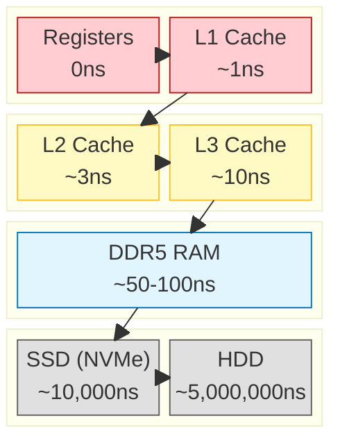

# Chương 1: Transistor & Logic Gates — Từ Electron đến Tính toán

> **Mục tiêu chương:** Hiểu cách một linh kiện vật lý nhỏ bé (transistor) tạo ra nền tảng cho MỌI phép tính trong máy tính — từ phép cộng đơn giản đến việc render hàng triệu polygon trong Unity.

---

## 1. Tại sao phải bắt đầu từ đây?

Khi bạn viết dòng code C# này trong Unity:

```csharp
float3 newPosition = currentPosition + velocity * deltaTime;
```

Bên dưới mọi abstraction layer, phép cộng và nhân đó **thực sự xảy ra** bên trong các mạch transistor vật lý. Không có phép màu — chỉ có electron chạy qua các công tắc bán dẫn, theo quy luật vật lý.

Hiểu điều này giúp bạn trả lời câu hỏi: **"Tại sao cách tôi tổ chức dữ liệu lại ảnh hưởng đến tốc độ?"** — bởi vì mọi thứ cuối cùng đều quay về cách phần cứng xử lý tín hiệu điện.

---

## 2. Chất bán dẫn — Vật liệu nền tảng

### 2.1. Ba loại vật liệu dẫn điện

| Loại | Đặc điểm | Ví dụ |
| :--- | :--- | :--- |
| **Dẫn điện (Conductor)** | Electron di chuyển tự do | Đồng (Cu), Nhôm (Al), Vàng (Au) |
| **Cách điện (Insulator)** | Electron bị giữ chặt, không di chuyển | Cao su, Thủy tinh, Nhựa |
| **Bán dẫn (Semiconductor)** | **Có thể bật/tắt** khả năng dẫn điện | Silicon (Si), Germanium (Ge) |

### 2.2. Silicon — "Đất" của ngành công nghiệp chip

Silicon (Si) là nguyên tố phổ biến thứ 2 trên vỏ Trái Đất (sau Oxy). Ở trạng thái nguyên chất, nó **gần như không dẫn điện**. Nhưng khi ta "pha tạp" (doping) thêm các nguyên tố khác, nó trở thành vật liệu kỳ diệu: **Có thể chuyển đổi qua lại giữa Dẫn điện và Cách điện.**

> **Tư duy Software:** Hãy coi Silicon như `bool isConducting` có thể thay đổi trạng thái theo ý muốn.

---

## 3. MOSFET — Transistor hiện đại

### 3.1. Mental Model: Công tắc điện tử

Đối với Software Engineer, bạn **KHÔNG CẦN QUAN TÂM** đến vật lý lượng tử bên dưới. Hãy hình dung **MOSFET là một công tắc (Switch)** được điều khiển bằng điện áp.

```text
      Gate (Cổng điều khiển)
        │
      ┌─┴─┐
      │   │  <-- Nút bấm (Điện áp)
      └─┬─┘
  Source│        Drain
   ─────●   ●─────
        │   │
        └─Switch─┘
```

### 3.2. Nguyên lý hoạt động (Vòi nước)

Tưởng tượng MOSFET như một vòi nước:
- **Source:** Nguồn nước (Dòng điện).
- **Drain:** Cống thoát.
- **Gate:** Tay vặn van.

| Trạng thái | Gate (Tay vặn) | Kết quả | Bit |
| :--- | :--- | :--- | :--- |
| **OFF** | 0V (Đóng) | Nước KHÔNG chảy | **0** |
| **ON** | > 0V (Mở) | Nước CHẢY mạnh | **1** |

> **Tại sao cần quan tâm?**
> Việc đóng/mở này tốn **thời gian** và sinh **nhiệt**.
> - Tốc độ đóng mở = Tốc độ CPU (GHz).
> - Nhiệt tỏa ra = Giới hạn hiệu năng (Thermal Throttling).

### 3.3. Kích thước & Định luật Moore

Kích thước transistor càng nhỏ, ta càng nhét được nhiều "công tắc" vào một chip → Xử lý được lượng dữ liệu khổng lồ cùng lúc.

| Năm | Chip | Kích thước | Số lượng Transistor |
| :--- | :--- | :--- | :--- |
| 1971 | Intel 4004 | 10 μm | 2,300 |
| 2020 | Apple M1 | 5 nm | 16 tỷ |
| 2024 | Apple M4 | **3 nm** | **28 tỷ** |

> **Quy mô:** Transistor 3nm nhỏ đến mức bạn có thể xếp **26,000 cái** trên bề rộng một sợi tóc.

---

## 4. Từ Transistor → Logic Gates (Cổng Logic)

### 4.1. Ý tưởng cốt lõi

Một transistor đơn lẻ chỉ là công tắc ON/OFF. Nhưng khi **kết hợp nhiều transistor**, ta tạo ra các **mạch logic** — nền tảng của mọi phép tính.

Có hai họ transistor bổ sung cho nhau:
- **NMOS (N-channel):** Dẫn điện khi Gate = 1 (kéo xuống GND = logic 0)
- **PMOS (P-channel):** Dẫn điện khi Gate = 0 (kéo lên Vdd = logic 1)

Kết hợp cả hai → **CMOS (Complementary MOS):** Mạch tiêu thụ điện cực thấp, chỉ tốn năng lượng khi chuyển trạng thái.

---

### 4.2. Cổng NOT (Inverter) — Cổng đơn giản nhất

**Chức năng:** Đảo ngược tín hiệu. Input 0 → Output 1. Input 1 → Output 0.

```
        Vdd (Nguồn dương)
         │
    ┌────┴────┐
    │  PMOS   │─── Gate = Input A
    └────┬────┘
         │
         ├─────────── Output (Y = NOT A)
         │
    ┌────┴────┐
    │  NMOS   │─── Gate = Input A
    └────┬────┘
         │
        GND (Đất)


Khi A = 0:                          Khi A = 1:
  PMOS ON (dẫn Vdd)                   PMOS OFF
  NMOS OFF                            NMOS ON (dẫn GND)
  Output = Vdd = 1                    Output = GND = 0

Bảng chân lý:
┌───────┬────────┐
│ A (In)│ Y (Out)│
├───────┼────────┤
│   0   │   1    │
│   1   │   0    │
└───────┴────────┘
```

> **2 transistor** → 1 phép tính logic đầu tiên!

---

### 4.3. Cổng NAND — "Cổng Vạn năng" (Universal Gate)

**Chức năng:** Output = 0 **chỉ khi** cả A VÀ B đều bằng 1. Mọi trường hợp khác = 1.

```
        Vdd                    Vdd
         │                      │
    ┌────┴────┐            ┌────┴────┐
    │  PMOS   │─ A         │  PMOS   │─ B       (Mắc SONG SONG)
    └────┬────┘            └────┬────┘
         │                      │
         └──────────┬───────────┘
                    │
                    ├──────────── Output (Y = NOT(A AND B))
                    │
               ┌────┴────┐
               │  NMOS   │─── A
               └────┬────┘                      (Mắc NỐI TIẾP)
               ┌────┴────┐
               │  NMOS   │─── B
               └────┬────┘
                    │
                   GND


Bảng chân lý:
┌───┬───┬───────────┐
│ A │ B │ NAND(A,B) │
├───┼───┼───────────┤
│ 0 │ 0 │     1     │     ← NMOS cả hai OFF → Output kéo lên Vdd
│ 0 │ 1 │     1     │     ← NMOS A OFF → đường xuống GND bị chặn
│ 1 │ 0 │     1     │     ← NMOS B OFF → đường xuống GND bị chặn
│ 1 │ 1 │     0     │     ← Cả hai NMOS ON → Output nối xuống GND
└───┴───┴───────────┘

Tổng: 4 transistors
```

**Tại sao NAND là "Universal"?** Vì mọi cổng logic khác đều có thể xây từ NAND:

```
NOT A        =  NAND(A, A)           ← Nối cả 2 input thành 1

A AND B      =  NOT(NAND(A, B))      ← NAND rồi đảo
             =  NAND(NAND(A,B), NAND(A,B))

A OR B       =  NAND(NOT A, NOT B)
             =  NAND(NAND(A,A), NAND(B,B))

→ Chỉ cần biết NAND, ta xây được MỌI THỨ.
  Đây là lý do bộ nhớ Flash (SSD) gọi là "NAND Flash".
```

---

### 4.4. Cổng AND, OR, XOR — Bộ công cụ đầy đủ

```
  ╔════════════════════════════════════════════════════════════════╗
  ║                 CÁC CỔNG LOGIC CƠ BẢN                        ║
  ╠════════════════════════════════════════════════════════════════╣
  ║                                                               ║
  ║  AND (VÀ) ── 6 transistors                                   ║
  ║  "Cả hai phải đúng"                                           ║
  ║  ┌───┬───┬──────────┐                                        ║
  ║  │ A │ B │ A AND B  │      Ẩn dụ: Khóa cửa cần CẢ HAI chìa  ║
  ║  ├───┼───┼──────────┤      → Chìa A VÀ Chìa B mới mở được   ║
  ║  │ 0 │ 0 │    0     │                                        ║
  ║  │ 0 │ 1 │    0     │                                        ║
  ║  │ 1 │ 0 │    0     │                                        ║
  ║  │ 1 │ 1 │    1     │  ← Chỉ trường hợp này ra 1             ║
  ║  └───┴───┴──────────┘                                        ║
  ║                                                               ║
  ║  OR (HOẶC) ── 6 transistors                                  ║
  ║  "Ít nhất một đúng"                                           ║
  ║  ┌───┬───┬──────────┐                                        ║
  ║  │ A │ B │ A OR B   │      Ẩn dụ: 2 công tắc đèn song song   ║
  ║  ├───┼───┼──────────┤      → Bất kỳ ai bật cũng sáng đèn     ║
  ║  │ 0 │ 0 │    0     │  ← Chỉ trường hợp này ra 0             ║
  ║  │ 0 │ 1 │    1     │                                        ║
  ║  │ 1 │ 0 │    1     │                                        ║
  ║  │ 1 │ 1 │    1     │                                        ║
  ║  └───┴───┴──────────┘                                        ║
  ║                                                               ║
  ║  XOR (HOẶC LOẠI TRỪ) ── 8-12 transistors                    ║
  ║  "Khác nhau mới đúng"                                        ║
  ║  ┌───┬───┬──────────┐                                        ║
  ║  │ A │ B │ A XOR B  │      Ẩn dụ: 2 công tắc cầu thang       ║
  ║  ├───┼───┼──────────┤      → Đèn đổi trạng thái mỗi khi     ║
  ║  │ 0 │ 0 │    0     │        BẤT KỲ AI bật/tắt               ║
  ║  │ 0 │ 1 │    1     │                                        ║
  ║  │ 1 │ 0 │    1     │                                        ║
  ║  │ 1 │ 1 │    0     │                                        ║
  ║  └───┴───┴──────────┘                                        ║
  ║                                                               ║
  ║  XOR rất đặc biệt vì: A XOR B = Bit tổng của phép cộng!     ║
  ║  Đây là nền tảng xây dựng mạch CỘNG (Adder).                 ║
  ║                                                               ║
  ╚════════════════════════════════════════════════════════════════╝
```

---

## 5. Xây dựng mạch Tính toán — Từ Gates đến ALU

### 5.1. Half Adder — Bộ cộng nửa (Cộng 2 bit)

**Bài toán:** Cộng 2 bit (A + B), cho ra kết quả **Sum** (tổng) và **Carry** (nhớ).

```
Ví dụ thực tế (cộng nhị phân):
   0 + 0 = 00  (Sum=0, Carry=0)
   0 + 1 = 01  (Sum=1, Carry=0)
   1 + 0 = 01  (Sum=1, Carry=0)
   1 + 1 = 10  (Sum=0, Carry=1)    ← "10" nhị phân = 2 thập phân

Nhận xét:
   Sum  = A XOR B   (Giống nhau → 0, Khác nhau → 1)
   Carry = A AND B   (Cả hai = 1 → Nhớ 1)


Sơ đồ mạch:
          ┌─────────┐
   A ─────┤         │
          │   XOR   ├──────── Sum (Bit tổng)
   B ──┬──┤         │
       │  └─────────┘
       │
       │  ┌─────────┐
       └──┤         │
          │   AND   ├──────── Carry (Bit nhớ)
   A ─────┤         │
          └─────────┘

Tổng: 1 XOR + 1 AND ≈ 14-18 transistors
```

### 5.2. Full Adder — Bộ cộng đầy đủ (Cộng 2 bit + Carry trước)

**Bài toán:** Cộng A + B + Cin (bit nhớ từ phép cộng trước đó).

```
Ví dụ:  Cộng 5 + 3 ở dạng nhị phân (4-bit)

         Carry: 1 1
                0 1 0 1    (5)
              + 0 0 1 1    (3)
              ─────────
                1 0 0 0    (8)

Từ phải sang trái:
  Bit 0: 1+1+0   = 10 → Sum=0, Carry=1        (Full Adder #0)
  Bit 1: 0+1+1   = 10 → Sum=0, Carry=1        (Full Adder #1)
  Bit 2: 1+0+1   = 10 → Sum=0, Carry=1        (Full Adder #2)
  Bit 3: 0+0+1   = 01 → Sum=1, Carry=0        (Full Adder #3)
  Kết quả: 1000 = 8 ✓


Sơ đồ Full Adder (= 2 Half Adders + 1 OR):
              ┌──────────────┐
   A ─────────┤ Half Adder 1 ├─── S1 ────┐
   B ─────────┤              ├─── C1 ──┐ │
              └──────────────┘         │ │
                                       │ │  ┌──────────────┐
                                       │ └──┤ Half Adder 2 ├─── Sum (Kết quả)
   Cin (Carry in) ─────────────────────┘────┤              ├─── C2
                                            └──────────────┘  │
                                                              │
              ┌───────┐                                       │
   C1 ────────┤  OR   ├──── Cout (Carry out tới bit tiếp)    │
   C2 ────────┤       │                                       │
              └───────┘◄──────────────────────────────────────┘

Tổng: ~40 transistors cho 1 Full Adder
```

### 5.3. Ripple Carry Adder — Cộng số nhiều bit

Để cộng hai số 32-bit, ta nối **32 Full Adders** lại:

```
32-bit Ripple Carry Adder:

   A[0] B[0]     A[1] B[1]     A[2] B[2]          A[31] B[31]
     │   │         │   │         │   │               │    │
   ┌─▼───▼─┐     ┌─▼───▼─┐     ┌─▼───▼─┐          ┌─▼────▼─┐
   │  FA   │     │  FA   │     │  FA   │   ····   │   FA   │
   │  #0   │     │  #1   │     │  #2   │          │  #31   │
   └──┬──┬─┘     └──┬──┬─┘     └──┬──┬─┘          └──┬──┬──┘
      │  └─Cout──►Cin┘  └─Cout──►Cin┘               │  └─ Overflow?
    Sum[0]       Sum[1]       Sum[2]              Sum[31]

   Carry "gợn sóng" (ripple) từ phải sang trái.
   Tổng: 32 × 40 = ~1,280 transistors cho phép cộng 32-bit.

   ⚠ Nhược điểm: Bit cao nhất phải ĐỢI carry từ bit thấp nhất.
     → Giải pháp: Carry-Lookahead Adder (tính carry song song, nhanh hơn).
```

#### > Code to Hardware: ADD
Khi bạn viết `c = a + b;` trong C#:
1.  **Compiler:** Dịch sang Assembly `ADD R1, R2` (cộng giá trị R2 vào R1).
2.  **Hardware:**
    *   `R1` và `R2` đưa tín hiệu điện vào 32 cặp input `A` và `B`.
    *   Tín hiệu lan truyền qua 1,280 transistors trong Ripple Carry Adder.
    *   Sau ~1 clock cycle, kết quả xuất hiện ở output `Sum` và được ghi lại vào `R1`.

---

### 5.4. Subtractor — Mạch trừ (Tái sử dụng Adder!)

**Insight quan trọng:** CPU KHÔNG CÓ mạch trừ riêng! Nó DÙNG LẠI mạch cộng.

```
Cách tính A - B bằng mạch cộng:

  Trong hệ nhị phân có dấu (Two's Complement):
    -B = NOT(B) + 1    (đảo tất cả bits rồi cộng 1)

  Vậy:
    A - B = A + (-B) = A + NOT(B) + 1
                             ↑         ↑
                          XOR gates   Cin = 1


Ví dụ: 5 - 3 = ?

    A    =  0101  (5)
    B    =  0011  (3)
    NOT B =  1100
    +1   → Cin=1

    Thực hiện: 0101 + 1100 + 1 = 10010
    Bỏ bit tràn → 0010 = 2 ✓


Mạch Subtractor = Adder + XOR gates:

   A[0] B[0]     A[1] B[1]     A[2] B[2]          A[31] B[31]
     │   │         │   │         │   │               │    │
     │  ┌▼┐        │  ┌▼┐        │  ┌▼┐              │   ┌▼┐
     │  │X│←SUB    │  │X│←SUB    │  │X│←SUB          │   │X│←SUB
     │  │O│        │  │O│        │  │O│              │   │O│
     │  │R│        │  │R│        │  │R│              │   │R│
     │  └┬┘        │  └┬┘        │  └┬┘              │   └┬┘
   ┌─▼───▼─┐     ┌─▼───▼─┐     ┌─▼───▼─┐          ┌─▼────▼─┐
   │  FA   │     │  FA   │     │  FA   │   ····   │   FA   │
   │  #0   │     │  #1   │     │  #2   │          │  #31   │
   └──┬──┬─┘     └──┬──┬─┘     └──┬──┬─┘          └──┬──┬──┘
      │  └─Cout──►Cin┘  └─Cout──►Cin┘               │
    R[0]          R[1]          R[2]               R[31]
         ▲
         │
   Cin = SUB signal (0 = cộng, 1 = trừ)

   Khi SUB = 0: XOR gates pass B through (B XOR 0 = B), Cin = 0 → A + B
   Khi SUB = 1: XOR gates flip B (B XOR 1 = NOT B), Cin = 1 → A + NOT(B) + 1 = A - B

   → CÙNG 1 MẠCH VẬT LÝ làm được CẢ cộng VÀ trừ!
   → Tiết kiệm transistor + diện tích chip → Đây là thiết kế thực tế trong CPU
```

#### > Code to Hardware: SUB
Khi bạn viết `health -= damage;`:
1.  **Assembly:** `SUB EAX, EBX` (x86) hoặc `SUB R0, R1, R2` (ARM).
2.  **Hardware:**
    *   ALU nhận tín hiệu `SUB` (Opcode).
    *   Tín hiệu này kích hoạt các cổng **XOR** ở đầu vào B để đảo bit (`NOT B`).
    *   Đồng thời kích hoạt `Cin = 1` vào Full Adder đầu tiên.
    *   Mạch cộng chạy bình thường → Ra kết quả phép trừ!

> **Kết nối Unity:** Khi Burst compile `a - b`, CPU thực thi lệnh `SUB` — nhưng bên trong ALU, nó chỉ là `ADD` với B được đảo + Cin=1. Cùng mạch cộng ở trên.

---

### 5.5. Multiplexer (MUX) — Bộ chọn tín hiệu

**MUX là "cổng chọn"** — quyết định output lấy từ input nào, dựa trên tín hiệu select.

```
MUX 2:1 (chọn 1 trong 2 inputs):

   I0 ───┐
         │    ┌─────┐
         ├────┤ MUX ├──── Y (Output)
         │    │ 2:1 │
   I1 ───┘    └──┬──┘
                 │
   S ────────────┘ (Select)

   Bảng chân lý:
   ┌───┬───┬───┬────────┐
   │ S │ I0│ I1│ Y      │
   ├───┼───┼───┼────────┤
   │ 0 │ * │ * │ Y = I0 │   ← S=0: chọn input I0
   │ 1 │ * │ * │ Y = I1 │   ← S=1: chọn input I1
   └───┴───┴───┴────────┘

   Công thức: Y = (NOT S AND I0) OR (S AND I1)
   → Xây từ: 1 NOT + 2 AND + 1 OR = ~12 transistors


MUX 4:1 (chọn 1 trong 4 — dùng 2 bit select):

   I0 ──┐
   I1 ──┤    ┌─────┐
         ├────┤ MUX ├──── Y
   I2 ──┤    │ 4:1 │
   I3 ──┘    └──┬──┘
                │
   S[1:0] ──────┘

   S = 00 → Y = I0
   S = 01 → Y = I1
   S = 10 → Y = I2
   S = 11 → Y = I3


TẠI SAO MUX QUAN TRỌNG CHO ALU?

   ALU chạy TẤT CẢ mạch tính toán CÙNG LÚC (adder, AND, OR, shift, ...)
   MUX ở output CHỌN kết quả đúng dựa trên Opcode.

   Ví dụ: ALU nhận Opcode = ADD
   → Adder, AND unit, OR unit, Shifter... tất cả đều tính
   → MUX chọn output từ Adder, bỏ qua phần còn lại
   → Hiệu quả hơn là routing tín hiệu tùy theo lệnh!

   Opcode 2-bit → MUX 4:1 → chọn 1 trong 4 phép tính
   Opcode 3-bit → MUX 8:1 → chọn 1 trong 8 phép tính
```

#### > Code to Hardware: Conditional Move
Khi bạn dùng `math.select(a, b, condition)` trong Burst:
1.  **Assembly:** `CMOVNE EAX, EBX` (Conditional Move - x86) hoặc `CSEL W0, W1, W2, NE` (ARM).
2.  **Hardware:**
    *   Thay vì dùng `JUMP` (nhảy dòng lệnh), CPU dùng MUX để chọn giá trị.
    *   Nếu `condition` đúng, MUX chọn `b`. Sai chọn `a`.
    *   **Không có Branch Prediction penalty!**

---

### 5.6. Shifter — Mạch dịch bit

**Shifter dịch tất cả bits sang trái hoặc phải.** Dịch trái 1 bit = nhân 2, dịch phải 1 bit = chia 2.

```
Shift Left Logical (SHL) — Ví dụ: 00001010 << 2

   Trước:   0 0 0 0 1 0 1 0   = 10
   Dịch ←2: 0 0 1 0 1 0 0 0   = 40
                         ↑ ↑
                     Điền 0 vào

   10 << 2 = 10 × 4 = 40 ✓  (Mỗi dịch trái = ×2)


Shift Right Logical (SHR) — Ví dụ: 00101000 >> 2

   Trước:   0 0 1 0 1 0 0 0   = 40
   Dịch →2: 0 0 0 0 1 0 1 0   = 10
             ↑ ↑
         Điền 0 vào

   40 >> 2 = 40 ÷ 4 = 10 ✓  (Mỗi dịch phải = ÷2)


Barrel Shifter — Dịch N bit trong 1 clock cycle:

   Mạch tổ hợp dùng MUXes nhiều tầng:

   Tầng 0: MUX quyết định dịch 0 hay 1 bit   (dựa trên shift[0])
   Tầng 1: MUX quyết định dịch 0 hay 2 bits  (dựa trên shift[1])
   Tầng 2: MUX quyết định dịch 0 hay 4 bits  (dựa trên shift[2])
   Tầng 3: MUX quyết định dịch 0 hay 8 bits  (dựa trên shift[3])
   Tầng 4: MUX quyết định dịch 0 hay 16 bits (dựa trên shift[4])

   → 5 tầng MUX = dịch bất kỳ 0-31 bit cho số 32-bit!
   → Tổng: ~32 MUXes × 5 tầng × 12 transistors = ~1,920 transistors


   Input:    [b31][b30][b29]...[b1][b0]
                │    │    │        │   │
             ┌──▼────▼────▼────────▼───▼──┐
             │  Tầng 0: Shift 0 or 1?     │ ← shift[0]
             └──┬────┬────┬────────┬───┬──┘
             ┌──▼────▼────▼────────▼───▼──┐
             │  Tầng 1: Shift 0 or 2?     │ ← shift[1]
             └──┬────┬────┬────────┬───┬──┘
             ┌──▼────▼────▼────────▼───▼──┐
             │  Tầng 2: Shift 0 or 4?     │ ← shift[2]
             └──┬────┬────┬────────┬───┬──┘
                │    │    │        │   │
             ... (tầng 3, 4)
                │    │    │        │   │
             [r31][r30][r29]...[r1][r0]  = Result
```

#### > Code to Hardware: SHL / SHR
1.  **C#:** `int x = a << 2;` (hoặc `a * 4`)
2.  **Assembly (x86):** `SHL EAX, 2`
3.  **Hardware:**
    *   Tín hiệu điện chạy qua tầng MUX số 1 (dịch 2 bit).
    *   Bỏ qua các tầng MUX khác.
    *   Kết quả có ngay trong 1 cycle. Nhanh hơn mạch nhân (`IMUL`) nhiều (mất 3-4 cycles).

> **Kết nối Unity:** Trong Burst-compiled code, `x << n` hoặc `x >> n` = 1 lệnh Assembly (`SHL`/`SHR`). Bitwises operations trong Lab 1 (BitFlags) — mỗi shift chạy qua chính mạch Barrel Shifter này. Shift nhanh hơn multiply (`x * 4` = `x << 2`), đây là lý do compilers tự convert `x * 2^n` thành shift!

---

### 5.7. Multiplier — Mạch nhân (Shift-and-Add)

**Nhân chỉ là cộng lặp lại** — nhưng thông minh hơn: shift-and-add.

```
Nhân nhị phân giống nhân thập phân trên giấy:

   Ví dụ: 0101 × 0011 (5 × 3):

         0 1 0 1    (A = 5)
       × 0 0 1 1    (B = 3)
       ──────────
         0 1 0 1    ← A × B[0] = A × 1 = A          (không shift)
       0 1 0 1 0    ← A × B[1] = A × 1 = A << 1     (shift trái 1)
     0 0 0 0 0 0    ← A × B[2] = A × 0 = 0           (skip)
   0 0 0 0 0 0 0    ← A × B[3] = A × 0 = 0           (skip)
   ──────────────
     0 0 0 1 1 1 1  = 15 ✓

   Quy tắc:
   - Nếu bit B[i] = 1: Cộng A đã shift trái i bit
   - Nếu bit B[i] = 0: Bỏ qua (cộng 0)
   - Tổng tất cả partial products = kết quả


Mạch Multiplier 4-bit:

   A[3:0]    B[3:0]
     │          │
     │    ┌─────┴─────┐
     │    │ B[0]=1?   │ → Partial Product 0 = A[3:0] AND B[0]
     │    │ B[1]=1?   │ → Partial Product 1 = (A[3:0] AND B[1]) << 1
     │    │ B[2]=1?   │ → Partial Product 2 = (A[3:0] AND B[2]) << 2
     │    │ B[3]=1?   │ → Partial Product 3 = (A[3:0] AND B[3]) << 3
     │    └───────────┘
     │         │
     │    ┌────▼────┐
     │    │  Adder  │  ← Cộng tất cả partial products
     │    │  Tree   │    (Wallace Tree hoặc Dadda Tree)
     │    └────┬────┘
     │         │
          Result[7:0]  ← Kết quả 8-bit (4-bit × 4-bit = tối đa 8-bit)


   ● "B[i] AND A" = 4 AND gates (mỗi bit) → quyết định cộng A hay 0
   ● Partial products cộng bằng Adder tree
   ● Kết quả: width gấp đôi (4-bit × 4-bit = 8-bit, 32×32 = 64-bit)
   ● Transistor count: Multiplier 32-bit = ~30,000-50,000 transistors
     (ĐẮT hơn nhiều so với Adder ~1,300!)


Wallace Tree — Cộng nhanh partial products:

   Thay vì cộng tuần tự (P0+P1, rồi +P2, rồi +P3...):
   → Wallace Tree cộng SONG SONG bằng cách dùng Full Adders liên tầng

   Tầng 1: Nhóm 3 partial products → FA → giảm xuống 2 dòng
   Tầng 2: Nhóm tiếp → giảm tiếp
   ...
   Tầng cuối: 1 phép cộng cuối cùng

   → Thay vì O(N) tầng cộng tuần tự → O(log N) tầng!
   → Multiplier 32-bit hoàn thành trong ~3-4 clock cycles thay vì ~32
```

#### > Code to Hardware: MUL / IMUL
1.  **C#:** `float3 c = a * b;`
2.  **Assembly (Burst AVX):** `VMULPS YMM0, YMM1, YMM2`
3.  **Hardware:**
    *   Lệnh này kích hoạt **8 bộ nhân FPU** chạy song song (vì YMM là 256-bit chứa 8 floats).
    *   Mỗi bộ nhân tiêu tốn khoảng 3-5 clock cycles (latency) nhưng có thể pipelined (throughput 0.5-1 cycle).

> **Kết nối Unity:** Mỗi `float3 result = a * b` trong Burst Job = 3 phép nhân float. Mỗi phép nhân chạy qua FPU Multiplier (~50,000 transistors). SIMD AVX2: `VMULPS ymm0, ymm1, ymm2` = 8 phép nhân song song — 8 multiplier units chạy cùng lúc!

---

### 5.8. Comparator — Mạch so sánh

**So sánh A và B** → xuất ra flags: A==B? A>B? A<B?

```
So sánh 1 bit (A vs B):

   A == B:  NOT(A XOR B)     ← XOR = khác nhau → NOT → giống nhau!
   A > B:   A AND (NOT B)    ← A=1 và B=0 → A lớn hơn
   A < B:   (NOT A) AND B    ← A=0 và B=1 → A nhỏ hơn


So sánh nhiều bit — Từ bit cao nhất xuống:

   Ví dụ: A = 0110 (6), B = 0100 (4)

   Bit 3: A[3]=0, B[3]=0 → Bằng → Xét bit tiếp
   Bit 2: A[2]=1, B[2]=1 → Bằng → Xét bit tiếp
   Bit 1: A[1]=1, B[1]=0 → A > B → DỪNG! Kết quả: A > B ✓


Mạch Comparator 4-bit (cascade):

   A[3] B[3]     A[2] B[2]     A[1] B[1]     A[0] B[0]
     │   │         │   │         │   │         │   │
   ┌─▼───▼─┐     ┌─▼───▼─┐     ┌─▼───▼─┐     ┌─▼───▼─┐
   │ 1-bit │     │ 1-bit │     │ 1-bit │     │ 1-bit │
   │ Comp  │     │ Comp  │     │ Comp  │     │ Comp  │
   │ #3    │     │ #2    │     │ #1    │     │ #0    │
   └───┬───┘     └───┬───┘     └───┬───┘     └───┬───┘
       │ EQ,GT,LT    │             │             │
       └──priority──►└──priority──►└──priority──►└──► Flags
                                                       │
                                                  Zero (A==B)
                                                  Negative (A<B)
                                                  Carry (A>B)

   Output → CPU Flags Register:
   ┌──────────────────────────────────────────────────┐
   │  Z (Zero)    = 1 nếu A == B                     │
   │  N (Negative)= 1 nếu A < B (kết quả A-B < 0)   │
   │  C (Carry)   = 1 nếu A > B (overflow khi trừ)   │
   └──────────────────────────────────────────────────┘

   CPU dùng flags này cho "branch instructions":
     CMP R1, R2     → Subtractor: R1 - R2, ghi flags
     JE  label      → Nhảy nếu Z=1 (Jump if Equal)
     JG  label      → Nhảy nếu Z=0 AND N=0 (Jump if Greater)
     JL  label      → Nhảy nếu N=1 (Jump if Less)
```

#### > Code to Hardware: CMP + JUMP
1.  **C#:** `if (health <= 0) Die();`
2.  **Assembly:**
    ```asm
    CMP  EAX, 0      ; So sánh EAX (health) với 0 -> Mạch Comparator chạy
    JLE  Label_Die   ; Jump if Less or Equal (Kiểm tra Flag Z=1 hoặc N=1)
    ```
3.  **Hardware:**
    *   `CMP` thực chất là phép trừ `health - 0` mà **bỏ qua kết quả**, chỉ giữ lại Flags.
    *   Nếu `health=0`, kết quả trừ = 0 → Flag Z bật lên 1.
    *   Lệnh `JLE` chỉ nhìn vào Flag Z và N để quyết định nạp lệnh tiếp theo từ đâu.

> **Kết nối Unity:** Mỗi `if (health <= 0)` trong C# → Burst/IL2CPP compile thành `CMP` + `JLE`. `CMP` = mạch Subtractor (tính `health - 0`) + ghi flags. `JLE` = kiểm tra flags Z hoặc N. Branch prediction (Chapter 3) dự đoán kết quả flags TRƯỚC KHI comparator hoàn thành!

---

### 5.9. ALU (Arithmetic Logic Unit) — Bộ não hoàn chỉnh

Bây giờ ta thấy ALU = **ghép TẤT CẢ mạch trên bằng MUX**:

```
                    ┌──────────────────────────────────────────────┐
                    │               ALU (32-bit)                    │
                    │                                              │
   A (32-bit) ─────►│  ┌─────────────┐                            │
                    │  │   Adder     │─── Kết quả nếu ADD         │
   B (32-bit) ─────►│  │ (1,280 tr.) │                            │
                    │  ├─────────────┤                            │
                    │  │ Subtractor  │─── Kết quả nếu SUB         │
                    │  │ (=Adder+XOR)│  (dùng lại Adder!)         │
                    │  ├─────────────┤                            │
                    │  │  Multiplier │─── Kết quả nếu MUL         │
                    │  │(30,000 tr.) │                  │         │
                    │  ├─────────────┤                  │         │
                    │  │  AND (32×)  │─── Kết quả nếu AND│         │
                    │  ├─────────────┤                  │  ┌─────┐│
                    │  │  OR  (32×)  │─── Kết quả nếu OR│  │ MUX ││──► Result
                    │  ├─────────────┤                  │  │ 8:1 ││
                    │  │  XOR (32×)  │─── Kết quả nếu XOR│ │     ││
                    │  ├─────────────┤                  │  └──┬──┘│
                    │  │  Shifter    │─── Kết quả nếu SHL│    │   │
                    │  │ (1,920 tr.) │                  │    │   │
                    │  ├─────────────┤                  │    │   │
                    │  │ Comparator  │─── Flags ───────►│ FLAG│   │
                    │  └─────────────┘                       REG │
                    │                                              │
   Opcode (3-bit) ──►──────────────── Select line cho MUX ────────┘
                    │                                              │
                    │  ┌─────────────────────────────────────────┐ │
                    │  │ Opcode Map:                             │ │
                    │  │   000 = ADD    100 = AND                │ │
                    │  │   001 = SUB    101 = OR                 │ │
                    │  │   010 = MUL    110 = XOR                │ │
                    │  │   011 = SHL/R  111 = CMP                │ │
                    │  └─────────────────────────────────────────┘ │
                    │                                              │
                    │  Tổng: ~50,000-80,000 transistors             │
                    │  CPU hiện đại: 4-8 ALU + FPU per core       │
                    │  GPU: 128 ALU per SM × 46 SM = 5,888 ALU!   │
                    └──────────────────────────────────────────────┘
```

**Ví dụ cụ thể — Lệnh `ADD R1, R2`:**
```
Bước 1: CPU đọc lệnh "ADD" → Giải mã Opcode = 0010
Bước 2: Lấy giá trị R1 (= 5 = 00000101) và R2 (= 3 = 00000011) từ Registers
Bước 3: ALU nhận A=R1, B=R2, Opcode=ADD
Bước 4: MUX chọn output từ Adder
Bước 5: Adder tính: 00000101 + 00000011 = 00001000 (= 8)
Bước 6: Kết quả 8 ghi lại vào R1

→ Tất cả diễn ra trong 1 clock cycle (~0.2 nanosecond ở 5GHz)
→ Chỉ là electron chạy qua ~1,300 transistors trong Adder
```

---

## 6. Kết nối tới Unity — Tại sao điều này quan trọng?

### 6.1. Phép tính trong Shader chính là ALU đang chạy

```csharp
// Vertex Shader (chạy trên GPU):
float4 clipPos = mul(UNITY_MATRIX_MVP, vertexPos);
```

Phép nhân ma trận `mul()` này = **16 phép nhân + 12 phép cộng** `float`.
Mỗi phép tính `float` sử dụng một **FPU (Floating Point Unit)** — phiên bản ALU cho số thực.

Với 10,000 vertices → GPU thực hiện **280,000 phép tính** chỉ cho bước MVP transform.
Mỗi phép tính = hàng nghìn transistor đóng/mở trong FPU.

### 6.2. Tại sao NAND quan trọng cho Game Developer?

```
SSD trong máy bạn = hàng tỷ NAND Gates xếp chồng lên nhau (3D NAND).
  → Load texture, load scene, streaming assets = đọc từ NAND Flash.
  → SSD nhanh hơn HDD vì NAND truy cập tức thời (không quay đĩa).

RAM trong máy bạn = hàng tỷ transistors đơn (DRAM).
  → Mỗi pixel trong RenderTexture = dữ liệu nằm trên DRAM.
  → GC allocation trong C# = cấp phát thêm vùng DRAM mới.
```

### 6.3. Tại sao kích thước transistor ảnh hưởng đến game?

| Transistor nhỏ hơn → | Lý do | Hệ quả cho Game |
| :--- | :--- | :--- |
| Nhiều transistor hơn/chip | Nhiều ALU hơn, nhiều cores hơn | Chạy được nhiều logic & render phức tạp hơn |
| Tiêu thụ ít điện hơn | Ít nhiệt → clock speed cao hơn | FPS cao hơn ở cùng TDP |
| Tốc độ đóng/mở nhanh hơn | Khoảng cách electron di chuyển ngắn hơn | Mỗi clock cycle nhanh hơn |

> **Kết luận Chapter 1:** Mỗi dòng code bạn viết — từ `if (health <= 0)` đến `Shader.SetFloat()` — cuối cùng đều biến thành tín hiệu điện chạy qua hàng tỷ transistor. Hiểu điều này không chỉ là kiến thức lý thuyết, mà là nền tảng để bạn hiểu tại sao **cách tổ chức dữ liệu** (DOD) và **cách viết shader** (branchless) lại ảnh hưởng trực tiếp đến hiệu năng.

---

## 7. Mảnh ghép còn thiếu — Kẻ đã quên mình là ai

Chúng ta đã xây dựng được ALU — một cỗ máy tính toán siêu việt từ hàng nghìn cổng logic.
- Nó có thể tính `5000 + 3000` trong nháy mắt.
- Nó có thể so sánh `health <= 0` cực nhanh.

**NHƯNG... có một vấn đề chết người:**
Ngay khi dòng điện đi qua, cổng logic trả về kết quả, và sau đó... **nó quên sạch**.
- Input tắt → Output tắt.
- Không có cách nào để lưu số "8000" lại để dùng cho phép tính sau.

Một CPU mà không có bộ nhớ (Memory) thì chỉ là một chiếc máy tính bỏ túi không có nút "M+" — vô dụng với các chương trình phức tạp.

Để biến chiếc máy tính này thành một **Computer** thực thụ, ta cần một loại mạch điện mới: Một loại mạch có thể **tự duy trì dòng điện** của chính nó.

👉 **Mời bước sang Chapter 2: Nơi ta học cách "bẫy" electron để tạo ra Ký ức.**

---

> **Chương tiếp theo:** [Chapter 2 — Memory & Storage: Từ Flip-flop đến RAM]() — Cách transistor tạo ra bộ nhớ, và tại sao Memory Hierarchy là chìa khóa của hiệu năng DOTS.

---
*Chapter 1 — Nghiên cứu cho Unity High-Performance Agent*
# Chương 2: Memory & Storage — Từ Flip-flop đến RAM

> **Mục tiêu chương:** Hiểu cách transistor tạo ra bộ nhớ, tại sao có nhiều tầng bộ nhớ khác nhau (Memory Hierarchy), và tại sao **Cache Locality** là yếu tố quyết định hiệu năng trong Unity DOTS.

---

## 1. Vấn đề: CPU nhanh, Bộ nhớ chậm

Ở **Chapter 1**, chúng ta đã tạo ra bộ não biết tính toán (ALU). Nó có thể cộng trừ nhân chia siêu tốc.
Nhưng bộ não đó có một điểm yếu chết người: **Nó không có trí nhớ.** (Input tắt → Output mất).

Để giải quyết, ta cần cung cấp cho nó "nguyên liệu" (Data) để tính toán và một nơi để lưu kết quả.

Hãy tưởng tượng bạn là một đầu bếp thiên tài (CPU), có thể chế biến bất kỳ món ăn nào trong **1 giây**. Nhưng:

```
┌──────────────────────────────────────────────────────────────────────┐
│  ĐẦU BẾP (CPU) cần nguyên liệu (Data):                             │
│                                                                      │
│  📋 Bảng ghi chú trước mặt (Registers):    Lấy ngay = 0 giây       │
│  🧊 Tủ lạnh cạnh bếp (L1 Cache):           Mở lấy  = 2 giây       │
│  🧊 Tủ lạnh ngoài hành lang (L2 Cache):    Đi lấy  = 5 giây       │
│  🧊 Kho lạnh tầng hầm (L3 Cache):          Xuống lấy = 15 giây    │
│  🏪 Siêu thị gần nhà (RAM):                Chạy đi = 3 PHÚT       │
│  🚚 Nhà kho ngoại thành (SSD):             Gọi giao = 1 GIỜ       │
│  🚢 Nhập khẩu từ nước ngoài (HDD):         Đợi ship = 1 TUẦN      │
│                                                                      │
│  → Đầu bếp (CPU) phải ĐỨNG ĐỢI khi nguyên liệu ở xa.              │
│    Đây gọi là "Memory Stall" — CPU không làm gì cả, chỉ chờ data.  │
└──────────────────────────────────────────────────────────────────────┘
```

**Giải pháp của ngành công nghiệp:** Tạo ra nhiều tầng bộ nhớ — nhỏ nhưng nhanh ở gần CPU, lớn nhưng chậm ở xa CPU. Đây là **Memory Hierarchy**.

---

## 2. Clock & Cycle — "Nhịp tim" của CPU

> **🎯 Ẩn dụ — Nhạc trưởng dàn nhạc:**
> Tưởng tượng dàn nhạc 100 người. Nếu ai cũng chơi lúc nào tùy thích → **HỖN LOẠN**.
> Nhạc trưởng giơ đũa — **"ĐÁNH!"** — tất cả 100 nhạc công cùng đánh nốt tiếp theo **ĐỒNG LOẠT**.
> Clock signal = **Cây đũa nhạc trưởng** của CPU.
> Mỗi lần "đánh" = tất cả hàng tỷ transistors trong CPU cập nhật trạng thái **CÙNG MỘT KHOẢNH KHẮC**.

### Clock là gì?

**Clock** = MỘT TÍN HIỆU ĐIỆN cứ lặp đi lặp lại: CAO → THẤP → CAO → THẤP...

```text
Volts
 3.3V  +---+   +---+   +---+   +---+
       |   |   |   |   |   |   |   |
   0V  +   +---+   +---+   +---+   +
       ^       ^       ^       ^
     Tick 1  Tick 2  Tick 3  Tick 4
```

> **Cơ chế:**
> - Chỉ tại mỗi **CẠNH LÊN** (Low → High), mọi thứ xảy ra (**Tick**).
> - Giữa 2 cạnh lên = CPU đang **CHỜ** tín hiệu ổn định.

**Clock được tạo ra từ đâu? — Trái tim Thạch anh**

Tín hiệu Clock không tự nhiên có. Nó đến từ một linh kiện nhỏ trên Mainboard gọi là **Bộ dao động Thạch anh (Crystal Oscillator)**.

1.  **Hiệu ứng áp điện:** Khi cho dòng điện chạy qua tinh thể thạch anh, nó sẽ **rung** (co giãn) với tần số cực kỳ ổn định và chính xác (ví dụ: 100 MHz).
2.  **Nhân tần số (PLL):** CPU không chạy ở 100 MHz. Nó dùng mạch nhân tần (Multiplier) để nhân lên 30-50 lần → tạo ra 3 GHz, 5 GHz.
3.  **Tại sao cần thạch anh?** Vì nếu dùng mạch điện thường, nhiệt độ thay đổi sẽ làm tần số sai lệch → CPU chạy không ổn định (treo máy). Thạch anh giữ nhịp "chuẩn từng mili-giây".

> **Ví dụ:** Giống như quả lắc đồng hồ cơ. Quả lắc dao động đều đặn (gốc), và các bánh răng (PLL) nhân chuyển động đó lên để quay kim giây, kim phút.

---

### 2.1. Cycle — 1 "nhịp đập" = 1 đơn vị thời gian

**1 Cycle = Khoảng thời gian GIỮA 2 cạnh lên liên tiếp**

```text
Time --->

Clock:      _   _   _   _   _   _   _
          _| |_| |_| |_| |_| |_| |_| |_

Cycle:    [   1   ][   2   ][   3   ]
Action:   [ Fetch ][ Decode][ Execute ]
```

> **Giải thích:**
> - Trong 1 cycle (giữa 2 Tick), CPU làm trọn vẹn 1 bước công việc.
> - Ví dụ: Tải lệnh → Giải mã → Thực thi.


═══ Clock Speed = Bao nhiêu cycles MỖI GIÂY? ═══

  1 GHz  =  1,000,000,000 cycles/giây    (1 cycle = 1.0 ns)
  3 GHz  =  3,000,000,000 cycles/giây    (1 cycle = 0.33 ns)
  5 GHz  =  5,000,000,000 cycles/giây    (1 cycle = 0.2 ns)
                                                     ↑
                                          Ánh sáng đi được 6cm
                                          trong thời gian này!

  Nhịp tim người:    ~1.2 Hz   (1.2 nhịp/giây)
  Nhịp tim CPU:      ~5 GHz    (5 TỶ nhịp/giây)
  → CPU nhanh hơn tim bạn khoảng 4,000,000,000 lần.
```

### 2.2. Tại sao cần Clock? — Chaos vs Order

```
  ═══ KHÔNG CÓ CLOCK ═══

  Transistor A xong → gửi kết quả cho B
  Nhưng B chưa sẵn sàng! → Kết quả bị MẤT hoặc SAI
  Transistor C xong trước A? → Thứ tự loạn, kết quả vô nghĩa

  = 100 nhạc công chơi tùy hứng → CACophony 🔇


  ═══ CÓ CLOCK ═══

  TICK → TẤT CẢ flip-flops "chụp ảnh" dữ liệu CÙNG LÚC
       → Kết quả ổn định, đúng thứ tự
       → Bước tiếp theo chỉ bắt đầu khi bước trước đã xong

  = 100 nhạc công cùng nhìn nhạc trưởng → Symphony 🎵


  CPU 5 GHz = Nhạc trưởng đánh 5 TỶ nhịp mỗi giây.
  Mỗi nhịp = hàng tỷ transistors cùng bước sang trạng thái mới.
  → Đây là lý do "overclock" (tăng GHz) nguy hiểm:
     Nếu nhạc trưởng đánh quá nhanh, nhạc công chưa kịp đánh nốt
     trước đó → SAI NỐT → CPU crash / BSOD / artifact rendering.
```

---

## 3. Flip-flop — Viên gạch đầu tiên của Bộ nhớ

### Bài toán: Làm sao "nhớ" 1 bit?

Ở Chapter 1, ta biết cổng logic cho output **tức thì** dựa trên input hiện tại. Nhưng nó **không nhớ** gì cả — thay đổi input thì output đổi ngay.

**Flip-flop** giải quyết vấn đề này bằng 1 trick đơn giản: **nối output ngược lại input** (feedback loop).

> **🎯 Ẩn dụ — Công tắc đèn:**
> - Bạn **bật** đèn (Set) → đèn sáng. Bỏ tay ra — đèn **VẪN SÁNG**.
> - Bạn **tắt** đèn (Reset) → đèn tắt. Bỏ tay ra — đèn **VẪN TẮT**.
> - Đèn "nhớ" trạng thái cuối cùng mà không cần bạn giữ tay.
> - Đó chính là **feedback loop**: trạng thái tự duy trì chính nó.

**Chỉ cần nhớ 3 điều về Flip-flop:**

| # | Điều cần nhớ | Chi tiết |
|---|---|---|
| 1 | **Nhớ đúng 1 bit** (0 hoặc 1) | Được xây từ ~2 cổng logic + feedback loop |
| 2 | **Chỉ thay đổi khi Clock "tick"** | Giống máy ảnh: chỉ "chụp" dữ liệu tại đúng nhịp Clock ↑ |
| 3 | **Là nền tảng của MỌI bộ nhớ** | Register, Cache, RAM — tất cả đều bắt nguồn từ nguyên lý này |

> Chỉ từ ~8 transistors, ta tạo ra thứ có thể **NHỚ**. Mọi bộ nhớ trên thế giới — từ Register trong CPU đến thanh RAM 64GB — đều bắt nguồn từ nguyên lý feedback loop này.

---

## 4. Từ Flip-flop → Register → Register File

### 4.1. Register — 32 Flip-flops = 1 từ dữ liệu

```mermaid
block-beta
    columns 7
    d31["D-FF<br/>#31"]
    d30["D-FF<br/>#30"]
    d29["D-FF<br/>#29"]
    d28["D-FF<br/>#28"]
    space["..."]
    d1["D-FF<br/>#1"]
    d0["D-FF<br/>#0"]

    clk(("CLOCK"))
    
    clk --> d31
    clk --> d30
    clk --> d29
    clk --> d28
    clk --> d1
    clk --> d0

    style d31 fill:#f9fbe7,stroke:#827717
    style d30 fill:#f9fbe7,stroke:#827717
    style d29 fill:#f9fbe7,stroke:#827717
    style d28 fill:#f9fbe7,stroke:#827717
    style d1 fill:#f9fbe7,stroke:#827717
    style d0 fill:#f9fbe7,stroke:#827717
    style clk fill:#ffecb3,stroke:#ff6f00
```

> **Cơ chế:**
> - Tất cả 32 flip-flops nhận **CÙNG** tín hiệu Clock.
> - Khi Clock ↑ (cạnh lên): Cả 32 bit được ghi **ĐỒNG THỜI**.
> - → Ghi một số `int` 32-bit chỉ mất **1 clock cycle**.
#### > Code to Hardware: MOV
1.  **C#:** `int x = 42;`
2.  **Assembly:** `MOV EAX, 42`
3.  **Hardware:**
    *   `42` (nhị phân `101010`) được đưa vào đầu vào D của các Flip-flop tương ứng trong Register EAX.
    *   Tín hiệu `Write Enable` cho EAX được bật.
    *   Tại cạnh lên Clock tiếp theo: EAX chốt giá trị 42.

#### > Register vs RAM:
*   `MOV EAX, EBX` (Register to Register): **0.2 ns** (ngay lập tức).
*   `MOV EAX, [EBX]` (RAM to Register): **100 ns** (phải đợi tín hiệu đi ra mainboard và quay lại!).


Ví dụ cụ thể:
  Số nguyên 42 = 00000000 00000000 00000000 00101010
  → 32 flip-flops lưu:
     FF#31=0, FF#30=0, ... FF#5=1, FF#4=0, FF#3=1, FF#2=0, FF#1=1, FF#0=0
```

> **🎯 Ẩn dụ — Bàn tay của Đầu bếp:**
> Register = **MÓN ĐỒ ĐANG CẦM TRÊN TAY** đầu bếp.
> - Đầu bếp (CPU) chỉ có 2 tay (ít registers).
> - Cái gì trên tay → dùng được NGAY LẬP TỨC (0 delay).
> - Nhưng chỉ cầm được 2-3 thứ cùng lúc → phải bỏ xuống bàn (Cache) hoặc cất vào tủ (RAM) nếu muốn lấy thứ khác.
> - Tốc độ: Cầm trên tay > Lấy từ bàn > Đi bộ tới tủ > Chạy ra kho ngoài sân.

### 4.2. Register File — Bộ nhớ "ngay tay" của CPU

*(Xem sơ đồ chi tiết vị trí của Register File trong kiến trúc CPU Core tại **Section 7**)*

**Dòng chảy dữ liệu trong 1 phép tính:**

```
Ví dụ: ADD EAX, EBX  (EAX = EAX + EBX)

  Cycle 1:
  ┌──────────────┐
  │ REGISTER FILE│
  │              │
  │  EAX ── 42 ─┼──── Port A ────►┌───────┐
  │              │                 │       │
  │  EBX ── 10 ─┼──── Port B ────►│  ALU  │──── Result: 52
  │              │                 │       │
  │              │◄── Write Port ──┘───────┘
  │  EAX ── 52  │   (Ghi kết quả lại vào EAX)
  └──────────────┘

  Tất cả xảy ra trong 1 CYCLE duy nhất:
  1. Đọc EAX (42) qua Port A         } Cùng
  2. Đọc EBX (10) qua Port B         } lúc!
  3. ALU tính 42 + 10 = 52            }
  4. Ghi 52 lại vào EAX qua Write Port}

  → Register File có NHIỀU cổng (ports) để đọc/ghi ĐỒNG THỜI.
  → Đây là Multi-ported Register File = 2 Read + 1 Write cùng lúc.
  → So sánh: RAM chỉ có 1 cổng, phải đọc rồi mới ghi → chậm hơn.
```

**Registers "thật" vs Registers "ảo" — Register Renaming:**

```
Bạn NHÌN THẤY 16 registers (RAX, RBX, ..., R15) trong Assembly.
Nhưng CPU THẬT SỰ có ~180-200 registers vật lý bên trong!

Tại sao? Để chạy Out-of-Order (xáo trộn thứ tự lệnh):

  Ví dụ 2 lệnh ĐỘC LẬP nhưng dùng CÙNG thanh ghi:
  ──────────────────────────────────────────────────
  Lệnh 1:  ADD  EAX, 5       ; EAX = EAX + 5
  Lệnh 2:  MOV  EAX, [mem]   ; EAX = giá trị từ RAM ← CÙNG EAX!

  Vấn đề: Lệnh 2 GHI ĐÈ lên EAX, nhưng lệnh 1 cũng cần EAX.
  → CPU không thể chạy song song!

  Giải pháp — Register Renaming:
  ──────────────────────────────
  CPU đổi tên bên trong:
  Lệnh 1:  ADD  P47, 5       ; EAX → mapped sang Physical Register #47
  Lệnh 2:  MOV  P92, [mem]   ; EAX → mapped sang Physical Register #92

  → Bây giờ 2 lệnh KHÔNG ĐỤNG NHAU → chạy song song được!
  → Programmer vẫn thấy "EAX" — nhưng bên trong là registers khác nhau.

  ┌─────────────────────────────────────────────────────────────┐
  │  Architectural Registers     Physical Registers              │
  │  (Bạn thấy trong Assembly)   (CPU thật sự dùng bên trong)  │
  │                                                              │
  │  EAX  ──────────────────►  P47, P92, P15, ...               │
  │  EBX  ──────────────────►  P03, P88, ...                    │
  │  ECX  ──────────────────►  P55, P12, ...                    │
  │  ...                       (Pool ~180-200 registers)        │
  │                                                              │
  │  16 tên ← mapping → ~200 registers vật lý                   │
  └─────────────────────────────────────────────────────────────┘
```

```
Register File trong CPU x86-64 (đơn giản hóa):

  ┌─────────────────────────────────────────────────────────┐
  │                   REGISTER FILE                         │
  │                                                         │
  │  ┌────────┬──────────────────────────────────────────┐  │
  │  │  RAX   │ 0000 0000 0000 0000 0000 0000 0010 1010 │  │  ← 64-bit
  │  ├────────┼──────────────────────────────────────────┤  │
  │  │  RBX   │ 0000 0000 0000 0000 0000 0000 0000 0011 │  │
  │  ├────────┼──────────────────────────────────────────┤  │
  │  │  RCX   │ 0000 0000 0000 0000 0000 0000 0000 1010 │  │
  │  ├────────┼──────────────────────────────────────────┤  │
  │  │  RDX   │ 0000 0000 0000 0000 0000 0000 0000 0101 │  │
  │  ├────────┼──────────────────────────────────────────┤  │
  │  │  RSP   │ ← Stack Pointer (đỉnh Stack)            │  │
  │  ├────────┼──────────────────────────────────────────┤  │
  │  │  RBP   │ ← Base Pointer (đáy Stack Frame)        │  │
  │  ├────────┼──────────────────────────────────────────┤  │
  │  │  RIP   │ ← Instruction Pointer (lệnh tiếp theo)  │  │
  │  ├────────┼──────────────────────────────────────────┤  │
  │  │  ...   │ (tổng ~16 registers general-purpose)     │  │
  │  └────────┴──────────────────────────────────────────┘  │
  │                                                         │
  │  SIMD Registers (cho Burst Compiler):                   │
  │  ┌────────┬──────────────────────────────────────────┐  │
  │  │ XMM0   │ 128-bit (4 × float32)                   │  │  ← SSE
  │  ├────────┼──────────────────────────────────────────┤  │
  │  │ YMM0   │ 256-bit (8 × float32)                   │  │  ← AVX
  │  ├────────┼──────────────────────────────────────────┤  │
  │  │ ZMM0   │ 512-bit (16 × float32)                  │  │  ← AVX-512
  │  ├────────┼──────────────────────────────────────────┤  │
  │  │  ...   │ (XMM0-XMM15 / YMM0-YMM15)              │  │
  │  └────────┴──────────────────────────────────────────┘  │
  │                                                         │
  │  Tổng dung lượng Register File: ~1-2 KB                 │
  │  Tốc độ truy cập: 0 cycles (tức thì, cùng clock)       │
  │  Transistor cost: ~Vài nghìn transistor (rẻ)            │
  └─────────────────────────────────────────────────────────┘
```

> **Unity DOTS Connection:** Khi Burst Compiler biên dịch `float3 a + float3 b`, nó đặt `a` vào XMM0 và `b` vào XMM1, rồi gọi lệnh `ADDPS` — cộng cả 3 thành phần (x,y,z) **cùng 1 lệnh** trên thanh ghi 128-bit. Đó là sức mạnh SIMD.

---

## 5. SRAM vs DRAM — Hai cách xây bộ nhớ từ Transistor

### 5.1. SRAM (Static RAM) — Dùng cho Cache

```
SRAM Cell — 1 bit = 6 Transistors:

        Vdd                Vdd
         │                  │
    ┌────┴────┐        ┌────┴────┐
    │  PMOS   │        │  PMOS   │
    └────┬────┘        └────┬────┘
         │    ┌────────┐    │
         ├────┤Inverter├────┤
         │    │  Loop  │    │        ← Vòng feedback (2 inverters)
         │    └────────┘    │           Giữ nguyên trạng thái
    ┌────┴────┐        ┌────┴────┐     mà KHÔNG cần làm mới
    │  NMOS   │        │  NMOS   │
    └────┬────┘        └────┬────┘
         │                  │
        GND                GND

  + 2 NMOS transistor làm "cổng truy cập" (Access Transistors)
  = Tổng 6 Transistors / bit

Đặc điểm SRAM:
  ✅ Cực nhanh (~1ns)
  ✅ Không cần refresh (giữ data nếu có điện)
  ❌ Đắt (6 transistors/bit)
  ❌ Tốn diện tích (lớn gấp 6× DRAM)
  → Dùng cho: L1, L2, L3 Cache
```

### 5.2. DRAM (Dynamic RAM) — Dùng cho RAM chính

```
DRAM Cell — 1 bit = 1 Transistor + 1 Tụ điện:

    Word Line (Hàng)
         │
    ┌────┴────┐
    │  NMOS   │──── Bit Line (Cột)
    └────┬────┘
         │
    ┌────┴────┐
    │  Tụ     │     ← Tụ điện (Capacitor) LƯU ĐIỆN TÍCH
    │ điện    │        Có điện = 1, Không điện = 0
    └────┬────┘
         │
        GND

Đặc điểm DRAM:
  ✅ Rẻ (1 transistor + 1 tụ / bit)
  ✅ Mật độ cao (nhiều GB trong chip nhỏ)
  ❌ Chậm hơn SRAM (~50-100ns)
  ❌ Phải REFRESH liên tục (tụ điện rò rỉ charge)
     → Cứ ~64ms phải đọc lại và ghi lại TẤT CẢ cells
     → Trong lúc refresh, RAM KHÔNG THỂ đọc/ghi → thêm trễ
  → Dùng cho: RAM chính (DDR4, DDR5)
```

### 5.3. So sánh trực quan

```
┌───────────────────────────────────────────────────────────────────┐
│          SRAM vs DRAM — Cùng lưu 1 bit, khác hoàn toàn           │
├───────────────┬──────────────────┬────────────────────────────────┤
│               │     SRAM         │         DRAM                  │
├───────────────┼──────────────────┼────────────────────────────────┤
│ Transistor    │ 6 / bit          │ 1 / bit + 1 tụ điện           │
│ Tốc độ       │ ~1 ns            │ ~50-100 ns                    │
│ Chi phí       │ $$$$             │ $                              │
│ Cần Refresh?  │ Không            │ Có (mỗi ~64ms)               │
│ Dung lượng    │ MB (nhỏ)         │ GB (lớn)                     │
│ Vị trí       │ Trên chip CPU    │ Chip riêng trên mainboard      │
│ Vai trò      │ L1/L2/L3 Cache   │ RAM chính (DDR5)              │
├───────────────┴──────────────────┴────────────────────────────────┤
│                                                                   │
│  Ẩn dụ:                                                           │
│  SRAM = Ngăn kéo bàn làm việc (nhỏ, lấy ngay, đắt)              │
│  DRAM = Tủ hồ sơ ở góc phòng (lớn, phải đứng dậy đi lấy, rẻ)   │
│                                                                   │
└───────────────────────────────────────────────────────────────────┘
```

### 5.4. Bức tranh toàn cảnh — Flip-flop vs Register vs SRAM vs DRAM

> **🎯 Ẩn dụ thống nhất — "Bàn học của Sinh viên":**
>
> Hãy tưởng tượng bạn đang **ôn thi** trong ký túc xá:
>
> | Loại bộ nhớ | Ẩn dụ | Ví dụ thực tế |
> |---|---|---|
> | **1 Flip-flop** | **1 ô Post-it** — dán 1 chữ số (0 hoặc 1) | Nhớ đúng 1 bit |
> | **1 Register** | **1 dòng Post-it** — 32 ô dán liền nhau = 1 con số | Nhớ 1 số int (VD: `42`) |
> | **SRAM (Cache)** | **Mặt bàn học** — vài tờ giấy đang mở, đọc ngay | L1/L2/L3 Cache trên CPU |
> | **DRAM (RAM)** | **Kệ sách trong phòng** — phải đứng dậy đi lấy | DDR5 RAM 16-64 GB |
> | *(SSD/HDD)* | **Thư viện downstairs** — phải đi thang máy | Ổ cứng lưu trữ |
>
> **Điểm mấu chốt:**
> - Flip-flop → Register → SRAM → DRAM **không phải** 4 thứ khác nhau.
> - Chúng là **CÙNG 1 ý TƯỞNG** ("nhớ bit") nhưng được **xây khác nhau** để đánh đổi giữa **tốc độ** và **dung lượng**.

```
Cách xây từ nhỏ → lớn:

  1 Flip-flop = 1 bit nhớ
       │
       │ × 32 cái ghép lại
       ▼
  1 Register = 32 bits = 1 con số
       │
       │  Quá đắt để làm nhiều → dùng mạch SRAM đơn giản hơn
       ▼
  SRAM = Bỏ bớt mạch (6 transistor/bit thay vì ~20)
       │  → Chậm hơn Register nhưng chứa được MB
       │
       │  Vẫn quá đắt → thay transistor bằng tụ điện
       ▼
  DRAM = 1 transistor + 1 tụ điện / bit
         → Chậm hơn SRAM nhưng chứa được GB
         → Phải refresh (tụ rò rỉ) → thêm chậm


  Tốc độ:    Register >>>>>>> SRAM >>>>>> DRAM
  Dung lượng: Register <<<<<<< SRAM <<<<<< DRAM  
  Giá tiền:   Register $$$$$$$ SRAM $$$$$$ DRAM $
```

---

## 6. Cache — Bộ đệm thay đổi cuộc chơi

### 6.1. Tại sao cần Cache?

```
Tốc độ qua các thế hệ (1980 → nay):

  CPU Speed:     ████████████████████████████████████████  ×10,000 lần
  RAM Speed:     █████████                                 ×100 lần

  → "Memory Wall": CPU phải CHỜ RAM hàng trăm chu kỳ.
     Mỗi chu kỳ chờ = lãng phí hàng tỷ phép tính/giây.


Giải pháp = Cache (Bộ đệm SRAM nằm trên chip CPU):

  ┌──────────────────────────────────┐
  │  CPU Die (Mặt cắt chip thật)    │
  │                                  │
  │  ┌──────┐  ┌──────┐             │
  │  │Core 0│  │Core 1│             │
  │  │┌─L1─┐│  │┌─L1─┐│             │
  │  │└────┘│  │└────┘│             │
  │  │┌─L2─┐│  │┌─L2─┐│             │
  │  │└────┘│  │└────┘│             │
  │  └──────┘  └──────┘             │
  │                                  │
  │  ┌──────────────────────────┐    │
  │  │     L3 Cache (Shared)    │    │    ← SRAM chiếm >50% diện tích chip!
  │  └──────────────────────────┘    │
  │                                  │
  └──────────────────────────────────┘
         │
         │  (Đường bus ra ngoài chip)
         ▼
  ┌──────────────────┐
  │  DDR5 RAM (DRAM) │   ← Chip riêng biệt trên mainboard
  └──────────────────┘
```

### 6.2. Cache Line — Đơn vị truyền dữ liệu cơ bản

**Đây là khái niệm QUAN TRỌNG NHẤT cho hiệu năng Unity DOTS.**

```
CPU KHÔNG BAO GIỜ đọc 1 byte đơn lẻ từ RAM.
Nó luôn đọc 1 CACHE LINE = 64 BYTES.

Ví dụ: Bạn truy cập array[0] (4 bytes int):

  RAM:
  ┌────┬────┬────┬────┬────┬────┬────┬────┬────┬────┬────┬────┬────┬────┬────┬────┐
  │ [0]│ [1]│ [2]│ [3]│ [4]│ [5]│ [6]│ [7]│ [8]│ [9]│[10]│[11]│[12]│[13]│[14]│[15]│
  │ 4B │ 4B │ 4B │ 4B │ 4B │ 4B │ 4B │ 4B │ 4B │ 4B │ 4B │ 4B │ 4B │ 4B │ 4B │ 4B │
  └────┴────┴────┴────┴────┴────┴────┴────┴────┴────┴────┴────┴────┴────┴────┴────┘
  ◄──────────── 64 bytes (1 Cache Line) ────────────►

  Bạn chỉ cần [0], nhưng CPU tải TOÀN BỘ 64 bytes vào L1 Cache.
  → [1] đến [15] đã có sẵn trong Cache → truy cập miễn phí!


Hệ quả:
  ┌──────────────────────────────────────────────────────────────┐
  │  NẾU bạn duyệt array TUẦN TỰ ([0], [1], [2], ...):        │
  │    → Cache Hit gần 100% (chỉ 1 lần tải / 16 phần tử)      │
  │    → CỰC NHANH                                              │
  │                                                              │
  │  NẾU bạn duyệt array NGẪU NHIÊN ([7], [1023], [3], ...):  │
  │    → Cache Miss liên tục (mỗi truy cập = tải cache line mới)│
  │    → CỰC CHẬM (100-300× chậm hơn!)                         │
  └──────────────────────────────────────────────────────────────┘
```

> **🎯 Ẩn dụ — Kho hàng Amazon:**
> Cache Line = **Thùng hàng đóng gói sẵn** trong kho Amazon.
> - Bạn đặt mua **1 cuốn sách** (4 bytes). Amazon không gửi riêng 1 cuốn.
> - Họ gửi **cả thùng 16 cuốn** cùng chủ đề (64 bytes = 1 Cache Line).
> - Nếu bạn đọc hết bộ sách theo thứ tự → 15 cuốn sau miễn phí ship! (**Cache Hit**)
> - Nếu bạn đọc ngẫu nhiên sách từ khắp nơi → mỗi cuốn = 1 thùng hàng mới → phí ship cực đắt! (**Cache Miss**)

### 6.3. Ví dụ thực tế: Cache Hit vs Miss

#### > Under the Hood: Tại sao Random chậm?
Hãy nhìn vào Assembly của vòng lặp:

```asm
; Vòng lặp tính tổng (Simplified x86)
Loop_Start:
    MOV  RBX, [IndexArr + RCX*4]   ; 1. Tải index ngẫu nhiên từ mảng IndexArr
                                   ;    (Nếu lặp tuần tự, Index có sẵn trong L1)

    MOV  EAX, [DataArr + RBX*4]    ; 2. Dùng index đó để tải Data
                                   ;    ⚠️ CACHE MISS LỚN Ở ĐÂY!
                                   ;    Vì RBX nhảy lung tung, CPU không đoán được.
                                   ;    CPU phải DỪNG (Stall) ~300 cycles để đợi RAM.

    ADD  SUM, EAX                  ; 3. Cộng (chỉ mất 1 cycle)
    INC  RCX                       ; 4. Tăng đếm
    CMP  RCX, 1000000
    JNE  Loop_Start
```
*   **Sequential:** Dòng 2 luôn trúng Cache (Hit) vì CPU tự động prefetch dòng tiếp theo.
*   **Random:** Dòng 2 trượt Cache (Miss) liên tục. Lệnh `ADD` ở dòng 3 không thể chạy cho đến khi dòng 2 xong. CPU ngồi chơi 99% thời gian!

```
Bài toán: Tính tổng 1 triệu số (1,000,000 ints = ~4 MB)

═══ Kịch bản 1: Duyệt tuần tự (Sequential) ═══

  for (int i = 0; i < 1000000; i++)
      sum += data[i];    // Cache Hit 15/16 lần = 93.75%

  Phân tích:
  - Tải cache line chứa data[0..15] → ~100 cycles   (Miss)
  - Đọc data[0]: 0 cycles  (Hit)
  - Đọc data[1]: 0 cycles  (Hit)
  - ...
  - Đọc data[15]: 0 cycles (Hit)
  - Tải cache line chứa data[16..31] → ~100 cycles  (Miss)
  - ... lặp lại

  Tổng thời gian: ~62,500 cache misses × 100 cycles = ~6.25M cycles
  Tốc độ thực tế: ★★★★★ CỰC NHANH


═══ Kịch bản 2: Duyệt ngẫu nhiên (Random) ═══

  for (int i = 0; i < 1000000; i++)
      sum += data[random_index[i]];    // Cache Miss ~100%

  Phân tích:
  - Mỗi random_index chỉ đến vị trí khác nhau trong 4MB
  - 4MB >> L1 Cache (64KB) → gần như mọi truy cập đều Miss
  - 1,000,000 misses × 100 cycles = ~100M cycles

  Tốc độ thực tế: ★☆☆☆☆ CHẬM GẤP 16 LẦN!
```

### 6.4. Bảng tốc độ chi tiết — Memory Hierarchy



> **Quy tắc vàng:**
> - Mỗi tầng chậm hơn tầng trên khoảng 3-10×
> - Mỗi tầng lớn hơn tầng trên khoảng 10-1000×

---

## 7. Kiến trúc CPU Core — Nơi mọi thứ hội tụ

**Register File nằm ở đâu trong CPU?**

```mermaid
graph TD
    classDef unit fill:#e1f5fe,stroke:#01579b,stroke-width:2px;
    classDef storage fill:#fff3e0,stroke:#e65100,stroke-width:2px;
    classDef memory fill:#e8f5e9,stroke:#1b5e20,stroke-width:2px;

    subgraph CPU_Core [CPU CORE #0]
        direction TB

        subgraph Control_Unit [★ CU — CONTROL UNIT - Bếp trưởng]
            direction TB
            Fetch[Fetch<br/>Tải lệnh từ L1i]
            Decoder[Decoder<br/>Giải mã → μops]
            Scheduler[Scheduler / Rename<br/>Phân công lệnh]
            
            Fetch --> Decoder --> Scheduler
        end
        
        BP[Branch Predictor<br/>Đoán nhánh if/else] -.-> Fetch

        RF[★★★ REGISTER FILE ★★★<br/>TRUNG TÂM — Mặt bàn bếp]:::storage

        subgraph Execution_Units [Execution Units - Đầu bếp]
            direction LR
            ALU[ALU INT<br/>+, -, logic]:::unit
            FPU[FPU FLOAT<br/>×, ÷, float]:::unit
        end

        subgraph Memory_Unit [★ MU — MEMORY UNIT - NV Kho]
            direction TB
            Load[Load Unit<br/>Đọc data]
            Store[Store Unit<br/>Ghi data]
            TLB[TLB<br/>Cache địa chỉ]
        end

        Scheduler --> RF
        Scheduler --> Memory_Unit
        Scheduler --> Execution_Units
        
        RF <==> Execution_Units
        RF <==> Memory_Unit
        
        subgraph L1_Cache [L1 Cache - Tủ lạnh bếp]
            L1d[L1 Data Cache<br/>32-64 KB<br/>SRAM]:::memory
        end

        subgraph L2_Cache [L2 Cache - Kho phụ]
            L2c[L2 Cache<br/>256KB-1MB]:::memory
        end

        Memory_Unit <==> L1d
        L1d <==> L2c
    end

    L3[L3 Cache (Shared)<br/>8-96 MB<br/>Kho tầng hầm]:::memory
    RAM[DDR5 RAM<br/>16-64 GB<br/>Siêu thị]:::memory

    L2c <==> L3
    L3 <==> RAM
```

| Thành phần | Vai trò | Ẩn dụ nhà bếp |
|---|---|---|
| **CU** | Đọc lệnh, giải mã, phân công | 👨‍🍳 Bếp trưởng |
| **Register File** | Lưu data đang dùng NGAY | 🍽️ Mặt bàn bếp |
| **ALU/FPU** | Tính toán (+, -, ×, float) | 🔪 Đầu bếp |
| **MU** | Lấy/cất data từ Cache/RAM | 📦 Nhân viên kho |
| **L1 Cache** | Kho nhỏ ngay cạnh bếp | 🧊 Tủ lạnh bếp |
| **L2 Cache** | Kho dự trữ trong nhà | 🏠 Kho phụ |
| **L3 Cache** | Kho chung cho tất cả bếp | 🏗️ Kho tầng hầm |
| **DDR5 RAM** | Kho hàng ngoại vi | 🏪 Siêu thị |

**Dòng chảy lệnh `MOV EAX, [address]`:**

1. **CU** đọc lệnh → "À, cần load data từ bộ nhớ"
2. **CU** giao cho **MU** (Load Unit) → "Đi lấy data ở địa chỉ này!"
3. **MU** kiểm tra L1 Cache:
   - **HIT?** → Trả data ngay (3-4 cycles)
   - **MISS?** → Hỏi L2 (10 cycles) → L3 (30 cycles) → RAM (200 cycles)
4. **MU** nhận data → Ghi vào **Register File** (EAX)
5. **CU** tiếp tục lệnh tiếp theo (ví dụ: `ADD EAX, 5` → gửi EAX tới ALU)

> **Điểm mấu chốt:** Register File nằm **NGAY TRUNG TÂM** CPU Core, cách ALU chỉ vài **micromet** (1 micromet = 1/1000 mm). Tín hiệu điện đi từ Register → ALU → Register trong **cùng 1 clock cycle**. Đây là lý do nó nhanh nhất.

### 7.1. Register Renaming — Ảo thuật của CPU (Nâng cao)

Code Assembly dùng các tên cố định (`RAX`, `RBX`...), gọi là **Architectural Registers** (16 cái).
Nhưng CPU hiện đại thực sự có hàng trăm **Physical Registers** (168+ cái trên Core i9).

**Tại sao cần Renaming?** — Để chạy song song (Instruction Level Parallelism).

```asm
1. MOV EAX, 1     ; EAX(logic) → Physical_Reg_10
2. ADD EAX, 5     ; Dùng PR_10

3. MOV EAX, 100   ; EAX(logic) → Physical_Reg_99 (Đổi tên!)
                  ; CPU không cần chờ dòng 2 xong. Nó cấp ngay PR_99 mới.
4. ADD EAX, 2     ; Dùng PR_99
```

→ Lệnh (3)-(4) chạy **SONG SONG** với (1)-(2) vì chúng dùng thanh ghi vật lý KHÁC NHAU, dù chung tên `EAX`.

---

## 8. Cache Associativity — Dữ liệu nằm ở đâu trong Cache?

### 8.1. Ba cách tổ chức Cache

#### 1. Direct Mapped (Ánh xạ trực tiếp)
Mỗi địa chỉ RAM chỉ có THỂ nằm ở **1 vị trí cố định** trong Cache.


- ✅ **Ưu:** Đơn giản, rẻ, nhanh nhất (do không cần tìm kiếm).
- ❌ **Nhược:** **Conflict Miss**. Nếu chương trình cần dùng cả Block 0 và Block 4 cùng lúc, chúng sẽ đá nhau liên tục khỏi Line 0.

#### 2. Fully Associative (Liên kết hoàn toàn)
Mỗi block RAM có thể nằm ở **BẤT KỲ** cache line nào.

- ✅ **Ưu:** Không bao giờ có Conflict Miss (trừ khi cache đầy).
- ❌ **Nhược:** Phải so sánh tag với **TOÀN BỘ** cache lines song song → Mạch điện cực phức tạp, tốn điện. Chỉ dùng cho cache siêu nhỏ (như TLB).

#### 3. Set-Associative (N-way) — Phổ biến nhất
Cache chia thành các **Sets**. Block RAM thuộc về 1 Set cố định, nhưng có thể nằm ở **bất kỳ Way** nào trong Set đó.

**Ví dụ: 4-Way Set Associative**
(Block 0, 4, 8 đều thuộc Set 0, nhưng Set 0 có 4 chỗ chứa)

```mermaid
graph LR
    subgraph RAM
        B0[Blk 0]:::ram
        B4[Blk 4]:::ram
        B8[Blk 8]:::ram
    end

    subgraph Set0 [Set 0 (4 Ways)]
        direction TB
        W0[Way 0: Blk 0]:::cache
        W1[Way 1: Blk 4]:::cache
        W2[Way 2: Blk 8]:::cache
        W3[Way 3: Trống]:::empty
    end

    B0 --> W0
    B4 --> W1
    B8 --> W2

    classDef ram fill:#e1f5fe,stroke:#01579b
    classDef cache fill:#fff9c4,stroke:#fbc02d
    classDef empty fill:#f5f5f5,stroke:#bdbdbd,stroke-dasharray: 5 5
```

- ✅ **Cân bằng:** Giảm conflict miss đáng kể mà không quá đắt đỏ như Fully Associative.
- 💡 **Thực tế:** L1 thường là 8-way, L2 là 16-way.

> **🎯 Ẩn dụ — Tủ khóa Ký túc xá:**
> - **Direct Mapped** = Mỗi sinh viên được gán **đúng 1 tủ cố định** (theo số MSSV). Nếu 2 SV cùng hash về 1 tủ → tranh nhau, phải luân phiên bỏ đồ ra.
> - **Fully Associative** = Sinh viên được chọn **BẤT KỲ tủ nào trống**. Tuyệt vời! Nhưng mỗi lần tìm đồ phải mở **TẤT CẢ** tủ để check → chậm.
> - **Set-Associative (4-way)** = Mỗi SV được gán **1 dãy (set) gồm 4 tủ**. Chọn tủ nào trống trong dãy đó. Tìm đồ chỉ cần check 4 tủ thay vì hàng trăm → cân bằng hoàn hảo!

---

## 9. Cache Coherency — Vấn đề đa lõi

### 9.1. False Sharing — "Kẻ thù giấu mặt" của đa luồng

```
Kịch bản:
  2 lõi CPU cùng truy cập mảng counters[], nhưng TRÊ2 phần tử khác nhau.

  struct Counters {
      public int countA;  // Core 0 dùng
      public int countB;  // Core 1 dùng
  }
  // sizeof(Counters) = 8 bytes
  // Cả countA và countB nằm trên CÙNG 1 cache line (64 bytes)!


  Core 0                           Core 1
  ──────                           ──────
  countA++                         countB++
     │                                │
     ▼                                ▼
  ┌─────────────────────────────────────────────────┐
  │  Cache Line (64 bytes):                         │
  │  [countA=1] [countB=0] [padding...............]  │
  └─────────────────────────────────────────────────┘
     │                                │
     │  "Tôi sửa cache line này!"    │  "Tôi CŨNG sửa cache line này!"
     │                                │
     ▼                                ▼
  MESI Protocol bắt buộc:
  1. Core 0 ghi countA → đánh dấu cache line = "Modified"
  2. Core 1 muốn ghi countB → phải INVALIDATE cache line ở Core 0
  3. Core 0 flush cache line về L3 → Core 1 tải lại từ L3
  4. Core 1 ghi countB → đánh dấu "Modified"
  5. Core 0 muốn ghi countA lần nữa → lại phải invalidate...
  
  → PING-PONG liên tục! Mỗi lần = ~40-100 cycles wasted
  → Hiệu năng GIẢM tới 10-100× so với dùng 1 lõi!
```

> **🎯 Ẩn dụ — 2 người viết cùng 1 trang vở:**
> Tưởng tượng 2 người ngồi 2 bàn, mỗi người viết **ở GÓC RIÊNG** của cùng 1 trang giấy.
> - Người A viết góc trái → xong, đưa trang giấy cho Người B.
> - Người B viết góc phải → xong, đưa lại cho Người A.
> - Dù họ **KHÔNG CHẠM vào chữ của nhau**, nhưng vì cùng 1 trang giấy (= cùng 1 Cache Line), họ phải **chuyền qua chuyền lại** liên tục.
> - **Giải pháp:** Cho mỗi người viết trên **TRANG RIÊNG** (= padding để tách cache line) → không cần chờ nhau nữa!

**Giải pháp: Đệm (Padding) để tách cache line**

```csharp
struct CountersPadded {
    public int countA;
    // 60 bytes padding → đẩy countB sang cache line khác
    fixed byte _pad[60];
    public int countB;
}

// Hoặc trong Unity DOTS:
// [NativeDisableContainerSafetyRestriction]
// → Đặt dữ liệu của mỗi Job trên chunk riêng biệt
```

### 9.2. MESI Protocol — Quy ước đồng bộ Cache

```
┌──────────────────────────────────────────────────────────────┐
│  MESI = 4 trạng thái của mỗi Cache Line                     │
│                                                              │
│  M (Modified):   Chỉ core này có data MỚI NHẤT              │
│                  RAM đã lỗi thời (phải ghi lại khi evict)   │
│                                                              │
│  E (Exclusive):  Chỉ core này có, nhưng GIỐNG với RAM       │
│                  Có thể chuyển sang M mà không báo ai       │
│                                                              │
│  S (Shared):     NHIỀU cores đều có copy giống nhau          │
│                  Muốn ghi → phải invalidate các core khác   │
│                                                              │
│  I (Invalid):    Cache line này KHÔNG HỢP LỆ                │
│                  Phải tải lại từ L3/RAM nếu cần             │
│                                                              │
│  Chuyển trạng thái:                                          │
│  I ──Read──► E ──Write──► M                                  │
│  E ──Other core reads──► S                                   │
│  S ──Write──► M (+ Invalidate others → I)                    │
│  M ──Other core reads──► S (+ Flush to L3)                   │
└──────────────────────────────────────────────────────────────┘
```

---

## 10. Kết nối Unity — Cache Locality là tất cả

### 10.1. MonoBehaviour vs ECS — Câu chuyện Cache Line

**═══ Classic MonoBehaviour (OOP) — Cache NIGHTMARE ═══**

```csharp
class Enemy : MonoBehaviour {
    Vector3 position;     // 12 bytes
    float health;          // 4 bytes
    string name;           // 8 bytes (reference)
    Rigidbody rb;          // 8 bytes (reference)
    Animator animator;     // 8 bytes (reference)
    // ... + MonoBehaviour overhead = ~100+ bytes
}
```

```
Bộ nhớ Heap (rời rạc, ngẫu nhiên):
  ┌────────┐  ┌────────┐  ┌────────┐  ┌────────┐
  │Enemy[0]│  │ String │  │Enemy[1]│  │ Sound  │
  │ @0x100 │  │ @0x280 │  │ @0x500 │  │ @0x390 │
  └────────┘  └────────┘  └────────┘  └────────┘
       ↑           ↑           ↑           ↑
  Cache Line A  Cache Line E  Cache Line I  Cache Line G

  Duyệt Enemy[0] → Cache Miss (tải Line A)
  Duyệt Enemy[1] → Cache Miss (tải Line I)  ← KHÁC cache line!
  Duyệt Enemy[2] → Cache Miss (ở đâu đó khác trên Heap)

  → Cứ MỖI enemy = 1 Cache Miss = 200 cycles wasted
  → 10,000 enemies = 2,000,000 cycles wasted = ~0.4ms ở 5GHz
     (Chưa kể pointer chasing: position → rb → collider → ...)
```

#### > The Pointer Chasing Problem (Assembly):
Để lấy `enemy.transform.position`, CPU phải "săn tìm địa chỉ" (pointer chasing):

```asm
MOV  R1, [EnemyAddress]        ; Tải địa chỉ object Enemy
MOV  R2, [R1 + TransformOffset]; Tải địa chỉ Transform component (CACHE MISS?)
MOV  R3, [R2 + PositionOffset] ; Tải dữ liệu Position (CACHE MISS?)
```

- Tệ hại: Lệnh 2 **PHỤ THUỘC** vào R1 từ lệnh 1. Lệnh 3 **PHỤ THUỘC** vào R2 từ lệnh 2.
- CPU không thể "chạy trước" (Instruction Level Parallelism).
- Nếu lệnh 1 Miss Cache, lệnh 2 và 3 phải đợi → **Chuỗi dây chuyền thảm họa.**

---

**═══ Unity ECS (DOD) — Cache PARADISE ═══**

```csharp
struct Position : IComponentData { public float3 Value; }  // 12 bytes
struct Health : IComponentData { public float Value; }       // 4 bytes
```

```
Archetype Chunk (16 KB, contiguous):
  ┌──────────────────────────────────────────────────────────────┐
  │ Position Data (liên tục):                                    │
  │ [pos0][pos1][pos2][pos3][pos4][pos5]...[pos659]              │
  │  12B   12B   12B   12B   12B   12B      12B                 │
  │ ◄──── Cache Line (64B) = 5 positions ────►                  │
  │                                                              │
  │ Health Data (liên tục):                                      │
  │ [hp0][hp1][hp2][hp3][hp4][hp5]...[hp659]                    │
  │  4B   4B   4B   4B   4B   4B      4B                        │
  │ ◄──── Cache Line (64B) = 16 healths ────►                   │
  └──────────────────────────────────────────────────────────────┘

  Duyệt Position:
  - Tải cache line → có 5 positions miễn phí!
  - Cache Hit 4/5 = 80%
  - 10,000 entities ÷ 5 per line = 2,000 misses
  - 2,000 × 100 cycles = 200,000 cycles = ~0.04ms

  → ECS nhanh hơn MonoBehaviour ~10× chỉ nhờ Cache Locality!
```

### 10.2. Tại sao NativeArray không có GC?

**C# Managed Array** (`new int[]`):
- Cấp phát trên **Managed Heap**
- GC phải quét (scan) để biết array còn dùng không
- GC có thể **DI CHUYỂN** array (compaction) → địa chỉ thay đổi
- Không thể dùng trong Burst (Burst cần địa chỉ cố định cho SIMD)

**NativeArray\<int\>:**
- Cấp phát trên **Unmanaged Heap** (qua `Marshal.AllocHGlobal` hoặc `UnsafeUtility`)
- GC **KHÔNG BIẾT** nó tồn tại → Zero GC pressure
- Địa chỉ **CỐ ĐỊNH** → Burst dùng trực tiếp cho SIMD
- Developer **PHẢI tự Dispose()** → nếu quên = Memory Leak

```
  ┌─────────────────────────────────────────────────────┐
  │  Managed Heap (GC quản lý):                         │
  │  [string] [List<T>] [MonoBehaviour] [GameObject]    │
  │  ↑ GC scan toàn bộ vùng này định kỳ                │
  ├─────────────────────────────────────────────────────┤
  │  Unmanaged Heap (Dev tự quản lý):                   │
  │  [NativeArray] [NativeList] [NativeHashMap]         │
  │  ↑ GC KHÔNG CHẠM vào vùng này                      │
  │  ↑ Burst Compiler truy cập TRỰC TIẾP               │
  └─────────────────────────────────────────────────────┘
```

### 10.3. Allocator Types — Chọn đúng tầng bộ nhớ

| Allocator | Mô tả | Ưu/Nhược | Dùng cho |
|---|---|---|---|
| **`Allocator.Temp`** | Stack-like, xóa cuối frame | ✅ Cực nhanh (không lock) · ❌ Chỉ sống 1 frame | Kết quả tạm trong `Update()` |
| **`Allocator.TempJob`** | Sống qua nhiều frame, tự xóa sau 4 frame | ✅ An toàn cho Jobs · ❌ Không quá lâu dài | `IJobParallelFor` data |
| **`Allocator.Persistent`** | Sống đến khi bạn `Dispose()` | ✅ Dài hạn · ❌ Chậm hơn, PHẢI tự Dispose | Lookup tables, spatial hash |

---

## 11. Tổng kết Chapter 2

```
Chuỗi tiến hóa bộ nhớ:

  2 NOR Gates (8 transistors) → SR Latch (nhớ 1 bit)
       │
       ▼
  D Flip-flop (nhớ 1 bit theo nhịp Clock)
       │
       ▼
  32 D-FF = 1 Register (nhớ 1 số 32-bit)
       │
       ▼
  SRAM (6T/bit) → L1/L2/L3 Cache (nhanh, đắt, nhỏ)
       │
       ▼
  DRAM (1T+1C/bit) → DDR5 RAM (chậm hơn, rẻ, lớn)
       │
       ▼
  NAND Flash → SSD (rất chậm, rất rẻ, rất lớn)
```

> **Bài học quan trọng nhất:**
> - Không phải **thuật toán nào nhanh hơn** mà là **dữ liệu nào gần CPU hơn**.
> - `O(n)` tuần tự trên Cache nhanh hơn `O(log n)` nhảy ngẫu nhiên trên RAM.
> - Unity ECS nhanh không phải vì ECS "thông minh hơn", mà vì nó **đặt dữ liệu đúng chỗ** để CPU Cache hoạt động hiệu quả nhất.

---

> **Chương tiếp theo:** [Chapter 3 — CPU, ISA & Programming Languages]() — Cách CPU thực thi lệnh, Pipeline, Branch Prediction, và con đường từ C# → IL → Native Code.

---
*Chapter 2 — Nghiên cứu cho Unity High-Performance Agent*
