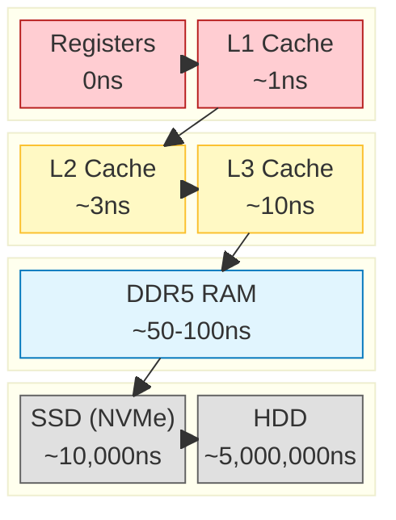
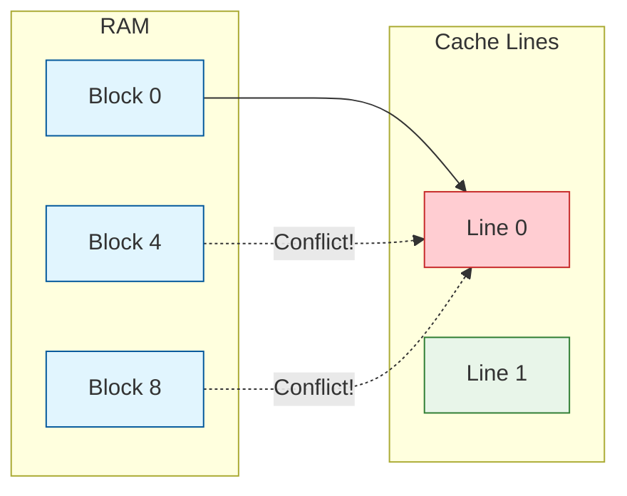

# ChÆ°Æ¡ng 1: Transistor & Logic Gates — Từ Electron đến Tính toán

> **Mục tiêu chương:** Hiểu cách một linh kiện vật lý nhỏ bé (transistor) tạo ra nền tảng cho MỌI phép tính trong máy tính — từ phép cộng đơn giản đến việc render hàng triệu polygon trong Unity.

---

## 1. Tại sao phải bắt đầu từ đây?

Khi bạn viết dòng code C# này trong Unity:

```csharp
float3 newPosition = currentPosition + velocity * deltaTime;
```

Bên dưới mọi abstraction layer, phép cộng và nhân đó **thực sự xảy ra** bên trong các mạch transistor vật lý. Không có phép màu — chỉ có electron chạy qua các công tắc bán dẫn, theo quy luật vật lý.

Hiểu điều này giúp bạn trả lời câu hỏi: **"Tại sao cách tôi tổ chức dữ liệu lại ảnh hưởng đến tốc độ?"** — bởi vì mọi thứ cuối cùng đều quay về cách phần cứng xử lý tín hiệu điện.

---

## 2. Chất bán dẫn — Vật liệu nền tảng

### 2.1. Ba loại vật liệu dẫn điện

| Loại | Đặc điểm | Ví dụ |
| :--- | :--- | :--- |
| **Dẫn điện (Conductor)** | Electron di chuyển tự do | Đồng (Cu), Nhôm (Al), Vàng (Au) |
| **Cách điện (Insulator)** | Electron bị giữ chặt, không di chuyển | Cao su, Thủy tinh, Nhựa |
| **Bán dẫn (Semiconductor)** | **Có thể bật/tắt** khả năng dẫn điện | Silicon (Si), Germanium (Ge) |

### 2.2. Silicon — "Đất" của ngành công nghiệp chip

Silicon (Si) là nguyên tố phổ biến thứ 2 trên vỏ Trái Đất (sau Oxy). Ở trạng thái nguyên chất, nó **gần như không dẫn điện**. Nhưng khi ta "pha tạp" (doping) thêm các nguyên tố khác, nó trở thành vật liệu kỳ diệu:

```
Silicon nguyên chất (4 electron lớp ngoài):

    Si --- Si --- Si --- Si
    |      |      |      |
    Si --- Si --- Si --- Si      ← Liên kết cộng hóa trị bền vững
    |      |      |      |         Không có electron tự do → KHÔNG dẫn điện
    Si --- Si --- Si --- Si


Pha tạp loại N (thêm Phosphorus - 5 electron):

    Si --- Si --- Si --- Si
    |      |      |      |
    Si --- [P]•── Si --- Si      ← Phosphorus có 5 electron, 4 liên kết với Si
    |      |      |      |         Thừa 1 electron tự do (•) → DẪN ĐIỆN (mang điện âm)
    Si --- Si --- Si --- Si


Pha tạp loại P (thêm Boron - 3 electron):

    Si --- Si --- Si --- Si
    |      |      |      |
    Si --- [B]○── Si --- Si      ← Boron có 3 electron, thiếu 1 liên kết
    |      |      |      |         Tạo "lỗ trống" (○) → DẪN ĐIỆN (mang điện dương)
    Si --- Si --- Si --- Si
```

> **Điểm mấu chốt:** Bằng cách kết hợp vùng N và vùng P, ta tạo ra "cửa" cho phép hoặc chặn dòng electron đi qua. Đó chính là nguyên lý của transistor.

---

## 3. MOSFET — Transistor hiện đại

### 3.1. Cấu tạo MOSFET (Metal-Oxide-Semiconductor Field-Effect Transistor)

MOSFET là loại transistor phổ biến nhất, chiếm **99%** transistor trong CPU/GPU hiện đại.

```
                         Gate (Cổng điều khiển)
                           │
                     ┌─────┴─────┐
                     │  Metal    │
                     ├───────────┤
                     │  Oxide    │   ← SiO₂ (Lớp cách điện siêu mỏng, ~1-2nm)
                     │  (SiO₂)  │
   ──────────────────┴───────────┴──────────────────
   │    Source (N)    │  Channel  │    Drain (N)    │
   │  (Vùng N-type)  │  (P-type) │  (Vùng N-type)  │
   └─────────────────┴───────────┴─────────────────┘
                      Substrate (P-type Nền Silicon)
                           │
                         Body (Nối đất)
```

### 3.2. Hoạt động — Như một vòi nước điện tử

Hãy tưởng tượng MOSFET như **vòi nước**:

```
┌──────────────────────────────────────────────────────────────────┐
│                     MOSFET = VÒI NƯỚC                            │
│                                                                  │
│    Source (Bể nước)                Drain (Cốc nước)              │
│        ┌───┐           Tay vặn         ┌───┐                    │
│        │///│          (= Gate)          │   │                    │
│        │///│            │               │   │                    │
│        │///│      ┌─────┴─────┐         │   │                    │
│        │///│──────│   Valve   │─────────│   │                    │
│        │///│      └───────────┘         │   │                    │
│        └───┘                            └───┘                    │
│                                                                  │
│   Gate = 0V (Tắt):  Valve ĐÓNG → Nước KHÔNG chảy → Bit "0"     │
│   Gate > Vth (Bật): Valve MỞ   → Nước CHẢY qua   → Bit "1"    │
│                                                                  │
│   Vth (Threshold Voltage) ≈ 0.3V - 0.7V tùy công nghệ          │
└──────────────────────────────────────────────────────────────────┘
```

### 3.3. Hai trạng thái — Nền tảng của nhị phân

**Trạng thái OFF (Logic 0):** Gate = 0V
```
    Gate = 0V
      │
   ───┴───
   │Oxide│
   ───────
   N │ P █████ N      ← Vùng P chặn electron
   ──┘         └──       Không có dòng điện Source → Drain
                         OUTPUT = 0 (LOW)
```

**Trạng thái ON (Logic 1):** Gate = Vdd (ví dụ 3.3V hoặc 1.0V)
```
    Gate = Vdd
      │
   ───┴───
   │Oxide│         Điện trường "kéo" electron lên tạo kênh dẫn
   ───────
   N │ n-channel │ N   ← Kênh N hình thành giữa Source và Drain
   ──┘            └──     Electron di chuyển tự do
                          OUTPUT = 1 (HIGH)
```

### 3.4. Kích thước thực tế — Sự thu nhỏ kinh ngạc

| Năm | Công nghệ | Kích thước Gate | Transistors/Chip | Ví dụ |
| :--- | :--- | :--- | :--- | :--- |
| 1971 | Intel 4004 | 10 μm | 2,300 | Máy tính bỏ túi |
| 1993 | Pentium | 800 nm | 3.1 triệu | PC đầu tiên phổ biến |
| 2013 | Haswell | 22 nm | 1.4 tá»· | Desktop gaming |
| 2020 | Apple M1 | 5 nm | 16 tá»· | MacBook |
| 2024 | Apple M4 | 3 nm | 28 tá»· | iPad Pro |
| 2025 | TSMC N2 | **2 nm** | 50+ tá»· | Next-gen chips |

> **Để so sánh trực quan:** 1 sợi tóc con người dày khoảng **80,000 nm**. Transistor 3nm có nghĩa là bạn có thể xếp **~26,000 transistor** trên bề rộng một sợi tóc.

---

## 4. Từ Transistor → Logic Gates (Cổng Logic)

### 4.1. Ý tưởng cốt lõi

Một transistor đơn lẻ chỉ là công tắc ON/OFF. Nhưng khi **kết hợp nhiều transistor**, ta tạo ra các **mạch logic** — nền tảng của mọi phép tính.

Có hai họ transistor bổ sung cho nhau:
- **NMOS (N-channel):** Dẫn điện khi Gate = 1 (kéo xuống GND = logic 0)
- **PMOS (P-channel):** Dẫn điện khi Gate = 0 (kéo lên Vdd = logic 1)

Kết hợp cả hai → **CMOS (Complementary MOS):** Mạch tiêu thụ điện cực thấp, chỉ tốn năng lượng khi chuyển trạng thái.

---

### 4.2. Cổng NOT (Inverter) — Cổng đơn giản nhất

**Chức năng:** Đảo ngược tín hiệu. Input 0 → Output 1. Input 1 → Output 0.

```
        Vdd (Nguồn dương)
         │
    ┌────┴────┐
    │  PMOS   │─── Gate = Input A
    └────┬────┘
         │
         ├─────────── Output (Y = NOT A)
         │
    ┌────┴────┐
    │  NMOS   │─── Gate = Input A
    └────┬────┘
         │
        GND (Đất)


Khi A = 0:                          Khi A = 1:
  PMOS ON (dẫn Vdd)                   PMOS OFF
  NMOS OFF                            NMOS ON (dẫn GND)
  Output = Vdd = 1                    Output = GND = 0

Bảng chân lý:
┌───────┬────────┐
│ A (In)│ Y (Out)│
├───────┼────────┤
│   0   │   1    │
│   1   │   0    │
└───────┴────────┘
```

> **2 transistor** → 1 phép tính logic đầu tiên!

---

### 4.3. Cổng NAND — "Cổng Vạn năng" (Universal Gate)

**Chức năng:** Output = 0 **chỉ khi** cả A VÀ B đều bằng 1. Mọi trường hợp khác = 1.

```
        Vdd                    Vdd
         │                      │
    ┌────┴────┐            ┌────┴────┐
    │  PMOS   │─ A         │  PMOS   │─ B       (Mắc SONG SONG)
    └────┬────┘            └────┬────┘
         │                      │
         └──────────┬───────────┘
                    │
                    ├──────────── Output (Y = NOT(A AND B))
                    │
               ┌────┴────┐
               │  NMOS   │─── A
               └────┬────┘                      (Mắc NỐI TIẾP)
               ┌────┴────┐
               │  NMOS   │─── B
               └────┬────┘
                    │
                   GND


Bảng chân lý:
┌───┬───┬───────────┐
│ A │ B │ NAND(A,B) │
├───┼───┼───────────┤
│ 0 │ 0 │     1     │     ← NMOS cả hai OFF → Output kéo lên Vdd
│ 0 │ 1 │     1     │     ← NMOS A OFF → đường xuống GND bị chặn
│ 1 │ 0 │     1     │     ← NMOS B OFF → đường xuống GND bị chặn
│ 1 │ 1 │     0     │     ← Cả hai NMOS ON → Output nối xuống GND
└───┴───┴───────────┘

Tổng: 4 transistors
```

**Tại sao NAND là "Universal"?** Vì mọi cổng logic khác đều có thể xây từ NAND:

```
NOT A        =  NAND(A, A)           ← Nối cả 2 input thành 1

A AND B      =  NOT(NAND(A, B))      ← NAND rồi đảo
             =  NAND(NAND(A,B), NAND(A,B))

A OR B       =  NAND(NOT A, NOT B)
             =  NAND(NAND(A,A), NAND(B,B))

→ Chỉ cần biết NAND, ta xây được MỌI THỨ.
  Đây là lý do bộ nhớ Flash (SSD) gọi là "NAND Flash".
```

---

### 4.4. Cổng AND, OR, XOR — Bộ công cụ đầy đủ

```
  ╔════════════════════════════════════════════════════════════════╗
  ║                 CÁC CỔNG LOGIC CƠ BẢN                        ║
  ╠════════════════════════════════════════════════════════════════╣
  â•‘                                                               â•‘
  ║  AND (VÀ) ── 6 transistors                                   ║
  ║  "Cả hai phải đúng"                                           ║
  ║  ┌───┬───┬──────────┐                                        ║
  ║  │ A │ B │ A AND B  │      Ẩn dụ: Khóa cửa cần CẢ HAI chìa  ║
  ║  ├───┼───┼──────────┤      → Chìa A VÀ Chìa B mới mở được   ║
  ║  │ 0 │ 0 │    0     │                                        ║
  ║  │ 0 │ 1 │    0     │                                        ║
  ║  │ 1 │ 0 │    0     │                                        ║
  ║  │ 1 │ 1 │    1     │  ← Chỉ trường hợp này ra 1             ║
  ║  └───┴───┴──────────┘                                        ║
  â•‘                                                               â•‘
  ║  OR (HOẶC) ── 6 transistors                                  ║
  ║  "Ít nhất một đúng"                                           ║
  ║  ┌───┬───┬──────────┐                                        ║
  ║  │ A │ B │ A OR B   │      Ẩn dụ: 2 công tắc đèn song song   ║
  ║  ├───┼───┼──────────┤      → Bất kỳ ai bật cũng sáng đèn     ║
  ║  │ 0 │ 0 │    0     │  ← Chỉ trường hợp này ra 0             ║
  ║  │ 0 │ 1 │    1     │                                        ║
  ║  │ 1 │ 0 │    1     │                                        ║
  ║  │ 1 │ 1 │    1     │                                        ║
  ║  └───┴───┴──────────┘                                        ║
  â•‘                                                               â•‘
  ║  XOR (HOẶC LOẠI TRỪ) ── 8-12 transistors                    ║
  ║  "Khác nhau mới đúng"                                        ║
  ║  ┌───┬───┬──────────┐                                        ║
  ║  │ A │ B │ A XOR B  │      Ẩn dụ: 2 công tắc cầu thang       ║
  ║  ├───┼───┼──────────┤      → Đèn đổi trạng thái mỗi khi     ║
  ║  │ 0 │ 0 │    0     │        BẤT KỲ AI bật/tắt               ║
  ║  │ 0 │ 1 │    1     │                                        ║
  ║  │ 1 │ 0 │    1     │                                        ║
  ║  │ 1 │ 1 │    0     │                                        ║
  ║  └───┴───┴──────────┘                                        ║
  â•‘                                                               â•‘
  ║  XOR rất đặc biệt vì: A XOR B = Bit tổng của phép cộng!     ║
  ║  Đây là nền tảng xây dựng mạch CỘNG (Adder).                 ║
  â•‘                                                               â•‘
  ╚════════════════════════════════════════════════════════════════╝
```

---

## 5. Xây dựng mạch Tính toán — Từ Gates đến ALU

### 5.1. Half Adder — Bộ cộng nửa (Cộng 2 bit)

**Bài toán:** Cộng 2 bit (A + B), cho ra kết quả **Sum** (tổng) và **Carry** (nhớ).

```
Ví dụ thực tế (cộng nhị phân):
   0 + 0 = 00  (Sum=0, Carry=0)
   0 + 1 = 01  (Sum=1, Carry=0)
   1 + 0 = 01  (Sum=1, Carry=0)
   1 + 1 = 10  (Sum=0, Carry=1)    ← "10" nhị phân = 2 thập phân

Nhận xét:
   Sum  = A XOR B   (Giống nhau → 0, Khác nhau → 1)
   Carry = A AND B   (Cả hai = 1 → Nhớ 1)


Sơ đồ mạch:
          ┌─────────┐
   A ─────┤         │
          │   XOR   ├──────── Sum (Bit tổng)
   B ──┬──┤         │
       │  └─────────┘
       │
       │  ┌─────────┐
       └──┤         │
          │   AND   ├──────── Carry (Bit nhớ)
   A ─────┤         │
          └─────────┘

Tổng: 1 XOR + 1 AND ≈ 14-18 transistors
```

### 5.2. Full Adder — Bộ cộng đầy đủ (Cộng 2 bit + Carry trước)

**Bài toán:** Cộng A + B + Cin (bit nhớ từ phép cộng trước đó).

```
Ví dụ:  Cộng 5 + 3 ở dạng nhị phân (4-bit)

         Carry: 1 1
                0 1 0 1    (5)
              + 0 0 1 1    (3)
              ─────────
                1 0 0 0    (8)

Từ phải sang trái:
  Bit 0: 1+1+0   = 10 → Sum=0, Carry=1        (Full Adder #0)
  Bit 1: 0+1+1   = 10 → Sum=0, Carry=1        (Full Adder #1)
  Bit 2: 1+0+1   = 10 → Sum=0, Carry=1        (Full Adder #2)
  Bit 3: 0+0+1   = 01 → Sum=1, Carry=0        (Full Adder #3)
  Kết quả: 1000 = 8 ✓


Sơ đồ Full Adder (= 2 Half Adders + 1 OR):
              ┌──────────────┐
   A ─────────┤ Half Adder 1 ├─── S1 ────┐
   B ─────────┤              ├─── C1 ──┐ │
              └──────────────┘         │ │
                                       │ │  ┌──────────────┐
                                       │ └──┤ Half Adder 2 ├─── Sum (Kết quả)
   Cin (Carry in) ─────────────────────┘────┤              ├─── C2
                                            └──────────────┘  │
                                                              │
              ┌───────┐                                       │
   C1 ────────┤  OR   ├──── Cout (Carry out tới bit tiếp)    │
   C2 ────────┤       │                                       │
              └───────┘◄──────────────────────────────────────┘

Tổng: ~40 transistors cho 1 Full Adder
```

### 5.3. Ripple Carry Adder — Cộng số nhiều bit

Để cộng hai số 32-bit, ta nối **32 Full Adders** lại:

```
32-bit Ripple Carry Adder:

   A[0] B[0]     A[1] B[1]     A[2] B[2]          A[31] B[31]
     │   │         │   │         │   │               │    │
   ┌─▼───▼─┐     ┌─▼───▼─┐     ┌─▼───▼─┐          ┌─▼────▼─┐
   │  FA   │     │  FA   │     │  FA   │   ····   │   FA   │
   │  #0   │     │  #1   │     │  #2   │          │  #31   │
   └──┬──┬─┘     └──┬──┬─┘     └──┬──┬─┘          └──┬──┬──┘
      │  └─Cout──►Cin┘  └─Cout──►Cin┘               │  └─ Overflow?
    Sum[0]       Sum[1]       Sum[2]              Sum[31]

   Carry "gợn sóng" (ripple) từ phải sang trái.
   Tổng: 32 × 40 = ~1,280 transistors cho phép cộng 32-bit.

   ⚠ Nhược điểm: Bit cao nhất phải ĐỢI carry từ bit thấp nhất.
     → Giải pháp: Carry-Lookahead Adder (tính carry song song, nhanh hơn).
```

#### > Code to Hardware: ADD
Khi bạn viết `c = a + b;` trong C#:
1.  **Compiler:** Dịch sang Assembly `ADD R1, R2` (cộng giá trị R2 vào R1).
2.  **Hardware:**
    *   `R1` và `R2` đưa tín hiệu điện vào 32 cặp input `A` và `B`.
    *   Tín hiệu lan truyền qua 1,280 transistors trong Ripple Carry Adder.
    *   Sau ~1 clock cycle, kết quả xuất hiện ở output `Sum` và được ghi lại vào `R1`.

---

### 5.4. Subtractor — Mạch trừ (Tái sử dụng Adder!)

**Insight quan trọng:** CPU KHÔNG CÓ mạch trừ riêng! Nó DÙNG LẠI mạch cộng.

```
Cách tính A - B bằng mạch cộng:

  Trong hệ nhị phân có dấu (Two's Complement):
    -B = NOT(B) + 1    (đảo tất cả bits rồi cộng 1)

  Vậy:
    A - B = A + (-B) = A + NOT(B) + 1
                             ↑         ↑
                          XOR gates   Cin = 1


Ví dụ: 5 - 3 = ?

    A    =  0101  (5)
    B    =  0011  (3)
    NOT B =  1100
    +1   → Cin=1

    Thực hiện: 0101 + 1100 + 1 = 10010
    Bỏ bit tràn → 0010 = 2 ✓


Mạch Subtractor = Adder + XOR gates:

   A[0] B[0]     A[1] B[1]     A[2] B[2]          A[31] B[31]
     │   │         │   │         │   │               │    │
     │  ┌▼┐        │  ┌▼┐        │  ┌▼┐              │   ┌▼┐
     │  │X│←SUB    │  │X│←SUB    │  │X│←SUB          │   │X│←SUB
     │  │O│        │  │O│        │  │O│              │   │O│
     │  │R│        │  │R│        │  │R│              │   │R│
     │  └┬┘        │  └┬┘        │  └┬┘              │   └┬┘
   ┌─▼───▼─┐     ┌─▼───▼─┐     ┌─▼───▼─┐          ┌─▼────▼─┐
   │  FA   │     │  FA   │     │  FA   │   ····   │   FA   │
   │  #0   │     │  #1   │     │  #2   │          │  #31   │
   └──┬──┬─┘     └──┬──┬─┘     └──┬──┬─┘          └──┬──┬──┘
      │  └─Cout──►Cin┘  └─Cout──►Cin┘               │
    R[0]          R[1]          R[2]               R[31]
         â–²
         │
   Cin = SUB signal (0 = cộng, 1 = trừ)

   Khi SUB = 0: XOR gates pass B through (B XOR 0 = B), Cin = 0 → A + B
   Khi SUB = 1: XOR gates flip B (B XOR 1 = NOT B), Cin = 1 → A + NOT(B) + 1 = A - B

   → CÙNG 1 MẠCH VẬT LÝ làm được CẢ cộng VÀ trừ!
   → Tiết kiệm transistor + diện tích chip → Đây là thiết kế thực tế trong CPU
```

#### > Code to Hardware: SUB
Khi bạn viết `health -= damage;`:
1.  **Assembly:** `SUB EAX, EBX` (x86) hoặc `SUB R0, R1, R2` (ARM).
2.  **Hardware:**
    *   ALU nhận tín hiệu `SUB` (Opcode).
    *   Tín hiệu này kích hoạt các cổng **XOR** ở đầu vào B để đảo bit (`NOT B`).
    *   Đồng thời kích hoạt `Cin = 1` vào Full Adder đầu tiên.
    *   Mạch cộng chạy bình thường → Ra kết quả phép trừ!

> **Kết nối Unity:** Khi Burst compile `a - b`, CPU thực thi lệnh `SUB` — nhưng bên trong ALU, nó chỉ là `ADD` với B được đảo + Cin=1. Cùng mạch cộng ở trên.

---

### 5.5. Multiplexer (MUX) — Bộ chọn tín hiệu

**MUX là "cổng chọn"** — quyết định output lấy từ input nào, dựa trên tín hiệu select.

```
MUX 2:1 (chọn 1 trong 2 inputs):

   I0 ───┐
         │    ┌─────┐
         ├────┤ MUX ├──── Y (Output)
         │    │ 2:1 │
   I1 ───┘    └──┬──┘
                 │
   S ────────────┘ (Select)

   Bảng chân lý:
   ┌───┬───┬───┬────────┐
   │ S │ I0│ I1│ Y      │
   ├───┼───┼───┼────────┤
   │ 0 │ * │ * │ Y = I0 │   ← S=0: chọn input I0
   │ 1 │ * │ * │ Y = I1 │   ← S=1: chọn input I1
   └───┴───┴───┴────────┘

   Công thức: Y = (NOT S AND I0) OR (S AND I1)
   → Xây từ: 1 NOT + 2 AND + 1 OR = ~12 transistors


MUX 4:1 (chọn 1 trong 4 — dùng 2 bit select):

   I0 ──┐
   I1 ──┤    ┌─────┐
         ├────┤ MUX ├──── Y
   I2 ──┤    │ 4:1 │
   I3 ──┘    └──┬──┘
                │
   S[1:0] ──────┘

   S = 00 → Y = I0
   S = 01 → Y = I1
   S = 10 → Y = I2
   S = 11 → Y = I3


TẠI SAO MUX QUAN TRỌNG CHO ALU?

   ALU chạy TẤT CẢ mạch tính toán CÙNG LÚC (adder, AND, OR, shift, ...)
   MUX ở output CHỌN kết quả đúng dựa trên Opcode.

   Ví dụ: ALU nhận Opcode = ADD
   → Adder, AND unit, OR unit, Shifter... tất cả đều tính
   → MUX chọn output từ Adder, bỏ qua phần còn lại
   → Hiệu quả hơn là routing tín hiệu tùy theo lệnh!

   Opcode 2-bit → MUX 4:1 → chọn 1 trong 4 phép tính
   Opcode 3-bit → MUX 8:1 → chọn 1 trong 8 phép tính
```

#### > Code to Hardware: Conditional Move
Khi bạn dùng `math.select(a, b, condition)` trong Burst:
1.  **Assembly:** `CMOVNE EAX, EBX` (Conditional Move - x86) hoặc `CSEL W0, W1, W2, NE` (ARM).
2.  **Hardware:**
    *   Thay vì dùng `JUMP` (nhảy dòng lệnh), CPU dùng MUX để chọn giá trị.
    *   Nếu `condition` đúng, MUX chọn `b`. Sai chọn `a`.
    *   **Không có Branch Prediction penalty!**

---

### 5.6. Shifter — Mạch dịch bit

**Shifter dịch tất cả bits sang trái hoặc phải.** Dịch trái 1 bit = nhân 2, dịch phải 1 bit = chia 2.

```
Shift Left Logical (SHL) — Ví dụ: 00001010 << 2

   TrÆ°á»›c:   0 0 0 0 1 0 1 0   = 10
   Dịch ←2: 0 0 1 0 1 0 0 0   = 40
                         ↑ ↑
                     Điền 0 vào

   10 << 2 = 10 × 4 = 40 ✓  (Mỗi dịch trái = ×2)


Shift Right Logical (SHR) — Ví dụ: 00101000 >> 2

   TrÆ°á»›c:   0 0 1 0 1 0 0 0   = 40
   Dịch →2: 0 0 0 0 1 0 1 0   = 10
             ↑ ↑
         Điền 0 vào

   40 >> 2 = 40 ÷ 4 = 10 ✓  (Mỗi dịch phải = ÷2)


Barrel Shifter — Dịch N bit trong 1 clock cycle:

   Mạch tổ hợp dùng MUXes nhiều tầng:

   Tầng 0: MUX quyết định dịch 0 hay 1 bit   (dựa trên shift[0])
   Tầng 1: MUX quyết định dịch 0 hay 2 bits  (dựa trên shift[1])
   Tầng 2: MUX quyết định dịch 0 hay 4 bits  (dựa trên shift[2])
   Tầng 3: MUX quyết định dịch 0 hay 8 bits  (dựa trên shift[3])
   Tầng 4: MUX quyết định dịch 0 hay 16 bits (dựa trên shift[4])

   → 5 tầng MUX = dịch bất kỳ 0-31 bit cho số 32-bit!
   → Tổng: ~32 MUXes × 5 tầng × 12 transistors = ~1,920 transistors


   Input:    [b31][b30][b29]...[b1][b0]
                │    │    │        │   │
             ┌──▼────▼────▼────────▼───▼──┐
             │  Tầng 0: Shift 0 or 1?     │ ← shift[0]
             └──┬────┬────┬────────┬───┬──┘
             ┌──▼────▼────▼────────▼───▼──┐
             │  Tầng 1: Shift 0 or 2?     │ ← shift[1]
             └──┬────┬────┬────────┬───┬──┘
             ┌──▼────▼────▼────────▼───▼──┐
             │  Tầng 2: Shift 0 or 4?     │ ← shift[2]
             └──┬────┬────┬────────┬───┬──┘
                │    │    │        │   │
             ... (tầng 3, 4)
                │    │    │        │   │
             [r31][r30][r29]...[r1][r0]  = Result
```

#### > Code to Hardware: SHL / SHR
1.  **C#:** `int x = a << 2;` (hoặc `a * 4`)
2.  **Assembly (x86):** `SHL EAX, 2`
3.  **Hardware:**
    *   Tín hiệu điện chạy qua tầng MUX số 1 (dịch 2 bit).
    *   Bỏ qua các tầng MUX khác.
    *   Kết quả có ngay trong 1 cycle. Nhanh hơn mạch nhân (`IMUL`) nhiều (mất 3-4 cycles).

> **Kết nối Unity:** Trong Burst-compiled code, `x << n` hoặc `x >> n` = 1 lệnh Assembly (`SHL`/`SHR`). Bitwises operations trong Lab 1 (BitFlags) — mỗi shift chạy qua chính mạch Barrel Shifter này. Shift nhanh hơn multiply (`x * 4` = `x << 2`), đây là lý do compilers tự convert `x * 2^n` thành shift!

---

### 5.7. Multiplier — Mạch nhân (Shift-and-Add)

**Nhân chỉ là cộng lặp lại** — nhưng thông minh hơn: shift-and-add.

```
Nhân nhị phân giống nhân thập phân trên giấy:

   Ví dụ: 0101 × 0011 (5 × 3):

         0 1 0 1    (A = 5)
       × 0 0 1 1    (B = 3)
       ──────────
         0 1 0 1    ← A × B[0] = A × 1 = A          (không shift)
       0 1 0 1 0    ← A × B[1] = A × 1 = A << 1     (shift trái 1)
     0 0 0 0 0 0    ← A × B[2] = A × 0 = 0           (skip)
   0 0 0 0 0 0 0    ← A × B[3] = A × 0 = 0           (skip)
   ──────────────
     0 0 0 1 1 1 1  = 15 ✓

   Quy tắc:
   - Nếu bit B[i] = 1: Cộng A đã shift trái i bit
   - Nếu bit B[i] = 0: Bỏ qua (cộng 0)
   - Tổng tất cả partial products = kết quả


Mạch Multiplier 4-bit:

   A[3:0]    B[3:0]
     │          │
     │    ┌─────┴─────┐
     │    │ B[0]=1?   │ → Partial Product 0 = A[3:0] AND B[0]
     │    │ B[1]=1?   │ → Partial Product 1 = (A[3:0] AND B[1]) << 1
     │    │ B[2]=1?   │ → Partial Product 2 = (A[3:0] AND B[2]) << 2
     │    │ B[3]=1?   │ → Partial Product 3 = (A[3:0] AND B[3]) << 3
     │    └───────────┘
     │         │
     │    ┌────▼────┐
     │    │  Adder  │  ← Cộng tất cả partial products
     │    │  Tree   │    (Wallace Tree hoặc Dadda Tree)
     │    └────┬────┘
     │         │
          Result[7:0]  ← Kết quả 8-bit (4-bit × 4-bit = tối đa 8-bit)


   ● "B[i] AND A" = 4 AND gates (mỗi bit) → quyết định cộng A hay 0
   ● Partial products cộng bằng Adder tree
   ● Kết quả: width gấp đôi (4-bit × 4-bit = 8-bit, 32×32 = 64-bit)
   ● Transistor count: Multiplier 32-bit = ~30,000-50,000 transistors
     (ĐẮT hơn nhiều so với Adder ~1,300!)


Wallace Tree — Cộng nhanh partial products:

   Thay vì cộng tuần tự (P0+P1, rồi +P2, rồi +P3...):
   → Wallace Tree cộng SONG SONG bằng cách dùng Full Adders liên tầng

   Tầng 1: Nhóm 3 partial products → FA → giảm xuống 2 dòng
   Tầng 2: Nhóm tiếp → giảm tiếp
   ...
   Tầng cuối: 1 phép cộng cuối cùng

   → Thay vì O(N) tầng cộng tuần tự → O(log N) tầng!
   → Multiplier 32-bit hoàn thành trong ~3-4 clock cycles thay vì ~32
```

#### > Code to Hardware: MUL / IMUL
1.  **C#:** `float3 c = a * b;`
2.  **Assembly (Burst AVX):** `VMULPS YMM0, YMM1, YMM2`
3.  **Hardware:**
    *   Lệnh này kích hoạt **8 bộ nhân FPU** chạy song song (vì YMM là 256-bit chứa 8 floats).
    *   Mỗi bộ nhân tiêu tốn khoảng 3-5 clock cycles (latency) nhưng có thể pipelined (throughput 0.5-1 cycle).

> **Kết nối Unity:** Mỗi `float3 result = a * b` trong Burst Job = 3 phép nhân float. Mỗi phép nhân chạy qua FPU Multiplier (~50,000 transistors). SIMD AVX2: `VMULPS ymm0, ymm1, ymm2` = 8 phép nhân song song — 8 multiplier units chạy cùng lúc!

---

### 5.8. Comparator — Mạch so sánh

**So sánh A và B** → xuất ra flags: A==B? A>B? A<B?

```
So sánh 1 bit (A vs B):

   A == B:  NOT(A XOR B)     ← XOR = khác nhau → NOT → giống nhau!
   A > B:   A AND (NOT B)    ← A=1 và B=0 → A lớn hơn
   A < B:   (NOT A) AND B    ← A=0 và B=1 → A nhỏ hơn


So sánh nhiều bit — Từ bit cao nhất xuống:

   Ví dụ: A = 0110 (6), B = 0100 (4)

   Bit 3: A[3]=0, B[3]=0 → Bằng → Xét bit tiếp
   Bit 2: A[2]=1, B[2]=1 → Bằng → Xét bit tiếp
   Bit 1: A[1]=1, B[1]=0 → A > B → DỪNG! Kết quả: A > B ✓


Mạch Comparator 4-bit (cascade):

   A[3] B[3]     A[2] B[2]     A[1] B[1]     A[0] B[0]
     │   │         │   │         │   │         │   │
   ┌─▼───▼─┐     ┌─▼───▼─┐     ┌─▼───▼─┐     ┌─▼───▼─┐
   │ 1-bit │     │ 1-bit │     │ 1-bit │     │ 1-bit │
   │ Comp  │     │ Comp  │     │ Comp  │     │ Comp  │
   │ #3    │     │ #2    │     │ #1    │     │ #0    │
   └───┬───┘     └───┬───┘     └───┬───┘     └───┬───┘
       │ EQ,GT,LT    │             │             │
       └──priority──►└──priority──►└──priority──►└──► Flags
                                                       │
                                                  Zero (A==B)
                                                  Negative (A<B)
                                                  Carry (A>B)

   Output → CPU Flags Register:
   ┌──────────────────────────────────────────────────┐
   │  Z (Zero)    = 1 nếu A == B                     │
   │  N (Negative)= 1 nếu A < B (kết quả A-B < 0)   │
   │  C (Carry)   = 1 nếu A > B (overflow khi trừ)   │
   └──────────────────────────────────────────────────┘

   CPU dùng flags này cho "branch instructions":
     CMP R1, R2     → Subtractor: R1 - R2, ghi flags
     JE  label      → Nhảy nếu Z=1 (Jump if Equal)
     JG  label      → Nhảy nếu Z=0 AND N=0 (Jump if Greater)
     JL  label      → Nhảy nếu N=1 (Jump if Less)
```

#### > Code to Hardware: CMP + JUMP
1.  **C#:** `if (health <= 0) Die();`
2.  **Assembly:**
    ```asm
    CMP  EAX, 0      ; So sánh EAX (health) với 0 -> Mạch Comparator chạy
    JLE  Label_Die   ; Jump if Less or Equal (Kiểm tra Flag Z=1 hoặc N=1)
    ```
3.  **Hardware:**
    *   `CMP` thực chất là phép trừ `health - 0` mà **bỏ qua kết quả**, chỉ giữ lại Flags.
    *   Nếu `health=0`, kết quả trừ = 0 → Flag Z bật lên 1.
    *   Lệnh `JLE` chỉ nhìn vào Flag Z và N để quyết định nạp lệnh tiếp theo từ đâu.

> **Kết nối Unity:** Mỗi `if (health <= 0)` trong C# → Burst/IL2CPP compile thành `CMP` + `JLE`. `CMP` = mạch Subtractor (tính `health - 0`) + ghi flags. `JLE` = kiểm tra flags Z hoặc N. Branch prediction (Chapter 3) dự đoán kết quả flags TRƯỚC KHI comparator hoàn thành!

---

### 5.9. ALU (Arithmetic Logic Unit) — Bộ não hoàn chỉnh

Bây giờ ta thấy ALU = **ghép TẤT CẢ mạch trên bằng MUX**:

```
                    ┌──────────────────────────────────────────────┐
                    │               ALU (32-bit)                    │
                    │                                              │
   A (32-bit) ─────►│  ┌─────────────┐                            │
                    │  │   Adder     │─── Kết quả nếu ADD         │
   B (32-bit) ─────►│  │ (1,280 tr.) │                            │
                    │  ├─────────────┤                            │
                    │  │ Subtractor  │─── Kết quả nếu SUB         │
                    │  │ (=Adder+XOR)│  (dùng lại Adder!)         │
                    │  ├─────────────┤                            │
                    │  │  Multiplier │─── Kết quả nếu MUL         │
                    │  │(30,000 tr.) │                  │         │
                    │  ├─────────────┤                  │         │
                    │  │  AND (32×)  │─── Kết quả nếu AND│         │
                    │  ├─────────────┤                  │  ┌─────┐│
                    │  │  OR  (32×)  │─── Kết quả nếu OR│  │ MUX ││──► Result
                    │  ├─────────────┤                  │  │ 8:1 ││
                    │  │  XOR (32×)  │─── Kết quả nếu XOR│ │     ││
                    │  ├─────────────┤                  │  └──┬──┘│
                    │  │  Shifter    │─── Kết quả nếu SHL│    │   │
                    │  │ (1,920 tr.) │                  │    │   │
                    │  ├─────────────┤                  │    │   │
                    │  │ Comparator  │─── Flags ───────►│ FLAG│   │
                    │  └─────────────┘                       REG │
                    │                                              │
   Opcode (3-bit) ──►──────────────── Select line cho MUX ────────┘
                    │                                              │
                    │  ┌─────────────────────────────────────────┐ │
                    │  │ Opcode Map:                             │ │
                    │  │   000 = ADD    100 = AND                │ │
                    │  │   001 = SUB    101 = OR                 │ │
                    │  │   010 = MUL    110 = XOR                │ │
                    │  │   011 = SHL/R  111 = CMP                │ │
                    │  └─────────────────────────────────────────┘ │
                    │                                              │
                    │  Tổng: ~50,000-80,000 transistors             │
                    │  CPU hiện đại: 4-8 ALU + FPU per core       │
                    │  GPU: 128 ALU per SM × 46 SM = 5,888 ALU!   │
                    └──────────────────────────────────────────────┘
```

**Ví dụ cụ thể — Lệnh `ADD R1, R2`:**
```
Bước 1: CPU đọc lệnh "ADD" → Giải mã Opcode = 0010
Bước 2: Lấy giá trị R1 (= 5 = 00000101) và R2 (= 3 = 00000011) từ Registers
Bước 3: ALU nhận A=R1, B=R2, Opcode=ADD
Bước 4: MUX chọn output từ Adder
Bước 5: Adder tính: 00000101 + 00000011 = 00001000 (= 8)
Bước 6: Kết quả 8 ghi lại vào R1

→ Tất cả diễn ra trong 1 clock cycle (~0.2 nanosecond ở 5GHz)
→ Chỉ là electron chạy qua ~1,300 transistors trong Adder
```

---

## 6. Kết nối tới Unity — Tại sao điều này quan trọng?

### 6.1. Phép tính trong Shader chính là ALU đang chạy

```csharp
// Vertex Shader (chạy trên GPU):
float4 clipPos = mul(UNITY_MATRIX_MVP, vertexPos);
```

Phép nhân ma trận `mul()` này = **16 phép nhân + 12 phép cộng** `float`.
Mỗi phép tính `float` sử dụng một **FPU (Floating Point Unit)** — phiên bản ALU cho số thực.

Với 10,000 vertices → GPU thực hiện **280,000 phép tính** chỉ cho bước MVP transform.
Mỗi phép tính = hàng nghìn transistor đóng/mở trong FPU.

### 6.2. Tại sao NAND quan trọng cho Game Developer?

```
SSD trong máy bạn = hàng tỷ NAND Gates xếp chồng lên nhau (3D NAND).
  → Load texture, load scene, streaming assets = đọc từ NAND Flash.
  → SSD nhanh hơn HDD vì NAND truy cập tức thời (không quay đĩa).

RAM trong máy bạn = hàng tỷ transistors đơn (DRAM).
  → Mỗi pixel trong RenderTexture = dữ liệu nằm trên DRAM.
  → GC allocation trong C# = cấp phát thêm vùng DRAM mới.
```

### 6.3. Tại sao kích thước transistor ảnh hưởng đến game?

| Transistor nhỏ hơn → | Lý do | Hệ quả cho Game |
| :--- | :--- | :--- |
| Nhiều transistor hơn/chip | Nhiều ALU hơn, nhiều cores hơn | Chạy được nhiều logic & render phức tạp hơn |
| Tiêu thụ ít điện hơn | Ít nhiệt → clock speed cao hơn | FPS cao hơn ở cùng TDP |
| Tốc độ đóng/mở nhanh hơn | Khoảng cách electron di chuyển ngắn hơn | Mỗi clock cycle nhanh hơn |

> **Kết luận Chapter 1:** Mỗi dòng code bạn viết — từ `if (health <= 0)` đến `Shader.SetFloat()` — cuối cùng đều biến thành tín hiệu điện chạy qua hàng tỷ transistor. Hiểu điều này không chỉ là kiến thức lý thuyết, mà là nền tảng để bạn hiểu tại sao **cách tổ chức dữ liệu** (DOD) và **cách viết shader** (branchless) lại ảnh hưởng trực tiếp đến hiệu năng.

---

## 7. Mảnh ghép còn thiếu — Kẻ đã quên mình là ai

Chúng ta đã xây dựng được ALU — một cỗ máy tính toán siêu việt từ hàng nghìn cổng logic.
- Nó có thể tính `5000 + 3000` trong nháy mắt.
- Nó có thể so sánh `health <= 0` cực nhanh.

**NHƯNG... có một vấn đề chết người:**
Ngay khi dòng điện đi qua, cổng logic trả về kết quả, và sau đó... **nó quên sạch**.
- Input tắt → Output tắt.
- Không có cách nào để lưu số "8000" lại để dùng cho phép tính sau.

Một CPU mà không có bộ nhớ (Memory) thì chỉ là một chiếc máy tính bỏ túi không có nút "M+" — vô dụng với các chương trình phức tạp.

Để biến chiếc máy tính này thành một **Computer** thực thụ, ta cần một loại mạch điện mới: Một loại mạch có thể **tự duy trì dòng điện** của chính nó.

👉 **Mời bước sang Chapter 2: Nơi ta học cách "bẫy" electron để tạo ra Ký ức.**

---

> **Chương tiếp theo:** [Chapter 2 — Memory & Storage: Từ Flip-flop đến RAM]() — Cách transistor tạo ra bộ nhớ, và tại sao Memory Hierarchy là chìa khóa của hiệu năng DOTS.

---
*Chapter 1 — Nghiên cứu cho Unity High-Performance Agent*
# Chương 2: Memory & Storage — Từ Flip-flop đến RAM

> **Mục tiêu chương:** Hiểu cách transistor tạo ra bộ nhớ, tại sao có nhiều tầng bộ nhớ khác nhau (Memory Hierarchy), và tại sao **Cache Locality** là yếu tố quyết định hiệu năng trong Unity DOTS.

---

## 1. Vấn đề: CPU nhanh, Bộ nhớ chậm

Ở **Chapter 1**, chúng ta đã tạo ra bộ não biết tính toán (ALU). Nó có thể cộng trừ nhân chia siêu tốc.
Nhưng bộ não đó có một điểm yếu chết người: **Nó không có trí nhớ.** (Input tắt → Output mất).

Để giải quyết, ta cần cung cấp cho nó "nguyên liệu" (Data) để tính toán và một nơi để lưu kết quả.

Hãy tưởng tượng bạn là một đầu bếp thiên tài (CPU), có thể chế biến bất kỳ món ăn nào trong **1 giây**. Nhưng:

```
┌──────────────────────────────────────────────────────────────────────┐
│  ĐẦU BẾP (CPU) cần nguyên liệu (Data):                             │
│                                                                      │
│  📋 Bảng ghi chú trước mặt (Registers):    Lấy ngay = 0 giây       │
│  🧊 Tủ lạnh cạnh bếp (L1 Cache):           Mở lấy  = 2 giây       │
│  🧊 Tủ lạnh ngoài hành lang (L2 Cache):    Đi lấy  = 5 giây       │
│  🧊 Kho lạnh tầng hầm (L3 Cache):          Xuống lấy = 15 giây    │
│  🏪 Siêu thị gần nhà (RAM):                Chạy đi = 3 PHÚT       │
│  🚚 Nhà kho ngoại thành (SSD):             Gọi giao = 1 GIỜ       │
│  🚢 Nhập khẩu từ nước ngoài (HDD):         Đợi ship = 1 TUẦN      │
│                                                                      │
│  → Đầu bếp (CPU) phải ĐỨNG ĐỢI khi nguyên liệu ở xa.              │
│    Đây gọi là "Memory Stall" — CPU không làm gì cả, chỉ chờ data.  │
└──────────────────────────────────────────────────────────────────────┘
```

**Giải pháp của ngành công nghiệp:** Tạo ra nhiều tầng bộ nhớ — nhỏ nhưng nhanh ở gần CPU, lớn nhưng chậm ở xa CPU. Đây là **Memory Hierarchy**.

---

## 2. Clock & Cycle — "Nhịp tim" của CPU

> **🎯 Ẩn dụ — Nhạc trưởng dàn nhạc:**
> Tưởng tượng dàn nhạc 100 người. Nếu ai cũng chơi lúc nào tùy thích → **HỖN LOẠN**.
> Nhạc trưởng giơ đũa — **"ĐÁNH!"** — tất cả 100 nhạc công cùng đánh nốt tiếp theo **ĐỒNG LOẠT**.
> Clock signal = **Cây đũa nhạc trưởng** của CPU.
> Mỗi lần "đánh" = tất cả hàng tỷ transistors trong CPU cập nhật trạng thái **CÙNG MỘT KHOẢNH KHẮC**.

### Clock là gì?

**Clock** = MỘT TÍN HIỆU ĐIỆN cứ lặp đi lặp lại: CAO → THẤP → CAO → THẤP...

```wavedrom
{
  "signal": [
    { "name": "Voltage", "wave": "lh.lh.lh.lh.lh." },
    { "name": "Tick",    "wave": "x.2..2..2..2..2.", "data": ["Tick", "Tick", "Tick", "Tick", "Tick"] }
  ],
  "head": {
    "text": "Tín hiệu Clock"
  },
  "foot": {
    "tick": 0
  },
  "config": { "hscale": 2 }
}
```

> **Cơ chế:**
> - Chỉ tại mỗi **CẠNH LÊN** (Low → High), mọi thứ xảy ra (**Tick**).
> - Giữa 2 cạnh lên = CPU đang **CHỜ** tín hiệu ổn định.

**Clock được tạo ra từ đâu? — Trái tim Thạch anh**

Tín hiệu Clock không tự nhiên có. Nó đến từ một linh kiện nhỏ trên Mainboard gọi là **Bộ dao động Thạch anh (Crystal Oscillator)**.

1.  **Hiệu ứng áp điện:** Khi cho dòng điện chạy qua tinh thể thạch anh, nó sẽ **rung** (co giãn) với tần số cực kỳ ổn định và chính xác (ví dụ: 100 MHz).
2.  **Nhân tần số (PLL):** CPU không chạy ở 100 MHz. Nó dùng mạch nhân tần (Multiplier) để nhân lên 30-50 lần → tạo ra 3 GHz, 5 GHz.
3.  **Tại sao cần thạch anh?** Vì nếu dùng mạch điện thường, nhiệt độ thay đổi sẽ làm tần số sai lệch → CPU chạy không ổn định (treo máy). Thạch anh giữ nhịp "chuẩn từng mili-giây".

> **Ví dụ:** Giống như quả lắc đồng hồ cơ. Quả lắc dao động đều đặn (gốc), và các bánh răng (PLL) nhân chuyển động đó lên để quay kim giây, kim phút.

---

### 2.1. Cycle — 1 "nhịp đập" = 1 đơn vị thời gian

**1 Cycle = Khoảng thời gian GIỮA 2 cạnh lên liên tiếp**

```wavedrom
{
  "signal": [
    { "name": "CLK",   "wave": "P........" },
    { "name": "Cycle", "wave": "x.3.4.5..", "data": ["Fetch ADD", "Decode", "Execute"] }
  ],
  "head": {
    "text": "Chu trình xử lý lệnh (Pipeline)",
    "tick": 0
  },
  "foot": {
    "tick": 0
  },
  "config": { "hscale": 2 }
}
```

> **Giải thích:**
> - Trong 1 cycle (giữa 2 Tick), CPU làm trọn vẹn 1 bước công việc.
> - Ví dụ: Tải lệnh → Giải mã → Thực thi.


═══ Clock Speed = Bao nhiêu cycles MỖI GIÂY? ═══

  1 GHz  =  1,000,000,000 cycles/giây    (1 cycle = 1.0 ns)
  3 GHz  =  3,000,000,000 cycles/giây    (1 cycle = 0.33 ns)
  5 GHz  =  5,000,000,000 cycles/giây    (1 cycle = 0.2 ns)
                                                     ↑
                                          Ánh sáng đi được 6cm
                                          trong thời gian này!

  Nhịp tim người:    ~1.2 Hz   (1.2 nhịp/giây)
  Nhịp tim CPU:      ~5 GHz    (5 TỶ nhịp/giây)
  → CPU nhanh hơn tim bạn khoảng 4,000,000,000 lần.
```

### 2.2. Tại sao cần Clock? — Chaos vs Order

```
  ═══ KHÔNG CÓ CLOCK ═══

  Transistor A xong → gửi kết quả cho B
  Nhưng B chưa sẵn sàng! → Kết quả bị MẤT hoặc SAI
  Transistor C xong trước A? → Thứ tự loạn, kết quả vô nghĩa

  = 100 nhạc công chơi tùy hứng → CACophony 🔇


  ═══ CÓ CLOCK ═══

  TICK → TẤT CẢ flip-flops "chụp ảnh" dữ liệu CÙNG LÚC
       → Kết quả ổn định, đúng thứ tự
       → Bước tiếp theo chỉ bắt đầu khi bước trước đã xong

  = 100 nhạc công cùng nhìn nhạc trưởng → Symphony 🎵


  CPU 5 GHz = Nhạc trưởng đánh 5 TỶ nhịp mỗi giây.
  Mỗi nhịp = hàng tỷ transistors cùng bước sang trạng thái mới.
  → Đây là lý do "overclock" (tăng GHz) nguy hiểm:
     Nếu nhạc trưởng đánh quá nhanh, nhạc công chưa kịp đánh nốt
     trước đó → SAI NỐT → CPU crash / BSOD / artifact rendering.
```

---

## 3. Flip-flop — Viên gạch đầu tiên của Bộ nhớ

### Bài toán: Làm sao "nhớ" 1 bit?

Ở Chapter 1, ta biết cổng logic cho output **tức thì** dựa trên input hiện tại. Nhưng nó **không nhớ** gì cả — thay đổi input thì output đổi ngay.

**Flip-flop** giải quyết vấn đề này bằng 1 trick đơn giản: **nối output ngược lại input** (feedback loop).

> **🎯 Ẩn dụ — Công tắc đèn:**
> - Bạn **bật** đèn (Set) → đèn sáng. Bỏ tay ra — đèn **VẪN SÁNG**.
> - Bạn **tắt** đèn (Reset) → đèn tắt. Bỏ tay ra — đèn **VẪN TẮT**.
> - Đèn "nhớ" trạng thái cuối cùng mà không cần bạn giữ tay.
> - Đó chính là **feedback loop**: trạng thái tự duy trì chính nó.

**Chỉ cần nhớ 3 điều về Flip-flop:**

| # | Điều cần nhớ | Chi tiết |
|---|---|---|
| 1 | **Nhớ đúng 1 bit** (0 hoặc 1) | Được xây từ ~2 cổng logic + feedback loop |
| 2 | **Chỉ thay đổi khi Clock "tick"** | Giống máy ảnh: chỉ "chụp" dữ liệu tại đúng nhịp Clock ↑ |
| 3 | **Là nền tảng của MỌI bộ nhớ** | Register, Cache, RAM — tất cả đều bắt nguồn từ nguyên lý này |

> Chỉ từ ~8 transistors, ta tạo ra thứ có thể **NHỚ**. Mọi bộ nhớ trên thế giới — từ Register trong CPU đến thanh RAM 64GB — đều bắt nguồn từ nguyên lý feedback loop này.

---

## 4. Từ Flip-flop → Register → Register File

### 4.1. Register — 32 Flip-flops = 1 từ dữ liệu

```mermaid
block-beta
    columns 7
    d31["D-FF<br/>#31"]
    d30["D-FF<br/>#30"]
    d29["D-FF<br/>#29"]
    d28["D-FF<br/>#28"]
    space["..."]
    d1["D-FF<br/>#1"]
    d0["D-FF<br/>#0"]

    clk(("CLOCK"))
    
    clk --> d31
    clk --> d30
    clk --> d29
    clk --> d28
    clk --> d1
    clk --> d0

    style d31 fill:#f9fbe7,stroke:#827717
    style d30 fill:#f9fbe7,stroke:#827717
    style d29 fill:#f9fbe7,stroke:#827717
    style d28 fill:#f9fbe7,stroke:#827717
    style d1 fill:#f9fbe7,stroke:#827717
    style d0 fill:#f9fbe7,stroke:#827717
    style clk fill:#ffecb3,stroke:#ff6f00
```

> **Cơ chế:**
> - Tất cả 32 flip-flops nhận **CÙNG** tín hiệu Clock.
> - Khi Clock ↑ (cạnh lên): Cả 32 bit được ghi **ĐỒNG THỜI**.
> - → Ghi một số `int` 32-bit chỉ mất **1 clock cycle**.
#### > Code to Hardware: MOV
1.  **C#:** `int x = 42;`
2.  **Assembly:** `MOV EAX, 42`
3.  **Hardware:**
    *   `42` (nhị phân `101010`) được đưa vào đầu vào D của các Flip-flop tương ứng trong Register EAX.
    *   Tín hiệu `Write Enable` cho EAX được bật.
    *   Tại cạnh lên Clock tiếp theo: EAX chốt giá trị 42.

#### > Register vs RAM:
*   `MOV EAX, EBX` (Register to Register): **0.2 ns** (ngay lập tức).
*   `MOV EAX, [EBX]` (RAM to Register): **100 ns** (phải đợi tín hiệu đi ra mainboard và quay lại!).


Ví dụ cụ thể:
  Số nguyên 42 = 00000000 00000000 00000000 00101010
  → 32 flip-flops lưu:
     FF#31=0, FF#30=0, ... FF#5=1, FF#4=0, FF#3=1, FF#2=0, FF#1=1, FF#0=0
```

> **🎯 Ẩn dụ — Bàn tay của Đầu bếp:**
> Register = **MÓN ĐỒ ĐANG CẦM TRÊN TAY** đầu bếp.
> - Đầu bếp (CPU) chỉ có 2 tay (ít registers).
> - Cái gì trên tay → dùng được NGAY LẬP TỨC (0 delay).
> - Nhưng chỉ cầm được 2-3 thứ cùng lúc → phải bỏ xuống bàn (Cache) hoặc cất vào tủ (RAM) nếu muốn lấy thứ khác.
> - Tốc độ: Cầm trên tay > Lấy từ bàn > Đi bộ tới tủ > Chạy ra kho ngoài sân.

### 4.2. Register File — Bộ nhớ "ngay tay" của CPU

*(Xem sơ đồ chi tiết vị trí của Register File trong kiến trúc CPU Core tại **Section 7**)*

**Dòng chảy dữ liệu trong 1 phép tính:**

```
Ví dụ: ADD EAX, EBX  (EAX = EAX + EBX)

  Cycle 1:
  ┌──────────────┐
  │ REGISTER FILE│
  │              │
  │  EAX ── 42 ─┼──── Port A ────►┌───────┐
  │              │                 │       │
  │  EBX ── 10 ─┼──── Port B ────►│  ALU  │──── Result: 52
  │              │                 │       │
  │              │◄── Write Port ──┘───────┘
  │  EAX ── 52  │   (Ghi kết quả lại vào EAX)
  └──────────────┘

  Tất cả xảy ra trong 1 CYCLE duy nhất:
  1. Đọc EAX (42) qua Port A         } Cùng
  2. Đọc EBX (10) qua Port B         } lúc!
  3. ALU tính 42 + 10 = 52            }
  4. Ghi 52 lại vào EAX qua Write Port}

  → Register File có NHIỀU cổng (ports) để đọc/ghi ĐỒNG THỜI.
  → Đây là Multi-ported Register File = 2 Read + 1 Write cùng lúc.
  → So sánh: RAM chỉ có 1 cổng, phải đọc rồi mới ghi → chậm hơn.
```

**Registers "thật" vs Registers "ảo" — Register Renaming:**

```
Bạn NHÌN THẤY 16 registers (RAX, RBX, ..., R15) trong Assembly.
Nhưng CPU THẬT SỰ có ~180-200 registers vật lý bên trong!

Tại sao? Để chạy Out-of-Order (xáo trộn thứ tự lệnh):

  Ví dụ 2 lệnh ĐỘC LẬP nhưng dùng CÙNG thanh ghi:
  ──────────────────────────────────────────────────
  Lệnh 1:  ADD  EAX, 5       ; EAX = EAX + 5
  Lệnh 2:  MOV  EAX, [mem]   ; EAX = giá trị từ RAM ← CÙNG EAX!

  Vấn đề: Lệnh 2 GHI ĐÈ lên EAX, nhưng lệnh 1 cũng cần EAX.
  → CPU không thể chạy song song!

  Giải pháp — Register Renaming:
  ──────────────────────────────
  CPU đổi tên bên trong:
  Lệnh 1:  ADD  P47, 5       ; EAX → mapped sang Physical Register #47
  Lệnh 2:  MOV  P92, [mem]   ; EAX → mapped sang Physical Register #92

  → Bây giờ 2 lệnh KHÔNG ĐỤNG NHAU → chạy song song được!
  → Programmer vẫn thấy "EAX" — nhưng bên trong là registers khác nhau.

  ┌─────────────────────────────────────────────────────────────┐
  │  Architectural Registers     Physical Registers              │
  │  (Bạn thấy trong Assembly)   (CPU thật sự dùng bên trong)  │
  │                                                              │
  │  EAX  ──────────────────►  P47, P92, P15, ...               │
  │  EBX  ──────────────────►  P03, P88, ...                    │
  │  ECX  ──────────────────►  P55, P12, ...                    │
  │  ...                       (Pool ~180-200 registers)        │
  │                                                              │
  │  16 tên ← mapping → ~200 registers vật lý                   │
  └─────────────────────────────────────────────────────────────┘
```

```
Register File trong CPU x86-64 (đơn giản hóa):

  ┌─────────────────────────────────────────────────────────┐
  │                   REGISTER FILE                         │
  │                                                         │
  │  ┌────────┬──────────────────────────────────────────┐  │
  │  │  RAX   │ 0000 0000 0000 0000 0000 0000 0010 1010 │  │  ← 64-bit
  │  ├────────┼──────────────────────────────────────────┤  │
  │  │  RBX   │ 0000 0000 0000 0000 0000 0000 0000 0011 │  │
  │  ├────────┼──────────────────────────────────────────┤  │
  │  │  RCX   │ 0000 0000 0000 0000 0000 0000 0000 1010 │  │
  │  ├────────┼──────────────────────────────────────────┤  │
  │  │  RDX   │ 0000 0000 0000 0000 0000 0000 0000 0101 │  │
  │  ├────────┼──────────────────────────────────────────┤  │
  │  │  RSP   │ ← Stack Pointer (đỉnh Stack)            │  │
  │  ├────────┼──────────────────────────────────────────┤  │
  │  │  RBP   │ ← Base Pointer (đáy Stack Frame)        │  │
  │  ├────────┼──────────────────────────────────────────┤  │
  │  │  RIP   │ ← Instruction Pointer (lệnh tiếp theo)  │  │
  │  ├────────┼──────────────────────────────────────────┤  │
  │  │  ...   │ (tổng ~16 registers general-purpose)     │  │
  │  └────────┴──────────────────────────────────────────┘  │
  │                                                         │
  │  SIMD Registers (cho Burst Compiler):                   │
  │  ┌────────┬──────────────────────────────────────────┐  │
  │  │ XMM0   │ 128-bit (4 × float32)                   │  │  ← SSE
  │  ├────────┼──────────────────────────────────────────┤  │
  │  │ YMM0   │ 256-bit (8 × float32)                   │  │  ← AVX
  │  ├────────┼──────────────────────────────────────────┤  │
  │  │ ZMM0   │ 512-bit (16 × float32)                  │  │  ← AVX-512
  │  ├────────┼──────────────────────────────────────────┤  │
  │  │  ...   │ (XMM0-XMM15 / YMM0-YMM15)              │  │
  │  └────────┴──────────────────────────────────────────┘  │
  │                                                         │
  │  Tổng dung lượng Register File: ~1-2 KB                 │
  │  Tốc độ truy cập: 0 cycles (tức thì, cùng clock)       │
  │  Transistor cost: ~Vài nghìn transistor (rẻ)            │
  └─────────────────────────────────────────────────────────┘
```

> **Unity DOTS Connection:** Khi Burst Compiler biên dịch `float3 a + float3 b`, nó đặt `a` vào XMM0 và `b` vào XMM1, rồi gọi lệnh `ADDPS` — cộng cả 3 thành phần (x,y,z) **cùng 1 lệnh** trên thanh ghi 128-bit. Đó là sức mạnh SIMD.

---

## 5. SRAM vs DRAM — Hai cách xây bộ nhớ từ Transistor

### 5.1. SRAM (Static RAM) — Dùng cho Cache

```
SRAM Cell — 1 bit = 6 Transistors:

        Vdd                Vdd
         │                  │
    ┌────┴────┐        ┌────┴────┐
    │  PMOS   │        │  PMOS   │
    └────┬────┘        └────┬────┘
         │    ┌────────┐    │
         ├────┤Inverter├────┤
         │    │  Loop  │    │        ← Vòng feedback (2 inverters)
         │    └────────┘    │           Giữ nguyên trạng thái
    ┌────┴────┐        ┌────┴────┐     mà KHÔNG cần làm mới
    │  NMOS   │        │  NMOS   │
    └────┬────┘        └────┬────┘
         │                  │
        GND                GND

  + 2 NMOS transistor làm "cổng truy cập" (Access Transistors)
  = Tổng 6 Transistors / bit

Đặc điểm SRAM:
  ✅ Cực nhanh (~1ns)
  ✅ Không cần refresh (giữ data nếu có điện)
  ❌ Đắt (6 transistors/bit)
  ❌ Tốn diện tích (lớn gấp 6× DRAM)
  → Dùng cho: L1, L2, L3 Cache
```

### 5.2. DRAM (Dynamic RAM) — Dùng cho RAM chính

```
DRAM Cell — 1 bit = 1 Transistor + 1 Tụ điện:

    Word Line (Hàng)
         │
    ┌────┴────┐
    │  NMOS   │──── Bit Line (Cột)
    └────┬────┘
         │
    ┌────┴────┐
    │  Tụ     │     ← Tụ điện (Capacitor) LƯU ĐIỆN TÍCH
    │ điện    │        Có điện = 1, Không điện = 0
    └────┬────┘
         │
        GND

Đặc điểm DRAM:
  ✅ Rẻ (1 transistor + 1 tụ / bit)
  ✅ Mật độ cao (nhiều GB trong chip nhỏ)
  ❌ Chậm hơn SRAM (~50-100ns)
  ❌ Phải REFRESH liên tục (tụ điện rò rỉ charge)
     → Cứ ~64ms phải đọc lại và ghi lại TẤT CẢ cells
     → Trong lúc refresh, RAM KHÔNG THỂ đọc/ghi → thêm trễ
  → Dùng cho: RAM chính (DDR4, DDR5)
```

### 5.3. So sánh trực quan

```
┌───────────────────────────────────────────────────────────────────┐
│          SRAM vs DRAM — Cùng lưu 1 bit, khác hoàn toàn           │
├───────────────┬──────────────────┬────────────────────────────────┤
│               │     SRAM         │         DRAM                  │
├───────────────┼──────────────────┼────────────────────────────────┤
│ Transistor    │ 6 / bit          │ 1 / bit + 1 tụ điện           │
│ Tốc độ       │ ~1 ns            │ ~50-100 ns                    │
│ Chi phí       │ $$$$             │ $                              │
│ Cần Refresh?  │ Không            │ Có (mỗi ~64ms)               │
│ Dung lượng    │ MB (nhỏ)         │ GB (lớn)                     │
│ Vị trí       │ Trên chip CPU    │ Chip riêng trên mainboard      │
│ Vai trò      │ L1/L2/L3 Cache   │ RAM chính (DDR5)              │
├───────────────┴──────────────────┴────────────────────────────────┤
│                                                                   │
│  Ẩn dụ:                                                           │
│  SRAM = Ngăn kéo bàn làm việc (nhỏ, lấy ngay, đắt)              │
│  DRAM = Tủ hồ sơ ở góc phòng (lớn, phải đứng dậy đi lấy, rẻ)   │
│                                                                   │
└───────────────────────────────────────────────────────────────────┘
```

### 5.4. Bức tranh toàn cảnh — Flip-flop vs Register vs SRAM vs DRAM

> **🎯 Ẩn dụ thống nhất — "Bàn học của Sinh viên":**
>
> Hãy tưởng tượng bạn đang **ôn thi** trong ký túc xá:
>
> | Loại bộ nhớ | Ẩn dụ | Ví dụ thực tế |
> |---|---|---|
> | **1 Flip-flop** | **1 ô Post-it** — dán 1 chữ số (0 hoặc 1) | Nhớ đúng 1 bit |
> | **1 Register** | **1 dòng Post-it** — 32 ô dán liền nhau = 1 con số | Nhớ 1 số int (VD: `42`) |
> | **SRAM (Cache)** | **Mặt bàn học** — vài tờ giấy đang mở, đọc ngay | L1/L2/L3 Cache trên CPU |
> | **DRAM (RAM)** | **Kệ sách trong phòng** — phải đứng dậy đi lấy | DDR5 RAM 16-64 GB |
> | *(SSD/HDD)* | **Thư viện downstairs** — phải đi thang máy | Ổ cứng lưu trữ |
>
> **Điểm mấu chốt:**
> - Flip-flop → Register → SRAM → DRAM **không phải** 4 thứ khác nhau.
> - Chúng là **CÙNG 1 ý TƯỞNG** ("nhớ bit") nhưng được **xây khác nhau** để đánh đổi giữa **tốc độ** và **dung lượng**.

```
Cách xây từ nhỏ → lớn:

  1 Flip-flop = 1 bit nhá»›
       │
       │ × 32 cái ghép lại
       â–¼
  1 Register = 32 bits = 1 con số
       │
       │  Quá đắt để làm nhiều → dùng mạch SRAM đơn giản hơn
       â–¼
  SRAM = Bỏ bớt mạch (6 transistor/bit thay vì ~20)
       │  → Chậm hơn Register nhưng chứa được MB
       │
       │  Vẫn quá đắt → thay transistor bằng tụ điện
       â–¼
  DRAM = 1 transistor + 1 tụ điện / bit
         → Chậm hơn SRAM nhưng chứa được GB
         → Phải refresh (tụ rò rỉ) → thêm chậm


  Tốc độ:    Register >>>>>>> SRAM >>>>>> DRAM
  Dung lượng: Register <<<<<<< SRAM <<<<<< DRAM  
  Giá tiền:   Register $$$$$$$ SRAM $$$$$$ DRAM $
```

---

## 6. Cache — Bộ đệm thay đổi cuộc chơi

### 6.1. Tại sao cần Cache?

```
Tốc độ qua các thế hệ (1980 → nay):

  CPU Speed:     ████████████████████████████████████████  ×10,000 lần
  RAM Speed:     █████████                                 ×100 lần

  → "Memory Wall": CPU phải CHỜ RAM hàng trăm chu kỳ.
     Mỗi chu kỳ chờ = lãng phí hàng tỷ phép tính/giây.


Giải pháp = Cache (Bộ đệm SRAM nằm trên chip CPU):

  ┌──────────────────────────────────┐
  │  CPU Die (Mặt cắt chip thật)    │
  │                                  │
  │  ┌──────┐  ┌──────┐             │
  │  │Core 0│  │Core 1│             │
  │  │┌─L1─┐│  │┌─L1─┐│             │
  │  │└────┘│  │└────┘│             │
  │  │┌─L2─┐│  │┌─L2─┐│             │
  │  │└────┘│  │└────┘│             │
  │  └──────┘  └──────┘             │
  │                                  │
  │  ┌──────────────────────────┐    │
  │  │     L3 Cache (Shared)    │    │    ← SRAM chiếm >50% diện tích chip!
  │  └──────────────────────────┘    │
  │                                  │
  └──────────────────────────────────┘
         │
         │  (Đường bus ra ngoài chip)
         â–¼
  ┌──────────────────┐
  │  DDR5 RAM (DRAM) │   ← Chip riêng biệt trên mainboard
  └──────────────────┘
```

### 6.2. Cache Line — Đơn vị truyền dữ liệu cơ bản

**Đây là khái niệm QUAN TRỌNG NHẤT cho hiệu năng Unity DOTS.**

```
CPU KHÔNG BAO GIỜ đọc 1 byte đơn lẻ từ RAM.
Nó luôn đọc 1 CACHE LINE = 64 BYTES.

Ví dụ: Bạn truy cập array[0] (4 bytes int):

  RAM:
  ┌────┬────┬────┬────┬────┬────┬────┬────┬────┬────┬────┬────┬────┬────┬────┬────┐
  │ [0]│ [1]│ [2]│ [3]│ [4]│ [5]│ [6]│ [7]│ [8]│ [9]│[10]│[11]│[12]│[13]│[14]│[15]│
  │ 4B │ 4B │ 4B │ 4B │ 4B │ 4B │ 4B │ 4B │ 4B │ 4B │ 4B │ 4B │ 4B │ 4B │ 4B │ 4B │
  └────┴────┴────┴────┴────┴────┴────┴────┴────┴────┴────┴────┴────┴────┴────┴────┘
  ◄──────────── 64 bytes (1 Cache Line) ────────────►

  Bạn chỉ cần [0], nhưng CPU tải TOÀN BỘ 64 bytes vào L1 Cache.
  → [1] đến [15] đã có sẵn trong Cache → truy cập miễn phí!


Hệ quả:
  ┌──────────────────────────────────────────────────────────────┐
  │  NẾU bạn duyệt array TUẦN TỰ ([0], [1], [2], ...):        │
  │    → Cache Hit gần 100% (chỉ 1 lần tải / 16 phần tử)      │
  │    → CỰC NHANH                                              │
  │                                                              │
  │  NẾU bạn duyệt array NGẪU NHIÊN ([7], [1023], [3], ...):  │
  │    → Cache Miss liên tục (mỗi truy cập = tải cache line mới)│
  │    → CỰC CHẬM (100-300× chậm hơn!)                         │
  └──────────────────────────────────────────────────────────────┘
```

> **🎯 Ẩn dụ — Kho hàng Amazon:**
> Cache Line = **Thùng hàng đóng gói sẵn** trong kho Amazon.
> - Bạn đặt mua **1 cuốn sách** (4 bytes). Amazon không gửi riêng 1 cuốn.
> - Họ gửi **cả thùng 16 cuốn** cùng chủ đề (64 bytes = 1 Cache Line).
> - Nếu bạn đọc hết bộ sách theo thứ tự → 15 cuốn sau miễn phí ship! (**Cache Hit**)
> - Nếu bạn đọc ngẫu nhiên sách từ khắp nơi → mỗi cuốn = 1 thùng hàng mới → phí ship cực đắt! (**Cache Miss**)

### 6.3. Ví dụ thực tế: Cache Hit vs Miss

#### > Under the Hood: Tại sao Random chậm?
Hãy nhìn vào Assembly của vòng lặp:

```asm
; Vòng lặp tính tổng (Simplified x86)
Loop_Start:
    MOV  RBX, [IndexArr + RCX*4]   ; 1. Tải index ngẫu nhiên từ mảng IndexArr
                                   ;    (Nếu lặp tuần tự, Index có sẵn trong L1)

    MOV  EAX, [DataArr + RBX*4]    ; 2. Dùng index đó để tải Data
                                   ;    ⚠️ CACHE MISS LỚN Ở ĐÂY!
                                   ;    Vì RBX nhảy lung tung, CPU không đoán được.
                                   ;    CPU phải DỪNG (Stall) ~300 cycles để đợi RAM.

    ADD  SUM, EAX                  ; 3. Cộng (chỉ mất 1 cycle)
    INC  RCX                       ; 4. Tăng đếm
    CMP  RCX, 1000000
    JNE  Loop_Start
```
*   **Sequential:** Dòng 2 luôn trúng Cache (Hit) vì CPU tự động prefetch dòng tiếp theo.
*   **Random:** Dòng 2 trượt Cache (Miss) liên tục. Lệnh `ADD` ở dòng 3 không thể chạy cho đến khi dòng 2 xong. CPU ngồi chơi 99% thời gian!

```
Bài toán: Tính tổng 1 triệu số (1,000,000 ints = ~4 MB)

═══ Kịch bản 1: Duyệt tuần tự (Sequential) ═══

  for (int i = 0; i < 1000000; i++)
      sum += data[i];    // Cache Hit 15/16 lần = 93.75%

  Phân tích:
  - Tải cache line chứa data[0..15] → ~100 cycles   (Miss)
  - Đọc data[0]: 0 cycles  (Hit)
  - Đọc data[1]: 0 cycles  (Hit)
  - ...
  - Đọc data[15]: 0 cycles (Hit)
  - Tải cache line chứa data[16..31] → ~100 cycles  (Miss)
  - ... lặp lại

  Tổng thời gian: ~62,500 cache misses × 100 cycles = ~6.25M cycles
  Tốc độ thực tế: ★★★★★ CỰC NHANH


═══ Kịch bản 2: Duyệt ngẫu nhiên (Random) ═══

  for (int i = 0; i < 1000000; i++)
      sum += data[random_index[i]];    // Cache Miss ~100%

  Phân tích:
  - Mỗi random_index chỉ đến vị trí khác nhau trong 4MB
  - 4MB >> L1 Cache (64KB) → gần như mọi truy cập đều Miss
  - 1,000,000 misses × 100 cycles = ~100M cycles

  Tốc độ thực tế: ★☆☆☆☆ CHẬM GẤP 16 LẦN!
```

### 6.4. Bảng tốc độ chi tiết — Memory Hierarchy



> **Quy tắc vàng:**
> - Mỗi tầng chậm hơn tầng trên khoảng 3-10×
> - Mỗi tầng lớn hơn tầng trên khoảng 10-1000×

---

## 7. Kiến trúc CPU Core — Nơi mọi thứ hội tụ

**Register File nằm ở đâu trong CPU?**

```mermaid
graph TD
    classDef unit fill:#e1f5fe,stroke:#01579b,stroke-width:2px;
    classDef storage fill:#fff3e0,stroke:#e65100,stroke-width:2px;
    classDef memory fill:#e8f5e9,stroke:#1b5e20,stroke-width:2px;

    subgraph CPU_Core [CPU CORE #0]
        direction TB

        subgraph Control_Unit [★ CU — CONTROL UNIT - Bếp trưởng]
            direction TB
            Fetch[Fetch<br/>Tải lệnh từ L1i]
            Decoder[Decoder<br/>Giải mã → μops]
            Scheduler[Scheduler / Rename<br/>Phân công lệnh]
            
            Fetch --> Decoder --> Scheduler
        end
        
        BP[Branch Predictor<br/>Đoán nhánh if/else] -.-> Fetch

        RF[★★★ REGISTER FILE ★★★<br/>TRUNG TÂM — Mặt bàn bếp]:::storage

        subgraph Execution_Units [Execution Units - Đầu bếp]
            direction LR
            ALU[ALU INT<br/>+, -, logic]:::unit
            FPU[FPU FLOAT<br/>×, ÷, float]:::unit
        end

        subgraph Memory_Unit [★ MU — MEMORY UNIT - NV Kho]
            direction TB
            Load[Load Unit<br/>Đọc data]
            Store[Store Unit<br/>Ghi data]
            TLB[TLB<br/>Cache địa chỉ]
        end

        Scheduler --> RF
        Scheduler --> Memory_Unit
        Scheduler --> Execution_Units
        
        RF <==> Execution_Units
        RF <==> Memory_Unit
        
        subgraph L1_Cache [L1 Cache - Tủ lạnh bếp]
            L1d[L1 Data Cache<br/>32-64 KB<br/>SRAM]:::memory
        end

        subgraph L2_Cache [L2 Cache - Kho phụ]
            L2c[L2 Cache<br/>256KB-1MB]:::memory
        end

        Memory_Unit <==> L1d
        L1d <==> L2c
    end

    L3[L3 Cache (Shared)<br/>8-96 MB<br/>Kho tầng hầm]:::memory
    RAM[DDR5 RAM<br/>16-64 GB<br/>Siêu thị]:::memory

    L2c <==> L3
    L3 <==> RAM
```

| Thành phần | Vai trò | Ẩn dụ nhà bếp |
|---|---|---|
| **CU** | Đọc lệnh, giải mã, phân công | 👨‍🍳 Bếp trưởng |
| **Register File** | Lưu data đang dùng NGAY | 🍽️ Mặt bàn bếp |
| **ALU/FPU** | Tính toán (+, -, ×, float) | 🔪 Đầu bếp |
| **MU** | Lấy/cất data từ Cache/RAM | 📦 Nhân viên kho |
| **L1 Cache** | Kho nhỏ ngay cạnh bếp | 🧊 Tủ lạnh bếp |
| **L2 Cache** | Kho dự trữ trong nhà | 🏠 Kho phụ |
| **L3 Cache** | Kho chung cho tất cả bếp | 🏗️ Kho tầng hầm |
| **DDR5 RAM** | Kho hàng ngoại vi | 🏪 Siêu thị |

**Dòng chảy lệnh `MOV EAX, [address]`:**

1. **CU** đọc lệnh → "À, cần load data từ bộ nhớ"
2. **CU** giao cho **MU** (Load Unit) → "Đi lấy data ở địa chỉ này!"
3. **MU** kiểm tra L1 Cache:
   - **HIT?** → Trả data ngay (3-4 cycles)
   - **MISS?** → Hỏi L2 (10 cycles) → L3 (30 cycles) → RAM (200 cycles)
4. **MU** nhận data → Ghi vào **Register File** (EAX)
5. **CU** tiếp tục lệnh tiếp theo (ví dụ: `ADD EAX, 5` → gửi EAX tới ALU)

> **Điểm mấu chốt:** Register File nằm **NGAY TRUNG TÂM** CPU Core, cách ALU chỉ vài **micromet** (1 micromet = 1/1000 mm). Tín hiệu điện đi từ Register → ALU → Register trong **cùng 1 clock cycle**. Đây là lý do nó nhanh nhất.

### 7.1. Register Renaming — Ảo thuật của CPU (Nâng cao)

Code Assembly dùng các tên cố định (`RAX`, `RBX`...), gọi là **Architectural Registers** (16 cái).
Nhưng CPU hiện đại thực sự có hàng trăm **Physical Registers** (168+ cái trên Core i9).

**Tại sao cần Renaming?** — Để chạy song song (Instruction Level Parallelism).

```asm
1. MOV EAX, 1     ; EAX(logic) → Physical_Reg_10
2. ADD EAX, 5     ; Dùng PR_10

3. MOV EAX, 100   ; EAX(logic) → Physical_Reg_99 (Đổi tên!)
                  ; CPU không cần chờ dòng 2 xong. Nó cấp ngay PR_99 mới.
4. ADD EAX, 2     ; Dùng PR_99
```

→ Lệnh (3)-(4) chạy **SONG SONG** với (1)-(2) vì chúng dùng thanh ghi vật lý KHÁC NHAU, dù chung tên `EAX`.

---

## 8. Cache Associativity — Dữ liệu nằm ở đâu trong Cache?

### 8.1. Ba cách tổ chức Cache

#### 1. Direct Mapped (Ánh xạ trực tiếp)
Mỗi địa chỉ RAM chỉ có THỂ nằm ở **1 vị trí cố định** trong Cache.



- ✅ **Ưu:** Đơn giản, rẻ, nhanh nhất (do không cần tìm kiếm).
- ❌ **Nhược:** **Conflict Miss**. Nếu chương trình cần dùng cả Block 0 và Block 4 cùng lúc, chúng sẽ đá nhau liên tục khỏi Line 0.

#### 2. Fully Associative (Liên kết hoàn toàn)
Mỗi block RAM có thể nằm ở **BẤT KỲ** cache line nào.

- ✅ **Ưu:** Không bao giờ có Conflict Miss (trừ khi cache đầy).
- ❌ **Nhược:** Phải so sánh tag với **TOÀN BỘ** cache lines song song → Mạch điện cực phức tạp, tốn điện. Chỉ dùng cho cache siêu nhỏ (như TLB).

#### 3. Set-Associative (N-way) — Phổ biến nhất
Cache chia thành các **Sets**. Block RAM thuộc về 1 Set cố định, nhưng có thể nằm ở **bất kỳ Way** nào trong Set đó.

**Ví dụ: 4-Way Set Associative**
(Block 0, 4, 8 đều thuộc Set 0, nhưng Set 0 có 4 chỗ chứa)

```mermaid
graph LR
    subgraph RAM
        B0[Blk 0]:::ram
        B4[Blk 4]:::ram
        B8[Blk 8]:::ram
    end

    subgraph Set0 [Set 0 (4 Ways)]
        direction TB
        W0[Way 0: Blk 0]:::cache
        W1[Way 1: Blk 4]:::cache
        W2[Way 2: Blk 8]:::cache
        W3[Way 3: Trống]:::empty
    end

    B0 --> W0
    B4 --> W1
    B8 --> W2

    classDef ram fill:#e1f5fe,stroke:#01579b
    classDef cache fill:#fff9c4,stroke:#fbc02d
    classDef empty fill:#f5f5f5,stroke:#bdbdbd,stroke-dasharray: 5 5
```

- ✅ **Cân bằng:** Giảm conflict miss đáng kể mà không quá đắt đỏ như Fully Associative.
- 💡 **Thực tế:** L1 thường là 8-way, L2 là 16-way.

> **🎯 Ẩn dụ — Tủ khóa Ký túc xá:**
> - **Direct Mapped** = Mỗi sinh viên được gán **đúng 1 tủ cố định** (theo số MSSV). Nếu 2 SV cùng hash về 1 tủ → tranh nhau, phải luân phiên bỏ đồ ra.
> - **Fully Associative** = Sinh viên được chọn **BẤT KỲ tủ nào trống**. Tuyệt vời! Nhưng mỗi lần tìm đồ phải mở **TẤT CẢ** tủ để check → chậm.
> - **Set-Associative (4-way)** = Mỗi SV được gán **1 dãy (set) gồm 4 tủ**. Chọn tủ nào trống trong dãy đó. Tìm đồ chỉ cần check 4 tủ thay vì hàng trăm → cân bằng hoàn hảo!

---

## 9. Cache Coherency — Vấn đề đa lõi

### 9.1. False Sharing — "Kẻ thù giấu mặt" của đa luồng

```
Kịch bản:
  2 lõi CPU cùng truy cập mảng counters[], nhưng TRÊ2 phần tử khác nhau.

  struct Counters {
      public int countA;  // Core 0 dùng
      public int countB;  // Core 1 dùng
  }
  // sizeof(Counters) = 8 bytes
  // Cả countA và countB nằm trên CÙNG 1 cache line (64 bytes)!


  Core 0                           Core 1
  ──────                           ──────
  countA++                         countB++
     │                                │
     â–¼                                â–¼
  ┌─────────────────────────────────────────────────┐
  │  Cache Line (64 bytes):                         │
  │  [countA=1] [countB=0] [padding...............]  │
  └─────────────────────────────────────────────────┘
     │                                │
     │  "Tôi sửa cache line này!"    │  "Tôi CŨNG sửa cache line này!"
     │                                │
     â–¼                                â–¼
  MESI Protocol bắt buộc:
  1. Core 0 ghi countA → đánh dấu cache line = "Modified"
  2. Core 1 muốn ghi countB → phải INVALIDATE cache line ở Core 0
  3. Core 0 flush cache line về L3 → Core 1 tải lại từ L3
  4. Core 1 ghi countB → đánh dấu "Modified"
  5. Core 0 muốn ghi countA lần nữa → lại phải invalidate...
  
  → PING-PONG liên tục! Mỗi lần = ~40-100 cycles wasted
  → Hiệu năng GIẢM tới 10-100× so với dùng 1 lõi!
```

> **🎯 Ẩn dụ — 2 người viết cùng 1 trang vở:**
> Tưởng tượng 2 người ngồi 2 bàn, mỗi người viết **ở GÓC RIÊNG** của cùng 1 trang giấy.
> - Người A viết góc trái → xong, đưa trang giấy cho Người B.
> - Người B viết góc phải → xong, đưa lại cho Người A.
> - Dù họ **KHÔNG CHẠM vào chữ của nhau**, nhưng vì cùng 1 trang giấy (= cùng 1 Cache Line), họ phải **chuyền qua chuyền lại** liên tục.
> - **Giải pháp:** Cho mỗi người viết trên **TRANG RIÊNG** (= padding để tách cache line) → không cần chờ nhau nữa!

**Giải pháp: Đệm (Padding) để tách cache line**

```csharp
struct CountersPadded {
    public int countA;
    // 60 bytes padding → đẩy countB sang cache line khác
    fixed byte _pad[60];
    public int countB;
}

// Hoặc trong Unity DOTS:
// [NativeDisableContainerSafetyRestriction]
// → Đặt dữ liệu của mỗi Job trên chunk riêng biệt
```

### 9.2. MESI Protocol — Quy ước đồng bộ Cache

```
┌──────────────────────────────────────────────────────────────┐
│  MESI = 4 trạng thái của mỗi Cache Line                     │
│                                                              │
│  M (Modified):   Chỉ core này có data MỚI NHẤT              │
│                  RAM đã lỗi thời (phải ghi lại khi evict)   │
│                                                              │
│  E (Exclusive):  Chỉ core này có, nhưng GIỐNG với RAM       │
│                  Có thể chuyển sang M mà không báo ai       │
│                                                              │
│  S (Shared):     NHIỀU cores đều có copy giống nhau          │
│                  Muốn ghi → phải invalidate các core khác   │
│                                                              │
│  I (Invalid):    Cache line này KHÔNG HỢP LỆ                │
│                  Phải tải lại từ L3/RAM nếu cần             │
│                                                              │
│  Chuyển trạng thái:                                          │
│  I ──Read──► E ──Write──► M                                  │
│  E ──Other core reads──► S                                   │
│  S ──Write──► M (+ Invalidate others → I)                    │
│  M ──Other core reads──► S (+ Flush to L3)                   │
└──────────────────────────────────────────────────────────────┘
```

---

## 10. Kết nối Unity — Cache Locality là tất cả

### 10.1. MonoBehaviour vs ECS — Câu chuyện Cache Line

**═══ Classic MonoBehaviour (OOP) — Cache NIGHTMARE ═══**

```csharp
class Enemy : MonoBehaviour {
    Vector3 position;     // 12 bytes
    float health;          // 4 bytes
    string name;           // 8 bytes (reference)
    Rigidbody rb;          // 8 bytes (reference)
    Animator animator;     // 8 bytes (reference)
    // ... + MonoBehaviour overhead = ~100+ bytes
}
```

```
Bộ nhớ Heap (rời rạc, ngẫu nhiên):
  ┌────────┐  ┌────────┐  ┌────────┐  ┌────────┐
  │Enemy[0]│  │ String │  │Enemy[1]│  │ Sound  │
  │ @0x100 │  │ @0x280 │  │ @0x500 │  │ @0x390 │
  └────────┘  └────────┘  └────────┘  └────────┘
       ↑           ↑           ↑           ↑
  Cache Line A  Cache Line E  Cache Line I  Cache Line G

  Duyệt Enemy[0] → Cache Miss (tải Line A)
  Duyệt Enemy[1] → Cache Miss (tải Line I)  ← KHÁC cache line!
  Duyệt Enemy[2] → Cache Miss (ở đâu đó khác trên Heap)

  → Cứ MỖI enemy = 1 Cache Miss = 200 cycles wasted
  → 10,000 enemies = 2,000,000 cycles wasted = ~0.4ms ở 5GHz
     (Chưa kể pointer chasing: position → rb → collider → ...)
```

#### > The Pointer Chasing Problem (Assembly):
Để lấy `enemy.transform.position`, CPU phải "săn tìm địa chỉ" (pointer chasing):

```asm
MOV  R1, [EnemyAddress]        ; Tải địa chỉ object Enemy
MOV  R2, [R1 + TransformOffset]; Tải địa chỉ Transform component (CACHE MISS?)
MOV  R3, [R2 + PositionOffset] ; Tải dữ liệu Position (CACHE MISS?)
```

- Tệ hại: Lệnh 2 **PHỤ THUỘC** vào R1 từ lệnh 1. Lệnh 3 **PHỤ THUỘC** vào R2 từ lệnh 2.
- CPU không thể "chạy trước" (Instruction Level Parallelism).
- Nếu lệnh 1 Miss Cache, lệnh 2 và 3 phải đợi → **Chuỗi dây chuyền thảm họa.**

---

**═══ Unity ECS (DOD) — Cache PARADISE ═══**

```csharp
struct Position : IComponentData { public float3 Value; }  // 12 bytes
struct Health : IComponentData { public float Value; }       // 4 bytes
```

```
Archetype Chunk (16 KB, contiguous):
  ┌──────────────────────────────────────────────────────────────┐
  │ Position Data (liên tục):                                    │
  │ [pos0][pos1][pos2][pos3][pos4][pos5]...[pos659]              │
  │  12B   12B   12B   12B   12B   12B      12B                 │
  │ ◄──── Cache Line (64B) = 5 positions ────►                  │
  │                                                              │
  │ Health Data (liên tục):                                      │
  │ [hp0][hp1][hp2][hp3][hp4][hp5]...[hp659]                    │
  │  4B   4B   4B   4B   4B   4B      4B                        │
  │ ◄──── Cache Line (64B) = 16 healths ────►                   │
  └──────────────────────────────────────────────────────────────┘

  Duyệt Position:
  - Tải cache line → có 5 positions miễn phí!
  - Cache Hit 4/5 = 80%
  - 10,000 entities ÷ 5 per line = 2,000 misses
  - 2,000 × 100 cycles = 200,000 cycles = ~0.04ms

  → ECS nhanh hơn MonoBehaviour ~10× chỉ nhờ Cache Locality!
```

### 10.2. Tại sao NativeArray không có GC?

**C# Managed Array** (`new int[]`):
- Cấp phát trên **Managed Heap**
- GC phải quét (scan) để biết array còn dùng không
- GC có thể **DI CHUYỂN** array (compaction) → địa chỉ thay đổi
- Không thể dùng trong Burst (Burst cần địa chỉ cố định cho SIMD)

**NativeArray\<int\>:**
- Cấp phát trên **Unmanaged Heap** (qua `Marshal.AllocHGlobal` hoặc `UnsafeUtility`)
- GC **KHÔNG BIẾT** nó tồn tại → Zero GC pressure
- Địa chỉ **CỐ ĐỊNH** → Burst dùng trực tiếp cho SIMD
- Developer **PHẢI tự Dispose()** → nếu quên = Memory Leak

```
  ┌─────────────────────────────────────────────────────┐
  │  Managed Heap (GC quản lý):                         │
  │  [string] [List<T>] [MonoBehaviour] [GameObject]    │
  │  ↑ GC scan toàn bộ vùng này định kỳ                │
  ├─────────────────────────────────────────────────────┤
  │  Unmanaged Heap (Dev tự quản lý):                   │
  │  [NativeArray] [NativeList] [NativeHashMap]         │
  │  ↑ GC KHÔNG CHẠM vào vùng này                      │
  │  ↑ Burst Compiler truy cập TRỰC TIẾP               │
  └─────────────────────────────────────────────────────┘
```

### 10.3. Allocator Types — Chọn đúng tầng bộ nhớ

| Allocator | Mô tả | Ưu/Nhược | Dùng cho |
|---|---|---|---|
| **`Allocator.Temp`** | Stack-like, xóa cuối frame | ✅ Cực nhanh (không lock) · ❌ Chỉ sống 1 frame | Kết quả tạm trong `Update()` |
| **`Allocator.TempJob`** | Sống qua nhiều frame, tự xóa sau 4 frame | ✅ An toàn cho Jobs · ❌ Không quá lâu dài | `IJobParallelFor` data |
| **`Allocator.Persistent`** | Sống đến khi bạn `Dispose()` | ✅ Dài hạn · ❌ Chậm hơn, PHẢI tự Dispose | Lookup tables, spatial hash |

---

## 11. Tổng kết Chapter 2

```
Chuỗi tiến hóa bộ nhớ:

  2 NOR Gates (8 transistors) → SR Latch (nhớ 1 bit)
       │
       â–¼
  D Flip-flop (nhớ 1 bit theo nhịp Clock)
       │
       â–¼
  32 D-FF = 1 Register (nhớ 1 số 32-bit)
       │
       â–¼
  SRAM (6T/bit) → L1/L2/L3 Cache (nhanh, đắt, nhỏ)
       │
       â–¼
  DRAM (1T+1C/bit) → DDR5 RAM (chậm hơn, rẻ, lớn)
       │
       â–¼
  NAND Flash → SSD (rất chậm, rất rẻ, rất lớn)
```

> **Bài học quan trọng nhất:**
> - Không phải **thuật toán nào nhanh hơn** mà là **dữ liệu nào gần CPU hơn**.
> - `O(n)` tuần tự trên Cache nhanh hơn `O(log n)` nhảy ngẫu nhiên trên RAM.
> - Unity ECS nhanh không phải vì ECS "thông minh hơn", mà vì nó **đặt dữ liệu đúng chỗ** để CPU Cache hoạt động hiệu quả nhất.

---

> **Chương tiếp theo:** [Chapter 3 — CPU, ISA & Programming Languages]() — Cách CPU thực thi lệnh, Pipeline, Branch Prediction, và con đường từ C# → IL → Native Code.

---
*Chapter 2 — Nghiên cứu cho Unity High-Performance Agent*
# ChÆ°Æ¡ng 3: CPU Execution, ISA & Programming Languages

> **Mục tiêu chương:** Hiểu cách CPU thực thi mã máy từng bước, tại sao Pipeline và Branch Prediction ảnh hưởng trực tiếp đến game performance, và con đường đầy đủ từ C# source code → mã máy native trong Unity.

---

## 1. Instruction Set Architecture (ISA) — Ngôn ngữ mẹ đẻ của CPU

### 1.1. ISA là gì?

ISA là **bản hợp đồng** giữa phần cứng (CPU) và phần mềm (Compiler/OS). Nó định nghĩa:
- Tập lệnh CPU hiểu được (ADD, MOV, JUMP, ...)
- Thanh ghi nào có sẵn (RAX, RSP, XMM0, ...)
- Cách đánh địa chỉ bộ nhớ (Addressing Modes)
- Kích thước dữ liệu (8/16/32/64-bit)

```
Tầng abstraction:

  ┌─────────────────────────────────────────────────┐
  │  C#:  health -= damage;                          │   ← Ngôn ngữ bậc cao
  ├─────────────────────────────────────────────────┤
  │  IL:  ldarg.0                                    │   ← Bytecode trung gian
  │       ldfld float Health::Value                  │
  │       ldarg.1                                    │
  │       sub                                        │
  │       stfld float Health::Value                  │
  ├─────────────────────────────────────────────────┤
  │  x86 ASM:                                        │   ← Assembly (1:1 với ISA)
  │       movss  xmm0, [rcx+0x10]   ; load health   │
  │       subss  xmm0, xmm1         ; health -= dmg │
  │       movss  [rcx+0x10], xmm0   ; store back    │
  ├─────────────────────────────────────────────────┤
  │  Machine Code:                                   │   ← Nhị phân thuần
  │       F3 0F 10 41 10                             │
  │       F3 0F 5C C1                                │
  │       F3 0F 11 41 10                             │
  └─────────────────────────────────────────────────┘
       ↑
  Mỗi byte → bộ giải mã → tín hiệu điều khiển ALU/FPU/Load-Store Unit.
```

#### > Anatomy of an Instruction (Giải phẫu lệnh):
Lệnh `ADD EAX, EBX` (01 03) trong x86:

```
  0000 0001   0000 0011
  └──┬────┘   └──┬────┘
    Opcode      ModR/M
    (ADD)      (EAX, EBX)

  CPU Decoder đọc 2 bytes này → Biết rằng:
  1. Cần dùng mạch ADDER (Chapter 1).
  2. Input 1 là Register EAX (Chapter 2).
  3. Input 2 là Register EBX (Chapter 2).
  4. Kết quả ghi lại vào EAX.
```

### 1.2. CISC vs RISC — Hai triết lý thiết kế ISA

```
┌─────────────────────────────────────────────────────────────────────┐
│                    CISC vs RISC                                     │
├─────────────────────────┬───────────────────────────────────────────┤
│        CISC             │            RISC                           │
│  (Complex Instruction   │    (Reduced Instruction                   │
│   Set Computer)         │     Set Computer)                         │
├─────────────────────────┼───────────────────────────────────────────┤
│ Đại diện: x86-64        │ Đại diện: ARM, RISC-V                    │
│ Intel, AMD              │ Apple Silicon, Qualcomm                   │
├─────────────────────────┼───────────────────────────────────────────┤
│ Lệnh PHỨC TẠP:          │ Lệnh ĐƠN GIẢN:                          │
│ 1 lệnh có thể làm      │ 1 lệnh chỉ làm 1 việc                   │
│ nhiều việc cùng lúc     │                                           │
│                         │                                           │
│ Ví dụ:                  │ Ví dụ:                                    │
│ ADD [mem], reg           │ LDR  R1, [mem]    ; Load                │
│ (Đọc RAM + Cộng +       │ ADD  R1, R1, R2   ; Cộng                │
│  Ghi lại RAM trong      │ STR  R1, [mem]    ; Ghi                 │
│  1 lệnh duy nhất)       │ (3 lệnh riêng biệt)                     │
├─────────────────────────┼───────────────────────────────────────────┤
│ Kích thước lệnh:        │ Kích thước lệnh:                         │
│ 1 → 15 bytes (biến đổi)│ 4 bytes CỐ ĐỊNH (ARM)                   │
│ → Bộ giải mã phức tạp  │ → Bộ giải mã đơn giản, nhanh             │
├─────────────────────────┼───────────────────────────────────────────┤
│ Ưu điểm:                │ Ưu điểm:                                  │
│ ✅ Code compact (ít byte)│ ✅ Pipeline hiệu quả hơn                 │
│ ✅ Tương thích ngược     │ ✅ Tiết kiệm năng lượng                  │
│    (chạy code từ 1978)  │ ✅ Dễ tối ưu cho compiler                 │
├─────────────────────────┼───────────────────────────────────────────┤
│ Nền tảng:                │ Nền tảng:                                 │
│ PC, PlayStation, Xbox    │ Mobile, Switch, Mac (M-series)           │
│ Server                   │ VR Headset (Quest)                       │
├─────────────────────────┼───────────────────────────────────────────┤
│ Unity build target:      │ Unity build target:                       │
│ Windows x64, Linux x64  │ Android ARM64, iOS ARM64                 │
│ macOS x64 (Intel Mac)   │ macOS ARM64 (Apple Silicon)              │
└─────────────────────────┴───────────────────────────────────────────┘
```

> **Thực tế hiện đại:** CPU x86 của Intel/AMD bên ngoài là CISC, nhưng bên trong giải mã thành **micro-ops** (μops) giống RISC rồi mới thực thi. Ranh giới CISC/RISC ngày nay đã mờ đi rất nhiều.

### 1.3. Một số lệnh Assembly quan trọng cho Unity Developer

```
┌──────────────────────────────────────────────────────────────────────────┐
│                  x86-64 ASSEMBLY — LỆNH THƯỜNG GẶP                      │
├──────────┬─────────────────────┬─────────────────────────────────────────┤
│  Lệnh    │  Ý nghĩa            │  Gặp ở đâu trong Unity?                │
├──────────┼─────────────────────┼─────────────────────────────────────────┤
│ MOV      │ Copy dữ liệu        │ Mọi nơi (gán biến, load field)        │
│ ADD/SUB  │ Cộng/Trừ            │ position += velocity                   │
│ MUL/IMUL │ Nhân                │ scale * direction                      │
│ CMP      │ So sánh             │ if (health <= 0)                       │
│ JE/JNE   │ Nhảy nếu bằng/khác │ Branching (if/else/switch)             │
│ CALL     │ Gọi hàm            │ Mỗi method call                        │
│ RET      │ Return từ hàm      │ Kết thúc method                        │
│ PUSH/POP │ Stack operations    │ Lưu/khôi phục registers khi gọi hàm   │
├──────────┼─────────────────────┼─────────────────────────────────────────┤
│          │   SIMD (Burst)       │                                        │
├──────────┼─────────────────────┼─────────────────────────────────────────┤
│ MOVAPS   │ Load 128-bit aligned│ Load float4 vào XMM register           │
│ ADDPS    │ Add Packed Singles  │ float4 a + b (4 phép cộng cùng lúc)   │
│ MULPS    │ Mul Packed Singles  │ float4 a * b (4 phép nhân cùng lúc)   │
│ SHUFPS   │ Shuffle floats     │ Swizzle (a.xyzw → a.wzyx)             │
│ DPPS     │ Dot Product         │ math.dot(a, b)                         │
│ RSQRTPS  │ Fast 1/sqrt        │ math.rsqrt() cho normalize             │
│ VFMADD   │ Fused Multiply-Add │ a * b + c trong 1 lệnh (AVX2)         │
└──────────┴─────────────────────┴─────────────────────────────────────────┘


Ví dụ thực tế — Burst biên dịch float3 addition:

  C# (trong IJobParallelFor):
  ──────────────────────────
  position.Value += velocity.Value * deltaTime;


  Burst output (x86-64 + AVX):
  ──────────────────────────────
  vbroadcastss  ymm2, [deltaTime]         ; Nhân rộng deltaTime sang 8 slots
  vmulps        ymm1, ymm0, ymm2          ; velocity * deltaTime (8 floats)
  vaddps        ymm3, ymm1, [positions]   ; position + result    (8 floats)
  vmovaps       [positions], ymm3         ; Store kết quả


  → 3 lệnh SIMD thay cho 24 lệnh scalar!
  → Burst tự phát hiện pattern và vectorize.
  → Đây là lý do [BurstCompile] nhanh hơn Mono 5-10×.
```

---

## 2. CPU Pipeline — Dây chuyền lắp ráp lệnh

### 2.1. Pipeline cơ bản (5 giai đoạn)

Nếu mỗi lệnh phải hoàn thành tất cả bước trước khi bắt đầu lệnh tiếp, CPU sẽ cực kỳ lãng phí. **Pipeline** giải quyết điều này bằng cách overlap các giai đoạn:

```
═══ KHÔNG có Pipeline (Sequential) ═══

  Lệnh 1: [Fetch][Decode][Execute][Memory][WriteBack]
  Lệnh 2:                                             [Fetch][Decode][Execute][Memory][WriteBack]
  Lệnh 3:                                                                                        [Fetch]...

  → 5 cycles/lệnh. Để xử lý 3 lệnh cần 15 cycles.
  → 4/5 bộ phận CPU NGỒI KHÔNG trong mỗi cycle!


═══ CÓ Pipeline (Overlapped) ═══

  Cycle:       1      2      3      4      5      6      7
  Lệnh 1: [Fetch][Decode][Exec ][Mem  ][Write]
  Lệnh 2:        [Fetch][Decode][Exec ][Mem  ][Write]
  Lệnh 3:               [Fetch][Decode][Exec ][Mem  ][Write]

  → Sau khi pipeline đầy (cycle 5), mỗi cycle hoàn thành 1 lệnh!
  → 3 lệnh chỉ cần 7 cycles thay vì 15.
  → Throughput: ~1 lệnh/cycle (IPC ≈ 1)

#### > Visualizing the Pipeline (Assembly View):
Giả sử ta có 3 lệnh Assembly liên tiếp:
1. `MOV EAX, 10`
2. `ADD EAX, 5`
3. `MOV [Ptr], EAX`

```
Time (Cycles) ──►
      1      2      3      4      5      6      7
   ┌────┐ ┌────┐ ┌────┐ ┌────┐ ┌────┐
1. │ IF │ │ ID │ │ EX │ │ MEM│ │ WB │  (MOV EAX, 10)
   └────┘ └────┘ └────┘ └────┘ └────┘
          ┌────┐ ┌────┐ ┌────┐ ┌────┐ ┌────┐
2.        │ IF │ │ ID │ │ EX │ │ MEM│ │ WB │  (ADD EAX, 5)
          └────┘ └────┘ └────┘ └────┘ └────┘
                 ┌────┐ ┌────┐ ┌────┐ ┌────┐ ┌────┐
3.               │ IF │ │ ID │ │ EX │ │ MEM│ │ WB │  (MOV [Ptr], EAX)
                 └────┘ └────┘ └────┘ └────┘ └────┘
```
**Tại cycle 3:**
*   Lệnh 1 đang Thực thi (EX).
*   Lệnh 2 đang Giải mã (ID).
*   Lệnh 3 đang được Tải về (IF).
*   → **3 phần của CPU đang làm việc CÙNG LÚC!**


Ẩn dụ — Giặt đồ:
  ┌────────────────────────────────────────────────────────────────┐
  │  Bạn có 3 bước: Giặt (30p) → Sấy (30p) → Gấp (30p)          │
  │                                                                │
  │  Không Pipeline: Cuộn 1 xong hết mới bắt đầu Cuộn 2           │
  │    → 3 cuộn × 90 phút = 270 phút                              │
  │                                                                │
  │  Có Pipeline: Cuộn 1 đang Sấy → bỏ Cuộn 2 vào Giặt           │
  │    → Cuộn 1: 90p, Cuộn 2: thêm 30p, Cuộn 3: thêm 30p        │
  │    → Tổng: 150 phút (tiết kiệm 44%!)                          │
  └────────────────────────────────────────────────────────────────┘
```

### 2.2. Pipeline hiện đại — Superscalar & Out-of-Order

CPU hiện đại (Zen 5, Intel Core Ultra) có pipeline **19-25 stages** và là **superscalar** (nhiều pipeline chạy song song):

```
CPU Pipeline hiện đại (đơn giản hóa):

  Instruction Stream (Dòng lệnh từ RAM/Cache):
  ────────────────────────────────────────────
  │ ADD │ SUB │ MUL │ LOAD │ CMP │ JNE │ ...
  ────────────────────────────────────────────
       │
       â–¼
  ┌─────────────────────────────────────────────────────────────┐
  │  FRONT-END (Thu thập & Giải mã)                             │
  │                                                             │
  │  ① Fetch: Tải 16-32 bytes lệnh từ L1i Cache                │
  │     ↓                                                       │
  │  ② Pre-decode: Xác định ranh giới lệnh (x86 = biến đổi)   │
  │     ↓                                                       │
  │  ③ Decode: Chuyển x86 → μops (micro-operations)            │
  │     - 1 lệnh đơn giản → 1 μop                              │
  │     - 1 lệnh phức tạp → 2-4 μops                           │
  │     ↓                                                       │
  │  ④ μop Cache: Lưu μops đã decode (tránh decode lại)        │
  │     ↓                                                       │
  │  ⑤ Rename: Đổi tên registers ảo → vật lý (tránh hazards)   │
  │     ↓                                                       │
  │  ⑥ Allocate & Dispatch: Đưa μops vào Reservation Stations  │
  └────────────────────────────┬────────────────────────────────┘
                               │
                               â–¼
  ┌─────────────────────────────────────────────────────────────┐
  │  BACK-END (Thực thi — Out-of-Order)                         │
  │                                                             │
  │  Reservation Station (Hàng đợi cho mỗi loại đơn vị):       │
  │                                                             │
  │  ┌──────────┐  ┌──────────┐  ┌──────────┐  ┌──────────┐   │
  │  │  ALU #0  │  │  ALU #1  │  │  ALU #2  │  │  ALU #3  │   │  ← 4 ALU
  │  │ (Int Add)│  │ (Int Add)│  │(Int Mul) │  │(Bit ops) │   │     song song!
  │  └──────────┘  └──────────┘  └──────────┘  └──────────┘   │
  │                                                             │
  │  ┌──────────┐  ┌──────────┐                                │
  │  │  FPU #0  │  │  FPU #1  │                                │  ← 2 FPU
  │  │(FP Add)  │  │(FP Mul)  │                                │     (float math)
  │  └──────────┘  └──────────┘                                │
  │                                                             │
  │  ┌──────────┐  ┌──────────┐                                │
  │  │ Load #0  │  │ Load #1  │                                │  ← 2 Load Units
  │  │(Read mem)│  │(Read mem)│                                │
  │  └──────────┘  └──────────┘                                │
  │                                                             │
  │  ┌──────────┐                                              │
  │  │ Store #0 │                                              │  ← 1 Store Unit
  │  │(Write)   │                                              │
  │  └──────────┘                                              │
  │                                                             │
  │  → CPU có thể thực thi 6-8 μops CÙNG LÚC mỗi cycle!       │
  │  → Lệnh không cần chạy theo thứ tự (Out-of-Order)          │
  │    miễn là kết quả cuối cùng ĐÚNG thứ tự.                  │
  └────────────────────────────┬────────────────────────────────┘
                               │
                               â–¼
  ┌─────────────────────────────────────────────────────────────┐
  │  RETIRE (Hoàn tất — In-Order)                               │
  │                                                             │
  │  Re-Order Buffer (ROB): Sắp xếp lại kết quả theo thứ tự   │
  │  gốc, rồi commit vào Register File / Cache.                │
  │                                                             │
  │  → Đảm bảo chương trình "nhìn" đúng thứ tự dù CPU         │
  │    thực thi xáo trộn bên trong.                             │
  └─────────────────────────────────────────────────────────────┘
```

> **IPC (Instructions Per Cycle):** CPU hiện đại đạt IPC = 4-6 (hoàn thành 4-6 lệnh mỗi clock cycle nhờ superscalar). Đây là lý do tốc độ GHz không phải tất cả — IPC quan trọng không kém.

---

## 3. Pipeline Hazards — Ba kẻ phá hoại Pipeline

### 3.1. Data Hazard — Phụ thuộc dữ liệu

```
Ví dụ:
  ADD  R1, R2, R3    ; R1 = R2 + R3
  SUB  R4, R1, R5    ; R4 = R1 - R5  ← CẦN R1 từ lệnh trên!

Vấn đề: SUB cần R1, nhưng ADD chưa ghi kết quả vào R1 xong.

  Cycle:      1      2      3      4      5
  ADD R1:  [Fetch][Decode][Exec ][Mem  ][Write] ← R1 có ở cycle 5
  SUB R4:         [Fetch][Decode][████ ][████ ] ← SUB cần R1 ở cycle 3!
                                  STALL!! (Đứng chờ 2 cycles)

Giải pháp — Forwarding (Bypass):
  CPU "chuyền" kết quả từ output của ALU TRỰC TIẾP sang input
  mà KHÔNG ĐỢI ghi vào Register File:

  Cycle:      1      2      3      4      5
  ADD R1:  [Fetch][Decode][Exec→][Mem  ][Write]
  SUB R4:         [Fetch][Decode][Exec ][Mem  ]
                              ↑
                    Forwarding! R1 sẵn sàng ngay sau Exec của ADD
                    → Không stall!
```

### 3.2. Control Hazard — Branch (Nhánh rẽ) — KẺ THÙ LỚN NHẤT

```
Ví dụ C#:
  if (enemy.health <= 0)
      DestroyEntity(enemy);
  else
      UpdateAI(enemy);


Assembly tÆ°Æ¡ng Ä‘Æ°Æ¡ng:
  CMP   [health], 0          ; So sánh health với 0
  JLE   destroy_label        ; Nhảy đến destroy NẾU health <= 0
  CALL  UpdateAI             ; Nhánh else
  JMP   done                 
  destroy_label:
  CALL  DestroyEntity        ; Nhánh if
  destroy_label:
  CALL  DestroyEntity        ; Nhánh if
  done:

#### > Branch Prediction: CPU "đoán" thế nào?
Khi CPU gặp lệnh `JLE` (cycle 2), nó **CHƯA BIẾT** kết quả so sánh `CMP` (phải đến cycle 3-4 mới tính xong).
*   Để không dừng lại (stall), CPU **ĐOÁN** luôn: "Chắc là sẽ nhảy (Taken)".
*   Nó bắt đầu nạp lệnh tại `destroy_label` (CALL DestroyEntity) vào Pipeline ngay lập tức.
*   **Nếu đoán đúng:** Pipeline chạy mượt mà (0 penalty).
*   **Nếu đoán sai:** (VD: health > 0), CPU phải **HỦY BỎ (Flush)** toàn bộ các lệnh `DestroyEntity` đang chạy dở và quay lại nạp `CALL UpdateAI`.
    → Mất trắng 15-20 cycles đã "cầm đèn chạy trước ô tô"!


Vấn đề Pipeline:
  Cycle:     1      2      3      4      5
  CMP:    [Fetch][Decode][Exec ]
  JLE:           [Fetch][Decode][Exec ] ← Kết quả nhảy biết ở cycle 4
  ???:                  [Fetch]         ← CPU KHÔNG BIẾT fetch lệnh nào!
                                          UpdateAI hay DestroyEntity?

  CPU phải ĐOÁN (Branch Prediction):
  - Đoán đúng:  Pipeline tiếp tục bình thường     → 0 penalty
  - Đoán sai:   Pipeline FLUSH — xóa sạch 15-20 lệnh đã fetch sai
                 → 15-20 cycles wasted!


Branch Prediction — CPU "đoán" nhánh nào:

  ┌────────────────────────────────────────────────────────────────┐
  │  Branch History Table (BHT):                                   │
  │                                                                │
  │  Địa chỉ lệnh JLE    │ Lịch sử (T=Taken, N=Not-Taken)        │
  │  ────────────────────┼───────────────────────────              │
  │  0x004010A0           │  T T T T T N T T → Predict: TAKEN      │
  │  0x004010B4           │  N N N N N T N N → Predict: NOT-TAKEN  │
  │  0x004010C8           │  T N T N T N T N → Predict: ???        │
  │                        │  ↑ Pattern không rõ → accuracy thấp    │
  │                                                                │
  │  CPU hiện đại: ~95-97% accuracy cho code thông thường          │
  │  Nhưng: Pattern ngẫu nhiên → accuracy ~50% → thảm họa!        │
  └────────────────────────────────────────────────────────────────┘
```

### 3.3. Ảnh hưởng thực tế trong Unity — Ví dụ Branching

```
═══ Kịch bản: Xử lý 10,000 entities, 50% alive, 50% dead ═══

--- Code có Branch ---
[BurstCompile]
public void Execute(int i)
{
    if (healths[i].Value > 0)        // Branch — CPU phải đoán!
    {
        positions[i] += velocities[i] * dt;
        healths[i] -= poisonDamage;
    }
    // else: skip (dead entity)
}

Phân tích:
  - 50% alive, 50% dead → Pattern NGẪU NHIÊN
  - Branch accuracy: ~50-60%
  - Má»—i miss-predict: ~15 cycles penalty
  - 10,000 × 40% miss × 15 = 60,000 cycles wasted


--- Code Branchless ---
[BurstCompile]
public void Execute(int i)
{
    float alive = math.select(0f, 1f, healths[i].Value > 0);
    // alive = 1.0 nếu sống, 0.0 nếu chết

    positions[i] += velocities[i] * dt * alive;
    // Dead entity: velocity × 0 = 0 → position không đổi
    
    healths[i] -= poisonDamage * alive;
    // Dead entity: -= 0 → health không đổi
}

Phân tích:
  - KHÔNG CÓ BRANCH → Không có prediction, không có miss
  - CPU + Burst vectorize toàn bộ bằng SIMD
  - Tính dư (dead entity vẫn nhân × 0) nhưng pipeline KHÔNG BỊ PHẪU
  - Nhanh hơn ~2-3× khi tỉ lệ alive/dead gần 50/50!


═══ Quy tắc: Khi nào dùng Branch vs Branchless? ═══

  ┌──────────────────────────────────────────────────────────┐
  │  Branch (if/else) TỐT KHI:                              │
  │    - Một nhánh chiếm >90% (CPU đoán đúng gần hết)      │
  │    - Nhánh đắt (skip heavy computation khi không cần)   │
  │    - Code clarity quan trọng hơn performance             │
  │                                                          │
  │  Branchless (select/step/lerp) TỐT KHI:                 │
  │    - Tỉ lệ hai nhánh gần 50/50 (CPU đoán sai nhiều)    │
  │    - Trong tight loop xử lý hàng nghìn phần tử          │
  │    - Trong Shader (GPU branch divergence còn tệ hơn!)   │
  │    - Code trong [BurstCompile] Job                       │
  └──────────────────────────────────────────────────────────┘
```

---

## 4. Stack & Function Calls — Cái giá của mỗi lần gọi hàm

### 4.1. Call Stack — Cách CPU quản lý hàm

```
C# code:
  void GameLoop() {
      float dmg = CalculateDamage(10, 5);
      ApplyDamage(enemy, dmg);
  }
  float CalculateDamage(int baseDmg, int level) {
      return baseDmg * (1 + level * 0.1f);
  }


Assembly flow (đơn giản hóa):

  GameLoop:
      PUSH  RBP                    ; Lưu Base Pointer cũ lên Stack
      MOV   RBP, RSP               ; Set Base Pointer mới = đỉnh Stack
      SUB   RSP, 16                ; Dành chỗ cho local variables

      MOV   ECX, 10                ; Arg 1: baseDmg = 10
      MOV   EDX, 5                 ; Arg 2: level = 5
      CALL  CalculateDamage        ; ← Push Return Address + Jump

      ; ... khi CalculateDamage return, kết quả nằm trong XMM0 ...
      
      MOV   RSP, RBP               ; Khôi phục Stack
      POP   RBP                    ; Khôi phục Base Pointer
      RET                          ; Pop Return Address + Jump back


Stack Memory khi Ä‘ang trong CalculateDamage():

  Địa chỉ cao  ┌──────────────────────────┐
               │  ... (GameLoop caller)    │
               ├──────────────────────────┤
               │  Return Address (RIP cũ) │ ← CPU tự push khi CALL
               ├──────────────────────────┤
       RBP ──► │  Old RBP (GameLoop)      │ ← Nơi quay lại
               ├──────────────────────────┤
               │  local var: baseDmg = 10 │
               ├──────────────────────────┤
       RSP ──► │  local var: level = 5    │ ← Đỉnh Stack hiện tại
               ├──────────────────────────┤
               │  (Space trống — grow ↓)  │
  Địa chỉ thấp └──────────────────────────┘

  Khi RET:
  1. Pop return address
  2. Jump về GameLoop
  3. Khôi phục RBP/RSP
  → Stack Frame bị "hủy" (chỉ di chuyển pointer, KHÔNG xóa data)
```

### 4.2. Inlining — Loại bỏ chi phí gọi hàm

```
Chi phí mỗi CALL:
  1. PUSH return address        (~1 cycle)
  2. Push/Pop registers to save (~2-4 cycles)
  3. Pipeline flush (partial)   (~5-10 cycles)
  4. Return bookkeeping         (~1-2 cycles)
  ───────────────────────────────────────────
  Tổng: ~10-15 cycles overhead MỖI LẦN gọi hàm

Với 10,000 entities × 5 hàm/entity = 50,000 calls
→ 50,000 × 12 = 600,000 cycles wasted = ~0.12ms ở 5GHz


═══ Giải pháp: Inlining ═══

Compiler thay thế CALL bằng cách COPY code của hàm vào caller:

  TrÆ°á»›c Inline:                    Sau Inline:
  ──────────────                   ────────────
  void Update() {                  void Update() {
      float d = CalcDmg(10, 5);       // CalcDmg "paste" trực tiếp:
      Apply(enemy, d);                 float d = 10 * (1 + 5 * 0.1f);
  }                                    Apply(enemy, d);
                                   }
  float CalcDmg(int b, int l) {
      return b * (1 + l * 0.1f);   → Không có CALL/RET overhead
  }                                → Burst/IL2CPP có thể tối ưu thêm
                                     (constant folding: d = 15.0f)


Unity & Inlining:
  ┌──────────────────────────────────────────────────────────────┐
  │  Mono JIT:   Inline rất hạn chế (hàm <32 bytes IL)          │
  │  IL2CPP:     Inline tốt hơn (C++ compiler quyết định)       │
  │  Burst:      Inline CỰC KỲ aggressive                       │
  │              + Tự vectorize sau khi inline                   │
  │              → Đây là lý do Burst nhanh hơn Mono 5-20×      │
  │                                                              │
  │  Tip: Đánh dấu [MethodImpl(MethodImplOptions.AggressiveInlining)] │
  │  để gợi ý compiler inline (không bắt buộc, compiler quyết)  │
  └──────────────────────────────────────────────────────────────┘
```

---

## 5. Từ C# đến Mã máy — Ba con đường trong Unity

### 5.1. Con đường Mono (JIT — Just-In-Time)

```
┌─────────────────────────────────────────────────────────────────┐
│  CON ĐƯỜNG MONO — Dùng trong Unity Editor & Development        │
│                                                                 │
│  1. Viết code C# (.cs files)                                    │
│     │                                                           │
│     ▼                                                           │
│  2. Roslyn Compiler biên dịch → IL bytecode (.dll files)        │
│     │    (Xảy ra khi bạn nhấn Ctrl+S hoặc Domain Reload)       │
│     │                                                           │
│     │    IL bytecode — Ví dụ:                                   │
│     │    .method void Update() {                                │
│     │        ldarg.0                  ; load "this"             │
│     │        ldfld float3 position    ; load position           │
│     │        ldarg.0                                            │
│     │        ldfld float3 velocity    ; load velocity           │
│     │        ldsfld float deltaTime   ; load Time.deltaTime     │
│     │        mul                      ; velocity * dt           │
│     │        add                      ; position + result       │
│     │        stfld float3 position    ; store back              │
│     │    }                                                      │
│     │                                                           │
│     ▼                                                           │
│  3. Mono Runtime JIT compile:                                    │
│     - Lần đầu gọi Update() → compile IL → x86-64 native        │
│     - Kết quả cache trong memory (không compile lại)             │
│     - Lần gọi sau: chạy native code trực tiếp                   │
│     │                                                           │
│     │  ⚠ Vấn đề JIT:                                           │
│     │  - Lần gọi đầu tiên CHẬM (JIT stutter / hiccup)          │
│     │  - JIT compiler phải NHANH → không đủ thời gian optimize  │
│     │  - Kết quả: native code CHƯA tối ưu bằng AOT             │
│     │                                                           │
│     ▼                                                           │
│  4. Native Code chạy trên CPU                                   │
│                                                                 │
│  ✅ Ưu điểm: Iterate nhanh (Save → Play ngay)                   │
│  ❌ Nhược điểm: Runtime performance kém hơn IL2CPP/Burst        │
└─────────────────────────────────────────────────────────────────┘
```

### 5.2. Con đường IL2CPP (AOT — Ahead-of-Time)

```
┌─────────────────────────────────────────────────────────────────┐
│  CON ĐƯỜNG IL2CPP — Dùng cho Production Builds                  │
│                                                                 │
│  1. C# → IL (giống Mono)                                        │
│     │                                                           │
│     ▼                                                           │
│  2. IL2CPP Transpiler:                                           │
│     Chuyển IL bytecode → C++ source code                         │
│     │                                                           │
│     │  Ví dụ output C++:                                        │
│     │  void Update_m1234(MyScript_t* __this) {                  │
│     │      float3 vel = __this->velocity;                       │
│     │      float dt = Time_get_deltaTime();                     │
│     │      float3 delta;                                        │
│     │      delta.x = vel.x * dt;                                │
│     │      delta.y = vel.y * dt;                                │
│     │      delta.z = vel.z * dt;                                │
│     │      __this->position.x += delta.x;                       │
│     │      __this->position.y += delta.y;                       │
│     │      __this->position.z += delta.z;                       │
│     │  }                                                        │
│     │                                                           │
│     ▼                                                           │
│  3. Platform C++ Compiler:                                       │
│     ┌─────────────────────────────────────────────────────┐     │
│     │  Windows: MSVC (cl.exe)     → x86-64 .exe          │     │
│     │  macOS:   Clang (Apple)     → ARM64 .app            │     │
│     │  Android: NDK Clang         → ARM64 .so             │     │
│     │  iOS:     Clang (Xcode)     → ARM64 .ipa            │     │
│     │  WebGL:   Emscripten        → WASM .wasm            │     │
│     └─────────────────────────────────────────────────────┘     │
│     │                                                           │
│     │  C++ compiler có HÀNG GIỜ để optimize:                    │
│     │  - Loop unrolling                                         │
│     │  - Dead code elimination                                  │
│     │  - Constant propagation                                   │
│     │  - Auto-vectorization (một phần)                          │
│     │  - Link-Time Optimization (LTO)                           │
│     │                                                           │
│     ▼                                                           │
│  4. Highly optimized native binary                               │
│                                                                 │
│  ✅ Performance gần C++ thuần                                    │
│  ✅ Code stripping giảm build size                               │
│  ❌ Build time lâu (phải compile C++)                            │
│  ❌ Debug khó hơn (native stack traces)                          │
│  📱 BẮT BUỘC cho iOS (Apple cấm JIT)                            │
└─────────────────────────────────────────────────────────────────┘
```

### 5.3. Con đường Burst (AOT + SIMD — Cao cấp nhất)

```
┌─────────────────────────────────────────────────────────────────┐
│  CON ĐƯỜNG BURST — Dành cho DOTS (ECS + Job System)             │
│                                                                 │
│  1. C# HPC# (High-Performance C#)                               │
│     │  Subset giới hạn của C#:                                  │
│     │  ✅ struct, NativeArray, math.*, fixed arrays              │
│     │  ❌ class, string, List<T>, LINQ, virtual, delegates       │
│     │  ❌ try/catch, reflection, GC allocations                  │
│     │                                                           │
│     ▼                                                           │
│  2. IL (giống Mono/IL2CPP)                                       │
│     │                                                           │
│     ▼                                                           │
│  3. Burst Compiler (LLVM Backend):                               │
│     │                                                           │
│     │  Burst = Custom LLVM frontend cho C#                      │
│     │  Sử dụng CÙNG backend optimizer như Clang/C++ compiler!   │
│     │                                                           │
│     │  Tối ưu hóa đặc biệt của Burst:                          │
│     │  ┌────────────────────────────────────────────────────┐   │
│     │  │ ✅ Auto-Vectorization (SIMD)                       │   │
│     │  │    → Tự chuyển scalar loop → SIMD instructions    │   │
│     │  │                                                    │   │
│     │  │ ✅ Loop Vectorization                              │   │
│     │  │    → for (i=0..N) → xử lý 4/8/16 phần tử/loop    │   │
│     │  │                                                    │   │
│     │  │ ✅ Bounds Check Elimination                        │   │
│     │  │    → Xóa [i] bounds check khi Burst chứng minh    │   │
│     │  │      index luôn hợp lệ                             │   │
│     │  │                                                    │   │
│     │  │ ✅ Alias Analysis                                  │   │
│     │  │    → Chứng minh 2 NativeArrays KHÔNG overlap      │   │
│     │  │    → Cho phép tối ưu mạnh hơn                     │   │
│     │  │                                                    │   │
│     │  │ ✅ Constant Folding                                │   │
│     │  │    → math.sin(0) → 0 tại compile time              │   │
│     │  │                                                    │   │
│     │  │ ✅ Aggressive Inlining                             │   │
│     │  │    → Inline GẦN NHƯ TẤT CẢ hàm nhỏ               │   │
│     │  └────────────────────────────────────────────────────┘   │
│     │                                                           │
│     ▼                                                           │
│  4. Platform-specific native code:                               │
│     - x86-64: SSE4.2 / AVX2 / AVX-512                           │
│     - ARM64:  NEON / SVE                                         │
│     - WASM:   SIMD128 (WebGL/WebGPU)                             │
│                                                                 │
│  ✅ Hiệu năng NGANG hoặc HƠN C++ hand-optimized                │
│  ✅ An toàn hơn C++ (safety checks ở Editor, remove ở Build)    │
│  ✅ Compile nhanh (vài giây cho Jobs)                            │
│  ❌ Chỉ dùng được HPC# subset                                   │
│  ❌ Không dùng được MonoBehaviour, strings, classes               │
└─────────────────────────────────────────────────────────────────┘
```

### 5.4. So sánh ba con đường — Benchmark thực tế

```
Bài test: Di chuyển 100,000 entities (position += velocity * dt)

┌───────────────┬──────────────┬────────┬──────────────────────────┐
│  Pipeline     │  Thời gian   │ So vs  │  Lý do                   │
│               │  (ms/frame)  │ Mono   │                          │
├───────────────┼──────────────┼────────┼──────────────────────────┤
│ Mono (JIT)    │  ~8.5 ms     │  1×    │ Scalar, bounds checks,   │
│               │              │        │ GC overhead, no SIMD     │
├───────────────┼──────────────┼────────┼──────────────────────────┤
│ IL2CPP (AOT)  │  ~3.2 ms     │  2.7×  │ C++ optimizer, inline,   │
│               │              │        │ minor auto-vectorize     │
├───────────────┼──────────────┼────────┼──────────────────────────┤
│ Burst (AOT    │  ~0.4 ms     │  21×   │ Full SIMD (AVX2),        │
│  + SIMD)      │              │        │ no bounds checks,        │
│               │              │        │ perfect cache (ECS),     │
│               │              │        │ ScheduleParallel (8 cores│
│               │              │        │ × 8-wide SIMD = 64×)     │
├───────────────┼──────────────┼────────┼──────────────────────────┤
│ Burst +       │  ~0.05 ms    │  170×  │ Burst + Job System       │
│ Parallel Jobs │              │        │ trên 8 cores             │
└───────────────┴──────────────┴────────┴──────────────────────────┘

Tại sao chênh lệch LỚN đến vậy?

  Mono:   scalar math (1 entity/lệnh) + bounds check + GC scan
  Burst:  SIMD math (8 entities/lệnh) + no checks + no GC
  + Jobs: chia 100K entities cho 8 cores
          = 100K ÷ 8 cores ÷ 8 SIMD = ~1,562 iterations/core
          thay vì 100,000 iterations trên 1 core
```

---

## 6. Garbage Collection — "Stop the World"

### 6.1. GC hoạt động như thế nào?

```
┌───────────────────────────────────────────────────────────────────┐
│              GARBAGE COLLECTOR (Boehm GC trong Unity)             │
│                                                                   │
│  Managed Heap:                                                    │
│  ┌─────┬─────┬█████┬─────┬█████┬─────┬─────┬█████┬─────┐        │
│  │ Obj │ Obj │DEAD │ Obj │DEAD │ Obj │ Obj │DEAD │ Obj │        │
│  │  A  │  B  │  C  │  D  │  E  │  F  │  G  │  H  │  I  │        │
│  └─────┴─────┴█████┴─────┴█████┴─────┴─────┴█████┴─────┘        │
│                                                                   │
│  GC Cycle:                                                        │
│  1. STOP THE WORLD — Tất cả C# code DỪNG LẠI                     │
│     (Game freeze! Player thấy "giật")                             │
│                                                                   │
│  2. MARK Phase:                                                   │
│     Bắt đầu từ "GC Roots" (static fields, stack variables)       │
│     Đi theo tất cả references → đánh dấu objects "sống"          │
│     Objects không được đánh dấu = "chết" (garbage)                │
│                                                                   │
│  3. SWEEP Phase:                                                  │
│     Giải phóng bộ nhớ của objects "chết"                           │
│     (Boehm GC KHÔNG di chuyển objects — không compact)            │
│                                                                   │
│  4. RESUME — Code tiếp tục chạy                                   │
│                                                                   │
│  Thời gian GC: 1-20ms tùy heap size                               │
│  Ở 60 FPS: 1 frame = 16.67ms                                      │
│  → GC 5ms = mất 30% thời gian frame → GIẬT!                      │
└───────────────────────────────────────────────────────────────────┘


Các "tội đồ" tạo GC trong Unity:

  ┌──────────────────────────────┬──────────────────────────────────┐
  │  Code thường gặp             │  Tạo GC bao nhiêu?              │
  ├──────────────────────────────┼──────────────────────────────────┤
  │  string name = "HP: " + hp;  │  ~100 bytes / frame (nối string)│
  │  new List<int>()             │  ~80 bytes (list object + array) │
  │  GetComponent<T>()           │  ~40 bytes (boxing/wrapper)      │
  │  LINQ (.Where, .Select)      │  ~200+ bytes (iterator objects)  │
  │  foreach (List<T>)           │  ~40 bytes (enumerator object)   │
  │  Closure / Lambda            │  ~60 bytes (delegate + captured) │
  │  params object[]             │  ~variable (boxing + array)      │
  │  ToString()                  │  ~40+ bytes (new string)         │
  ├──────────────────────────────┼──────────────────────────────────┤
  │  10 scripts × 5 allocs/frame │  ~2-5 KB / frame                │
  │  × 60 frames/second          │  ~120-300 KB / second            │
  │  → GC trigger mỗi ~10-30 giây│  → Giật định kỳ!                │
  └──────────────────────────────┴──────────────────────────────────┘


Giải pháp Zero-GC:

  ┌──────────────────────────────────────────────────────────────┐
  │  ❌ TRÁNH                     │  ✅ THAY BẰNG                 │
  ├──────────────────────────────┼───────────────────────────────┤
  │  string concat               │  StringBuilder (reuse)        │
  │  new List<T>() mỗi frame    │  Pool hoặc NativeList          │
  │  GetComponent<T>()           │  Cache reference ở Awake()    │
  │  LINQ                        │  for loop thủ công            │
  │  foreach trên List           │  for (int i=0; ...) loop      │
  │  Lambda / Closure            │  static method + struct data  │
  │  class (reference type)       │  struct (value type)          │
  │  Managed arrays              │  NativeArray<T>               │
  └──────────────────────────────┴───────────────────────────────┘
```

---

## 7. Tổng kết Chapter 3 — Con đường của một dòng code

```
Bạn viết:  position += velocity * deltaTime;

  ┌───────────────────────────────────────────────────────────────┐
  │                                                               │
  │  ① C# Source → Roslyn Compiler → IL Bytecode (.dll)          │
  │                                                               │
  │  ② IL → [Mono JIT | IL2CPP → C++ → Native | Burst → LLVM]   │
  │                                                               │
  │  ③ Native Code được CPU Fetch vào Pipeline (L1i Cache)        │
  │                                                               │
  │  ④ Decoder chuyển x86/ARM → μops                              │
  │                                                               │
  │  ⑤ Out-of-Order Engine dispatch μops tới ALU/FPU              │
  │     - Burst: SIMD registers (4-8 entities cùng lúc)           │
  │     - Jobs: ScheduleParallel → 8 cores × 8 SIMD = 64×        │
  │                                                               │
  │  ⑥ ALU/FPU thực thi phép tính                                 │
  │     (Transistors đóng/mở theo Chapter 1)                      │
  │                                                               │
  │  ⑦ Kết quả ghi vào Register → Cache → RAM                    │
  │     (Memory Hierarchy theo Chapter 2)                         │
  │                                                               │
  │  ⑧ Nếu có Branch (if/else):                                  │
  │     - Branch Predictor đoán nhánh                             │
  │     - Đoán đúng = 0 penalty                                  │
  │     - Đoán sai = 15-20 cycles flush pipeline                  │
  │                                                               │
  │  Toàn bộ: < 1 nanosecond cho 1 iteration                     │
  │  × 100,000 entities × 60 FPS = ~6 tỷ phép tính/giây          │
  └───────────────────────────────────────────────────────────────┘
```

> **Bài học thực tiễn:**
> 1. **Chọn đúng pipeline:** Mono cho Editor iteration, IL2CPP cho build, **Burst cho hot paths**.
> 2. **Tránh Branch** trong tight loops: dùng `math.select()`, `step()`, `lerp()`.
> 3. **Inline hàm nhỏ:** Burst làm tự động, nhưng Mono/IL2CPP cần hint.
> 4. **Zero-GC:** Mọi allocation trong Update() là "nợ" mà GC sẽ đòi lại (bằng frame drop).
> 5. **Profile trước khi tối ưu:** Unity Profiler + Burst Inspector cho biết CPU đang tốn thời gian ở đâu.

---

> **Chương tiếp theo:** [Chapter 4 — GPU Architecture & Rendering Pipeline]() — Cách GPU xử lý hàng triệu pixel song song, và tại sao shader code cần viết khác hoàn toàn CPU code.

---
*Chapter 3 — Nghiên cứu cho Unity High-Performance Agent*
# ChÆ°Æ¡ng 4: GPU Architecture & Rendering Pipeline

> **Mục tiêu chương:** Hiểu kiến trúc phần cứng GPU khác CPU như thế nào, cách Rendering Pipeline biến dữ liệu 3D thành pixel, và tại sao mỗi quyết định trong Shader code ảnh hưởng trực tiếp đến hiệu năng game.

---

## 1. Tại sao cần GPU? — CPU không đủ cho đồ họa

### 1.1. Bài toán rendering

```
Render 1 frame Full HD (1920×1080) ở 60 FPS:

  Số pixel:        1920 × 1080 = 2,073,600 pixels
  Mỗi pixel cần:   ~50-200 phép tính (lighting, texturing, shadows, ...)
  Tổng phép tính:  2M × 100 = ~200 TRIỆU phép tính / frame
  Ở 60 FPS:        200M × 60 = ~12 TỶ phép tính / giây

  CPU 8 cores × 5 GHz × IPC 4 = ~160 tỷ ops/giây
  → CPU CÓ THỂ render, nhưng:
    - Hết sạch CPU cho graphics → không còn cho game logic
    - Mỗi pixel LÀ ĐỘC LẬP → song song hóa hoàn hảo
    - CPU chỉ có 8-16 cores → lãng phí tiềm năng song song

  GPU ~4000 cores × 1.5 GHz = không nhanh từng core, nhưng:
  → XỬ LÝ 4000 PIXELS CÙNG LÚC
  → Throughput (lượng công việc/giây) >> CPU gấp nhiều lần
```

### 1.2. Triết lý thiết kế: Latency vs Throughput

```
┌─────────────────────────────────────────────────────────────────────┐
│                CPU vs GPU — Hai triết lý đối lập                    │
├────────────────────────────┬────────────────────────────────────────┤
│         CPU                │              GPU                       │
│   "Làm 1 việc CỰC NHANH"  │   "Làm TRIỆU việc song song"         │
├────────────────────────────┼────────────────────────────────────────┤
│ ● 8-24 cores              │ ● 2,000-16,000 cores                  │
│ ● Clock cao: 4-6 GHz      │ ● Clock thấp hơn: 1.5-2.5 GHz        │
│ ● Out-of-Order execution  │ ● In-Order (đơn giản hơn)             │
│ ● Branch prediction       │ ● Branch = thảm họa                   │
│ ● Cache LỚN (32MB L3)     │ ● Cache NHỎ (6MB L2 shared)          │
│ ● Latency-oriented        │ ● Throughput-oriented                  │
├────────────────────────────┼────────────────────────────────────────┤
│                            │                                        │
│  Ẩn dụ:                    │  Ẩn dụ:                                │
│  1 giáo sư giải đề thi    │  10,000 học sinh lớp 1                 │
│  → CỰC NHANH từng bài     │  → Mỗi em giải 1 bài ĐƠN GIẢN       │
│  → Nhưng 1 người           │  → Tổng: xong 10,000 bài CÙNG LÚC    │
│                            │                                        │
├────────────────────────────┼────────────────────────────────────────┤
│ Phù hợp:                  │ Phù hợp:                               │
│ ✅ Game logic              │ ✅ Rendering (pixel processing)         │
│ ✅ AI phức tạp             │ ✅ Particle systems (100K particles)   │
│ ✅ Physics (broad phase)   │ ✅ Post-processing                     │
│ ✅ Networking              │ ✅ Compute Shaders (GPGPU)             │
│ ✅ File I/O                │ ✅ Machine Learning inference          │
└────────────────────────────┴────────────────────────────────────────┘
```

---

## 2. Kiến trúc phần cứng GPU

### 2.1. Cấu trúc phân cấp — SM (Streaming Multiprocessor)

```
GPU Die (ví dụ: NVIDIA RTX 4070 — AD104):

  ┌───────────────────────────────────────────────────────────────┐
  │                    GPU CHIP (AD104)                            │
  │                                                               │
  │  ┌──── GPC 0 ─────┐  ┌──── GPC 1 ─────┐  ┌──── GPC ... ──┐ │
  │  │                 │  │                 │  │                │ │
  │  │  ┌─SM 0─┐       │  │  ┌─SM 4─┐       │  │                │ │
  │  │  │      │       │  │  │      │       │  │                │ │
  │  │  └──────┘       │  │  └──────┘       │  │                │ │
  │  │  ┌─SM 1─┐       │  │  ┌─SM 5─┐       │  │                │ │
  │  │  │      │       │  │  │      │       │  │                │ │
  │  │  └──────┘       │  │  └──────┘       │  │                │ │
  │  │  ┌─SM 2─┐       │  │  ┌─SM 6─┐       │  │                │ │
  │  │  │      │       │  │  │      │       │  │                │ │
  │  │  └──────┘       │  │  └──────┘       │  │                │ │
  │  │  ┌─SM 3─┐       │  │  ┌─SM 7─┐       │  │                │ │
  │  │  │      │       │  │  │      │       │  │     ×5 GPC     │ │
  │  │  └──────┘       │  │  └──────┘       │  │     = 46 SM    │ │
  │  └─────────────────┘  └─────────────────┘  └────────────────┘ │
  │                                                               │
  │  ┌────────────────────────────────────────────────────┐       │
  │  │              L2 Cache (36 MB, Shared)              │       │
  │  └────────────────────────────────────────────────────┘       │
  │                         │                                     │
  │                    Memory Controllers                         │
  │                         │                                     │
  └─────────────────────────┼─────────────────────────────────────┘
                            │
                  ┌─────────┴──────────┐
                  │  VRAM (GDDR6X)     │
                  │  12 GB, 192-bit    │
                  │  Bandwidth: 504 GB/s│
                  └────────────────────┘


Bên trong 1 SM (Streaming Multiprocessor):

  ┌────────────────────────────────────────────────────────────┐
  │  SM (Streaming Multiprocessor)                             │
  │                                                            │
  │  ┌──────────────────────────────────────────────────┐      │
  │  │  Warp Scheduler ×4                                │      │
  │  │  (Mỗi scheduler quản lý nhiều Warps)              │      │
  │  └──────────────────────────────────────────────────┘      │
  │                                                            │
  │  ┌─────────┐ ┌─────────┐ ┌─────────┐ ┌─────────┐         │
  │  │ FP32 ×32│ │ FP32 ×32│ │ FP32 ×32│ │ FP32 ×32│         │
  │  │ (CUDA   │ │ (CUDA   │ │ (CUDA   │ │ (CUDA   │         │
  │  │  cores) │ │  cores) │ │  cores) │ │  cores) │         │
  │  └─────────┘ └─────────┘ └─────────┘ └─────────┘         │
  │  = 128 FP32 cores / SM                                     │
  │                                                            │
  │  ┌─────────┐ ┌─────────┐                                  │
  │  │ INT32×32│ │Tensor×4 │  ← Tensor Cores (AI/ML, DLSS)   │
  │  └─────────┘ └─────────┘                                  │
  │                                                            │
  │  ┌─────────┐ ┌─────────┐                                  │
  │  │  SFU ×4 │ │  RT ×1  │  ← RT Core (Ray Tracing)        │
  │  │(sin,cos)│ └─────────┘                                  │
  │  └─────────┘                                              │
  │                                                            │
  │  ┌──────────────────────────────────┐                      │
  │  │  Register File: 65,536 × 32-bit │  = 256 KB / SM       │
  │  └──────────────────────────────────┘                      │
  │                                                            │
  │  ┌──────────────────────────────────┐                      │
  │  │  Shared Memory / L1 Cache       │  = 128 KB / SM       │
  │  │  (Configurable: 64K shared +    │                      │
  │  │   64K L1, hoặc 128K shared)     │                      │
  │  └──────────────────────────────────┘                      │
  │                                                            │
  │  ┌──────────────────────────────────┐                      │
  │  │  Texture Units × 4              │                      │
  │  │  (Bilinear filter, mipmapping)  │                      │
  │  └──────────────────────────────────┘                      │
  └────────────────────────────────────────────────────────────┘

  Tổng GPU: 46 SM × 128 cores = 5,888 CUDA Cores
  → So sánh: CPU có 8-16 cores, GPU có ~6,000 cores!
```

> **Tên gọi khác nhau cùng ý nghĩa:**
> - NVIDIA: SM (Streaming Multiprocessor), CUDA Core, Warp (32 threads)
> - AMD: CU (Compute Unit), Stream Processor, Wavefront (64 threads)
> - Apple: GPU Core, Execution Unit, SIMD Group (32 threads)

### 2.2. SIMT — Single Instruction, Multiple Threads

```
SIMT là mô hình thực thi của GPU — tương tự SIMD của CPU nhưng ở mức THREAD:

  CPU SIMD: 1 lệnh xử lý 4-8 data elements trong 1 register
  GPU SIMT: 1 lệnh điều khiển 32 threads CÙNG LÚC (= 1 Warp)


Ví dụ — Fragment Shader xử lý pixel:

  Shader code (chạy cho MỖI pixel):
  ─────────────────────────────────
  float4 FragMain(float2 uv) {
      float4 color = tex2D(_MainTex, uv);     // Lệnh 1: Sample texture
      color.rgb *= _LightColor;                // Lệnh 2: Áp ánh sáng
      color.rgb = pow(color.rgb, 2.2);         // Lệnh 3: Gamma correction
      return color;                            // Lệnh 4: Output
  }


  GPU thá»±c thi (1 Warp = 32 threads = 32 pixels):
  ────────────────────────────────────────────────

  Warp #0 (Pixel 0-31):
  ┌────────────────────────────────────────────────────────────────┐
  │ Clock 1: TẤT CẢ 32 threads chạy tex2D CÙNG LÚC              │
  │          Thread 0: tex2D(uv_0)                                 │
  │          Thread 1: tex2D(uv_1)                                 │
  │          ...                                                   │
  │          Thread 31: tex2D(uv_31)                               │
  │                                                                │
  │ Clock 2: TẤT CẢ 32 threads nhân _LightColor CÙNG LÚC         │
  │          Thread 0: color_0 *= light                            │
  │          Thread 1: color_1 *= light                            │
  │          ...                                                   │
  │                                                                │
  │ Clock 3: TẤT CẢ 32 threads tính pow() CÙNG LÚC               │
  │          ...                                                   │
  │                                                                │
  │ Clock 4: TẤT CẢ 32 output CÙNG LÚC                           │
  └────────────────────────────────────────────────────────────────┘

  → 4 clocks xử lý 32 pixels!
  → 46 SM × 4 Warp Schedulers = 184 Warps chạy đồng thời
  → 184 × 32 = 5,888 pixels xử lý CÙNG 1 clock
```

### 2.3. Branch Divergence — Kẻ giết hiệu năng Shader

```
Khi if/else trong Shader, các threads trong Warp có thể đi nhánh KHÁC NHAU:

  Shader code:
  float4 FragMain(float2 uv) {
      float4 color = tex2D(_MainTex, uv);
      
      if (color.a > 0.5) {          // ← BRANCH!
          // Nhánh A: Compute lighting (đắt)
          color = ComputePBRLighting(color, normal, lightDir);
      } else {
          // Nhánh B: Discard (rẻ)
          discard;
      }
      return color;
  }


  Warp thực thi khi threads đi KHÁC NHÁNH (Divergence):
  ┌────────────────────────────────────────────────────────────────┐
  │  Warp #0: 32 threads, giả sử 20 threads → A, 12 threads → B │
  │                                                                │
  │  Bước 1: Chạy nhánh A (threads 0-19 ACTIVE, 20-31 MASKED)    │
  │  ┌─────┬─────┬─────┬─────┬─────┬─────┬─────┬─────┐           │
  │  │ T0  │ T1  │ ... │ T19 │ T20 │ T21 │ ... │ T31 │           │
  │  │ RUN │ RUN │     │ RUN │IDLE │IDLE │     │IDLE │           │
  │  │ PBR │ PBR │     │ PBR │ --- │ --- │     │ --- │           │
  │  └─────┴─────┴─────┴─────┴─────┴─────┴─────┴─────┘           │
  │  → 12 threads LÃNG PHÍ = 37.5% GPU power wasted!              │
  │                                                                │
  │  Bước 2: Chạy nhánh B (threads 20-31 ACTIVE, 0-19 MASKED)    │
  │  ┌─────┬─────┬─────┬─────┬─────┬─────┬─────┬─────┐           │
  │  │ T0  │ T1  │ ... │ T19 │ T20 │ T21 │ ... │ T31 │           │
  │  │IDLE │IDLE │     │IDLE │ RUN │ RUN │     │ RUN │           │
  │  │ --- │ --- │     │ --- │disc │disc │     │disc │           │
  │  └─────┴─────┴─────┴─────┴─────┴─────┴─────┴─────┘           │
  │  → 20 threads LÃNG PHÍ = 62.5%!                               │
  │                                                                │
  │  Tổng: GPU phải chạy CẢ HAI nhánh tuần tự                     │
  │  Thời gian = cost(A) + cost(B) thay vì max(A, B)              │
  │  → Worst case: divergence 50/50 = 2× chậm hơn!               │
  └────────────────────────────────────────────────────────────────┘


═══ Giải pháp trong Unity Shader ═══

  ❌ TRÁNH: if/else dựa trên per-pixel data
  if (color.r > threshold) { ... } else { ... }

  ✅ DÙNG: Branchless math
  float mask = step(threshold, color.r);   // 0 hoặc 1
  color = lerp(colorB, colorA, mask);      // Blend thay vì branch

  ✅ DÙNG: Texture lookup thay vì complex branching
  float3 result = tex2D(_LookupTable, float2(input, 0));

  ✅ DÙNG: keyword variants thay vì runtime branch
  #pragma multi_compile _ _FEATURE_ON
  #ifdef _FEATURE_ON
      // Code này compile thành shader variant RIÊNG
      // → Không có branch at runtime!
  #endif
```

---

## 3. GPU Memory — Bandwidth là vua

### 3.1. Kiến trúc bộ nhớ GPU

```
┌────────────────────────────────────────────────────────────────────┐
│              GPU Memory Hierarchy                                  │
│                                                                    │
│  ┌─ Per-Thread ─────────────────────────────────────────┐          │
│  │  Registers: ~256 KB per SM                           │          │
│  │  Tốc độ: 0 cycles (tức thì)                          │          │
│  │  → Local variables trong shader                      │          │
│  └──────────────────────────────────────────────────────┘          │
│           │                                                        │
│           ▼                                                        │
│  ┌─ Per-SM (Shared) ────────────────────────────────────┐          │
│  │  Shared Memory / L1: 128 KB per SM                   │          │
│  │  Tốc độ: ~5 cycles                                   │          │
│  │  → Compute Shader groupshared data                   │          │
│  │  → Texture L1 cache                                  │          │
│  └──────────────────────────────────────────────────────┘          │
│           │                                                        │
│           ▼                                                        │
│  ┌─ Chip-wide ──────────────────────────────────────────┐          │
│  │  L2 Cache: 36 MB (RTX 4070)                          │          │
│  │  Tốc độ: ~30-50 cycles                               │          │
│  │  → Texture data reuse, render target readback        │          │
│  └──────────────────────────────────────────────────────┘          │
│           │                                                        │
│           ▼                                                        │
│  ┌─ Off-chip ───────────────────────────────────────────┐          │
│  │  VRAM (GDDR6X): 12 GB                                │          │
│  │  Tốc độ: ~200-400 cycles                              │          │
│  │  Bandwidth: 504 GB/s                                  │          │
│  │  → Textures, Buffers, Render Targets                  │          │
│  └──────────────────────────────────────────────────────┘          │
│           │                                                        │
│           ▼   (Qua PCIe bus — CHẬM NHẤT)                           │
│  ┌─ System RAM ─────────────────────────────────────────┐          │
│  │  DDR5 RAM: 16-64 GB                                   │          │
│  │  Bandwidth: ~50 GB/s qua PCIe 4.0 x16                │          │
│  │  → Upload textures, read-back pixels                  │          │
│  │  → MỖI LẦN CPU↔GPU transfer = BOTTLENECK!            │          │
│  └──────────────────────────────────────────────────────┘          │
└────────────────────────────────────────────────────────────────────┘


Bandwidth là bottleneck #1 trên GPU:

  Ví dụ: Render 1080p, mỗi pixel đọc 1 texture sample (RGBA8 = 4 bytes)
  + bilinear filter = 4 texels = 16 bytes/pixel

  2M pixels × 16 bytes = 32 MB / frame
  × 60 FPS = 1.92 GB/s → OK cho GDDR6X

  NHƯNG: Mỗi pixel thường sample 5-10 textures (albedo, normal,
  roughness, AO, emission, shadow map, ...) + overdraw 2-3×:

  2M × 16 bytes × 8 textures × 2.5 overdraw = 640 MB / frame
  × 60 FPS = 38.4 GB/s → Bắt đầu đáng lo!
  × 120 FPS (VR) = 76.8 GB/s → GẦN GIỚI HẠN!

  → Đây là lý do tối ưu texture fetch CỰC KỲ quan trọng.
```

### 3.2. Latency Hiding — Bí quyết của GPU

```
CPU ẩn latency bằng: Cache lớn + Out-of-Order + Branch Prediction
GPU ẩn latency bằng: CHUYỂN SANG WARP KHÁC

  ┌────────────────────────────────────────────────────────────────┐
  │  SM có 32 Warps active. Khi Warp #0 chờ texture:              │
  │                                                                │
  │  Clock 1-4:   Warp #0 chạy lệnh tính toán                    │
  │  Clock 5:     Warp #0 gọi tex2D() → chờ VRAM (~200 cycles)   │
  │                                                                │
  │  Clock 6:     SM CHUYỂN sang Warp #1 (tức thì, 0 cycles!)     │
  │  Clock 6-10:  Warp #1 chạy                                    │
  │  Clock 11:    Warp #1 chờ VRAM → chuyển sang Warp #2          │
  │  ...                                                           │
  │  Clock ~200:  Warp #0 nhận data từ VRAM → tiếp tục            │
  │                                                                │
  │  → Trong 200 cycles chờ, SM đã xử lý ~40 Warps khác!          │
  │  → GPU LUÔN BẬN: không bao giờ stall nếu đủ Warps             │
  └────────────────────────────────────────────────────────────────┘

  Điều kiện: Phải có ĐỦ active Warps (= Occupancy cao)
  
  Occupancy = Active Warps / Max Warps per SM
  
  Occupancy thấp (ít Warps):
    → GPU hết Warp để chuyển khi chờ VRAM
    → SM stall → hiệu năng giảm

  Nguyên nhân Occupancy thấp:
    ❌ Shader dùng quá nhiều registers (register pressure)
    ❌ Shader dùng quá nhiều shared memory
    ❌ Thread Group quá lớn hoặc quá nhỏ

  → Đây là lý do shader ĐÔGIAN hơn thường NHANH hơn shader phức tạp,
    NGAY CẢ KHI tổng phép tính ít hơn!
```

---

## 4. Rendering Pipeline — Từ Draw Call đến Pixel

### 4.1. Tổng quan luồng dữ liệu

```
Từ CPU đến Màn hình — Toàn bộ pipeline:

  CPU Side:                          GPU Side:
  ─────────                          ─────────

  â‘  Game Logic (C#/ECS)
     │
     â–¼
  â‘¡ Culling
     (Frustum, Occlusion)
     │
     â–¼
  â‘¢ Sorting
     (Front-to-back opaque,
      back-to-front transparent)
     │
     â–¼
  ④ Batching                    ═══════════════════════════
     │                           Command Buffer
     ▼                           ═══════════════════════════
  ⑤ Draw Call:                        │
     SetPassCall(shader)              â–¼
     SetTexture(albedo)          â‘¥ Input Assembly
     SetBuffer(vertices)         ⑦ Vertex Shader        ← PROGRAMMABLE
     DrawIndexed(triCount)       ⑧ Hull/Domain Shader    ← (Tessellation)
                                 ⑨ Geometry Shader       ← (ít dùng)
                                 ⑩ Rasterization         ← FIXED-FUNCTION
                                 ⑪ Fragment Shader       ← PROGRAMMABLE
                                 â‘« Output Merger
                                      │
                                      â–¼
                                 ⑬ Framebuffer → Display
```

### 4.2. Từng giai đoạn chi tiết

```
═══ ⑥ Input Assembly — Thu thập dữ liệu đỉnh ═══

  GPU đọc Vertex Buffer + Index Buffer từ VRAM:

  Vertex Buffer:
  ┌──────────────────────────────────────────────────────────────┐
  │ V0: pos(1,0,0) norm(0,1,0) uv(0,0) │ V1: pos(0,1,0)...    │
  │ V2: pos(-1,0,0)...                  │ V3: pos(0,-1,0)...   │
  └──────────────────────────────────────────────────────────────┘

  Index Buffer:
  ┌────────────────────────────────┐
  │ 0, 1, 2,  │ 2, 1, 3,  │ ...  │  ← Mỗi 3 indices = 1 tam giác
  └────────────────────────────────┘

  → Unity Mesh.vertices, Mesh.triangles map trực tiếp tới đây.


═══ ⑦ VERTEX SHADER — Biến đổi từ Object Space → Screen Space ═══

  Chạy 1 lần PER VERTEX. GPU thực thi hàng triệu vertices song song.

  Input:  Object Space position (tọa độ local của mesh)
  Output: Clip Space position (tọa độ chuẩn hóa cho màn hình)

  HLSL:
  ┌─────────────────────────────────────────────────────────────┐
  │  struct Varyings {                                          │
  │      float4 positionCS : SV_POSITION;  // Clip Space        │
  │      float2 uv         : TEXCOORD0;                        │
  │      float3 normalWS   : TEXCOORD1;    // World Space       │
  │  };                                                         │
  │                                                             │
  │  Varyings vert(Attributes IN) {                             │
  │      Varyings OUT;                                          │
  │      // Ma trận MVP: Model → View → Projection              │
  │      OUT.positionCS = TransformObjectToHClip(IN.positionOS);│
  │      OUT.uv = TRANSFORM_TEX(IN.uv, _MainTex);              │
  │      OUT.normalWS = TransformObjectToWorldNormal(IN.normal);│
  │      return OUT;                                            │
  │  }                                                          │
  └─────────────────────────────────────────────────────────────┘

  Biến đổi tọa độ:
  ┌───────────┐   Model    ┌───────────┐   View    ┌───────────┐
  │  Object   │──Matrix───►│   World   │──Matrix──►│  Camera   │
  │  Space    │            │   Space   │           │  Space    │
  └───────────┘            └───────────┘           └─────┬─────┘
                                                         │
                                                   Projection
                                                     Matrix
                                                         │
                                                         â–¼
                                                   ┌───────────┐
                                                   │   Clip     │
                                                   │   Space    │
                                                   │ (-1 to +1) │
                                                   └───────────┘


═══ ⑩ RASTERIZATION — Tam giác → Pixel (Fixed-Function) ═══

  GPU hardware chuyển tam giác thành danh sách pixel (fragments):

  Clip Space Triangle:           Screen Pixels (Fragments):
       ▲ V0                      ┌───┬───┬───┬───┬───┐
      / \                        │   │   │ ● │   │   │
     /   \                       ├───┼───┼───┼───┼───┤
    /     \                      │   │ ● │ ● │ ● │   │
   /       \                     ├───┼───┼───┼───┼───┤
  V1───────V2                    │ ● │ ● │ ● │ ● │ ● │
                                 └───┴───┴───┴───┴───┘
                                  ● = Fragment (pixel candidate)

  Quá trình:
  1. Edge Function: Xác định pixel nào nằm TRONG tam giác
  2. Interpolation: Tính UV, Normal, Color cho mỗi fragment
     bằng Barycentric Coordinates (nội suy trọng tâm)
  3. Output: Danh sách fragments → đưa vào Fragment Shader

  Đây là hardware CỐ ĐỊNH (không lập trình được) — cực nhanh.


═══ ⑪ FRAGMENT (PIXEL) SHADER — Tô màu từng pixel ═══

  Chạy 1 lần PER FRAGMENT. Đây là stage TỐN NHẤT (nhiều fragments nhất).

  HLSL:
  ┌─────────────────────────────────────────────────────────────┐
  │  float4 frag(Varyings IN) : SV_Target {                    │
  │                                                             │
  │      // 1. Sample textures                                  │
  │      float4 albedo = tex2D(_MainTex, IN.uv);               │
  │      float3 normal = UnpackNormal(tex2D(_BumpMap, IN.uv)); │
  │      float  rough  = tex2D(_RoughnessTex, IN.uv).r;        │
  │                                                             │
  │      // 2. Lighting (PBR - Cook-Torrance BRDF)              │
  │      float3 N = normalize(IN.normalWS);                     │
  │      float3 L = normalize(_LightDir);                       │
  │      float  NdotL = saturate(dot(N, L));                    │
  │                                                             │
  │      float3 diffuse = albedo.rgb * NdotL * _LightColor;    │
  │      float3 specular = CookTorranceBRDF(N, L, V, rough);   │
  │                                                             │
  │      // 3. Shadows, AO, Emission, ...                       │
  │      float shadow = SampleShadowMap(IN.positionWS);         │
  │      float ao = tex2D(_AOTex, IN.uv).r;                    │
  │                                                             │
  │      float3 final = (diffuse + specular) * shadow * ao;     │
  │      return float4(final, albedo.a);                        │
  │  }                                                          │
  └─────────────────────────────────────────────────────────────┘

  Chi phí:
  - Mỗi tex2D() = 1 texture fetch (~4-200 cycles tùy cache)
  - PBR lighting = ~50-100 ALU ops
  - Shadow sampling = 1-16 texture fetches (PCF/PCSS)
  - Nhân với 2M pixels × overdraw 2-3× = THỤ NGHIỆP LỚN NHẤT

  → Fragment Shader optimization = ĐÒN BẨY LỚN NHẤT cho FPS!


═══ ⑫ OUTPUT MERGER — Test & Blend ═══

  ┌────────────────────────────────────────────────────────────┐
  │  Depth Test (Z-Buffer):                                    │
  │    if (fragment.z < zbuffer[x,y]) {                        │
  │        zbuffer[x,y] = fragment.z;    // Cập nhật depth     │
  │        colorbuffer[x,y] = fragment.color;                  │
  │    }                                                       │
  │    // else: fragment bị che bởi object gần hơn → DISCARD   │
  │                                                            │
  │  Stencil Test: Masking (UI, portals, decals)               │
  │                                                            │
  │  Blending (cho transparent objects):                        │
  │    finalColor = src.rgb * src.a + dst.rgb * (1 - src.a)    │
  │    → Transparent objects phải render SAU opaque             │
  │    → Phải sort BACK-TO-FRONT                               │
  │    → KHÔNG viết depth → overdraw tăng!                     │
  └────────────────────────────────────────────────────────────┘
```

---

## 5. Draw Calls & Batching — CPU↔GPU Communication

### 5.1. Draw Call là gì?

```
Draw Call = 1 lần CPU ra lệnh cho GPU render.

  Mỗi Draw Call, CPU phải:
  1. Set Shader (Pipeline State)        → GPU state change
  2. Set Textures (Albedo, Normal, ...) → Bind textures
  3. Set Constant Buffers (MVP matrix)  → Upload uniforms
  4. Set Vertex/Index Buffers           → Bind geometry
  5. Gọi DrawIndexed(triangleCount)     → GPU bắt đầu render

  Chi phí: ~5-20 μs per draw call (phía CPU)
  
  → 1,000 draw calls = 5-20ms → GẦN HẾT budget 16.67ms/frame!
  → GPU thường NHANH hơn CPU render → CPU-bound!


  ┌── Frame Timeline ─────────────────────────────────────────────┐
  │                                                               │
  │  CPU:  [Draw1][Draw2][Draw3]...[Draw500][Submit]              │
  │        ████████████████████████████████████████  = 12ms       │
  │                                                               │
  │  GPU:        [Render1][Render2][Render3]...[Render500]        │
  │              ████████████████████████████████████  = 6ms      │
  │                                                               │
  │  → CPU is BOTTLENECK! GPU chờ CPU gửi tiếp.                  │
  │  → Frame time = max(CPU, GPU) = 12ms                          │
  │  → Giảm draw calls = giảm CPU time = tăng FPS                │
  └───────────────────────────────────────────────────────────────┘
```

### 5.2. Batching Strategies

```
┌─────────────────────────────────────────────────────────────────────┐
│                    BATCHING TECHNIQUES                               │
├───────────────────┬─────────────────────────────────────────────────┤
│ Static Batching   │ Combine meshes dùng CÙNG material tại          │
│                   │ build time (bake thành 1 mesh lớn)              │
│                   │ ✅ No CPU cost at runtime                       │
│                   │ ❌ Tăng memory (duplicate vertices)             │
│                   │ ❌ Objects không thể move / animate              │
│                   │ 🎯 Dùng cho: environment, props cố định         │
├───────────────────┼─────────────────────────────────────────────────┤
│ Dynamic Batching  │ Combine meshes nhỏ (<300 verts) mỗi frame      │
│                   │ ✅ Objects có thể move                          │
│                   │ ❌ CPU cost cho combining                        │
│                   │ ❌ Chỉ meshes rất nhỏ                           │
│                   │ 🎯 Dùng cho: particles, small props             │
├───────────────────┼─────────────────────────────────────────────────┤
│ GPU Instancing    │ 1 Draw Call render N copies của CÙNG mesh       │
│                   │ ✅ Minimal CPU overhead                         │
│                   │ ✅ Mỗi instance có thể khác position/color      │
│                   │ ❌ Cùng mesh + cùng material                    │
│                   │ 🎯 Dùng cho: trees, grass, enemies cùng model   │
├───────────────────┼─────────────────────────────────────────────────┤
│ SRP Batcher       │ Cache GPU state → reduce state changes          │
│                   │ ✅ Không cần cùng mesh                          │
│                   │ ✅ Chỉ cần cùng shader variant                  │
│                   │ ❌ URP/HDRP only (SRP = Scriptable RP)          │
│                   │ 🎯 Chiến lược mặc định cho URP projects         │
├───────────────────┼─────────────────────────────────────────────────┤
│ DrawMeshInstanced │ Render từ Compute Buffer — GPU-driven           │
│ Indirect          │ ✅ CPU gần như ZERO cost                        │
│                   │ ✅ GPU tự culling + sorting                     │
│                   │ ❌ Phức tạp để implement                        │
│                   │ 🎯 Dùng cho: grass, foliage, massive crowds     │
│                   │    (100K+ instances)                             │
└───────────────────┴─────────────────────────────────────────────────┘


Ví dụ DrawMeshInstancedIndirect (GPU-Driven Pipeline):

  ┌────────────────────────────────────────────────────────────────┐
  │                                                                │
  │  Bước 1: CPU upload instance data → Compute Buffer (1 lần)    │
  │    StructuredBuffer<InstanceData> _InstanceBuffer;             │
  │    // position, rotation, scale, color cho 100K instances      │
  │                                                                │
  │  Bước 2: GPU Compute Shader culling (mỗi frame)               │
  │    → Test mỗi instance vs frustum → output visible list       │
  │    → AppendStructuredBuffer<uint> _VisibleInstances;           │
  │                                                                │
  │  Bước 3: CPU gọi DrawMeshInstancedIndirect                    │
  │    → 1 DRAW CALL cho 100,000 instances!                       │
  │    → GPU tự lấy data từ buffer, không cần CPU per-instance    │
  │                                                                │
  │  Kết quả:                                                      │
  │    Truyền thống: 100,000 draw calls = 500ms (impossible)       │
  │    Instancing:   1 draw call = ~0.5ms (GPU only)               │
  └────────────────────────────────────────────────────────────────┘
```

---

## 6. Tile-Based Rendering — Kiến trúc GPU Mobile

### 6.1. IMR vs TBR

```
Desktop GPU (Immediate Mode Rendering — IMR):
  → Render tam giác → ghi pixel NGAY vào Framebuffer (VRAM)
  → Mỗi pixel ghi = 1 VRAM write = tốn bandwidth
  → VRAM bandwidth cao (504 GB/s) → không sao

Mobile GPU (Tile-Based Rendering — TBR):
  → Chia màn hình thành Tiles (16×16 hoặc 32×32 pixels)
  → Render toàn bộ geometry cho 1 Tile → ghi kết quả TRONG on-chip memory
  → Chỉ ghi ra VRAM 1 lần khi Tile hoàn thành
  → Tiết kiệm bandwidth KHỔNG LỒ (10-20×!)


┌──────────────────────────────────────────────────────────────────┐
│  Immediate Mode (Desktop):              Tile-Based (Mobile):     │
│                                                                  │
│  Tam giác 1: Ghi pixel A,B,C          Binning Phase:            │
│  Tam giác 2: Ghi pixel D,E,F          → Phân tam giác vào Tiles │
│  Tam giác 3: Ghi pixel G,H,I                                    │
│  ...                                   Rendering Phase:          │
│  → N lần ghi VRAM                      Tile 0: [T1,T5,T8]      │
│                                         → Render trên chip       │
│  ┌────────────────┐                     → Ghi 1 lần ra VRAM     │
│  │ VRAM           │                                              │
│  │ bandwidth:     │                    Tile 1: [T2,T3,T7]       │
│  │ 504 GB/s (PC)  │                    → Render trên chip        │
│  │ ~50 GB/s (Mobile)│ ← Bandwidth GẤP 10× thấp hơn!            │
│  └────────────────┘                    ...                       │
│                                                                  │
│  Hệ quả cho Unity Developer:                                    │
│  ┌──────────────────────────────────────────────────────────┐   │
│  │  ❌ TRÁNH trên Mobile:                                   │   │
│  │  - Đọc Framebuffer giữa chừng (_CameraOpaqueTexture)    │   │
│  │    → Force flush Tile → ghi ra VRAM → đọc lại = 2× cost │   │
│  │  - RenderTexture.GetTemporary() không cẩn thận           │   │
│  │  - Quá nhiều render passes                                │   │
│  │                                                           │   │
│  │  ✅ DÙNG trên Mobile:                                    │   │
│  │  - Load/Store Actions hiệu quả (DontCare, Clear)         │   │
│  │  - Memoryless render targets (transient attachments)      │   │
│  │  - NativeRenderPass API (URP 12+)                         │   │
│  │  - MSAA (gần như miễn phí trên TBR — resolve trên chip!) │   │
│  └──────────────────────────────────────────────────────────┘   │
└──────────────────────────────────────────────────────────────────┘


MSAA trên TBR vs IMR:

  Desktop (IMR):
    MSAA 4× = 4× bandwidth (đọc/ghi 4 samples per pixel vào VRAM)
    → Đắt! (thường dùng FXAA/TAA thay thế)

  Mobile (TBR):
    MSAA 4× = resolve trên Tile Memory (on-chip, cực nhanh!)
    → Chỉ ghi 1 resolved pixel ra VRAM
    → MSAA 4× trên mobile GẦN NHƯ MIỄN PHÍ!
    → Đây là lý do URP default bật MSAA trên mobile.
```

---

## 7. Compute Shaders — GPU không chỉ render

### 7.1. GPGPU trong Unity

```
Compute Shader = Chạy code trên GPU KHÔNG liên quan đến rendering.

Bất kỳ tính toán nào cần XỬ LÝ SONG SONG lượng lớn dữ liệu:
  ✅ Particle simulation (100K+ particles)
  ✅ Frustum/Occlusion culling trên GPU
  ✅ Skinned mesh animation (GPU skinning)
  ✅ Terrain sculpting / erosion
  ✅ AI pathfinding (flow fields)
  ✅ Physics (broad phase collision)
  ✅ Image processing (blur, bloom, color grading)


Thread Group = TÆ°Æ¡ng Ä‘Æ°Æ¡ng Warp/Wavefront:

  [numthreads(64, 1, 1)]    // 64 threads per group
  void CSMain(uint3 id : SV_DispatchThreadID) {
      float3 pos = _Positions[id.x];
      float3 vel = _Velocities[id.x];
      
      // Simulate particle
      vel.y -= 9.81 * _DeltaTime;     // Gravity
      pos += vel * _DeltaTime;          // Euler integration
      
      _Positions[id.x] = pos;
      _Velocities[id.x] = vel;
  }

  C# dispatch:
  int groups = Mathf.CeilToInt(particleCount / 64.0f);
  computeShader.Dispatch(kernel, groups, 1, 1);

  → 100,000 particles ÷ 64 = 1,563 thread groups
  → GPU xử lý ~5,888 threads đồng thời
  → Hoàn thành trong ~27 "waves"
  → Total: <0.5ms thay vì CPU ~15ms


  ┌─────────────────────────────────────────────────────────────┐
  │  CPU (Burst + Jobs, 8 cores):                               │
  │    100K particles ÷ 8 cores = 12,500 particles/core         │
  │    ~12,500 × 10ns = 0.125ms per core → ~0.15ms total        │
  │                                                             │
  │  GPU (Compute Shader):                                      │
  │    100K particles ÷ 5,888 threads = ~17 "waves"             │
  │    ~17 × 20ns/wave = ~0.34ms                                │
  │                                                             │
  │  → Cho 100K: CPU Burst ≈ GPU Compute                        │
  │  → Cho 1M+: GPU Compute WIN (5,888 >> 8 cores)              │
  │  → BONUS: GPU compute GIẢI PHÓNG CPU cho game logic!        │
  └─────────────────────────────────────────────────────────────┘
```

---

## 8. Shader Optimization — Quy tắc vàng

```
┌─────────────────────────────────────────────────────────────────────┐
│              SHADER OPTIMIZATION CHECKLIST                           │
├──────┬──────────────────────────────────────────────────────────────┤
│  #1  │ GIẢM TEXTURE FETCHES                                        │
│      │ - Pack data: metallic+roughness+AO vào 1 texture (RGB)      │
│      │ - Channel packing: mask vào alpha channel                    │
│      │ - Atlas textures: nhiều sprites trong 1 texture             │
│      │ - Giảm shadow cascade quality khi xa camera                 │
├──────┼──────────────────────────────────────────────────────────────┤
│  #2  │ TRÁNH BRANCH DIVERGENCE                                     │
│      │ - step(), lerp(), smoothstep() thay if/else                 │
│      │ - #pragma multi_compile cho feature toggles                 │
│      │ - Precompute vào lookup texture                             │
├──────┼──────────────────────────────────────────────────────────────┤
│  #3  │ DÙNG PRECISION THẤP KHI ĐỦ                                 │
│      │ - half (16-bit) cho colors, UVs, normals                    │
│      │ - float (32-bit) chỉ cho positions, depth                   │
│      │ - min16float / min16int cho mobile                          │
│      │ → Mobile GPU có native half ALU → 2× throughput!            │
├──────┼──────────────────────────────────────────────────────────────┤
│  #4  │ GIẢM OVERDRAW                                               │
│      │ - Render opaque objects FRONT-TO-BACK (early-z reject)      │
│      │ - Avoid alpha test (clip/discard) khi có thể               │
│      │ - Z-prepass cho complex scenes                              │
│      │ - LOD system (ít triangles ở xa = ít fragments)             │
├──────┼──────────────────────────────────────────────────────────────┤
│  #5  │ TỐI ƯU ALU                                                  │
│      │ - rsqrt() thay 1/sqrt()                                    │
│      │ - mad(a,b,c) thay a*b+c (1 lệnh thay 2)                   │
│      │ - Tránh pow(), sin(), cos() trong fragment shader           │
│      │   → Precompute vào LUT texture                              │
├──────┼──────────────────────────────────────────────────────────────┤
│  #6  │ BANDWIDTH AWARENESS                                         │
│      │ - Texture compression (BC7/ASTC) giảm 4-8× size            │
│      │ - Mipmaps luôn bật (ít texels fetch khi xa)                 │
│      │ - Render Scale < 1.0 cho mobile (FSR upscale)               │
│      │ - Prefer Compute over Fragment cho heavy transforms         │
└──────┴──────────────────────────────────────────────────────────────┘
```

---

## 9. Tổng kết Chapter 4 — GPU trong 1 Frame

```
Bạn nhấn Play. Frame N render:

  ┌──────────────────────────────────────────────────────────────────┐
  │                                                                  │
  │  CPU (Chapter 3):                                                │
  │   ① ECS Systems → ScheduleParallel Jobs → Burst → SIMD          │
  │   ② Camera Culling: Frustum test 10,000 objects → 2,000 visible │
  │   ③ Sort: Opaque front-to-back, Transparent back-to-front       │
  │   ④ Build Command Buffer: ~200 draw calls                       │
  │   ⑤ Submit Command Buffer → GPU qua PCIe/shared memory         │
  │      → CPU bắt đầu frame N+1 NGAY (CPU và GPU chạy song song!) │
  │                                                                  │
  │  GPU:                                                            │
  │   ⑥ Shadow Pass: Render depth từ góc nhìn light → Shadow Map    │
  │   ⑦ Z-Prepass: Render depth từ camera (optional, cho early-z)   │
  │   ⑧ Opaque Pass:                                                │
  │      - Vertex Shader: MVP transform × 500K vertices             │
  │      - Rasterizer: Tam giác → ~4M fragments                     │
  │      - Fragment Shader: PBR lighting × 4M pixels                │
  │      - Early-Z: Reject ~2M fragments (behind other objects)     │
  │   ⑨ Transparent Pass:                                           │
  │      - Back-to-front, alpha blending                             │
  │   ⑩ Post-Processing:                                             │
  │      - Bloom, Color Grading, Tonemapping, FXAA/TAA              │
  │      - (Mỗi pass = fullscreen quad = 2M fragments)              │
  │   ⑪ Final Blit → Framebuffer → Display                          │
  │                                                                  │
  │  Tổng GPU time: ~8ms = 120 FPS ✅                                │
  │  (Bottleneck thường ở Fragment Shader hoặc Bandwidth)            │
  └──────────────────────────────────────────────────────────────────┘
```

> **Bài học thực tiễn:**
> 1. **GPU ≠ faster CPU.** GPU là bộ xử lý song song khổng lồ, giỏi ở throughput, yếu ở latency.
> 2. **Branch = kẻ thù #1** trên GPU. Branchless math (step/lerp/select) luôn ưu tiên.
> 3. **Bandwidth > Compute** trên mobile. Giảm texture fetches, dùng half precision, compression.
> 4. **Draw calls = CPU cost.** SRP Batcher + GPU Instancing + Indirect = giảm CPU overhead.
> 5. **Profile bằng Frame Debugger + GPU Profiler** trước khi tối ưu. Biết bottleneck ở đâu mới fix đúng chỗ.

---

> **Chương tiếp theo:** [Chapter 5 — Unity Case Study]() — Kiến trúc dual-language (C++ Engine + C# Scripting), Mono vs IL2CPP, DOTS full stack, và tổng kết chuỗi Transistor → Frame.

---
*Chapter 4 — Nghiên cứu cho Unity High-Performance Agent*
# Chương 5: Unity Engine Case Study — Từ C++ Core đến C# Scripting

> **Mục tiêu chương:** Hiểu kiến trúc nội bộ của Unity Engine, tại sao nó dùng hai ngôn ngữ (C++ và C#), cách Mono/IL2CPP/Burst chuyển code thành mã máy, và cách DOTS tận dụng toàn bộ kiến thức phần cứng từ Chapter 1-4.

---

## 1. Kiến trúc Unity — Tại sao Dual-Language?

### 1.1. Bài toán thiết kế Engine

```
Engine game cần giải quyết HAI bài toán TRÁI NGƯỢC nhau:

  ┌─────────────────────────────────────────────────────────────────┐
  │                                                                 │
  │  BÀI TOÁN 1: HIỆU NĂNG CỰC CAO                                │
  │  → Rendering pipeline: xử lý hàng triệu tam giác/frame         │
  │  → Physics engine: va chạm, ragdoll, fluid                      │
  │  → Memory management: pool, allocator, alignment                │
  │  → Audio mixer: sample processing at 48 KHz                    │
  │                                                                 │
  │  YÊU CẦU: C/C++ (truy cập trực tiếp hardware, zero overhead)   │
  │                                                                 │
  ├─────────────────────────────────────────────────────────────────┤
  │                                                                 │
  │  BÀI TOÁN 2: ITERATION NHANH CHO GAME LOGIC                    │
  │  → Viết AI, UI, gameplay rules, quests, dialogues              │
  │  → Cần hot-reload (sửa code → thấy kết quả ngay)              │
  │  → Level designer / artist cũng cần scripting đơn giản          │
  │  → Crash do pointer bug = mất hàng giờ debug                   │
  │                                                                 │
  │  YÊU CẦU: Ngôn ngữ an toàn, dễ học, GC tự quản lý bộ nhớ      │
  │                                                                 │
  └─────────────────────────────────────────────────────────────────┘

  → GIẢI PHÁP: Chia engine thành 2 tầng.
```

### 1.2. Kiến trúc hai tầng

```
┌─────────────────────────────────────────────────────────────────────┐
│                    UNITY ENGINE ARCHITECTURE                        │
│                                                                     │
│  ┌── C# Scripting Layer (Frontend) ────────────────────────────┐   │
│  │                                                              │   │
│  │  Game Logic:                                                 │   │
│  │   ● MonoBehaviour scripts (Update, Start, ...)               │   │
│  │   ● ScriptableObjects (data assets)                          │   │
│  │   ● ECS Systems (ISystem, SystemBase)                        │   │
│  │   ● UI Toolkit (UXML, USS)                                  │   │
│  │   ● Editor Extensions (Custom Inspectors, Tools)             │   │
│  │                                                              │   │
│  │  Runtime: Mono JIT (Editor) / IL2CPP AOT (Build)             │   │
│  │  Hot-reload: Domain Reload khi sửa script                    │   │
│  │                                                              │   │
│  └─────────────────────────┬────────────────────────────────────┘   │
│                            │                                        │
│                   C# ↔ C++ Binding Layer                            │
│                   (Internal Calls / P/Invoke)                       │
│                            │                                        │
│  ┌─────────────────────────┴────────────────────────────────────┐   │
│  │                                                              │   │
│  │  C++ Native Engine (Backend)                                 │   │
│  │                                                              │   │
│  │  ┌──────────────┐  ┌──────────────┐  ┌──────────────┐       │   │
│  │  │  Rendering   │  │   Physics    │  │    Audio     │       │   │
│  │  │  (SRP Core,  │  │  (PhysX /    │  │  (FMOD /     │       │   │
│  │  │   Graphics   │  │   Custom)    │  │   Native)    │       │   │
│  │  │   API abstraction) │            │  │              │       │   │
│  │  └──────────────┘  └──────────────┘  └──────────────┘       │   │
│  │                                                              │   │
│  │  ┌──────────────┐  ┌──────────────┐  ┌──────────────┐       │   │
│  │  │   Memory     │  │  Job System  │  │  Animation   │       │   │
│  │  │  Management  │  │  (Native     │  │  (Mecanim    │       │   │
│  │  │  (Allocators,│  │   threads)   │  │   native)    │       │   │
│  │  │   Pools)     │  │              │  │              │       │   │
│  │  └──────────────┘  └──────────────┘  └──────────────┘       │   │
│  │                                                              │   │
│  │  ┌──────────────┐  ┌──────────────┐                         │   │
│  │  │  Asset       │  │  Platform    │                         │   │
│  │  │  Pipeline    │  │  Abstraction │                         │   │
│  │  │  (Import,    │  │  (Win, Mac,  │                         │   │
│  │  │   Serialize) │  │   iOS, Andr) │                         │   │
│  │  └──────────────┘  └──────────────┘                         │   │
│  │                                                              │   │
│  │  Compiled thành: UnityPlayer.dll (Win), libunity.so (Andr)  │   │
│  │  100% native code — compiler tối ưu cho từng platform        │   │
│  └──────────────────────────────────────────────────────────────┘   │
│                                                                     │
│  ┌── Platform Layer ────────────────────────────────────────────┐   │
│  │  OS APIs: Win32, Cocoa, JNI, ...                             │   │
│  │  Graphics APIs: Direct3D 12, Vulkan, Metal, WebGPU, OpenGL   │   │
│  │  Input: XInput, HID, Touch events                            │   │
│  └──────────────────────────────────────────────────────────────┘   │
└─────────────────────────────────────────────────────────────────────┘
```

### 1.3. C# ↔ C++ Binding — Lớp keo dính

```
Khi bạn gọi transform.position trong C#, điều gì xảy ra?

  C# Code:
  ────────
  transform.position = new Vector3(1, 2, 3);


  Thực tế bên dưới:

  ┌── C# Layer ──────────────────────────────────────────────┐
  │                                                          │
  │  // UnityEngine.Transform (C# wrapper class)             │
  │  public Vector3 position {                               │
  │      set {                                                │
  │          SetPosition_Injected(ref value);  // ← gọi C++  │
  │      }                                                    │
  │  }                                                        │
  │                                                          │
  │  [MethodImpl(MethodImplOptions.InternalCall)]             │
  │  extern static void SetPosition_Injected(ref Vector3 v); │
  │  // ↑ "InternalCall" = hàm này KHÔNG có body C#          │
  │  //   Nó được link trực tiếp tới hàm C++ trong engine    │
  │                                                          │
  └──────────────────────┬───────────────────────────────────┘
                         │ Marshalling (chuyển đổi data layout)
                         │ Vector3 (C#) → Vector3f (C++)
                         â–¼
  ┌── C++ Layer ─────────────────────────────────────────────┐
  │                                                          │
  │  // Transform.cpp (trong Unity C++ engine)                │
  │  void Transform::SetPosition(const Vector3f& pos) {      │
  │      m_LocalPosition = TransformPoint(                    │
  │          GetParent(), pos);                                │
  │      // → Cập nhật TransformHierarchy                     │
  │      // → Invalidate bounding boxes                       │
  │      // → Notify Physics engine                           │
  │      // → Mark dirty cho rendering                        │
  │      SetDirty();                                          │
  │  }                                                        │
  │                                                          │
  └──────────────────────────────────────────────────────────┘


Chi phí Managed ↔ Native transition:

  ┌────────────────────────────────────────────────────────────┐
  │  Mỗi lần gọi C++ từ C#:                                   │
  │    1. Marshalling data types (~10-50ns)                    │
  │    2. Safety checks (null, thread) (~5-20ns)               │
  │    3. Actual C++ execution (varies)                        │
  │    4. Marshal return value back (~10-50ns)                  │
  │                                                            │
  │  Overhead: ~30-100ns PER CALL                              │
  │                                                            │
  │  → 10,000 GetComponent<T>() calls / frame                 │
  │  → 10,000 × 100ns = 1ms OVERHEAD ALONE!                   │
  │  → Đây là lý do cache references ở Awake()                │
  │                                                            │
  │  DOTS bypass:                                              │
  │  → IComponentData = pure C# structs, KHÔNG gọi C++        │
  │  → SystemAPI.Query = iterate trực tiếp trên bộ nhớ C#     │
  │  → Burst compile = native code KHÔNG cần marshalling       │
  │  → Chi phí: 0ns overhead!                                  │
  └────────────────────────────────────────────────────────────┘
```

---

## 2. Mono vs IL2CPP — Chi tiết kỹ thuật

### 2.1. Mono Runtime — JIT Compilation

```
┌─────────────────────────────────────────────────────────────────────┐
│                    MONO RUNTIME                                     │
│                                                                     │
│  Khi Unity Editor chạy Play Mode:                                   │
│                                                                     │
│  ┌──── Domain Reload ────────────────────────────────────────────┐  │
│  │ 1. Unload tất cả scripts cũ                                  │  │
│  │ 2. Load .dll files mới (Assembly-CSharp.dll, ...)             │  │
│  │ 3. Tạo lại static state                                      │  │
│  │ 4. Gọi [RuntimeInitializeOnLoadMethod]                        │  │
│  │ → Domain Reload mất: 2-10 giây (tùy project size)            │  │
│  └───────────────────────────────────────────────────────────────┘  │
│                                                                     │
│  ┌──── JIT Compilation ──────────────────────────────────────────┐  │
│  │                                                               │  │
│  │  Lần đầu gọi Update() trên EnemyAI script:                   │  │
│  │                                                               │  │
│  │  IL Bytecode (trong .dll):                                    │  │
│  │  ┌──────────────────────────────────────┐                     │  │
│  │  │ .method void Update() {              │                     │  │
│  │  │   ldarg.0                            │                     │  │
│  │  │   ldfld float3 position              │ → JIT Compiler      │  │
│  │  │   ldarg.0                            │   phân tích IL      │  │
│  │  │   ldfld float3 velocity              │   và sinh ra        │  │
│  │  │   ldsfld float deltaTime             │   native code       │  │
│  │  │   mul                                │   tại runtime       │  │
│  │  │   add                                │                     │  │
│  │  │   stfld float3 position              │                     │  │
│  │  │ }                                    │                     │  │
│  │  └──────────────────────────────────────┘                     │  │
│  │                    │                                           │  │
│  │                    ▼                                           │  │
│  │  Native Code (trong memory):                                  │  │
│  │  ┌──────────────────────────────────────┐                     │  │
│  │  │ ; x86-64 — Mono JIT output           │                     │  │
│  │  │ push    rbp                          │                     │  │
│  │  │ mov     rbp, rsp                     │                     │  │
│  │  │ movss   xmm0, [rcx+0x10]  ; pos.x   │ ← Scalar!          │  │
│  │  │ movss   xmm1, [rcx+0x1C]  ; vel.x   │   Mono KHÔNG       │  │
│  │  │ movss   xmm2, [rip+dt]    ; dt       │   vectorize.       │  │
│  │  │ mulss   xmm1, xmm2        ; vel*dt   │   Từng float       │  │
│  │  │ addss   xmm0, xmm1        ; pos+vel  │   một.             │  │
│  │  │ movss   [rcx+0x10], xmm0  ; store    │                     │  │
│  │  │ ; ... lặp cho y, z                    │ ← 3× lệnh         │  │
│  │  │ pop     rbp                          │   thay vì 1×       │  │
│  │  │ ret                                  │   SIMD!             │  │
│  │  └──────────────────────────────────────┘                     │  │
│  │                                                               │  │
│  │  Lần gọi sau: Chạy native code ĐÃ COMPILE (không JIT lại)   │  │
│  │                                                               │  │
│  └───────────────────────────────────────────────────────────────┘  │
│                                                                     │
│  ┌──── Garbage Collector (Boehm GC) ────────────────────────────┐  │
│  │  - Non-generational, non-compacting                          │  │
│  │  - Stop-the-world khi GC                                     │  │
│  │  - KHÔNG di chuyển objects → fragmentation theo thời gian     │  │
│  │  - Unity 2021+: Incremental GC (chia nhỏ GC work)           │  │
│  │    → Mỗi frame GC chỉ làm 1-2ms thay vì 10-20ms            │  │
│  │    → Vẫn có overhead, nhưng không spike                      │  │
│  └───────────────────────────────────────────────────────────────┘  │
│                                                                     │
│  Ưu điểm Mono:                                                     │
│  ✅ Iterate CỰC NHANH (Save → Play ~2-10s)                        │
│  ✅ Debugging tốt (breakpoints, watches chính xác)                  │
│  ✅ Reflection đầy đủ (GetType, Activator.CreateInstance)           │
│                                                                     │
│  Nhược điểm Mono:                                                  │
│  ❌ Runtime performance kém (no SIMD, weak inlining)                │
│  ❌ JIT stutter frame đầu khi method mới được gọi                  │
│  ❌ Không dùng được trên iOS (Apple cấm JIT)                       │
│  ❌ Build size lớn (kèm Mono runtime)                               │
└─────────────────────────────────────────────────────────────────────┘
```

### 2.2. IL2CPP — Ahead-of-Time Compilation

```
┌─────────────────────────────────────────────────────────────────────┐
│                      IL2CPP PIPELINE                                │
│                                                                     │
│  Build Process (khi bạn bấm Build):                                 │
│                                                                     │
│  IL (.dll)                                                          │
│     │                                                               │
│     ▼                                                               │
│  ┌──── IL2CPP Transpiler ────────────────────────────────────────┐  │
│  │                                                               │  │
│  │  IL → C++ Source Code                                         │  │
│  │                                                               │  │
│  │  Ví dụ chuyển đổi:                                            │  │
│  │                                                               │  │
│  │  C# Original:                                                 │  │
│  │  ┌──────────────────────────────────────────────────────┐     │  │
│  │  │  public class Enemy {                                │     │  │
│  │  │      public float health = 100f;                     │     │  │
│  │  │      public void TakeDamage(float dmg) {             │     │  │
│  │  │          health -= dmg;                               │     │  │
│  │  │          if (health <= 0) Die();                      │     │  │
│  │  │      }                                                │     │  │
│  │  │  }                                                    │     │  │
│  │  └──────────────────────────────────────────────────────┘     │  │
│  │                         ↓ IL2CPP                               │  │
│  │  C++ Output:                                                  │  │
│  │  ┌──────────────────────────────────────────────────────┐     │  │
│  │  │  struct Enemy_t : public RuntimeObject {             │     │  │
│  │  │      float health;    // Public field → direct access│     │  │
│  │  │  };                                                  │     │  │
│  │  │                                                      │     │  │
│  │  │  void Enemy_TakeDamage_m1234(                        │     │  │
│  │  │      Enemy_t* __this, float dmg) {                   │     │  │
│  │  │      NullCheck(__this);  // C# null safety            │     │  │
│  │  │      __this->health -= dmg;                           │     │  │
│  │  │      if (__this->health <= 0.0f) {                    │     │  │
│  │  │          Enemy_Die_m5678(__this);                      │     │  │
│  │  │      }                                                │     │  │
│  │  │  }                                                    │     │  │
│  │  └──────────────────────────────────────────────────────┘     │  │
│  │                                                               │  │
│  │  Đặc biệt:                                                   │  │
│  │  - C# class → C++ struct + RuntimeObject header (GC metadata)│  │
│  │  - C# virtual method → C++ vtable lookup                     │  │
│  │  - C# interface → C++ interface table                        │  │
│  │  - GC vẫn hoạt động! (Boehm GC embedded trong IL2CPP runtime)│  │
│  └───────────────────────────────────────────────────────────────┘  │
│     │                                                               │
│     ▼                                                               │
│  ┌──── Platform C++ Compiler ────────────────────────────────────┐  │
│  │                                                               │  │
│  │  Windows:  MSVC /O2 /GL (Link-Time Optimization)              │  │
│  │  Android:  NDK Clang -O3 -flto                                │  │
│  │  iOS:      Xcode Clang -Os (Size Optimization)                │  │
│  │  WebGL:    Emscripten → WASM                                  │  │
│  │                                                               │  │
│  │  C++ compiler optimizations:                                  │  │
│  │  ✅ Inlining (hàm nhỏ → paste vào caller)                    │  │
│  │  ✅ Dead Code Elimination (code không dùng → xóa)             │  │
│  │  ✅ Loop Unrolling (giảm branch overhead)                     │  │
│  │  ✅ Constant Propagation (biết giá trị → tính sẵn)            │  │
│  │  ✅ Partial SIMD (compiler tự vectorize một phần)             │  │
│  │  ✅ LTO (xóa code chưa dùng ACROSS all files)                │  │
│  │                                                               │  │
│  └───────────────────────────────────────────────────────────────┘  │
│     │                                                               │
│     ▼                                                               │
│  Native binary (executable/library)                                 │
│                                                                     │
│  ┌──── Code Stripping ──────────────────────────────────────────┐  │
│  │  IL2CPP + Linker xóa code KHÔNG ĐƯỢC GỌI:                    │  │
│  │  - Unused MonoBehaviours                                      │  │
│  │  - Unused .NET library methods                                │  │
│  │  - Dead code paths                                            │  │
│  │                                                               │  │
│  │  ⚠ CẢNH BÁO: Nếu dùng Reflection → code có thể bị strip    │  │
│  │  → Cần link.xml để preserve                                   │  │
│  │  → DOTS SystemAPI.Query tránh được vấn đề này               │  │
│  │    (vì source generators tạo direct calls, không reflection) │  │
│  └───────────────────────────────────────────────────────────────┘  │
│                                                                     │
│  Build time: 5-30 phút (tùy project size)                           │
│  → Đánh đổi: iteration chậm, nhưng runtime performance cao          │
└─────────────────────────────────────────────────────────────────────┘
```

### 2.3. So sánh Mono vs IL2CPP — Quyết định thực tiễn

```
┌──────────────────────────────────────────────────────────────────────┐
│                    MONO vs IL2CPP                                    │
├───────────────────┬──────────────────────┬──────────────────────────┤
│                   │ Mono (JIT)           │ IL2CPP (AOT)             │
├───────────────────┼──────────────────────┼──────────────────────────┤
│ Compilation       │ Runtime (JIT)        │ Build time (AOT)         │
│ Build Speed       │ ★★★★★ (2-10s)       │ ★★☆☆☆ (5-30 min)        │
│ Runtime Speed     │ ★★☆☆☆                │ ★★★★☆                   │
│ SIMD              │ ❌ Không              │ ⚠ Hạn chế (auto only)   │
│ GC                │ Boehm                │ Boehm (same!)            │
│ Code Stripping    │ ❌ Không              │ ✅ Aggressive             │
│ Build Size        │ Lớn (+Mono runtime)  │ Nhỏ hơn (stripped)       │
│ Debugging         │ ★★★★★ (nguồn C#)    │ ★★★☆☆ (C++ stack traces)│
│ Reflection        │ ✅ Đầy đủ             │ ⚠ Cần link.xml          │
│ Platform          │ Editor, PC, Mac      │ TẤT CẢ (bắt buộc iOS)  │
├───────────────────┼──────────────────────┼──────────────────────────┤
│ Dùng khi          │ Development/Editor   │ Production Builds        │
│                   │ Prototype nhanh      │ Ship to players          │
│                   │ Quick testing        │ Performance-critical     │
└───────────────────┴──────────────────────┴──────────────────────────┘
```

---

## 3. DOTS — Unity High-Performance Stack

### 3.1. DOTS = 3 Trụ cột

```
DOTS (Data-Oriented Technology Stack):

  ┌─────────────────────────────────────────────────────────────────┐
  │                                                                 │
  │  ┌── ECS ─────────────────────────────────────────────────┐     │
  │  │  Entity Component System                               │     │
  │  │  → Data layout tối ưu cho Cache (Chapter 2)            │     │
  │  │  → Archetype Chunks: 16 KB contiguous memory           │     │
  │  │  → SOA (Struct of Arrays) thay vì AOS                  │     │
  │  └────────────────────────────────────────────────────────┘     │
  │                        │                                        │
  │                        ▼                                        │
  │  ┌── Job System ──────────────────────────────────────────┐     │
  │  │  Multithreaded Execution                               │     │
  │  │  → Chia công việc cho ALL CPU cores (Chapter 3)        │     │
  │  │  → Safety system: tự kiểm tra race conditions          │     │
  │  │  → Zero locking: Dữ liệu partition theo chunk          │     │
  │  └────────────────────────────────────────────────────────┘     │
  │                        │                                        │
  │                        ▼                                        │
  │  ┌── Burst Compiler ─────────────────────────────────────┐     │
  │  │  LLVM-based AOT Compiler                               │     │
  │  │  → SIMD auto-vectorization (Chapter 3)                 │     │
  │  │  → Bounds check elimination                            │     │
  │  │  → Aggressive inlining                                 │     │
  │  │  → Platform-specific: SSE/AVX/NEON/WASM-SIMD           │     │
  │  └────────────────────────────────────────────────────────┘     │
  │                                                                 │
  │  Kết hợp: ECS × Jobs × Burst = ĐÒN BẨY NHÂN                   │
  │    → Cache efficiency × Thread parallelism × SIMD width         │
  │    → 5× cache × 8× cores × 4-8× SIMD = ~160-320× vs Mono     │
  └─────────────────────────────────────────────────────────────────┘
```

### 3.2. ECS Memory Layout — Tại sao DOTS nhanh?

```
═══ Ví dụ: 10,000 Entities có Position + Velocity + Health ═══


MonoBehaviour (AOS — Array of Structs):

  Mỗi Enemy object trên Managed Heap:
  ┌────────────────────────────────────────────────────────────┐
  │ Object Header │ vtable │ pos.x │ pos.y │ pos.z │ vel.x │  │
  │  16 bytes     │  8B    │  4B   │  4B   │  4B   │  4B   │  │
  ├───────────────┼────────┼───────┼───────┼───────┤────────┤  │
  │ vel.y │ vel.z │ health │ name_ref │ rb_ref │ anim_ref │  │
  │  4B   │  4B   │  4B    │    8B    │   8B   │    8B    │  │
  └────────────────────────────────────────────────────────────┘
  Total: ~80 bytes per enemy (scattered on heap!)

  Để duyệt position:
  → Load 80 bytes nhưng chỉ cần 12 bytes (pos) = 85% lãng phí!
  → Mỗi enemy ở vị trí random trên heap → Cache Miss liên tục


ECS (SOA — Struct of Arrays) — Archetype Chunk:

  Chunk A (Archetype: Position+Velocity+Health, 16 KB):
  ┌──────────────────────────────────────────────────────────────┐
  │ Chunk Header: Entity count, Archetype info (256 bytes)       │
  ├──────────────────────────────────────────────────────────────┤
  │ Entity IDs:                                                  │
  │ [E0][E1][E2][E3]...[E659]                                   │
  ├──────────────────────────────────────────────────────────────┤
  │ Position Data (SOA):                                         │
  │ [pos0.x][pos0.y][pos0.z] [pos1.x][pos1.y][pos1.z] ...      │
  │  12B per entity × 660 entities = 7,920 bytes                │
  ├──────────────────────────────────────────────────────────────┤
  │ Velocity Data (SOA):                                         │
  │ [vel0.x][vel0.y][vel0.z] [vel1.x][vel1.y][vel1.z] ...      │
  │  12B per entity × 660 entities = 7,920 bytes                │
  ├──────────────────────────────────────────────────────────────┤
  │ Health Data (SOA):                                           │
  │ [hp0][hp1][hp2][hp3]...[hp659]                               │
  │  4B per entity × 660 entities = 2,640 bytes                  │
  └──────────────────────────────────────────────────────────────┘
  Total: ~18.7 KB per chunk ≈ 660 entities / chunk

  Để duyệt position:
  → Đọc liên tục 7,920 bytes!
  → Cache Line (64B) = ~5 entities → Cache Hit 80%+
  → KHÔNG có dữ liệu thừa → 0% lãng phí bandwidth


Số liệu thực tế (10,000 entities, position += velocity * dt):

  ┌───────────────────────────────────────────────────────────────┐
  │  MonoBehaviour:                                               │
  │    - 10,000 × virtual call Update() overhead = ~1.5ms        │
  │    - 10,000 × Cache Miss (scattered heap) = ~2.0ms           │
  │    - 10,000 × managed→native transition = ~1.0ms             │
  │    - Scalar math (no SIMD) = ~1.0ms                          │
  │    - Single thread only                                      │
  │    Total: ~5.5ms on 1 core                                   │
  │                                                               │
  │  DOTS (ECS + Burst + Jobs):                                   │
  │    - 0 virtual calls (ISystem direct dispatch)               │
  │    - ~16 chunks × sequential iteration → Cache Hit 95%+      │
  │    - No managed→native (pure Burst) = 0ms overhead           │
  │    - AVX2 SIMD: 8 entities per instruction                   │
  │    - 8 cores parallel (ScheduleParallel)                     │
  │    Total: ~0.04ms on 8 cores                                  │
  │                                                               │
  │    Speedup: 5.5ms / 0.04ms = ~137×                           │
  └───────────────────────────────────────────────────────────────┘
```

### 3.3. Burst Compiler — Xem mã máy thực tế

```
C# Job code:

  [BurstCompile]
  struct MoveJob : IJobParallelFor
  {
      public NativeArray<float3> positions;
      [ReadOnly] public NativeArray<float3> velocities;
      public float deltaTime;
      
      public void Execute(int i)
      {
          positions[i] += velocities[i] * deltaTime;
      }
  }


Burst Inspector output (x86-64, AVX2):

  ┌─────────────────────────────────────────────────────────────────┐
  │  ; Burst-generated assembly (simplified)                       │
  │                                                                 │
  │  .loop:                                                         │
  │      vbroadcastss  ymm0, [deltaTime]       ; dt → 8 copies     │
  │                                                                 │
  │      ; Load 8 velocities (x components) → 1 register           │
  │      vmovups       ymm1, [velocities + rax]                     │
  │      ; Load 8 positions  (x components) → 1 register           │
  │      vmovups       ymm2, [positions + rax]                      │
  │                                                                 │
  │      ; position.x += velocity.x * dt (for 8 entities at once!) │
  │      vfmadd231ps   ymm2, ymm1, ymm0                            │
  │      ;   ↑ Fused Multiply-Add: ymm2 = ymm1 * ymm0 + ymm2      │
  │      ;     1 instruction does both multiply AND add!            │
  │                                                                 │
  │      vmovups       [positions + rax], ymm2  ; Store back        │
  │                                                                 │
  │      ; ... repeat for y, z components                           │
  │                                                                 │
  │      add           rax, 32                  ; Next 8 entities   │
  │      cmp           rax, rcx                 ; Loop bound        │
  │      jl            .loop                                        │
  │                                                                 │
  │  ; Total per iteration of 8 entities:                           │
  │  ;   - 3 loads (pos x,y,z)                                     │
  │  ;   - 3 loads (vel x,y,z)                                     │
  │  ;   - 3 FMA  (multiply + add)                                 │
  │  ;   - 3 stores (pos x,y,z)                                    │
  │  ;   = 12 instructions for 8 entities = 1.5 inst/entity!       │
  │  ;                                                              │
  │  ;   Mono would need ~12-15 instructions PER entity.            │
  │  ;   → Burst: 8× fewer instructions (SIMD width alone)         │
  └─────────────────────────────────────────────────────────────────┘


Cách mở Burst Inspector trong Unity:
  Jobs → Burst → Open Inspector
  → Chọn Job hoặc System
  → Tab "Assembly" → xem mã máy thực tế
  → Tab "Summary" → xem safety checks, SIMD width
  → CÔNG CỤ MÃ MẠNH NHẤT để hiểu code đang chạy thế nào!
```

### 3.4. Job System — Phân chia công việc cho nhiều cores

```
Ví dụ: IJobParallelFor chia 10,000 entities cho 8 cores:

  ┌────────────────────────────────────────────────────────────────┐
  │                                                                │
  │  Main Thread:                                                  │
  │    var job = new MoveJob { ... };                               │
  │    var handle = job.ScheduleParallel(10000, 64, dependency);   │
  │    //                                           ↑               │
  │    //                               Batch Size = 64 entities   │
  │    //                           (mỗi "work item" xử lý 64)    │
  │                                                                │
  │  Job System tự chia:                                           │
  │    10,000 ÷ 64 = 157 work items (batches)                     │
  │    Đưa 157 items vào Work Stealing Queue                      │
  │                                                                │
  │  Worker Threads (7 threads + main thread):                     │
  │                                                                │
  │  ┌────────┐ ┌────────┐ ┌────────┐ ┌────────┐                  │
  │  │Core 0  │ │Core 1  │ │Core 2  │ │Core 3  │                  │
  │  │Batch   │ │Batch   │ │Batch   │ │Batch   │                  │
  │  │0-19    │ │20-39   │ │40-59   │ │60-79   │                  │
  │  └────────┘ └────────┘ └────────┘ └────────┘                  │
  │  ┌────────┐ ┌────────┐ ┌────────┐ ┌────────┐                  │
  │  │Core 4  │ │Core 5  │ │Core 6  │ │Core 7  │                  │
  │  │Batch   │ │Batch   │ │Batch   │ │Batch   │                  │
  │  │80-99   │ │100-119 │ │120-139 │ │140-156 │                  │
  │  └────────┘ └────────┘ └────────┘ └────────┘                  │
  │                                                                │
  │  Work Stealing:                                                │
  │    Core 3 xong sớm → "ăn trộm" batch từ Core 7 (chậm nhất)  │
  │    → Tất cả cores LUÔN BẬN → hiệu quả tối đa!                │
  │                                                                │
  │  Safety System:                                                │
  │    - NativeArray có safety handle → detect race conditions     │
  │    - [ReadOnly] tag → nhiều Jobs đọc song song                │
  │    - Không [ReadOnly] → exclusive access, enforce sequential   │
  │    - Safety checks = Editor only → zero cost in build         │
  │                                                                │
  └────────────────────────────────────────────────────────────────┘
```

---

## 4. Tổng kết — Hành trình từ Transistor đến 1 Frame trong Unity

```
═══════════════════════════════════════════════════════════════════════
  HÀNH TRÌNH CỦA 1 FRAME GAME — TỪ ELECTRON ĐẾN PIXEL
═══════════════════════════════════════════════════════════════════════

Bạn nhấn nút di chuyển nhân vật. Trong 16.67ms (60 FPS), điều gì xảy ra?


  ┌── TẦNG 1: VẬT LÝ (Chapter 1) ──────────────────────────────────┐
  │                                                                  │
  │  ⚡ Transistors (hàng TỶ trên chip CPU + GPU)                    │
  │     → Đóng/Mở theo tín hiệu điện áp (0V = 0, 3.3V = 1)        │
  │     → Tạo thành Logic Gates (AND, OR, NOT, XOR)                 │
  │     → Gates kết hợp → ALU (phép cộng, trừ, so sánh)            │
  │     → ALU + Registers + Control Unit = CPU Core                 │
  │                                                                  │
  │  Tất cả diễn ra ở tốc độ 5 GHz = 5 tỷ lần đóng/mở mỗi giây   │
  └──────────────────────────────────────────────────────────────────┘
                                    │
                                    â–¼
  ┌── TẦNG 2: BỘ NHỚ (Chapter 2) ──────────────────────────────────┐
  │                                                                  │
  │  📦 Dữ liệu game (positions, velocities, health) nằm trong:     │
  │     NativeArray<float3> → Unmanaged Heap → DDR5 RAM             │
  │                                                                  │
  │  Khi CPU đọc position[0]:                                       │
  │     RAM (100ns) → L3 (10ns) → L2 (3ns) → L1 (1ns) → Register  │
  │     + Tải nguyên Cache Line 64 bytes                            │
  │     → positions[1..4] miễn phí (ECS contiguous layout!)         │
  │                                                                  │
  │  Archetype Chunk 16KB → vừa vặn trong L1 Cache (32-64 KB)      │
  └──────────────────────────────────────────────────────────────────┘
                                    │
                                    â–¼
  ┌── TẦNG 3: CPU EXECUTION (Chapter 3) ────────────────────────────┐
  │                                                                  │
  │  🔧 Burst Compiler đã compile C# MoveJob → x86-64 native code   │
  │     → Sử dụng AVX2 registers (YMM0-YMM15): 256-bit wide        │
  │     → VFMADD231PS: pos += vel × dt cho 8 entities/instruction   │
  │     → Pipeline 20+ stages, Out-of-Order execution               │
  │     → No branches trong tight loop → Pipeline không bị flush    │
  │                                                                  │
  │  Job System phân chia:                                           │
  │     10,000 entities ÷ 8 cores × 8 SIMD =                        │
  │     ~156 iterations per core → hoàn thành trong ~0.04ms          │
  │                                                                  │
  │  Song song: CPU cũng chạy AI, Physics, Audio trên các cores     │
  │  khác hoặc trong các Jobs khác                                   │
  └──────────────────────────────────────────────────────────────────┘
                                    │
                                    â–¼
  ┌── TẦNG 4: GPU RENDERING (Chapter 4) ────────────────────────────┐
  │                                                                  │
  │  🎨 CPU submit Command Buffer → GPU qua PCIe/shared memory      │
  │                                                                  │
  │  GPU Pipeline:                                                   │
  │  ① Vertex Shader:                                                │
  │     → 500K vertices × MVP matrix transform                      │
  │     → 46 SM × 128 cores = 5,888 vertices đồng thời             │
  │                                                                  │
  │  ② Rasterizer:                                                   │
  │     → Tam giác → Fragments (Fixed-function hardware)             │
  │     → Barycentric interpolation cho UV, Normal                   │
  │                                                                  │
  │  ③ Fragment Shader:                                              │
  │     → PBR Lighting: Cook-Torrance BRDF                           │
  │     → 4M fragments × (albedo + normal + roughness + shadow)      │
  │     → SIMT: 1 Warp = 32 pixels cùng lúc                         │
  │     → Branchless: step(), lerp() thay if/else                   │
  │     → Half precision (16-bit) cho mobile bandwidth               │
  │                                                                  │
  │  ④ Post-Processing:                                              │
  │     → Bloom + Tonemapping + FXAA                                 │
  │     → Fullscreen passes trên Compute Shaders                     │
  │                                                                  │
  │  Tổng GPU time: ~6-8ms                                           │
  └──────────────────────────────────────────────────────────────────┘
                                    │
                                    â–¼
  ┌── TẦNG 5: UNITY ENGINE (Chapter 5) ─────────────────────────────┐
  │                                                                  │
  │  🎮 Unity Runtime orchestrates:                                  │
  │                                                                  │
  │  C++ Backend:                                                    │
  │     → SRP Core submit draw calls                                │
  │     → PhysX collisions resolved                                 │
  │     → Memory allocators manage pools                             │
  │                                                                  │
  │  C# Frontend (IL2CPP / Burst):                                  │
  │     → Game logic → IL → C++ → Native (IL2CPP)                   │
  │     → DOTS Jobs → IL → LLVM → SIMD Native (Burst)               │
  │     → Zero GC: NativeArrays + struct components                  │
  │                                                                  │
  │  Frame complete: Framebuffer → V-Sync → Display                  │
  │  Total: CPU ~4ms + GPU ~8ms = 12ms → 83 FPS ✅                   │
  └──────────────────────────────────────────────────────────────────┘


═══ CHUỖI LOGIC DUY NHẤT ═══

  Electron → Transistor → Logic Gate → ALU → CPU Core
       → Cache → RAM → Assembly → C++ → C# → IL → Burst/IL2CPP
            → Native SIMD code → Multi-core Jobs → ECS Chunks
                 → Command Buffer → GPU Pipeline → Pixels
                      → Display → MẮT NGƯỜI (60 lần/giây)

  Toàn bộ chuỗi này — từ electron đóng/mở transistor
  đến pixel sáng trên màn hình — diễn ra trong

                    ★ 16.67 MILLISECONDS ★

  Tức là 16.67 PHẦN NGHÌN của 1 giây.
  Nhanh hơn 1 cái chớp mắt (300-400ms) khoảng 20 lần.
```

---

## 5. Bảng tổng hợp — Quick Reference

```
┌──────────────────────────────────────────────────────────────────────┐
│       UNITY DEVELOPER — HARDWARE KNOWLEDGE QUICK REFERENCE          │
├───────────────────┬──────────────────────────────────────────────────┤
│ Khái niệm         │ Ảnh hưởng thực tế trong Unity                   │
├───────────────────┼──────────────────────────────────────────────────┤
│ Cache Line 64B    │ ECS Chunks: data liên tục → Cache Hit 95%+      │
│ Branch Prediction │ math.select() thay if/else trong Burst Jobs     │
│ SIMD (AVX2)       │ Burst auto-vectorize: 8 entities/instruction    │
│ Pipeline Stall    │ Avoid data dependency chains trong tight loops   │
│ False Sharing     │ Mỗi Job nên có read/write set riêng biệt       │
│ GC Stop-the-World │ Zero alloc: NativeArray, struct, object pool    │
│ Branch Divergence │ Branchless shader: step(), lerp(), smoothstep() │
│ Bandwidth (GPU)   │ Tex compression (ASTC), half precision, LODs    │
│ Draw Calls        │ SRP Batcher + GPU Instancing + Indirect         │
│ TBR (Mobile)      │ Minimize render passes, MSAA free trên mobile   │
│ Managed↔Native    │ Cache GetComponent ở Awake, prefer DOTS queries │
│ IL2CPP vs Mono    │ Dev=Mono, Build=IL2CPP, HotPath=Burst           │
│ Occupancy (GPU)   │ Giảm register pressure, shader đơn giản hơn    │
│ Memory Hierarchy  │ Allocator.Temp < TempJob < Persistent            │
└───────────────────┴──────────────────────────────────────────────────┘
```

---

> **Kết:** Hiểu phần cứng không phải để trở thành kỹ sư chip. Mà để khi bạn viết `position += velocity * deltaTime`, bạn biết chính xác:
> - **Dữ liệu nằm ở đâu** (Register? L1 Cache? RAM? VRAM?)
> - **Câu lệnh chạy thế nào** (Scalar hay SIMD? Pipelined hay stalled?)
> - **Tại sao cách này nhanh hơn cách kia** (Cache locality? No branching? Parallelism?)
>
> Đó là sự khác biệt giữa **viết code chạy được** và **viết code chạy NHANH**.

---
*Chapter 5 (Final) — Nghiên cứu cho Unity High-Performance Agent*
