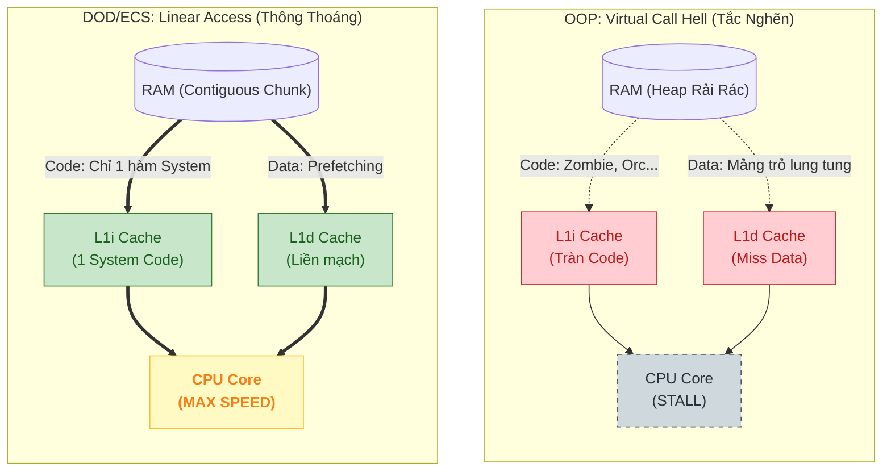

# Mục Lục

- [Chapter 0: Bảng chữ cái của Máy tính (Assembly Primer)](#chapter-0-bảng-chữ-cái-của-máy-tính-assembly-primer)
  - [1. Cấu trúc chương trình (.text vs .data) — Deep Dive](#1-cấu-trúc-chương-trình-text-vs-data-—-deep-dive)
  - [2. ISA (CISC vs RISC) — Bản hợp đồng Software-Hardware](#2-isa-cisc-vs-risc-—-bản-hợp-đồng-software-hardware)
  - [3. Giải phẫu một câu lệnh (Opcode & Operands)](#3-giải-phẫu-một-câu-lệnh-opcode--operands)
  - [4. Các nhóm lệnh cơ bản & Cách truy cập bộ nhớ](#4-các-nhóm-lệnh-cơ-bản--cách-truy-cập-bộ-nhớ)
  - [5. Ví dụ thực chiến: Từ C# sang Assembly](#5-ví-dụ-thực-chiến-từ-c-sang-assembly)
- [Chương 1: Transistor & Logic Gates — Từ Electron đến Tính toán](#chương-1-transistor--logic-gates-—-từ-electron-đến-tính-toán)
  - [1. Chất bán dẫn — Vật liệu nền tảng](#1-chất-bán-dẫn-—-vật-liệu-nền-tảng)
  - [2. MOSFET — Transistor hiện đại](#2-mosfet-—-transistor-hiện-đại)
  - [3. Từ Transistor → Logic Gates (Cổng Logic)](#3-từ-transistor--logic-gates-cổng-logic)
  - [4. Xây dựng mạch Tính toán & ALU (Arithmetic Logic Unit)](#4-xây-dựng-mạch-tính-toán--alu-arithmetic-logic-unit)
  - [5. Mảnh ghép còn thiếu — Kẻ đã quên mình là ai](#5-mảnh-ghép-còn-thiếu-—-kẻ-đã-quên-mình-là-ai)
- [Chương 2: Memory & Storage — Từ Flip-flop đến RAM](#chương-2-memory--storage-—-từ-flip-flop-đến-ram)
  - [1. Vấn đề: CPU nhanh, Bộ nhớ chậm](#1-vấn-đề-cpu-nhanh-bộ-nhớ-chậm)
  - [2. Clock & Cycle — "Nhịp tim" của CPU](#2-clock--cycle-—-nhịp-tim-của-cpu)
  - [3. Kiến trúc CPU Core — Nơi mọi thứ hội tụ](#3-kiến-trúc-cpu-core-—-nơi-mọi-thứ-hội-tụ)
  - [4. CPU Pipeline — Dây chuyền lắp ráp lệnh](#4-cpu-pipeline-—-dây-chuyền-lắp-ráp-lệnh)
  - [5. Pipeline Hazards — Ba kẻ phá hoại Pipeline](#5-pipeline-hazards-—-ba-kẻ-phá-hoại-pipeline)
  - [6. Flip-flop — Viên gạch đầu tiên của Bộ nhớ](#6-flip-flop-—-viên-gạch-đầu-tiên-của-bộ-nhớ)
  - [7. Từ Flip-flop → Register → Register File](#7-từ-flip-flop--register--register-file)
  - [8. SRAM vs DRAM — Hai cách xây bộ nhớ từ Transistor](#8-sram-vs-dram-—-hai-cách-xây-bộ-nhớ-từ-transistor)
  - [9. Cache – Bộ đệm thay đổi cuộc chơi (The Game Changer)](#9-cache-–-bộ-đệm-thay-đổi-cuộc-chơi-the-game-changer)
  - [10. Cache Associativity – Dữ liệu nằm ở đâu?](#10-cache-associativity-–-dữ-liệu-nằm-ở-đâu)
  - [11. Cache Coherency – Vấn đề "Tam sao thất bản" ở Đa lõi](#11-cache-coherency-–-vấn-đề-tam-sao-thất-bản-ở-đa-lõi)
  - [12. Kết nối Unity - Cache Locality là TẤT CẢ](#12-kết-nối-unity---cache-locality-là-tất-cả)
- [Chương 3: OS & Unity Runtime — Từ C# đến Transistor](#chương-3-os--unity-runtime-—-từ-c-sang-transistor)
  - [1. Stack vs. Heap — Trận chiến của Tốc độ và Linh hoạt](#1-stack-vs-heap-—-trận-chiến-của-tốc-độ-và-linh-hoạt)
  - [2. Stack & Function Calls — Cái giá của mỗi lần gọi hàm](#2-stack--function-calls-—-cái-giá-của-mỗi-lần-gọi-hàm)
  - [3. Từ C# đến Mã máy — Ba con đường trong Unity](#3-từ-c-đến-mã-máy-—-ba-con-đường-trong-unity)
  - [4. Garbage Collection — "Stop the World"](#4-garbage-collection-—-stop-the-world)

---

# Chapter 0: Bảng chữ cái của Máy tính (Assembly Primer)

## 1. Cấu trúc chương trình (.text vs .data) — Deep Dive

Một chương trình khi chạy (Executable) không chỉ là mớ code hỗn độn. Nó được chia thành các **Segments** (ngăn) rõ ràng. Tại sao phải chia? Để bảo vệ code không bị ghi đè, và tối ưu RAM.

### a. Static Segments (Nằm trong file .exe)
Là những phần được quy định rõ trong code Assembly của bạn.

| Segment | Tên gọi | Chứa gì? | Đặc điểm thú vị | Ví dụ C# |
| :--- | :--- | :--- | :--- | :--- |
| **.text** | Code Segment | **Lệnh máy** (Machine Code). | **Read-Only**. Nếu cố ghi vào đây → Crash (Access Violation). | Hàm `void Update() { ... }` |
| **.data** | Data Segment | **Biến toàn cục/tĩnh** đã khởi tạo khác 0. | Tốn dung lượng file .exe trên đĩa cứng. | `static int score = 100;` |
| **.rodata**| Read-Only Data | **Hằng số (Const)** và chuỗi ký tự. | Gộp chung strings để tiết kiệm RAM (String Interning). | `const float PI = 3.14f;` <br> `string s = "Hello";` |
| **.bss** | Uninitialized | Biến tĩnh **chưa** khởi tạo (mặc định 0). | **Magic:** Không tốn chỗ trên đĩa cứng! File .exe chỉ ghi: "Cần 1MB .bss", OS tự cấp 1MB toàn số 0 khi chạy. | `static int connectionId;` <br> `static byte[] buffer = new byte[1000];` |

### b. Runtime Memory (Được OS cấp khi chạy)
Assembly không có segment `.stack` hay `.heap` (tùy OS/Linker, nhưng về bản chất đây là vùng nhớ động).

| Vùng nhớ | Tên gọi | Chứa gì? | Đặc điểm | Ví dụ C# |
| :--- | :--- | :--- | :--- | :--- |
| **Stack** | Stack | Biến cục bộ, tham số hàm. | Lớn ra/thu vào liên tục. Quản lý bởi thanh ghi `RSP`. | `int localVariable = 5;` |
| **Heap** | Heap | Đối tượng cấp phát động. | Sống cho đến khi GC dọn dẹp. Quản lý bởi OS/Runtime. | `new Enemy();` |

> *   Nếu để trong `.bss` (chưa khởi tạo): File .exe **không tăng byte nào**. Window Loader chỉ cần biết "À, cấp cho anh này 1MB số 0" là xong. Tiết kiệm đĩa!

### c. Program Segments in Action (RISC/ARM64 Example)

Để dễ học, chúng ta sẽ dùng kiến trúc **ARM64** (RISC) — kiến trúc dùng trong iPhone, Mac M1/M2 và Android. RISC rất rõ ràng vì nó phân biệt cực kỳ rạch ròi giữa lệnh tính toán và lệnh truy cập bộ nhớ (**Load-Store Architecture**).

```asm
; ==========================================
; 1. RODATA (Read-Only Data)
; ==========================================
.section .rodata
    msg_format: .asciz "Score: %d\n"    ; Chuỗi kết thúc bằng \0
    PI:         .double 3.14159

; ==========================================
; 2. DATA (Initialized Data)
; ==========================================
.section .data
    .align 4
    score:      .word 100              ; int score = 100 (4 bytes)

; ==========================================
; 3. BSS (Uninitialized Data)
; ==========================================
.section .bss
    .align 8
    player_pos: .skip 12               ; float[3] (mặc định = 0)
    buffer:     .skip 1024             ; 1KB buffer

; ==========================================
; 4. TEXT (Code Segment)
; ==========================================
.section .text
    .global main

main:
    ; --- Thao tác trên .data (LOAD-MODIFY-STORE) ---
    ; 1. Load địa chỉ và giá trị
    adrp x0, score                     ; Lấy địa chỉ trang chứa 'score'
    add  x0, x0, :lo12:score           ; Lấy địa chỉ chính xác vào x0
    ldr  w1, [x0]                      ; LOAD: Đọc giá trị từ RAM vào register w1

    ; 2. MODIFY (Tính toán trong CPU)
    add  w1, w1, #50                   ; score += 50

    ; 3. STORE (Ghi trả lại RAM)
    str  w1, [x0]                      ; STORE: Ghi w1 vào địa chỉ trong x0

    ; --- Thao tác trên .bss ---
    adrp x2, player_pos
    add  x2, x2, :lo12:player_pos
    mov  w3, #10
    str  w3, [x2]                      ; player_pos[0] = 10

    ; --- Gọi printf (Sử dụng .rodata) ---
    adrp x0, msg_format
    add  x0, x0, :lo12:msg_format      ; Tham số 1: format string
    ; w1 đang chứa giá trị score mới (150)
    bl   printf                        ; Branch with Link (Gọi hàm)

    ; Thoát chương trình
    mov  w0, #0                        ; return 0
    ret
```

> [!TIP]
> **Tại sao RISC dễ đọc hơn?** Ở x86 (CISC), bạn có thể dùng `ADD [score], 50` (1 lệnh làm cả 3 việc). Ở ARM (RISC), bạn BẮT BUỘC phải làm 3 bước: **LDR** (Load) → **ADD** (Tính) → **STR** (Store). Điều này giúp bạn thấy rõ dòng chảy dữ liệu giữa RAM và CPU.

### d. Dynamic Segments (Stack & Heap) in Action

Khác với 4 segment tĩnh bên trên, **Stack** và **Heap** không được khai báo bằng từ khóa `.section`. Chúng được thể hiện thông qua các **lệnh điều khiển thanh ghi** và **hàm hệ thống**:

#### 1. Stack — Thể hiện qua Stack Pointer (SP)
Trong ARM64, Stack được quản lý bởi thanh ghi `SP`. Khi bạn gọi một hàm, CPU sẽ "mở rộng" Stack bằng cách giảm giá trị `SP`.

```asm
; --- Ví dụ về Stack (Push/Pop) ---
some_function:
    ; 1. PROLOGUE: Cấp phát 16 bytes trên Stack
    sub sp, sp, #16             ; SP = SP - 16 (Dịch đỉnh Stack xuống)
    
    ; 2. Lưu biến cục bộ vào Stack
    mov w0, #42
    str w1, [sp, #8]            ; Lưu giá trị 42 vào địa chỉ (SP + 8)

    ; ... thực hiện logic ...

    ; 3. EPILOGUE: Thu hồi 16 bytes
    add sp, sp, #16             ; SP = SP + 16 (Dịch đỉnh Stack lên)
    ret
```

#### 2. Heap — Thể hiện qua gọi hàm Allocator
Assembly không tự cấp phát Heap. Nó phải "xin" Hệ điều hành (thông qua `malloc` trong C hoặc `mmap` trong Linux).

```asm
; --- Ví dụ về Heap (Xin RAM từ OS) ---
    mov x0, #1024               ; Tham số 1: Xin 1024 bytes
    bl  malloc                  ; Gọi hàm malloc (Hàm này sẽ xin OS cấp Heap)
    ; Sau khi gọi, x0 sẽ chứa ĐỊA CHỈ vùng nhớ trên Heap vừa được cấp
    
    ; Sử dụng vùng nhớ Heap
    mov w1, #99
    str w1, [x0]                ; Ghi số 99 vào đầu vùng nhớ Heap vừa xin được
```

> [!NOTE]
> **Tóm tắt:** 
> - **Static (.text, .data, .bss)**: Do trình biên dịch quy định sẵn địa chỉ hoặc kích thước trong file chạy.
> - **Dynamic (Stack)**: Do CPU tự quản lý bằng cách tăng/giảm thanh ghi `SP` khi chạy hàm.
> - **Dynamic (Heap)**: Do code của bạn chủ động gọi các hàm của Hệ điều hành để mượn RAM.

### e. Specialized Segments (Nâng cao)

Ngoài 4 trụ cột chính, thực tế còn có các segment "hậu cần" giúp chương trình chạy được trong môi trường OS phức tạp:

| Segment | Ý nghĩa | Tại sao cần? |
| :--- | :--- | :--- |
| **.init / .fini** | Khởi tạo / Kết thúc | Chạy các hàm Constructor/Destructor toàn cục trước/sau `main()`. |
| **.debug** | Debugging Info | Chứa tên biến, số dòng code. Đây là lý do file `.exe` có debug lại nặng hơn file release. |
| **.plt / .got** | Linker Tables | Phục vụ cho **Dynamic Linking**. Giúp chương trình gọi được hàm từ DLL/SO (như Unity gọi thư viện đồ họa). |
| **.rel.text** | Relocation | Chứa thông tin để Linker "sửa" lại địa chỉ nếu chương trình được nạp vào vùng nhớ khác. |

> [!NOTE]
> Khi bạn build Unity sang **C++ (IL2CPP)**, trình biên dịch sẽ tạo ra hàng nghìn file `.cpp`. Kết quả cuối cùng là hàng chục MB dữ liệu nằm rải rác trong các segment này.

### f. Interlude: C Language — "High-level Assembly"

Bạn có bao giờ thắc mắc tại sao người ta nói ngôn ngữ C rất gần với Assembly không? 

Thực tế, C được gọi là **"High-level Assembly"** vì:
1.  **Ánh xạ 1:1**: Hầu hết các lệnh trong C (như `+`, `-`, `&`, `*`) đều ánh xạ trực tiếp xuống 1 hoặc vài lệnh Assembly tương ứng.
2.  **Quản lý bộ nhớ thủ công**: Giống như Assembly, C cho phép bạn can thiệp trực tiếp vào địa chỉ RAM thông qua **Con trỏ (Pointers)**. Bạn có quyền "đụng chạm" vào `.data`, `.bss`, hay tự xin `.heap` y hệt như đang viết Assembly.
3.  **Không có "Bảo mẫu"**: Khác với C# có Garbage Collector (GC) tự dọn dẹp RAM, C và Assembly yêu cầu bạn phải tự quản lý từng byte.

**So sánh sự "gần gũi":**
- **C#**: Cách xa phần cứng nhất (phải qua Virtual Machine, JIT, GC).
- **C / C++**: Đứng ngay sát phần cứng. Bạn viết gì, CPU thực thi gần như y hệt.
- **Assembly**: Chính là phần cứng (dưới dạng chữ viết).

> [!TIP]
> **Unity IL2CPP**: Lý do Unity chuyển code C# của bạn sang C++ rồi mới build ra app là để tận dụng tốc độ "gần phần cứng" này. C++ đóng vai trò là "ngôn ngữ trung gian" giúp code của bạn chạy nhanh hơn và khó bị bẻ khóa (reverse engineering) hơn so với C# thuần.


## 2. ISA (CISC vs RISC) — Bản hợp đồng Software-Hardware

### 2.1. ISA là gì? (Instruction Set Architecture)

ISA (**Instruction Set Architecture**) là **bản hợp đồng** giữa phần cứng (CPU) và phần mềm (Compiler/OS). Nó định nghĩa:
- Tập lệnh CPU hiểu được (ADD, MOV, JUMP, ...)
- Thanh ghi nào có sẵn (RAX, RSP, XMM0, ...)
- Cách đánh địa chỉ bộ nhớ (Addressing Modes)
- Kích thước dữ liệu (8/16/32/64-bit)

```
Tầng abstraction:

  ┌─────────────────────────────────────────────────┐
  │  C#:  health -= damage;                          │   ← Ngôn ngữ bậc cao
  ├─────────────────────────────────────────────────┤
  │  IL:  ldarg.0                                    │   ← Bytecode trung gian
  │       ldfld float Health::Value                  │
  │       ldarg.1                                    │
  │       sub                                        │
  │       stfld float Health::Value                  │
  ├─────────────────────────────────────────────────┤
  │  x86 ASM:                                        │   ← Assembly (1:1 với ISA)
  │       movss  xmm0, [rcx+0x10]   ; load health   │
  │       subss  xmm0, xmm1         ; health -= dmg │
  │       movss  [rcx+0x10], xmm0   ; store back    │
  ├─────────────────────────────────────────────────┤
  │  Machine Code:                                   │   ← Nhị phân thuần
  │       F3 0F 10 41 10                             │
  │       F3 0F 5C C1                                │
  │       F3 0F 11 41 10                             │
  └─────────────────────────────────────────────────┘
       ↑
  Mỗi byte → bộ giải mã → tín hiệu điều khiển ALU/FPU/Load-Store Unit.
```

### 2.2. CISC vs RISC — Hai triết lý thiết kế ISA

```
┌─────────────────────────────────────────────────────────────────────┐
│                    CISC vs RISC                                     │
├─────────────────────────┬───────────────────────────────────────────┤
│        CISC             │            RISC                           │
│  (Complex Instruction   │    (Reduced Instruction                   │
│   Set Computer)         │     Set Computer)                         │
├─────────────────────────┼───────────────────────────────────────────┤
│ Đại diện: x86-64        │ Đại diện: ARM, RISC-V                    │
│ Intel, AMD              │ Apple Silicon, Qualcomm                   │
├─────────────────────────┼───────────────────────────────────────────┤
│ Lệnh PHỨC TẠP:          │ Lệnh ĐƠN GIẢN:                          │
│ 1 lệnh có thể làm      │ 1 lệnh chỉ làm 1 việc                   │
│ nhiều việc cùng lúc     │                                           │
│                         │                                           │
│ Ví dụ:                  │ Ví dụ:                                    │
│ ADD [mem], reg           │ LDR  R1, [mem]    ; Load                │
│ (Đọc RAM + Cộng +       │ ADD  R1, R1, R2   ; Cộng                │
│  Ghi lại RAM trong      │ STR  R1, [mem]    ; Ghi                 │
│  1 lệnh duy nhất)       │ (3 lệnh riêng biệt)                     │
├─────────────────────────┼───────────────────────────────────────────┤
│ Kích thước lệnh:        │ Kích thước lệnh:                         │
│ 1 → 15 bytes (biến đổi)│ 4 bytes CỐ ĐỊNH (ARM)                   │
│ → Bộ giải mã phức tạp  │ → Bộ giải mã đơn giản, nhanh             │
├─────────────────────────┼───────────────────────────────────────────┤
│ Ưu điểm:                │ Ưu điểm:                                  │
│ ✅ Code compact (ít byte)│ ✅ Pipeline hiệu quả hơn                 │
│ ✅ Tương thích ngược     │ ✅ Tiết kiệm năng lượng                  │
│    (chạy code từ 1978)  │ ✅ Dễ tối ưu cho compiler                 │
├─────────────────────────┼───────────────────────────────────────────┤
│ Nền tảng:                │ Nền tảng:                                 │
│ PC, PlayStation, Xbox    │ Mobile, Switch, Mac (M-series)           │
│ Server                   │ VR Headset (Quest)                       │
├─────────────────────────┼───────────────────────────────────────────┤
│ Unity build target:      │ Unity build target:                       │
│ Windows x64, Linux x64  │ Android ARM64, iOS ARM64                 │
│ macOS x64 (Intel Mac)   │ macOS ARM64 (Apple Silicon)              │
└─────────────────────────┴───────────────────────────────────────────┘
```

> **Thực tế hiện đại:** CPU x86 của Intel/AMD bên ngoài là CISC, nhưng bên trong giải mã thành **micro-ops** (μops) giống RISC rồi mới thực thi. Ranh giới CISC/RISC ngày nay đã mờ đi rất nhiều.

### 2.3. Deep Dive: Micro-ops (uOps) — Cầu nối CISC và RISC

Tại sao Intel/AMD vẫn dùng CISC dù RISC có nhiều ưu điểm? Câu trả lời nằm ở **Micro-ops**.

#### a. Quá trình dịch lệnh (Instruction Translation)
Khi bạn chạy một lệnh x86 phức tạp, CPU không thực thi nó trực tiếp. Thay vào đó, bộ giải mã (**Decoder**) bẻ nó thành các lệnh nhỏ hơn, đơn giản hơn gọi là **uOps**.

**Ví dụ: Lệnh x86 `ADD [EAX], EBX`** (Cộng EBX vào giá trị tại địa chỉ RAM tro bởi EAX)
Bộ giải mã sẽ bẻ nó thành 3 uOps:
1.  **LDR**: Load giá trị từ RAM `[EAX]` vào một thanh ghi tạm ẩn.
2.  **ADD**: Cộng `EBX` vào thanh ghi tạm đó.
3.  **STR**: Ghi kết quả từ thanh ghi tạm ngược lại RAM `[EAX]`.

=> Bạn có thấy điều gì không? Bên trong một CPU CISC thực chất là một **"Trái tim RISC"** đang đập!

#### b. uOp Cache — "Phím tắt" siêu tốc
Việc dịch từ CISC sang uOps tốn thời gian và năng lượng. Để tối ưu, CPU hiện đại có một bộ nhớ đệm gọi là **uOp Cache**:
- Nếu một lệnh đã được dịch một lần, lần sau CPU lấy thẳng uOp từ cache, bỏ qua bước giải mã.
- Đây là lý do tại sao các vòng lặp (High-frequency loops) trong C# chạy cực nhanh trên x86.

#### c. Tại sao uOps lại quan trọng cho Hiệu năng?
1.  **Out-of-Order Execution (OoO)**: Vì uOps rất đơn giản, CPU có thể sắp xếp lại thứ tự chạy của chúng để tận dụng tối đa các bộ phận đang rảnh (Port), miễn là không làm sai kết quả cuối cùng.
2.  **Superscalar**: CPU có thể thực thi 4-6 uOps **cùng lúc** trong một nhịp clock.
3.  **Tối ưu hóa năng lượng**: uOps giúp CPU tắt bớt các mạch điện không cần thiết (Clock Gating) dễ dàng hơn so với các lệnh CISC cồng kềnh.

> [!IMPORTANT]
> **Kết luận:** CISC (x86) giống như một cuốn sách dày được viết bằng ngôn ngữ phức tạp để tiết kiệm giấy (dung lượng file), còn CPU là người thông dịch viên cực kỳ giỏi, tự xé lẻ từng câu ra thành các hành động đơn giản để thực hiện nhanh nhất có thể.


## 3. Giải phẫu một câu lệnh (Opcode & Operands)

Một dòng Assembly `ADD EAX, EBX` thực chất gồm 2 phần:

```asm
    ADD      EAX, EBX
   └─┬─┘    └───┬───┘
  Opcode     Operands
(Hành động) (Đối tượng)
```

1.  **Opcode (Operation Code):** Động từ. Làm gì? (ADD, MOV, SUB).
2.  **Operands:** Tân ngữ. Làm với ai?
    *   Thanh ghi (EAX, EBX).
    *   Bộ nhớ (RAM) — Thường viết trong ngoặc vuông `[0x1234]` hoặc `[EAX]`.
    *   Số trực tiếp (Immediate) — Ví dụ `10`, `0xFF`.


## 4. Các nhóm lệnh cơ bản & Cách truy cập bộ nhớ

### 4.1. Addressing Modes (Các cách truy cập bộ nhớ)

Sức mạnh của Assembly nằm ở chỗ nó linh hoạt trong việc lấy dữ liệu. Hãy xem cú pháp `[]` biến hóa như thế nào:

*   **Immediate:** `MOV EAX, 10`
    *   Không truy cập RAM. Giá trị nằm ngay trong lệnh. Nhanh nhất.
*   **Direct (Trực tiếp):** `MOV EAX, [0x00403A10]`
    *   Đến đúng địa chỉ nhà `0x...` lấy đồ. Dùng cho biến `static`.
*   **Register Indirect (Con trỏ):** `MOV EAX, [RBX]`
    *   "RBX chứa địa chỉ nào thì đến đó lấy". Tương đương `*pointer` trong C++.
*   **Register + Offset (Cấu trúc):** `MOV EAX, [RBX + 8]`
    *   "Đến chỗ RBX trỏ tới, đi thêm 8 bước nữa".
    *   Dùng để truy cập **Field** của Class/Struct (Ví dụ: `player.health` nằm ở offset 8).
*   **Base + Index * Scale (Mảng):** `MOV EAX, [RBP + RDI * 4]`
    *   "Bắt đầu từ RBP (mảng), nhảy đi RDI (index) bước, mỗi bước dài 4 bytes (int)".
    *   Đây chính là `array[i]`! CPU tính địa chỉ này trong **1 cycle**.

### 4.2. The Flags Register (EFLAGS) — Trạng thái ẩn

Khi bạn viết `if (a == b)`, CPU làm gì?
1.  Nó thực hiện phép trừ giả: `CMP a, b` (thực chất là `a - b` nhưng không lưu kết quả).
2.  Nó cập nhật **Flags Register** dựa trên kết quả phép trừ đó.

Các cờ (Flag) quan trọng nhất:
*   **ZF (Zero Flag):** Bật lên 1 nếu kết quả = 0. (Tức là `a == b`).
*   **SF (Sign Flag):** Bật lên 1 nếu kết quả âm. (Tức là `a < b`).
*   **OF (Overflow Flag):** Bật nếu tính toán bị tràn số (Signed overflow).
*   **CF (Carry Flag):** Bật nếu tính toán bị nhớ/mượn (Unsigned overflow).

Sau đó lệnh `JE` (Jump if Equal) chỉ đơn giản là: "Nếu ZF == 1 thì nhảy".

### 4.3. 4 Từ vựng cốt lõi (MOV, ADD, SUB, JMP)

Bạn chỉ cần nhớ đúng 4 lệnh này để đọc hiểu 90% ví dụ trong sách:

| Lệnh | Ý nghĩa | Ví dụ C# tương đương |
| :--- | :--- | :--- |
| **MOV** A, B | **Copy** giá trị từ B sang A (Move) | `A = B;` |
| **ADD** A, B | Cộng B vào A, lưu kết quả ở A | `A += B;` |
| **SUB** A, B | Trừ B khỏi A, lưu kết quả ở A | `A -= B;` |
| **JMP** Label | **Nhảy** tới dòng lệnh Label (Jump) | `goto Label;` |

## 5. Ví dụ thực chiến: Từ C# sang Assembly

**Code C#:**
```csharp
int a = 10;
int b = 20;
int c = a + b;
```

**Code Assembly (Dưới lăng kính phần cứng):**
```asm
MOV EAX, 10      ; Load 10 vào thanh ghi EAX
MOV EBX, 20      ; Load 20 vào thanh ghi EBX
ADD EAX, EBX     ; EAX = EAX + EBX (30)
MOV [c], EAX     ; Store 30 từ EAX vào địa chỉ biến c trong RAM
```

> **Bài học:** Một dòng code `int c = a + b` của bạn thực chất là một chuỗi hành động: **Load (Tải lên) → Calculate (Tính) → Store (Cất đi)**.

---

# Chương 1: Transistor & Logic Gates — Từ Electron đến Tính toán

> **Mục tiêu chương:** Hiểu cách một linh kiện vật lý nhỏ bé (transistor) tạo ra nền tảng cho MỌI phép tính trong máy tính — từ phép cộng đơn giản đến việc render hàng triệu polygon trong Unity.

---


## 1. Chất bán dẫn — Vật liệu nền tảng

### 1.1. Ba loại vật liệu dẫn điện

| Loại | Đặc điểm | Ví dụ |
| :--- | :--- | :--- |
| **Dẫn điện (Conductor)** | Electron di chuyển tự do | Đồng (Cu), Nhôm (Al), Vàng (Au) |
| **Cách điện (Insulator)** | Electron bị giữ chặt, không di chuyển | Cao su, Thủy tinh, Nhựa |
| **Bán dẫn (Semiconductor)** | **Có thể bật/tắt** khả năng dẫn điện | Silicon (Si), Germanium (Ge) |

### 1.2. Silicon — "Đất" của ngành công nghiệp chip

Silicon (Si) là nguyên tố phổ biến thứ 2 trên vỏ Trái Đất (sau Oxy). Ở trạng thái nguyên chất, nó **gần như không dẫn điện**. Nhưng khi ta "pha tạp" (doping) thêm các nguyên tố khác, nó trở thành vật liệu kỳ diệu: **Có thể chuyển đổi qua lại giữa Dẫn điện và Cách điện.**

---

## 2. MOSFET — Transistor hiện đại

### 2.1. Mental Model: Công tắc điện tử

Đối với Software Engineer, bạn **KHÔNG CẦN QUAN TÂM** đến vật lý lượng tử bên dưới. Hãy hình dung **MOSFET là một công tắc (Switch)** được điều khiển bằng điện áp.

```text
      Gate (Cổng điều khiển)
        │
      ┌─┴─┐
      │   │  <-- Nút bấm (Điện áp)
      └─┬─┘
  Source│        Drain
   ─────●   ●─────
        │   │
        └─Switch─┘
```

### 2.2. Nguyên lý hoạt động (Vòi nước)

Tưởng tượng MOSFET như một vòi nước:
- **Source:** Nguồn nước (Dòng điện).
- **Drain:** Cống thoát.
- **Gate:** Tay vặn van.

| Trạng thái | Gate (Tay vặn) | Kết quả | Bit |
| :--- | :--- | :--- | :--- |
| **OFF** | 0V (Đóng) | Nước KHÔNG chảy | **0** |
| **ON** | > 0V (Mở) | Nước CHẢY mạnh | **1** |

> **Tại sao cần quan tâm?**
> Việc đóng/mở này tốn **thời gian** và sinh **nhiệt**.
> - Tốc độ đóng mở = Tốc độ CPU (GHz).
> - Nhiệt tỏa ra = Giới hạn hiệu năng (Thermal Throttling).


## 3. Từ Transistor → Logic Gates (Cổng Logic)

### 3.1. Ý tưởng cốt lõi

Một transistor đơn lẻ chỉ là công tắc ON/OFF. Nhưng khi **kết hợp nhiều transistor**, ta tạo ra các **mạch logic** — nền tảng của mọi phép tính.

Có hai họ transistor bổ sung cho nhau:
- **NMOS (N-channel):** Dẫn điện khi Gate = 1 (kéo xuống GND = logic 0)
- **PMOS (P-channel):** Dẫn điện khi Gate = 0 (kéo lên Vdd = logic 1)

Kết hợp cả hai → **CMOS (Complementary MOS):** Mạch tiêu thụ điện cực thấp, chỉ tốn năng lượng khi chuyển trạng thái.

---

### 3.2. Cổng NOT (Inverter) — Cổng đơn giản nhất

**Chức năng:** Đảo ngược tín hiệu. Input 0 → Output 1. Input 1 → Output 0.

```
        Vdd (Nguồn dương)
         │
    ┌────┴────┐
    │  PMOS   │─── Gate = Input A
    └────┬────┘
         │
         ├─────────── Output (Y = NOT A)
         │
    ┌────┴────┐
    │  NMOS   │─── Gate = Input A
    └────┬────┘
         │
        GND (Đất)


Khi A = 0:                          Khi A = 1:
  PMOS ON (dẫn Vdd)                   PMOS OFF
  NMOS OFF                            NMOS ON (dẫn GND)
  Output = Vdd = 1                    Output = GND = 0

Bảng chân lý:
┌───────┬────────┐
│ A (In)│ Y (Out)│
├───────┼────────┤
│   0   │   1    │
│   1   │   0    │
└───────┴────────┘
```

> **2 transistor** → 1 phép tính logic đầu tiên!

---

### 3.3. Cổng NAND — "Cổng Vạn năng" (Universal Gate)

**Chức năng:** Output = 0 **chỉ khi** cả A VÀ B đều bằng 1. Mọi trường hợp khác = 1.

```
        Vdd                    Vdd
         │                      │
    ┌────┴────┐            ┌────┴────┐
    │  PMOS   │─ A         │  PMOS   │─ B       (Mắc SONG SONG)
    └────┬────┘            └────┬────┘
         │                      │
         └──────────┬───────────┘
                    │
                    ├──────────── Output (Y = NOT(A AND B))
                    │
               ┌────┴────┐
               │  NMOS   │─── A
               └────┬────┘                      (Mắc NỐI TIẾP)
               ┌────┴────┐
               │  NMOS   │─── B
               └────┬────┘
                    │
                   GND


Bảng chân lý:
┌───┬───┬───────────┐
│ A │ B │ NAND(A,B) │
├───┼───┼───────────┤
│ 0 │ 0 │     1     │     ← NMOS cả hai OFF → Output kéo lên Vdd
│ 0 │ 1 │     1     │     ← NMOS A OFF → đường xuống GND bị chặn
│ 1 │ 0 │     1     │     ← NMOS B OFF → đường xuống GND bị chặn
│ 1 │ 1 │     0     │     ← Cả hai NMOS ON → Output nối xuống GND
└───┴───┴───────────┘

Tổng: 4 transistors
```

**Tại sao NAND là "Universal"?** Vì mọi cổng logic khác đều có thể xây từ NAND:

```
NOT A        =  NAND(A, A)           ← Nối cả 2 input thành 1

A AND B      =  NOT(NAND(A, B))      ← NAND rồi đảo
             =  NAND(NAND(A,B), NAND(A,B))

A OR B       =  NAND(NOT A, NOT B)
             =  NAND(NAND(A,A), NAND(B,B))

→ Chỉ cần biết NAND, ta xây được MỌI THỨ.
  Đây là lý do bộ nhớ Flash (SSD) gọi là "NAND Flash".
```

---

### 3.4. Cổng AND, OR, XOR — Bộ công cụ đầy đủ

```
  ╔════════════════════════════════════════════════════════════════╗
  ║                 CÁC CỔNG LOGIC CƠ BẢN                        ║
  ╠════════════════════════════════════════════════════════════════╣
  ║                                                               ║
  ║  AND (VÀ) ── 6 transistors                                   ║
  ║  "Cả hai phải đúng"                                           ║
  ║  ┌───┬───┬──────────┐                                        ║
  ║  │ A │ B │ A AND B  │      Ẩn dụ: Khóa cửa cần CẢ HAI chìa  ║
  ║  ├───┼───┼──────────┤      → Chìa A VÀ Chìa B mới mở được   ║
  ║  │ 0 │ 0 │    0     │                                        ║
  ║  │ 0 │ 1 │    0     │                                        ║
  ║  │ 1 │ 0 │    0     │                                        ║
  ║  │ 1 │ 1 │    1     │  ← Chỉ trường hợp này ra 1             ║
  ║  └───┴───┴──────────┘                                        ║
  ║                                                               ║
  ║  OR (HOẶC) ── 6 transistors                                  ║
  ║  "Ít nhất một đúng"                                           ║
  ║  ┌───┬───┬──────────┐                                        ║
  ║  │ A │ B │ A OR B   │      Ẩn dụ: 2 công tắc đèn song song   ║
  ║  ├───┼───┼──────────┤      → Bất kỳ ai bật cũng sáng đèn     ║
  ║  │ 0 │ 0 │    0     │  ← Chỉ trường hợp này ra 0             ║
  ║  │ 0 │ 1 │    1     │                                        ║
  ║  │ 1 │ 0 │    1     │                                        ║
  ║  │ 1 │ 1 │    1     │                                        ║
  ║  └───┴───┴──────────┘                                        ║
  ║                                                               ║
  ║  XOR (HOẶC LOẠI TRỪ) ── 8-12 transistors                    ║
  ║  "Khác nhau mới đúng"                                        ║
  ║  ┌───┬───┬──────────┐                                        ║
  ║  │ A │ B │ A XOR B  │      Ẩn dụ: 2 công tắc cầu thang       ║
  ║  ├───┼───┼──────────┤      → Đèn đổi trạng thái mỗi khi     ║
  ║  │ 0 │ 0 │    0     │        BẤT KỲ AI bật/tắt               ║
  ║  │ 0 │ 1 │    1     │                                        ║
  ║  │ 1 │ 0 │    1     │                                        ║
  ║  │ 1 │ 1 │    0     │                                        ║
  ║  └───┴───┴──────────┘                                        ║
  ║                                                               ║
  ║  XOR rất đặc biệt vì: A XOR B = Bit tổng của phép cộng!     ║
  ║  Đây là nền tảng xây dựng mạch CỘNG (Adder).                 ║
  ║                                                               ║
  ╚════════════════════════════════════════════════════════════════╝
```

---

## 4. Xây dựng mạch Tính toán & ALU (Arithmetic Logic Unit)

Chúng ta thường nghe nói CPU có "bộ não" là ALU. Nhưng bên trong ALU là gì? Thực chất, ALU là tập hợp của nhiều mạch con chuyên biệt được ghép lại.

1.  **Mạch Tính toán (Arithmetic Circuits):** Xử lý toán học như Cộng, Trừ, Nhân... (Ví dụ: *Adder, Subtractor, Multiplier*).
2.  **Mạch Logic (Logic Circuits):** Xử lý từng bit như AND, OR, XOR, NOT, Shift... (Ví dụ: *Shifter, Comparator*).
3.  **ALU (Bộ Số học & Logic):** Là "cỗ máy tổng hợp" bao gồm **CẢ HAI** loại trên + bộ chọn (MUX) để quyết định dùng mạch nào.

Hành trình của chúng ta: Xây dựng từng mạch nhỏ (Adder) → Ghép lại thành ALU hoàn chỉnh.

### 4.1. Half Adder — Bộ cộng nửa

*   **Tạo từ:** 1 cổng **XOR** + 1 cổng **AND**.
*   **Chức năng:** Cộng 2 bit đơn lẻ (A + B).
*   **Kết quả:**
    *   **Sum** (Tổng): A XOR B (Khác nhau thì bằng 1).
    *   **Carry** (Nhớ): A AND B (Cả hai bằng 1 thì nhớ 1).


### 4.2. Full Adder — Bộ cộng đầy đủ

*   **Tạo từ:** 2 Half Adders + 1 cổng OR.
*   **Chức năng:** Cộng 3 bit: A + B + **Carry từ bit trước**.
*   **Tại sao cần?** Để cộng các số nhiều bit (ví dụ bit hàng chục cần nhớ từ hàng đơn vị).

> **Mental Model:** Giống như học sinh tiểu học cộng bài toán: "3 cộng 5 bằng 8, nhớ 1". Full Adder xử lý cái "nhớ 1" đó.

**Bài toán:** Cộng A + B + Cin (bit nhớ từ phép cộng trước đó).

```
Ví dụ:  Cộng 5 + 3 ở dạng nhị phân (4-bit)

         Carry: 1 1
                0 1 0 1    (5)
              + 0 0 1 1    (3)
              ─────────
                1 0 0 0    (8)

Từ phải sang trái:
  Bit 0: 1+1+0   = 10 → Sum=0, Carry=1        (Full Adder #0)
  Bit 1: 0+1+1   = 10 → Sum=0, Carry=1        (Full Adder #1)
  Bit 2: 1+0+1   = 10 → Sum=0, Carry=1        (Full Adder #2)
  Bit 3: 0+0+1   = 01 → Sum=1, Carry=0        (Full Adder #3)
  Kết quả: 1000 = 8 ✓

──────────────────────────────────────┘

Tổng: ~40 transistors cho 1 Full Adder
```

### 4.3. Ripple Carry Adder — Mạch cộng đa bít

*   **Tạo từ:** Nối tiếp 32 (hoặc 64) cái Full Adder lại với nhau.
*   **Chức năng:** Cộng hai số nguyên 32-bit (int) hoặc 64-bit (long).
*   **Cơ chế:** Bit nhớ (Carry) lan truyền từ bit thấp nhất lên bit cao nhất như sóng nước (ripple). CPU hiện đại dùng mạch "Carry Lookahead" để tính song song nhanh hơn.

#### > Code to Hardware: ADD
Khi bạn viết `c = a + b;` trong C#:
1.  **Compiler:** Dịch sang Assembly `ADD R1, R2`.
2.  **Hardware:**
    *   Tín hiệu điện chạy qua chuỗi 32 Full Adders (~1,280 transistors).
    *   Sau ~1 clock cycle, kết quả xuất hiện ở output `Sum` và được ghi lại vào Registers.

---

### 4.4. Subtractor — Mạch trừ (Không cần xây mới!)

*   **Tạo từ:** Mạch Adder + cổng **XOR** + 1 bit Carry đầu vào.


---

### 4.5. Multiplexer (MUX) — Bộ chọn tín hiệu (The Decision Maker)

Nếu Arithmetic Circuits là "Công nhân", thì MUX chính là "Trưởng phòng" — người quyết định công việc nào được thông qua. 

> **Mental Model: Đường ray tàu hỏa (Train Track Switch)**
> Tưởng tượng 2 đoàn tàu (Data A và Data B) đang lao tới. Chỉ có 1 đường ray ra (Output).
> - Cần một cái **Cần gạt (Select Signal)**.
> - Gạt sang trái: Tàu A đi qua.
> - Gạt sang phải: Tàu B đi qua.
> - **MUX chính là cái cần gạt đó.**

#### a. MUX 2:1 (Cơ bản nhất)
Chọn 1 trong 2 input (I0 hoặc I1) dựa trên 1 bit Select (S).

**Bên trong hộp đen MUX 2:1 có gì?**
Nó được ghép từ 3 loại cổng logic cơ bản:
1.  **Cổng NOT:** Để tạo ra tín hiệu đảo của Select.
2.  **Cổng AND:** Để "lọc" input (Chỉ cho qua khi điều kiện đúng).
3.  **Cổng OR:** Để gộp kết quả lại.

```text
       Input 0 (A) ────┐
                       │    ┌─────────┐
                       ├───►│  MUX    │────► Output (Y)
                       │    │  2:1    │
       Input 1 (B) ────┘    └────▲────┘
                                 │
                            Select (S)

   Công thức Logic: Y = (A AND NOT S) OR (B AND S)
   
   Giải thích:
   - Khi S = 0: (NOT S) = 1 → Cổng trên mở (A đi qua), cổng dưới đóng (B bị chặn).
   - Khi S = 1: (NOT S) = 0 → Cổng trên đóng (A bị chặn), cổng dưới mở (B đi qua).
   
   → Tổng cộng: 1 NOT + 2 AND + 1 OR = Khoảng 12-20 transistors.
```


#### c. Tại sao MUX là "Trái tim" của ALU?

Trong một ALU thực tế, **TẤT CẢ** các mạch (Adder, Subtractor, AND, OR...) đều **chạy cùng lúc!**

> **Case Study: Lệnh `c = a + b`**
> 1.  **Logical Level (Tư duy Logic):** 
>     - **CU (Control Unit)** gửi tín hiệu chọn `000` tới MUX.
>     - MUX "mở cổng" cho kết quả từ bộ Cộng và chặn các bộ phận khác. 
>     - Đây là cách lý tưởng nhất để hiểu về "quyền lựa chọn" của MUX.
> 
> 2.  **Physical Level (Thực tế Intel/AMD - Clock Gating):**
>     - Nếu CPU hiện đại để *tất cả* mạch chạy cùng lúc, chip sẽ nóng chảy vì lãng phí năng lượng.
>     - **Clock Gating:** CU (Control Unit) sẽ chỉ gửi xung nhịp (nhịp tim) cho bộ Cộng. Các bộ phận như Nhân (Multiplier) hay Chia (Divider) sẽ bị "ngắt nhịp tim" để không tiêu thụ điện năng.
>     - **Power Gating:** Ở các đơn vị lớn hơn (như AVX-512), CPU thậm chí ngắt hẳn nguồn điện nếu không dùng tới.
> 
> **Kết luận:** MUX là "người đưa ra quyết định" cuối cùng về mặt dữ liệu, nhưng **Clock Gating** mới là "người tiết kiệm điện" thực sự trong các CPU hiện đại của Intel và AMD.

#### > Code to Hardware: Toán tử `? :` và `if`
Khi bạn viết:
```csharp
int result = condition ? a : b;
```
Trình biên dịch sẽ cố gắng biến nó thành một lệnh **CMOV (Conditional Move)** — sử dụng MUX phần cứng để chọn A hoặc B mà **không cần rẽ nhánh (branching)**. Cực kỳ nhanh!


#### > Code to Hardware: Conditional Move
Khi bạn dùng `math.select(a, b, condition)` trong Burst:
1.  **Assembly:** `CMOVNE EAX, EBX` (Conditional Move - x86) hoặc `CSEL W0, W1, W2, NE` (ARM).
2.  **Hardware:**
    *   Thay vì dùng `JUMP` (nhảy dòng lệnh), CPU dùng MUX để chọn giá trị.
    *   Nếu `condition` đúng, MUX chọn `b`. Sai chọn `a`.
    *   **Không có Branch Prediction penalty!**

---

### 4.6. Shifter — Mạch dịch bit

*   **Tạo từ:** Hàng loạt **MUX** (Bộ chọn) xếp tầng.
*   **Chức năng:** Dịch các bit sang trái hoặc phải.
    *   Dịch trái (`<<`) = Nhân 2.
    *   Dịch phải (`>>`) = Chia 2.
*   **Barrel Shifter:** Thiết kế thông minh dùng MUX chia tầng, cho phép dịch `n` bit bất kỳ chỉ trong **1 Clock Cycle** (thay vì dịch từng bước).

#### > Code to Hardware: Bitwise Shift
Trong Unity, `transform.position * 2` thường chậm hơn chút xíu so với `x << 1` (về lý thuyết), nhưng compiler hiện đại đã tự tối ưu việc này. Tuy nhiên, trong **Bitmask/LayerMask**, shifter hoạt động liên tục!

**Shifter dịch tất cả bits sang trái hoặc phải.** Dịch trái 1 bit = nhân 2, dịch phải 1 bit = chia 2.

```
Shift Left Logical (SHL) — Ví dụ: 00001010 << 2

   Trước:   0 0 0 0 1 0 1 0   = 10
   Dịch ←2: 0 0 1 0 1 0 0 0   = 40
                         ↑ ↑
                     Điền 0 vào

   10 << 2 = 10 × 4 = 40 ✓  (Mỗi dịch trái = ×2)


Shift Right Logical (SHR) — Ví dụ: 00101000 >> 2

   Trước:   0 0 1 0 1 0 0 0   = 40
   Dịch →2: 0 0 0 0 1 0 1 0   = 10
             ↑ ↑
         Điền 0 vào

   40 >> 2 = 40 ÷ 4 = 10 ✓  (Mỗi dịch phải = ÷2)


Barrel Shifter — Dịch N bit trong 1 clock cycle:

   Mạch tổ hợp dùng MUXes nhiều tầng:

   Tầng 0: MUX quyết định dịch 0 hay 1 bit   (dựa trên shift[0])
   Tầng 1: MUX quyết định dịch 0 hay 2 bits  (dựa trên shift[1])
   Tầng 2: MUX quyết định dịch 0 hay 4 bits  (dựa trên shift[2])
   Tầng 3: MUX quyết định dịch 0 hay 8 bits  (dựa trên shift[3])
   Tầng 4: MUX quyết định dịch 0 hay 16 bits (dựa trên shift[4])

   → 5 tầng MUX = dịch bất kỳ 0-31 bit cho số 32-bit!
   → Tổng: ~32 MUXes × 5 tầng × 12 transistors = ~1,920 transistors


   Input:    [b31][b30][b29]...[b1][b0]
                │    │    │        │   │
             ┌──▼────▼────▼────────▼───▼──┐
             │  Tầng 0: Shift 0 or 1?     │ ← shift[0]
             └──┬────┬────┬────────┬───┬──┘
             ┌──▼────▼────▼────────▼───▼──┐
             │  Tầng 1: Shift 0 or 2?     │ ← shift[1]
             └──┬────┬────┬────────┬───┬──┘
             ┌──▼────▼────▼────────▼───▼──┐
             │  Tầng 2: Shift 0 or 4?     │ ← shift[2]
             └──┬────┬────┬────────┬───┬──┘
                │    │    │        │   │
             ... (tầng 3, 4)
                │    │    │        │   │
             [r31][r30][r29]...[r1][r0]  = Result
```

#### > Code to Hardware: SHL / SHR
1.  **C#:** `int x = a << 2;` (hoặc `a * 4`)
2.  **Assembly (x86):** `SHL EAX, 2`
3.  **Hardware:**
    *   Tín hiệu điện chạy qua tầng MUX số 1 (dịch 2 bit).
    *   Bỏ qua các tầng MUX khác.
    *   Kết quả có ngay trong 1 cycle. Nhanh hơn mạch nhân (`IMUL`) nhiều (mất 3-4 cycles).

> **Kết nối Unity:** Trong Burst-compiled code, `x << n` hoặc `x >> n` = 1 lệnh Assembly (`SHL`/`SHR`). Bitwises operations trong Lab 1 (BitFlags) — mỗi shift chạy qua chính mạch Barrel Shifter này. Shift nhanh hơn multiply (`x * 4` = `x << 2`), đây là lý do compilers tự convert `x * 2^n` thành shift!

---

### 4.7. Multiplier — Mạch nhân

*   **Cơ chế:** "Shift-and-Add" (Nhân nhị phân giống nhân trên giấy).
*   **Đặc điểm:** Phức tạp (~30,000+ transistors) và chậm hơn (3-5 cycles). CPU hiện đại dùng **Wallace Tree** để cộng song song các kết quả trung gian, giảm thời gian chờ.

#### > Code to Hardware: MUL / IMUL
Mỗi lệnh `float3 a * b` trong Burst Job kích hoạt bộ **FPU Multiplier**. Với SIMD (AVX2), CPU có thể chạy 8 bộ nhân song song (`VMULPS`), thực hiện hàng tỷ phép tính mỗi giây cho game.

---

### 4.8. Comparator — Mạch so sánh

*   **Cơ chế:** So sánh A và B bằng mạch trừ (A - B) nhưng chỉ giữ lại các **Flags** (ZF, SF...).
*   **Ứng dụng:** Dùng cho mọi câu lệnh `if`, `for`, `while`.

#### > Code to Hardware: IF
Khi bạn viết `if (health <= 0) Die();`:
1.  **CMP EAX, 0:** Chạy mạch Comparator (thực chất là trừ `health - 0`).
2.  **FLAGS:** Nếu kết quả = 0, cờ **ZF (Zero Flag)** bật lên 1. Nếu âm, cờ **SF (Sign Flag)** bật lên 1.
3.  **JLE:** Lệnh nhảy này chỉ kiểm tra Flags để quyết định nạp code từ hướng nào.

---

### 4.9. ALU (Arithmetic Logic Unit) — Bộ não hoàn chỉnh

Bây giờ ta thấy ALU = **ghép TẤT CẢ mạch trên bằng MUX**:

```
                    ┌──────────────────────────────────────────────┐
                    │               ALU (32-bit)                    │
                    │                                              │
   A (32-bit) ─────►│  ┌─────────────┐                            │
                    │  │   Adder     │─── Kết quả nếu ADD         │
   B (32-bit) ─────►│  │ (1,280 tr.) │                            │
                    │  ├─────────────┤                            │
                    │  │ Subtractor  │─── Kết quả nếu SUB         │
                    │  │ (=Adder+XOR)│  (dùng lại Adder!)         │
                    │  ├─────────────┤                            │
                    │  │  Multiplier │─── Kết quả nếu MUL         │
                    │  │(30,000 tr.) │                  │         │
                    │  ├─────────────┤                  │         │
                    │  │  AND (32×)  │─── Kết quả nếu AND│         │
                    │  ├─────────────┤                  │  ┌─────┐│
                    │  │  OR  (32×)  │─── Kết quả nếu OR│  │ MUX ││──► Result
                    │  ├─────────────┤                  │  │ 8:1 ││
                    │  │  XOR (32×)  │─── Kết quả nếu XOR│ │     ││
                    │  ├─────────────┤                  │  └──┬──┘│
                    │  │  Shifter    │─── Kết quả nếu SHL│    │   │
                    │  │ (1,920 tr.) │                  │    │   │
                    │  ├─────────────┤                  │    │   │
                    │  │ Comparator  │─── Flags ───────►│ FLAG│   │
                    │  └─────────────┘                       REG │
                    │                                              │
   Opcode (3-bit) ──►──────────────── Select line cho MUX ────────┘
                    │                                              │
                    │  ┌─────────────────────────────────────────┐ │
                    │  │ Opcode Map:                             │ │
                    │  │   000 = ADD    100 = AND                │ │
                    │  │   001 = SUB    101 = OR                 │ │
                    │  │   010 = MUL    110 = XOR                │ │
                    │  │   011 = SHL/R  111 = CMP                │ │
                    │  └─────────────────────────────────────────┘ │
                    │                                              │
                    │  Tổng: ~50,000-80,000 transistors             │
                    │  CPU hiện đại: 4-8 ALU + FPU per core       │
                    │  GPU: 128 ALU per SM × 46 SM = 5,888 ALU!   │
                    └──────────────────────────────────────────────┘
```

**Ví dụ cụ thể — Lệnh `ADD R1, R2`:**
```
Bước 1: CPU đọc lệnh "ADD" → Giải mã Opcode = 0010
Bước 2: Lấy giá trị R1 (= 5 = 00000101) và R2 (= 3 = 00000011) từ Registers
Bước 3: ALU nhận A=R1, B=R2, Opcode=ADD
Bước 4: MUX chọn output từ Adder
Bước 5: Adder tính: 00000101 + 00000011 = 00001000 (= 8)
Bước 6: Kết quả 8 ghi lại vào R1

→ Tất cả diễn ra trong 1 clock cycle (~0.2 nanosecond ở 5GHz)
→ Chỉ là electron chạy qua ~1,300 transistors trong Adder
```


## 5. Mảnh ghép còn thiếu — Kẻ đã quên mình là ai

Chúng ta đã xây dựng được ALU — một cỗ máy tính toán siêu việt từ hàng nghìn cổng logic.
- Nó có thể tính `5000 + 3000` trong nháy mắt.
- Nó có thể so sánh `health <= 0` cực nhanh.

**NHƯNG... có một vấn đề chết người:**
Ngay khi dòng điện đi qua, cổng logic trả về kết quả, và sau đó... **nó quên sạch**.
- Input tắt → Output tắt.
- Không có cách nào để lưu số "8000" lại để dùng cho phép tính sau.

Một CPU mà không có bộ nhớ (Memory) thì chỉ là một chiếc máy tính bỏ túi không có nút "M+" — vô dụng với các chương trình phức tạp.

Để biến chiếc máy tính này thành một **Computer** thực thụ, ta cần một loại mạch điện mới: Một loại mạch có thể **tự duy trì dòng điện** của chính nó.

👉 **Mời bước sang Chapter 2: Nơi ta học cách "bẫy" electron để tạo ra Ký ức.**

---


---
# Chương 2: Memory & Storage — Từ Flip-flop đến RAM

> **Mục tiêu chương:** Hiểu cách transistor tạo ra bộ nhớ, tại sao có nhiều tầng bộ nhớ khác nhau (Memory Hierarchy), và tại sao **Cache Locality** là yếu tố quyết định hiệu năng trong Unity DOTS.

---

## 1. Vấn đề: CPU nhanh, Bộ nhớ chậm

Ở **Chapter 1**, chúng ta đã tạo ra bộ não biết tính toán (ALU). Nó có thể cộng trừ nhân chia siêu tốc.
Nhưng bộ não đó có một điểm yếu chết người: **Nó không có trí nhớ.** (Input tắt → Output mất).

Để giải quyết, ta cần cung cấp cho nó "nguyên liệu" (Data) để tính toán và một nơi để lưu kết quả.

Hãy tưởng tượng bạn là một đầu bếp thiên tài (CPU), có thể chế biến bất kỳ món ăn nào trong **1 giây**. Nhưng:

| Thành phần | Ẩn dụ (Vị trí nguyên liệu) | Thời gian tương ứng |
| :--- | :--- | :--- |
| 📋 **Registers** | Bảng ghi chú trước mặt | Lấy ngay = **0 giây** |
| 🧊 **L1 Cache** | Tủ lạnh cạnh bếp | Mở lấy = **2 giây** |
| 🧊 **L2 Cache** | Tủ lạnh ngoài hành lang | Đi lấy = **5 giây** |
| 🧊 **L3 Cache** | Kho lạnh tầng hầm | Xuống lấy = **15 giây** |
| 🏪 **RAM** | Siêu thị gần nhà | Chạy đi = **3 PHÚT** |
| 🚚 **SSD** | Nhà kho ngoại thành | Gọi giao = **1 GIỜ** |
| 🚢 **HDD** | Nhập khẩu từ nước ngoài | Đợi ship = **1 TUẦN** |

> [!IMPORTANT]
> **Memory Stall**: Đầu bếp (CPU) phải **ĐỨNG ĐỢI** khi nguyên liệu ở xa. Lúc này CPU hoàn toàn không làm gì cả, chỉ ngồi chờ dữ liệu đổ về.


**Giải pháp của ngành công nghiệp:** Tạo ra nhiều tầng bộ nhớ — nhỏ nhưng nhanh ở gần CPU, lớn nhưng chậm ở xa CPU. Đây là **Memory Hierarchy**.

---

## 2. Clock & Cycle — "Nhịp tim" của CPU

> **🎯 Ẩn dụ — Nhạc trưởng dàn nhạc:**
> Tưởng tượng dàn nhạc 100 người. Nếu ai cũng chơi lúc nào tùy thích → **HỖN LOẠN**.
> Nhạc trưởng giơ đũa — **"ĐÁNH!"** — tất cả 100 nhạc công cùng đánh nốt tiếp theo **ĐỒNG LOẠT**.
> Clock signal = **Cây đũa nhạc trưởng** của CPU.
> Mỗi lần "đánh" = tất cả hàng tỷ transistors trong CPU cập nhật trạng thái **CÙNG MỘT KHOẢNH KHẮC**.

### Clock là gì?

**Clock** = MỘT TÍN HIỆU ĐIỆN cứ lặp đi lặp lại: CAO → THẤP → CAO → THẤP...

```text
Volts
 3.3V  +---+   +---+   +---+   +---+
       |   |   |   |   |   |   |   |
   0V  +   +---+   +---+   +---+   +
       ^       ^       ^       ^
     Tick 1  Tick 2  Tick 3  Tick 4
```

> **Cơ chế:**
> - Chỉ tại mỗi **CẠNH LÊN** (Low → High), mọi thứ xảy ra (**Tick**).
> - Giữa 2 cạnh lên = CPU đang **CHỜ** tín hiệu ổn định.

**Clock được tạo ra từ đâu? — Trái tim Thạch anh**

Tín hiệu Clock không tự nhiên có. Nó đến từ một linh kiện nhỏ trên Mainboard gọi là **Bộ dao động Thạch anh (Crystal Oscillator)**.

1.  **Hiệu ứng áp điện:** Khi cho dòng điện chạy qua tinh thể thạch anh, nó sẽ **rung** (co giãn) với tần số cực kỳ ổn định và chính xác (ví dụ: 100 MHz).
2.  **Nhân tần số (PLL):** CPU không chạy ở 100 MHz. Nó dùng mạch nhân tần (Multiplier) để nhân lên 30-50 lần → tạo ra 3 GHz, 5 GHz.
3.  **Tại sao cần thạch anh?** Vì nếu dùng mạch điện thường, nhiệt độ thay đổi sẽ làm tần số sai lệch → CPU chạy không ổn định (treo máy). Thạch anh giữ nhịp "chuẩn từng mili-giây".

> **Ví dụ:** Giống như quả lắc đồng hồ cơ. Quả lắc dao động đều đặn (gốc), và các bánh răng (PLL) nhân chuyển động đó lên để quay kim giây, kim phút.

---

### 2.1. Cycle — 1 "nhịp đập" = 1 đơn vị thời gian

**1 Cycle = Khoảng thời gian GIỮA 2 cạnh lên liên tiếp**

```text
Time --->

Clock:      _   _   _   _   _   _   _
          _| |_| |_| |_| |_| |_| |_| |_

Cycle:    [   1   ][   2   ][   3   ]
Action:   [ Fetch ][ Decode][ Execute ]
```

> **Giải thích:**
> - Trong 1 cycle (giữa 2 Tick), CPU làm trọn vẹn 1 bước công việc.
> - Ví dụ: Tải lệnh → Giải mã → Thực thi.


```text
═══ Clock Speed = Bao nhiêu cycles MỖI GIÂY? ═══

  1 GHz  =  1,000,000,000 cycles/giây    (1 cycle = 1.0 ns)
  3 GHz  =  3,000,000,000 cycles/giây    (1 cycle = 0.33 ns)
  5 GHz  =  5,000,000,000 cycles/giây    (1 cycle = 0.2 ns)
                                                     ↑
                                          Ánh sáng đi được 6cm
                                          trong thời gian này!

  Nhịp tim người:    ~1.2 Hz   (1.2 nhịp/giây)
  Nhịp tim CPU:      ~5 GHz    (5 TỶ nhịp/giây)
  → CPU nhanh hơn tim bạn khoảng 4,000,000,000 lần.
```

### 2.2. Tại sao cần Clock? — Chaos vs Order

```
  ═══ KHÔNG CÓ CLOCK ═══

  Transistor A xong → gửi kết quả cho B
  Nhưng B chưa sẵn sàng! → Kết quả bị MẤT hoặc SAI
  Transistor C xong trước A? → Thứ tự loạn, kết quả vô nghĩa

  = 100 nhạc công chơi tùy hứng → CACophony 🔇


  ═══ CÓ CLOCK ═══

  TICK → TẤT CẢ flip-flops "chụp ảnh" dữ liệu CÙNG LÚC
       → Kết quả ổn định, đúng thứ tự
       → Bước tiếp theo chỉ bắt đầu khi bước trước đã xong

  = 100 nhạc công cùng nhìn nhạc trưởng → Symphony 🎵


  CPU 5 GHz = Nhạc trưởng đánh 5 TỶ nhịp mỗi giây.
  Mỗi nhịp = hàng tỷ transistors cùng bước sang trạng thái mới.
  → Đây là lý do "overclock" (tăng GHz) nguy hiểm:
     Nếu nhạc trưởng đánh quá nhanh, nhạc công chưa kịp đánh nốt
     trước đó → SAI NỐT → CPU crash / BSOD / artifact rendering.
```


## 3. Kiến trúc CPU Core — Nơi mọi thứ hội tụ


## 4. CPU Pipeline — Dây chuyền lắp ráp lệnh

### 4.1. Pipeline cơ bản (5 giai đoạn)

Nếu mỗi lệnh phải hoàn thành tất cả bước trước khi bắt đầu lệnh tiếp, CPU sẽ cực kỳ lãng phí. **Pipeline** giải quyết điều này bằng cách overlap các giai đoạn:

### 4.1. Pipeline Visualization (Biểu đồ Không gian - Thời gian)

Cách tốt nhất để hình dung sự khác biệt là nhìn vào **Space-Time Diagram** (Bảng Lệnh vs Chu kỳ):

#### a. Mô hình Tuần tự (Sequential - Non-Pipelined)
*Mỗi lệnh phải chờ lệnh trước xong hẳn mới được bắt đầu.*

| Lệnh \ Chu kỳ (Time) | T1 | T2 | T3 | T4 | T5 | T6 | T7 | T8 | T9 | T10 |
| :--- | :---: | :---: | :---: | :---: | :---: | :---: | :---: | :---: | :---: | :---: |
| **Lệnh 1** | **F** | D | E | M | W | | | | | |
| **Lệnh 2** | | | | | | **F** | D | E | M | W |
| **Lệnh 3** | | | | | | | | | | |
> **Nhận xét:** Lãng phí 4 chu kỳ (T2-T5) mà bộ phận Fetch không làm gì cả.

#### b. Mô hình Pipeline (Gối đầu - Parallel)
*Ngay khi Lệnh 1 xong Fetch (T1), bộ phận Fetch rảnh tay để nạp Lệnh 2 ngay lập tức.*

| Lệnh \ Chu kỳ (Time) | T1 | T2 | T3 | T4 | T5 | T6 | T7 | T8 | T9 | T10 |
| :--- | :---: | :---: | :---: | :---: | :---: | :---: | :---: | :---: | :---: | :---: |
| **Lệnh 1** | **F** | D | E | M | W | | | | | |
| **Lệnh 2** | | **F** | D | E | M | W | | | | |
| **Lệnh 3** | | | **F** | D | E | M | W | | | |
| **Lệnh 4** | | | | **F** | D | E | M | W | | |
| **Lệnh 5** | | | | | **F** | D | E | M | W | |
> **Nhận xét:** Tại thời điểm **T5**, cả 5 bộ phận (Fetch, Decode, ALU, RAM, Write) đều đang làm việc cùng lúc cho 5 lệnh khác nhau. **Hiệu suất tăng gấp 5 lần!**

**Chú thích:**
*   **F (Fetch):** Nạp lệnh.
*   **D (Decode):** Giải mã.
*   **E (Execute):** Thực thi.
*   **M (Memory):** Truy cập RAM.
*   **W (Write Back):** Ghi kết quả.

> **Giải thích:** Trong mô hình có Pipeline, khi Lệnh 1 đang bước vào giai đoạn Decode (cycle 2), Lệnh 2 đã bắt đầu Fetch. Các bộ phận CPU luôn bận rộn thay vì ngồi chờ.


### 4.2. Tại sao gọi là "Siêu phân luồng"? (Superscalar & Out-of-Order)

Trước khi đi vào chi tiết Pipeline hiện đại, ta cần hiểu 2 khái niệm cốt lõi giúp CPU đạt tốc độ khủng khiếp:

#### a. Superscalar (Siêu phân luồng)
*   **Pipeline Thường (Scalar):** Mỗi chu kỳ chỉ nạp và chạy **1 lệnh**. (IPC = 1).
*   **Superscalar:** CPU có **nhiều Pipeline song song** (ví dụ: 4 bộ Fetch, 4 bộ ALU). Mỗi chu kỳ nó nạp và chạy **nhiều lệnh cùng lúc**. (IPC > 1).
    *   *Ví dụ:* Thay vì 1 người giặt đồ, bạn có 4 người giặt đồ cùng lúc.

#### b. Out-of-Order Execution (OoO — Thực thi lộn xộn)
*   **In-Order (Tuần tự):** Lệnh nào vào trước thì chạy trước. Nếu Lệnh 1 bị tắc (chờ RAM), Lệnh 2, 3, 4 phải đứng chờ theo (Stall).
*   **Out-of-Order:** CPU "nhìn trước" trong hàng đợi lệnh. Nếu thấy Lệnh 1 bị tắc, nó sẽ **nhặt Lệnh 2, 3 ra chạy trước** (miễn là Lệnh 2, 3 không phụ thuộc Lệnh 1). Sau đó, nó sẽ sắp xếp kết quả lại đúng thứ tự ban đầu.
    *   *Ví dụ:* Bạn định nấu Cơm và Luộc rau. Nồi cơm điện chưa cắm (chờ), bạn tranh thủ nhặt rau và luộc rau trước.

---

### 4.3. Pipeline hiện đại (Thực tế)

CPU hiện đại (Zen 5, Intel Core Ultra) kết hợp cả 2 kỹ thuật trên: pipeline dài **19-25 stages** và là **superscalar** rộng (4-6 lệnh/cycle):


> **IPC (Instructions Per Cycle):** CPU hiện đại đạt IPC = 4-6 (hoàn thành 4-6 lệnh mỗi clock cycle nhờ superscalar). Đây là lý do tốc độ GHz không phải tất cả — IPC quan trọng không kém.

#### Quy trình: In-Order → Out-of-Order → In-Order

Tại sao lại có sự pha trộn này?

**1. Fetch & Decode: Tuần tự (In-Order Front End)**
CPU bắt buộc phải nạp và giải mã lệnh theo đúng thứ tự (PC, PC+4, PC+8...).
*   **Tại sao?** CPU không thể biết dòng 10 là `ADD` hay `JUMP` nếu chưa đọc dòng 1-9. Nó cần "đọc sách" từ trái sang phải để hiểu ngữ cảnh.
*   **Ngoại lệ:** Branch Prediction (Đoán nhánh) giúp nó nhảy cóc, nhưng về cơ bản vẫn là luồng tuần tự.

**2. Execute: Lộn xộn (Out-of-Order Core)**
Sau khi giải mã, các lệnh được ném vào một "Hồ chứa" gọi là **Reservation Stations (RS)**.
*   **Reservation Stations (RS):** Là "phòng chờ" trước cửa từng ALU/FPU. Tại đây, lệnh nằm chờ cho đến khi "gom đủ nguyên liệu" (các toán hạng đã sẵn sàng).
*   **Cơ chế:** Lệnh nào đủ nguyên liệu trước sẽ được ALU bốc ra làm ngay, bất kể thứ tự.
*   **Ví dụ:** Fetch 1 -> 2 -> 3. Nhưng chạy 1 -> 3 (có sẵn) -> 2 (đang chờ dữ liệu RAM).

**3. Commit/Retire: Tuần tự (In-Order Back End)**
Khi trả kết quả cuối cùng (ghi vào Register/RAM), CPU bắt buộc phải sắp xếp lại y hệt thứ tự ban đầu.
*   **Reorder Buffer (ROB) - "Sổ Nợ" của CPU:**
    *   **Cơ chế:** ROB là một hàng đợi vòng (Circular Buffer). Khi lệnh được tung ra (Dispatch), nó xí một chỗ trong ROB. Khi tính xong, kết quả được ghi tạm vào đây (Speculative State) chứ **chưa** ghi vào Register File chính thức.
    *   **Commit (Thanh toán):** ROB kiểm tra lần lượt từ đầu hàng. Chỉ khi Lệnh 1 đã xong xuôi và **không có lỗi** (như đoán sai nhánh hay chia cho 0), nó mới được phép ghi kết quả "chốt hạ" vào Register File (Architectural State) và rời khỏi hàng.
    *   **Flush (Xóa sổ):** Nếu Lệnh 1 bị lỗi (ví dụ: đoán sai nhánh), toàn bộ các lệnh đi sau (Lệnh 2, Lệnh 3...) trong ROB sẽ bị **hủy bỏ ngay lập tức** (Flush), dù chúng đã tính xong hay chưa. Đây là cái giá phải trả của sự "anh hùng rơm" (Speculation).

*(Xem chi tiết phần **ROB Logic** trong sơ đồ Pipeline tổng thể ở mục 4.3 phía trên)*

> **Tóm lại chiến thuật:**
> *   **Fetch:** Tuần tự (như đọc sách).
> *   **Execute:** Song song, lộn xộn (như nấu ăn).
> *   **Commit:** Tuần tự (như xếp hàng thanh toán).

---

## 5. Pipeline Hazards — Ba kẻ phá hoại Pipeline

Pipeline giúp CPU chạy nhanh, nhưng nó rất dễ bị "tắc đường" bởi 3 kẻ phá hoại sau:

### 5.1. Data Hazard — Phụ thuộc dữ liệu
**Khái niệm:** Lệnh sau cần kết quả của lệnh trước **ngay lập tức**, nhưng lệnh trước chưa tính xong. CPU buộc phải dừng (Stall) để chờ.

> **🎮 Game Dev Deep Dive: Serial Dependency Chain**
> 
> Trong Unity ECS/Burst, Data Hazard thường xuất hiện khi các lệnh tính toán phụ thuộc nhau quá chặt chẽ (**Serial Dependency**), khiến CPU không thể tận dụng khả năng chạy song song (ILP).
> 
> **Ví dụ: Tính toán vật lý tuần tự**
> ```csharp
> // [BAD] Serial Dependency Chain
> // Kết quả 'x' của bước trước cần NGAY LẬP TỨC cho bước sau
> float x = position.x;
> x = x + velocity.x * dt;    // Dependency 1 (Wait Add)
> x = x * friction;           // Dependency 2 (Wait Mul)
> x = math.sqrt(x);           // Dependency 3 (Wait Sqrt) 
> // -> CPU phải đợi từng bước xong! Pipeline bị rỗng (pipeline bubble).
> position.x = x;
> ```
> 
> **Giải pháp: Instruction Level Parallelism (ILP)**
> Hãy viết code sao cho CPU có thể làm nhiều việc độc lập cùng lúc.
> ```csharp
> // [GOOD] Independent Math
> // Tính x và y song song. CPU có thể nạp lệnh tính y vào pipeline
> // ngay khi lệnh tính x đang chạy (vì y không cần kết quả của x).
> float newX = position.x + velocity.x * dt * friction; 
> float newY = position.y + velocity.y * dt * friction; // Không phụ thuộc dòng trên!
> 
> // Burst Compiler sẽ tự động vector hóa (SIMD) đoạn này dễ dàng hơn.
> position.x = newX;
> position.y = newY;
> ```

### 5.2. Control Hazard — Nhánh rẽ (Branching)
**Khái niệm:** Khi gặp lệnh `if/else`, CPU không biết nên nạp lệnh nào tiếp theo vào Pipeline. Nó buộc phải "đoán mò" (Branch Prediction). Nếu đoán sai, toàn bộ công sức nạp lệnh trước đó phải đổ bỏ (Flush Pipeline), gây lãng phí lớn (15-20 cycles).

> **Ẩn dụ Nhà Bếp (Kitchen Metaphor):**
> 
> Bếp trưởng (CU) thấy một đơn hàng chưa chốt: "Nếu khách là VIP (Điều kiện), làm bò Wagyu. Nếu không, làm bò thường".
> 
> *   **Vấn đề:** Để biết khách có phải VIP không, Lễ tân (Execute) phải chạy ra hỏi (tốn thời gian). Bếp không thể ngồi chờ (Stall) được!
> *   **Branch Prediction:** Bếp trưởng ra lệnh: "Khách tối nay toàn VIP thôi, **nướng sẵn Wagyu đi!**" (Đoán trước).
>     *   **Đúng:** Khách VIP thật → Có đồ ăn ngay (Hiệu năng cao).
>     *   **Sai:** Khách thường → **Vứt hết** bò Wagyu đã nướng (Flush Pipeline), lúi húi làm lại bò thường (Tốn kém).

> **🎮 Game Dev Deep Dive: "Sát thủ" Branching**
> 
> Đây là ví dụ kinh điển về việc `if/else` làm gãy pipeline khi CPU đoán sai nhánh (Misprediction).
> 
> **Kịch bản: Xử lý 10,000 entities, 50% alive, 50% dead**
> 
> ```csharp
> // [BAD] Code có Branch (if/else)
> [BurstCompile]
> public void Execute(int i)
> {
>     if (healths[i].Value > 0)        // Branch — CPU phải đoán!
>     {
>         positions[i] += velocities[i] * dt;
>         healths[i] -= poisonDamage;
>     }
>     // Nếu sai -> Flush Pipeline (tốn ~15-20 cycles/lần)
> }
> ```
> 
> **Giải pháp: Branchless Programming**
> 
> ```csharp
> // [GOOD] Branchless (math.select)
> [BurstCompile]
> public void Execute(int i)
> {
>     // Dùng math.select (CMOV) để không cần rẽ nhánh
>     bool isAlive = healths[i].Value > 0;
>     float keep = math.select(0f, 1f, isAlive);
> 
>     // Luôn tính toán (nhân với 0 nếu chết), nhưng Pipeline chạy mượt
>     positions[i] += velocities[i] * dt * keep;
>     healths[i] -= poisonDamage * keep;
> }
> ```

### 5.3. Structural Hazard — Tranh chấp tài nguyên
**Khái niệm:** Hai lệnh khác nhau muốn sử dụng cùng một bộ phận phần cứng trong cùng một chu kỳ (ví dụ: vừa muốn nạp Lệnh từ RAM, vừa muốn nạp Dữ liệu từ RAM).

**Giải pháp Phần Cứng: Kiến trúc Harvard (Harvard Architecture)**
Để giải quyết sự tranh chấp "đường đi" này, các kỹ sư tách bộ nhớ làm 2 luồng riêng biệt (khác với Von Neumann cổ điển dùng chung 1 bus):
*   **Von Neumann (Cổ điển):** Code và Data đi chung 1 con đường => Dễ tắc đường (Structural Hazard).
*   **Harvard (Hiện đại - Modified):** Tách biệt Code và Data ngay từ cấp độ L1 Cache.
    *   **L1i Cache (Instruction):** Chỉ chứa Code.
    *   **L1d Cache (Data):** Chỉ chứa Data.
    *   **Lợi ích:** CPU có thể vừa nạp lệnh (Fetch) vừa đọc dữ liệu (Memory Access) **cùng 1 lúc** mà không đánh nhau.

> **Tuy nhiên:** Dù phần cứng đã tách L1i/L1d, nếu code của bạn quá lộn xộn (OOP Virtual Call) thì vẫn gây tắc nghẽn cục bộ. Xem ví dụ dưới đây:

> **🎮 Game Dev Deep Dive: I-Cache Pollution & OOP**
> 
> Trong lập trình Game, Structural Hazard thường biểu hiện ở việc tranh chấp Cache giữa Code (Instructions) và Data, đặc biệt khi dùng OOP quá đà (**Virtual Call Hell**).
> 
> **Ví dụ:** `List<Monster>` chứa 10 loại quái khác nhau (Zombie, Skeleton, Orc...), và gọi `monster.Update()`:
> 
> 1.  **Instruction Cache (L1i) bị "tràn" (Thrashing):**
>     *   CPU phải nạp code của hàm `Zombie.Update`, chạy xong lại phải nạp code `Skeleton.Update`...
>     *   Code thay đổi liên tục khiến L1i không thể chứa nổi, phải nạp đi nạp lại từ RAM.
> 2.  **Data Cache (L1d) bị Miss:**
>     *   Dữ liệu các con quái nằm rải rác trong Heap (do cấp phát động `new Monster()`).
>     *   CPU không thể "đoán trước" (Prefetch) dữ liệu tiếp theo nằm ở đâu.
> 
> **Hậu quả:** CPU vừa đợi nạp Code, vừa đợi nạp Data. Pipeline tắc nghẽn hoàn toàn.
> 
> **Giải pháp: Data-Oriented Design (DOD) / ECS**
> *   **Code:** Chỉ có 1 hàm `MonsterSystem` duy nhất chạy cho 10,000 entities cùng loại (Archetype) → Nằm gọn trong **L1i Cache**.
> *   **Data:** Nằm liền nhau trong Chunk (Arrays) → Tối ưu **L1d Cache**.
> 
> **Kết quả:** Pipeline luôn được cấp đủ "nguyên liệu" (Data) và "công cụ" (Code) để chạy max tốc độ.



> **🌟 Ứng dụng (Programming Takeaway):**
> Hiểu được tại sao **Data-Oriented Design (DOD)** tách biệt **Data** và **Logic**:
> *   CPU có 2 bộ Cache L1 riêng biệt: **L1i (Instruction)** cho Code và **L1d (Data)** cho Biến.
> *   Việc tách Code (System) và Data (Component) giúp CPU tận dụng tối đa băng thông của cả 2 Cache này song song, không bị tranh chấp. Architecture OOP truyền thống (Data và Logic trộn lẫn trong 1 object) thường gây ra Structural Hazard ngầm.

---

## 6. Flip-flop — Viên gạch đầu tiên của Bộ nhớ

### Bài toán: Làm sao "nhớ" 1 bit?

Ở Chapter 1, ta biết cổng logic cho output **tức thì** dựa trên input hiện tại. Nhưng nó **không nhớ** gì cả — thay đổi input thì output đổi ngay.

**Flip-flop** giải quyết vấn đề này bằng 1 trick đơn giản: **nối output ngược lại input** (feedback loop).

> **🎯 Ẩn dụ — Công tắc đèn:**
> - Bạn **bật** đèn (Set) → đèn sáng. Bỏ tay ra — đèn **VẪN SÁNG**.
> - Bạn **tắt** đèn (Reset) → đèn tắt. Bỏ tay ra — đèn **VẪN TẮT**.
> - Đèn "nhớ" trạng thái cuối cùng mà không cần bạn giữ tay.
> - Đó chính là **feedback loop**: trạng thái tự duy trì chính nó.

**Chỉ cần nhớ 3 điều về Flip-flop:**

| # | Điều cần nhớ | Chi tiết |
| :--- | :--- | :--- |
| **1** | **Nhớ đúng 1 bit** (0 hoặc 1) | Được xây từ ~2 cổng logic + feedback loop. |
| **2** | **Chỉ thay đổi khi Clock "tick"** | Giống máy ảnh: chỉ "chụp" dữ liệu tại đúng nhịp Clock ↑. |
| **3** | **Là nền tảng của MỌI bộ nhớ** | Register, Cache, RAM — tất cả bắt nguồn từ nguyên lý này. |

> Chỉ từ ~8 transistors, ta tạo ra thứ có thể **NHỚ**. Mọi bộ nhớ trên thế giới — từ Register trong CPU đến thanh RAM 64GB — đều bắt nguồn từ nguyên lý feedback loop này.

---

## 7. Từ Flip-flop → Register → Register File

### 7.1. Register — 32 Flip-flops = 1 từ dữ liệu


**Cơ chế hoạt động:**
*   **Đồng bộ:** Tất cả 32 flip-flops nhận CÙNG một tín hiệu Clock.
*   **Tức thì:** Khi Clock ↑ (cạnh lên), cả 32 bit được ghi ĐỒNG THỜI.
*   **Hiệu năng:** Ghi một số nguyên `int` 32-bit chỉ tốn đúng **1 clock cycle**.

#### > Code to Hardware: MOV
1.  **C#:** `int x = 42;`
2.  **Assembly:** `MOV EAX, 42`
3.  **Hardware:**
    *   `42` (nhị phân `101010`) được đưa vào đầu vào D của các Flip-flop tương ứng trong Register EAX.
    *   Tín hiệu `Write Enable` cho EAX được bật.
    *   Tại cạnh lên Clock tiếp theo: EAX chốt giá trị 42.

#### > Register vs RAM:
*   `MOV EAX, EBX` (Register to Register): **0.2 ns** (ngay lập tức).
*   `MOV EAX, [EBX]` (RAM to Register): **100 ns** (phải đợi tín hiệu đi ra mainboard và quay lại!).


> **🎯 Ẩn dụ — Bàn tay của Đầu bếp:**
> Register = **MÓN ĐỒ ĐANG CẦM TRÊN TAY** đầu bếp.
> - Đầu bếp (CPU) chỉ có 2 tay (ít registers).
> - Cái gì trên tay → dùng được NGAY LẬP TỨC (0 delay).
> - Nhưng chỉ cầm được 2-3 thứ cùng lúc → phải bỏ xuống bàn (Cache) hoặc cất vào tủ (RAM) nếu muốn lấy thứ khác.
> - Tốc độ: Cầm trên tay > Lấy từ bàn > Đi bộ tới tủ > Chạy ra kho ngoài sân.

### 7.2. Register File & Register Renaming — "Mặt bàn bếp" của CPU

*(Xem sơ đồ chi tiết vị trí của Register File trong kiến trúc CPU Core tại **Section 3**)*

**Dòng chảy dữ liệu trong 1 phép tính:**

```
Ví dụ: ADD EAX, EBX  (EAX = EAX + EBX)

  Cycle 1:
  ┌──────────────┐
  │ REGISTER FILE│
  │              │
  │  EAX ── 42 ─┼──── Port A ────►┌───────┐
  │              │                 │       │
  │  EBX ── 10 ─┼──── Port B ────►│  ALU  │──── Result: 52
  │              │                 │       │
  │              │◄── Write Port ──┘───────┘
  │  EAX ── 52  │   (Ghi kết quả lại vào EAX)
  └──────────────┘

  Tất cả xảy ra trong 1 CYCLE duy nhất:
  1. Đọc EAX (42) qua Port A         } Cùng
  2. Đọc EBX (10) qua Port B         } lúc!
  3. ALU tính 42 + 10 = 52            }
  4. Ghi 52 lại vào EAX qua Write Port}

  → Register File có NHIỀU cổng (ports) để đọc/ghi ĐỒNG THỜI.
  → Đây là Multi-ported Register File = 2 Read + 1 Write cùng lúc.
  → So sánh: RAM chỉ có 1 cổng, phải đọc rồi mới ghi → chậm hơn.
```

**Registers "thật" vs Registers "ảo" — Register Renaming (Nâng cao):**
CPU hiện đại dùng kỹ thuật **Register Renaming** để ánh xạ ~16 thanh ghi logic (EAX, EBX...) sang một "Pool" vật lý lớn (~180-200 thanh ghi). 

*   **Tại sao cần?** Giúp giải quyết các xung đột tên (Name Dependencies như WAW/WAR).
*   **Lợi ích:** Cho phép CPU thực thi hàng chục lệnh cùng lúc mà không bị nghẽn bởi số lượng thanh ghi hạn chế của ISA. Nó phá vỡ các rào cản phụ thuộc để CPU có thể chạy Out-of-Order (xáo trộn thứ tự) hiệu quả.

```
Register File trong CPU x86-64 (đơn giản hóa):

  ┌─────────────────────────────────────────────────────────┐
  │                   REGISTER FILE                         │
  │                                                         │
  │  ┌────────┬──────────────────────────────────────────┐  │
  │  │  RAX   │ 0000 0000 0000 0000 0000 0000 0010 1010 │  │  ← 64-bit
  │  ├────────┼──────────────────────────────────────────┤  │
  │  │  RBX   │ 0000 0000 0000 0000 0000 0000 0000 0011 │  │
  │  ├────────┼──────────────────────────────────────────┤  │
  │  │  RCX   │ 0000 0000 0000 0000 0000 0000 0000 1010 │  │
  │  ├────────┼──────────────────────────────────────────┤  │
  │  │  RDX   │ 0000 0000 0000 0000 0000 0000 0000 0101 │  │
  │  ├────────┼──────────────────────────────────────────┤  │
  │  │  RSP   │ ← Stack Pointer (đỉnh Stack)            │  │
  │  ├────────┼──────────────────────────────────────────┤  │
  │  │  RBP   │ ← Base Pointer (đáy Stack Frame)        │  │
  │  ├────────┼──────────────────────────────────────────┤  │
  │  │  RIP   │ ← Instruction Pointer (lệnh tiếp theo)  │  │
  │  ├────────┼──────────────────────────────────────────┤  │
  │  │  ...   │ (tổng ~16 registers general-purpose)     │  │
  │  └────────┴──────────────────────────────────────────┘  │
  │                                                         │
  │  SIMD Registers (cho Burst Compiler):                   │
  │  ┌────────┬──────────────────────────────────────────┐  │
  │  │ XMM0   │ 128-bit (4 × float32)                   │  │  ← SSE
  │  ├────────┼──────────────────────────────────────────┤  │
  │  │ YMM0   │ 256-bit (8 × float32)                   │  │  ← AVX
  │  ├────────┼──────────────────────────────────────────┤  │
  │  │ ZMM0   │ 512-bit (16 × float32)                  │  │  ← AVX-512
  │  ├────────┼──────────────────────────────────────────┤  │
  │  │  ...   │ (XMM0-XMM15 / YMM0-YMM15)              │  │
  │  └────────┴──────────────────────────────────────────┘  │
  │                                                         │
  │  Tổng dung lượng Register File: ~1-2 KB                 │
  │  Tốc độ truy cập: 0 cycles (tức thì, cùng clock)       │
  │  Transistor cost: ~Vài nghìn transistor (rẻ)            │
  └─────────────────────────────────────────────────────────┘
```

> **Unity DOTS Connection:** Khi Burst Compiler biên dịch `float3 a + float3 b`, nó đặt `a` vào XMM0 và `b` vào XMM1, rồi gọi lệnh `ADDPS` — cộng cả 3 thành phần (x,y,z) **cùng 1 lệnh** trên thanh ghi 128-bit. Đó là sức mạnh SIMD.

---

## 8. SRAM vs DRAM — Hai cách xây bộ nhớ từ Transistor

### 8.1. SRAM (Static RAM) — Dùng cho Cache

```
SRAM Cell — 1 bit = 6 Transistors:

        Vdd                Vdd
         │                  │
    ┌────┴────┐        ┌────┴────┐
    │  PMOS   │        │  PMOS   │
    └────┬────┘        └────┬────┘
         │    ┌────────┐    │
         ├────┤Inverter├────┤
         │    │  Loop  │    │        ← Vòng feedback (2 inverters)
         │    └────────┘    │           Giữ nguyên trạng thái
    ┌────┴────┐        ┌────┴────┐     mà KHÔNG cần làm mới
    │  NMOS   │        │  NMOS   │
    └────┬────┘        └────┬────┘
         │                  │
        GND                GND

  + 2 NMOS transistor làm "cổng truy cập" (Access Transistors)
  = Tổng 6 Transistors / bit

Đặc điểm SRAM:
  ✅ Cực nhanh (~1ns)
  ✅ Không cần refresh (giữ data nếu có điện)
  ❌ Đắt (6 transistors/bit)
  ❌ Tốn diện tích (lớn gấp 6× DRAM)
  → Dùng cho: L1, L2, L3 Cache
```

### 8.2. DRAM (Dynamic RAM) — Dùng cho RAM chính

```
DRAM Cell — 1 bit = 1 Transistor + 1 Tụ điện:

    Word Line (Hàng)
         │
    ┌────┴────┐
    │  NMOS   │──── Bit Line (Cột)
    └────┬────┘
         │
    ┌────┴────┐
    │  Tụ     │     ← Tụ điện (Capacitor) LƯU ĐIỆN TÍCH
    │ điện    │        Có điện = 1, Không điện = 0
    └────┬────┘
         │
        GND

Đặc điểm DRAM:
  ✅ Rẻ (1 transistor + 1 tụ / bit)
  ✅ Mật độ cao (nhiều GB trong chip nhỏ)
  ❌ Chậm hơn SRAM (~50-100ns)
  ❌ Phải REFRESH liên tục (tụ điện rò rỉ charge)
     → Cứ ~64ms phải đọc lại và ghi lại TẤT CẢ cells
     → Trong lúc refresh, RAM KHÔNG THỂ đọc/ghi → thêm trễ
  → Dùng cho: RAM chính (DDR4, DDR5)
```

### 8.3. So sánh trực quan (DRAM vs SRAM)

| Đặc điểm | DRAM (RAM máy tính) | SRAM (Cache L1/L2/L3, Register) |
| :--- | :--- | :--- |
| **Linh kiện chính** | Tụ điện (Capacitor) | Flip-Flop (Transistor) |
| **Cơ chế giữ bit** | Lưu điện tích (như pin sạc) | Mạch chốt điện áp (như công tắc) |
| **Độ bền dữ liệu** | Bị mất dần (Rò rỉ) | Ổn định mãi mãi (nếu có điện) |
| **Hành động bắt buộc** | Phải **Refresh** liên tục | Không cần làm gì |
| **Mật độ tích hợp** | Cao (1 bit = 1T + 1C) | Thấp (1 bit = 6T) |
| **Tốc độ** | Chậm (do phải nạp/xả tụ) | Cực nhanh |
| **Giá thành** | Rẻ | Rất đắt |

> **Ẩn dụ:**
> *   **SRAM = Ngăn kéo bàn:** Nhanh, tiện, nhưng không chứa được nhiều (đắt).
> *   **DRAM = Kho lưu trữ:** Rộng mênh mông, rẻ, nhưng mỗi lần lấy đồ phải đi bộ (Refresh/Access Time).

## 9. Cache – Bộ đệm thay đổi cuộc chơi (The Game Changer)

Chào mừng bạn đến với phần "thực chiến" nhất của kiến trúc máy tính. Đây là những kiến thức phân định giữa một lập trình viên bình thường và một kỹ sư tối ưu hóa hiệu năng (đặc biệt trong Game Dev với Unity/C++).

Tại sao Cache lại quan trọng đến mức "thay đổi cuộc chơi"? Bởi vì có một sự chênh lệch khủng khiếp giữa tốc độ CPU và RAM, gọi là **"Bức tường bộ nhớ" (Memory Wall)**.

*   **CPU:** Xử lý 1 phép tính mất ~0.3 nano giây (ở 3GHz).
*   **RAM:** Lấy dữ liệu mất ~100 nano giây.

Nếu không có Cache, CPU sẽ phải chờ RAM 99.7% thời gian. Cache sinh ra để làm cầu nối: Nó nhỏ, đắt, nhưng cực nhanh.

> [!IMPORTANT]
> **Quy tắc vàng:** Dữ liệu càng gần CPU thì càng nhanh.

| Cấp độ | Tốc độ | Đặc điểm |
| :--- | :--- | :--- |
| **L1 Cache** | 1-3 chu kỳ | Nhanh như điện, nằm sát Core. |
| **L2 Cache** | 10-12 chu kỳ | Vừa phải, mỗi Core thường có riêng. |
| **L3 Cache** | 50-70 chu kỳ | Chậm hơn chút, nhưng dùng chung cho tất cả các Core. |
| **RAM** | 200-300 chu kỳ | Rất chậm so với tốc độ xử lý của CPU. |

### 9.1. Cache Line — Đơn vị truyền dữ liệu cơ bản

**Đây là khái niệm QUAN TRỌNG NHẤT cho hiệu năng Unity DOTS.**

CPU KHÔNG BAO GIỜ đọc 1 byte đơn lẻ từ RAM. Nó luôn đọc 1 **CACHE LINE = 64 BYTES**.

Hệ quả:
- **NẾU bạn duyệt array TUẦN TỰ ([0], [1], [2], ...):** Cache Hit gần 100% (chỉ 1 lần tải / 16 phần tử int). → **CỰC NHANH**.
- **NẾU bạn duyệt array NGẪU NHIÊN ([7], [1023], [3], ...):** Cache Miss liên tục (mỗi truy cập = tải cache line mới). → **CỰC CHẬM** (100-300× chậm hơn!).

> [!NOTE]
> **Deep Dive: Tại sao lại là 64 bytes?**
> Tại sao các kỹ sư Intel/AMD không chọn 16 bytes hay 1024 bytes? Đây là kết quả của việc cân bằng "Tỉ lệ vàng":
> 1. **DRAM Burst (Cơ chế truyền theo đợt):** Việc gửi địa chỉ từ CPU đến RAM rất tốn thời gian. Để tối ưu, RAM được thiết kế theo kiểu: "Gửi 1 địa chỉ, trả về 8 phần dữ liệu liên tiếp" (**Burst Length = 8**). Với bus dữ liệu 64-bit (8 bytes), một "đợt nổ" dữ liệu này sẽ chuyển vừa khít 64 bytes (8x8). 64 bytes là "điểm ngọt" (Sweet Spot) hoàn hảo: nhỏ hơn sẽ lãng phí công gửi địa chỉ, lớn hơn sẽ làm chậm thời gian phản hồi.
> 2. **Tag Overhead:** Mỗi Cache Line cần một nhãn (Tag) để ghi nhớ địa chỉ. Nếu Line quá nhỏ (ví dụ 4 bytes), bộ nhớ dùng để chứa Tag sẽ chiếm quá nhiều diện tích chip.
> 3. **Spatial Locality vs False Sharing:** 64 bytes đủ lớn để chứa các biến "hàng xóm" thường dùng chung (như struct `Position`), nhưng cũng đủ nhỏ để tránh việc 2 Core CPU vô tình tranh chấp cùng một dòng Cache (False Sharing).

---

## 10. Cache Associativity – Dữ liệu nằm ở đâu?

Khi CPU cần tìm biến A (địa chỉ 0x12345), làm sao nó biết A đang nằm ở đâu trong Cache L1? Nó có phải lật tung cả cái Cache lên để tìm không?

Không! Việc tìm kiếm phải diễn ra tức thì. Để làm được điều đó, người ta chia Cache thành các ngăn (Set) theo quy luật toán học (Hash). Có 3 cách tổ chức chính:

### A. Direct Mapped (Ánh xạ trực tiếp) - "Mỗi người một ghế"
- **Quy tắc:** Địa chỉ 0x12345 BẮT BUỘC phải nằm ở ngăn số 5.
- **Ưu điểm:** Tìm cực nhanh (chỉ cần ngó vào ngăn số 5).
- **Nhược điểm:** Nếu bạn cần dùng cả biến B (cũng có địa chỉ trỏ vào ngăn số 5), hai biến này sẽ đá nhau ra liên tục (**Cache Thrashing**), dù các ngăn khác đang trống.

### B. Fully Associative (Liên kết đầy đủ) - "Ngồi đâu cũng được"
- **Quy tắc:** Dữ liệu có thể nằm ở bất kỳ đâu.
- **Ưu điểm:** Không bao giờ bị xung đột vị trí. Tận dụng 100% dung lượng.
- **Nhược điểm:** Khi tìm, CPU phải so sánh địa chỉ với toàn bộ các dòng trong Cache cùng lúc. Mạch điện cực phức tạp và tốn điện.

### C. N-way Set Associative (Liên kết tập hợp) - "Giải pháp tối ưu"
Đây là cách các CPU hiện đại (Intel/AMD) dùng. Ví dụ: **8-way Set Associative**.
- Cache được chia thành nhiều ngăn (Set).
- Mỗi ngăn có 8 chỗ ngồi (Way).
- Địa chỉ 0x12345 bắt buộc vào Ngăn số 5, nhưng có thể ngồi ở bất kỳ ghế nào trong 8 ghế đó.
- **Kết quả:** Cân bằng hoàn hảo giữa tốc độ tìm kiếm và khả năng chống xung đột.

---

## 11. Cache Coherency – Vấn đề "Tam sao thất bản" ở Đa lõi

Mỗi Core CPU có Cache L1 riêng. Điều này dẫn đến vấn đề:
1. Core 1 đọc biến `Score = 10` vào L1 của nó.
2. Core 2 cũng đọc `Score = 10` vào L1 của nó.
3. Core 1 cập nhật `Score = 20` (nhưng chỉ mới lưu trong L1 của Core 1).
4. Core 2 đọc lại Score, nó vẫn thấy số 10 cũ rích trong L1 của mình!

→ **Lỗi Logic nghiêm trọng (Incoherency).**

### Giải pháp: Giao thức MESI (Snooping)
Các Core không chỉ làm việc, chúng còn "nghe lỏm" (**Snoop**) trên đường Bus chung.
- Khi Core 1 sửa Score, nó báo hiệu trên Bus: "Tao sửa thằng Score rồi nhé!".
- Core 2 nghe thấy, lập tức đánh dấu dòng Cache chứa Score của mình là **Invalid** (Hết hạn).
- Lần tới khi Core 2 cần Score, nó buộc phải xuống L3 hoặc RAM để lấy giá trị mới nhất (20).

> [!NOTE]
> Việc đồng bộ này (Sync) tốn thời gian. Nếu bạn viết code để 2 Core cùng ghi liên tục vào 2 biến nằm cạnh nhau (trên cùng 1 Cache Line), hiệu năng sẽ tụt thảm hại do hiện tượng **False Sharing**.

---

## 12. Kết nối Unity - Cache Locality là TẤT CẢ

Tại sao Unity chuyển sang DOTS (Data-Oriented Tech Stack) và ECS? Tại sao Class chậm hơn Struct? Câu trả lời nằm ở **Cache Locality** (Tính cục bộ).

### Kịch bản 1: OOP truyền thống (Object Oriented)
Bạn có `List<Monster>`, mỗi `Monster` là một Class (Reference Type).
- Dữ liệu thực của Monster 1 nằm ở địa chỉ 0xA000.
- Dữ liệu Monster 2 nằm ở 0xF000 (cách rất xa vì cấp phát ngẫu nhiên trên Heap).
- **Kết quả:** Khi vòng lặp chạy từ Monster 1 sang 2, CPU không tìm thấy Monster 2 trong Cache. Nó bị **Cache Miss** và phải đợi RAM. Đây gọi là **"Pointer Chasing"** (Đuổi bắt con trỏ) - Kẻ thù của hiệu năng.

### Kịch bản 2: DOD (Data Oriented - Unity DOTS)
Bạn dùng `NativeArray<MonsterData>`, mỗi `MonsterData` là một Struct (Value Type).
- Struct được xếp liên tiếp nhau trong bộ nhớ: `[Mon1][Mon2][Mon3]...`
- Khi CPU nạp Mon1, nó nạp luôn cả Mon2, Mon3 vào Cache Line (vì nằm ngay cạnh).
- **Kết quả:** Vòng lặp chạy cực nhanh vì dữ liệu luôn có sẵn trong L1 Cache (**Cache Hit**).

> [!TIP]
> **Tối ưu trong Unity:**
> 1. Dùng **Struct** (blittable types) thay vì Class cho dữ liệu số lượng lớn.
> 2. Dùng **Array** (NativeArray) thay vì List/LinkedList.
> 3. Sắp xếp dữ liệu để tận dụng tối đa 64 Bytes mỗi lần nạp.

Đó chính là bí mật đằng sau việc ECS có thể xử lý 100.000 unit cùng lúc mà vẫn mượt, trong khi cách code cũ chỉ chịu được 5.000 unit.

---
> **Bài học quan trọng nhất:**
> - Không phải **thuật toán nào nhanh hơn** mà là **dữ liệu nào gần CPU hơn**.
> - `O(n)` tuần tự trên Cache nhanh hơn `O(log n)` nhảy ngẫu nhiên trên RAM.
> - Unity ECS nhanh không phải vì ECS "thông minh hơn", mà vì nó **đặt dữ liệu đúng chỗ** để CPU Cache hoạt động hiệu quả nhất.

---

# Chương 3: OS & Unity Runtime — Từ C# đến Transistor

## 1. Stack vs. Heap — Trận chiến của Tốc độ và Linh hoạt

Câu trả lời ngắn gọn: Stack và Heap "sống" chính thức ở trong RAM, nhưng các phần "đang nóng" (Hot) của chúng sẽ được copy tạm thời vào Cache.

> **Tưởng tượng:**
> *   **RAM:** Kho tổng (Chứa toàn bộ).
> *   **L1/L2:** Bàn làm việc của CPU (Chứa cái đang dùng).

### 1.1. Stack — "Khách VIP" của L1 Cache
Stack chứa các biến cục bộ (`int i`, `float x`) và thông tin hàm đang chạy.

*   **Vị trí thường trú:** **L1d Cache (Data Cache)**.
*   **Tại sao Stack lại được ưu ái?**
    1.  **Tính liên tục (Spatial Locality):** Stack hoạt động như một chồng đĩa. Dữ liệu luôn được thêm vào (push) hoặc lấy ra (pop) ở cùng một chỗ. Các biến nằm sát sạt nhau → Cache Line nạp một phát được cả đống biến.
    2.  **Kích thước nhỏ:** Một Stack Frame chỉ vài chục bytes → Vừa khít trong vài dòng Cache Line.
    3.  **Truy cập liên tục (Temporal Locality):** Bạn vừa khai báo `i`, dòng sau đã `i++`. CPU dùng nó liên tục.
*   **Kết luận:** Đỉnh của Stack (nơi code đang chạy) gần như **100% nằm trong L1 Cache**. Đây là lý do truy cập biến local nhanh khủng khiếp (1-3 cycles).

### 1.2. Heap — "Kẻ lang thang" (Rải rác từ L1 đến RAM)
Heap là nơi chứa các Object to lớn (`new Class`, `List<T>`, `Texture`...).

*   **Vị trí thường trú:** Rải rác khắp nơi (L1, L2, L3, RAM).
*   **Tại sao Heap chậm?**
    1.  **Phân mảnh (Fragmentation):** Khi bạn `new Object()`, nó tìm chỗ trống bất kỳ để nhét vào. Object A ở đầu làng, Object B (con của A) ở cuối xóm.
    2.  **Kích thước lớn:** Một Texture hay Array lớn không thể nhét vừa L1 (chỉ 32-48KB). Nó buộc phải tràn xuống L2, L3.
    3.  **Pointer Chasing (Đuổi bắt con trỏ):** Đọc A (có trong L1) → Lấy địa chỉ B → Nhảy đến B (Chưa nạp??) → **Cache Miss** → Phải lục lọi xuống L2/L3/RAM.

### Bảng so sánh hành vi trong Cache

| Đặc điểm | Stack (Ngăn xếp) | Heap (Bộ nhớ động) |
| :--- | :--- | :--- |
| **Dữ liệu** | Biến cục bộ, tham số hàm | Object, mảng lớn, tài nguyên game |
| **Cách xếp** | **Xếp gạch** (Liền tù tì) | **Xếp lộn xộn** (Chỗ nào trống thì nhét) |
| **Ưu tiên Cache** | **Cực cao** (Khách VIP của L1) | **Thấp hơn** (Thường bị đẩy xuống L2/L3) |
| **Tốc độ** | Siêu nhanh (Gần như tức thì) | Chậm (Chờ nạp RAM nếu xui) |
| **Cache Miss** | Rất hiếm | **Rất thường xuyên** (nhất là Linked List/Class) |

---

## 2. Stack & Function Calls — Cái giá của mỗi lần gọi hàm

### 2.1. Call Stack — Cách CPU quản lý hàm

Đầu tiên, hãy phân biệt hai khái niệm dễ nhầm lẫn:
*   **Stack (Vùng nhớ Stack):** Là cả một "nhà kho" bộ nhớ khổng lồ dành cho việc gọi hàm.
*   **Stack Frame (Khung bộ nhớ hàm):** Là một "ngôi nhà" riêng biệt được tạo ra bên trong Stack **mỗi khi một hàm được gọi**. Khi hàm kết thúc, "ngôi nhà" này bị phá dỡ.

> **Ẩn dụ:**
> *   **Stack = Một chồng khay:** Cả chồng khay là Stack.
> *   **Stack Frame = Một chiếc khay:** Mỗi chiếc khay chứa đồ ăn cho một người (một hàm). Ăn xong thì nhấc khay đó ra.


```
C# code:
  void GameLoop() {
      float dmg = CalculateDamage(10, 5);
      ApplyDamage(enemy, dmg);
  }
  float CalculateDamage(int baseDmg, int level) {
      return baseDmg * (1 + level * 0.1f);
  }


Assembly flow (đơn giản hóa):

  GameLoop:
      PUSH  RBP                    ; Lưu Base Pointer cũ lên Stack
      MOV   RBP, RSP               ; Set Base Pointer mới = đỉnh Stack
      SUB   RSP, 16                ; Dành chỗ cho local variables

      MOV   ECX, 10                ; Arg 1: baseDmg = 10
      MOV   EDX, 5                 ; Arg 2: level = 5
      CALL  CalculateDamage        ; ← Push Return Address + Jump

      ; ... khi CalculateDamage return, kết quả nằm trong XMM0 ...
      
      MOV   RSP, RBP               ; Khôi phục Stack
      POP   RBP                    ; Khôi phục Base Pointer
      RET                          ; Pop Return Address + Jump back


Stack Memory khi đang trong CalculateDamage():

  Địa chỉ cao  ┌──────────────────────────┐
               │  ... (GameLoop caller)    │
               ├──────────────────────────┤
               │  Return Address (RIP cũ) │ ← CPU tự push khi CALL
               ├──────────────────────────┤
       RBP ──► │  Old RBP (GameLoop)      │ ← Nơi quay lại
               ├──────────────────────────┤
               │  local var: baseDmg = 10 │
               ├──────────────────────────┤
       RSP ──► │  local var: level = 5    │ ← Đỉnh Stack hiện tại
               ├──────────────────────────┤
               │  (Space trống — grow ↓)  │
  Địa chỉ thấp └──────────────────────────┘

  Khi RET:
  1. Pop return address
  2. Jump về GameLoop
  3. Khôi phục RBP/RSP
  → Stack Frame bị "hủy" (chỉ di chuyển pointer, KHÔNG xóa data)
```

### 2.2. Inlining — Loại bỏ chi phí gọi hàm

```
Chi phí mỗi CALL:
  1. PUSH return address        (~1 cycle)
  2. Push/Pop registers to save (~2-4 cycles)
  3. Pipeline flush (partial)   (~5-10 cycles)
  4. Return bookkeeping         (~1-2 cycles)
  ───────────────────────────────────────────
  Tổng: ~10-15 cycles overhead MỖI LẦN gọi hàm

Với 10,000 entities × 5 hàm/entity = 50,000 calls
→ 50,000 × 12 = 600,000 cycles wasted = ~0.12ms ở 5GHz


═══ Giải pháp: Inlining ═══

Compiler thay thế CALL bằng cách COPY code của hàm vào caller:

  Trước Inline:                    Sau Inline:
  ──────────────                   ────────────
  void Update() {                  void Update() {
      float d = CalcDmg(10, 5);       // CalcDmg "paste" trực tiếp:
      Apply(enemy, d);                 float d = 10 * (1 + 5 * 0.1f);
  }                                    Apply(enemy, d);
                                   }
  float CalcDmg(int b, int l) {
      return b * (1 + l * 0.1f);   → Không có CALL/RET overhead
  }                                → Burst/IL2CPP có thể tối ưu thêm
                                     (constant folding: d = 15.0f)


Unity & Inlining:
  ┌──────────────────────────────────────────────────────────────┐
  │  Mono JIT:   Inline rất hạn chế (hàm <32 bytes IL)          │
  │  IL2CPP:     Inline tốt hơn (C++ compiler quyết định)       │
  │  Burst:      Inline CỰC KỲ aggressive                       │
  │              + Tự vectorize sau khi inline                   │
  │              → Đây là lý do Burst nhanh hơn Mono 5-20×      │
  │                                                              │
  │  Tip: Đánh dấu [MethodImpl(MethodImplOptions.AggressiveInlining)] │
  │  để gợi ý compiler inline (không bắt buộc, compiler quyết)  │
  └──────────────────────────────────────────────────────────────┘
```

---

## 3. Từ C# đến Mã máy — Ba con đường trong Unity

### 3.1. Con đường Mono (JIT — Just-In-Time)

```
┌─────────────────────────────────────────────────────────────────┐
│  CON ĐƯỜNG MONO — Dùng trong Unity Editor & Development        │
│                                                                 │
│  1. Viết code C# (.cs files)                                    │
│     │                                                           │
│     ▼                                                           │
│  2. Roslyn Compiler biên dịch → IL bytecode (.dll files)        │
│     │    (Xảy ra khi bạn nhấn Ctrl+S hoặc Domain Reload)       │
│     │                                                           │
│     │    IL bytecode — Ví dụ:                                   │
│     │    .method void Update() {                                │
│     │        ldarg.0                  ; load "this"             │
│     │        ldfld float3 position    ; load position           │
│     │        ldarg.0                                            │
│     │        ldfld float3 velocity    ; load velocity           │
│     │        ldsfld float deltaTime   ; load Time.deltaTime     │
│     │        mul                      ; velocity * dt           │
│     │        add                      ; position + result       │
│     │        stfld float3 position    ; store back              │
│     │    }                                                      │
│     │                                                           │
│     ▼                                                           │
│  3. Mono Runtime JIT compile:                                    │
│     - Lần đầu gọi Update() → compile IL → x86-64 native        │
│     - Kết quả cache trong memory (không compile lại)             │
│     - Lần gọi sau: chạy native code trực tiếp                   │
│     │                                                           │
│     │  ⚠ Vấn đề JIT:                                           │
│     │  - Lần gọi đầu tiên CHẬM (JIT stutter / hiccup)          │
│     │  - JIT compiler phải NHANH → không đủ thời gian optimize  │
│     │  - Kết quả: native code CHƯA tối ưu bằng AOT             │
│     │                                                           │
│     ▼                                                           │
│  4. Native Code chạy trên CPU                                   │
│                                                                 │
│  ✅ Ưu điểm: Iterate nhanh (Save → Play ngay)                   │
│  ❌ Nhược điểm: Runtime performance kém hơn IL2CPP/Burst        │
└─────────────────────────────────────────────────────────────────┘
```

> [!NOTE]
> **Mono JIT vs. .NET CLR JIT (RyuJIT) — Khác nhau thế nào?**
>
> Nhiều bạn thắc mắc: "Tại sao Unity không dùng cái JIT xịn sò của .NET Core?"
>
> | Đặc điểm | Mono JIT (Unity / Xamarin) | CLR JIT (RyuJIT - .NET Core) |
> | :--- | :--- | :--- |
> | **Triết lý** | **Portable (Di động).** Chạy được trên mọi CPU lạ đời (MIPS, SPARC, ARM cũ...). Ưu tiên tốn ít RAM. | **Performance (Hiệu năng).** Tối ưu hóa tối đa cho Server và Desktop (x64, ARM64). Ưu tiên tốc độ xử lý. |
> | **Cơ chế JIT** | **Compile Once.** Dịch một lần, dùng mãi mãi. (Gần đây mới bắt đầu có Tiered). | **Tiered Compilation.** Dịch nháp để chạy ngay -> Theo dõi -> Dịch lại bản xịn hơn (Re-optimizing). |
> | **SIMD (Vector)** | Hỗ trợ kém hoặc cần thư viện riêng (`Unity.Mathematics`). | **Cực tốt.** Tự động dùng AVX/SSE để tính toán song song nhiều dữ liệu. |
> | **Garbage Collector** | SGen / Boehm. Đơn giản, dễ bị khựng (Stop-the-world lâu hơn). | **Generational GC.** Cực kỳ phức tạp, chia vùng (Server/Workstation), dọn rác song song cực mượt. |
> | **Khởi động** | **Chậm hơn** (do phải JIT kỹ ngay từ đầu). | **Nhanh hơn** (nhờ Tier 0 compilation). |
> | **Throughput** | Trung bình. Thua xa CLR ở các tác vụ tính toán nặng. | **Rất cao.** Thường nhanh hơn Mono từ 2x đến 10x tùy tác vụ. |
>
> **Tương lai:** Unity đang chuyển dần sang **CoreCLR** để tận dụng sức mạnh của .NET hiện đại, nhưng hiện tại Editor vẫn chủ yếu dựa vào Mono.

### 3.2. Con đường IL2CPP (AOT — Ahead-of-Time)

```
┌─────────────────────────────────────────────────────────────────┐
│  CON ĐƯỜNG IL2CPP — Dùng cho Production Builds                  │
│                                                                 │
│  1. C# → IL (giống Mono)                                        │
│     │                                                           │
│     ▼                                                           │
│  2. IL2CPP Transpiler:                                           │
│     Chuyển IL bytecode → C++ source code                         │
│     │                                                           │
│     │  Ví dụ output C++:                                        │
│     │  void Update_m1234(MyScript_t* __this) {                  │
│     │      float3 vel = __this->velocity;                       │
│     │      float dt = Time_get_deltaTime();                     │
│     │      float3 delta;                                        │
│     │      delta.x = vel.x * dt;                                │
│     │      delta.y = vel.y * dt;                                │
│     │      delta.z = vel.z * dt;                                │
│     │      __this->position.x += delta.x;                       │
│     │      __this->position.y += delta.y;                       │
│     │      __this->position.z += delta.z;                       │
│     │  }                                                        │
│     │                                                           │
│     ▼                                                           │
│  3. Platform C++ Compiler:                                       │
│     ┌─────────────────────────────────────────────────────┐     │
│     │  Windows: MSVC (cl.exe)     → x86-64 .exe          │     │
│     │  macOS:   Clang (Apple)     → ARM64 .app            │     │
│     │  Android: NDK Clang         → ARM64 .so             │     │
│     │  iOS:     Clang (Xcode)     → ARM64 .ipa            │     │
│     │  WebGL:   Emscripten        → WASM .wasm            │     │
│     └─────────────────────────────────────────────────────┘     │
│     │                                                           │
│     │  C++ compiler có HÀNG GIỜ để optimize:                    │
│     │  - Loop unrolling                                         │
│     │  - Dead code elimination                                  │
│     │  - Constant propagation                                   │
│     │  - Auto-vectorization (một phần)                          │
│     │  - Link-Time Optimization (LTO)                           │
│     │                                                           │
│     ▼                                                           │
│  4. Highly optimized native binary                               │
│                                                                 │
│  ✅ Performance gần C++ thuần                                    │
│  ✅ Code stripping giảm build size                               │
│  ❌ Build time lâu (phải compile C++)                            │
│  ❌ Debug khó hơn (native stack traces)                          │
│  📱 BẮT BUỘC cho iOS (Apple cấm JIT)                            │
└─────────────────────────────────────────────────────────────────┘
```

#### 3.2.1. Deep Dive: Tại sao IL2CPP mà không phải .NET Native AOT?

Nhiều người hỏi: "Tại sao Unity phải khổ sở dịch sang C++ mà không dùng luôn AOT của Microsoft?"
Câu trả lời nằm ở 3 yếu tố: **Lịch sử, Console và Game**.

1.  **Vấn đề Lịch sử ("Trâu chậm uống nước đục"):**
    *   Unity cần AOT cho iOS từ **2014** (do Apple cấm JIT). Lúc đó .NET AOT chưa ra đời.
    *   Microsoft .NET Native AOT mới thực sự ổn định gần đây (2022). Unity không thể chờ 8 năm được.

2.  **Vấn đề "Vua Cổng" (Portability):**
    *   **Console (PS5, Switch, Xbox):** SDK của các hãng này hỗ trợ **C++** cực tốt, nhưng **KHÔNG** hỗ trợ .NET Runtime.
    *   **Chiến thuật:** Unity chuyển C# thành C++, sau đó ném cho trình biên dịch của Sony/Nintendo xử lý. Đây là cách duy nhất để chạy trên mọi nền tảng mà không cần viết lại Runtime cho từng máy.

3.  **Code Stripping & Debugging:**
    *   **.NET Native AOT:** Cắt code (Trim) rất mạnh tay, dễ làm crash game dùng nhiều Reflection (JSON, DI).
    *   **IL2CPP:** Có cơ chế "Managed Stripping" thông minh hơn, giữ lại metadata cần thiết cho Game Engine hoạt động.
    *   **Debug:** Khi crash trên Android/Console, bạn có thể debug code C++ sinh ra bằng Android Studio/Xcode.

#### 3.2.2. Unity 6 & CoreCLR — Bước tiến mới

Unity 6 update **CoreCLR**, nhưng điều này **KHÔNG** có nghĩa là bỏ IL2CPP để qua .NET AOT.

*   **Trong Editor:** Thay thế Mono JIT cũ kỹ bằng **CoreCLR JIT (RyuJIT)**.
    *   ✅ GC xịn hơn (Generational GC) → Editor mượt hơn, ít giật.
    *   ✅ Import Asset nhanh hơn.
    *   ✅ Hỗ trợ C# mới nhất.
*   **Khi Build Game (Player):**
    *   **Desktop:** Có thể chọn CoreCLR JIT.
    *   **Mobile / Console:** Vẫn **BẮT BUỘC** dùng **IL2CPP**.

> **Tóm lại:** IL2CPP vẫn là "vũ khí tối thượng" để Unity thống trị thế giới đa nền tảng. CoreCLR giúp trải nghiệm Dev sướng hơn, nhưng không thay thế được vai trò của IL2CPP trên Console.

### 3.3. Con đường Burst (AOT + SIMD — Cao cấp nhất)

```
┌─────────────────────────────────────────────────────────────────┐
│  CON ĐƯỜNG BURST — Dành cho DOTS (ECS + Job System)             │
│                                                                 │
│  1. C# HPC# (High-Performance C#)                               │
│     │  Subset giới hạn của C#:                                  │
│     │  ✅ struct, NativeArray, math.*, fixed arrays              │
│     │  ❌ class, string, List<T>, LINQ, virtual, delegates       │
│     │  ❌ try/catch, reflection, GC allocations                  │
│     │                                                           │
│     ▼                                                           │
│  2. IL (giống Mono/IL2CPP)                                       │
│     │                                                           │
│     ▼                                                           │
│  3. Burst Compiler (LLVM Backend):                               │
│     │                                                           │
│     │  Burst = Custom LLVM frontend cho C#                      │
│     │  Sử dụng CÙNG backend optimizer như Clang/C++ compiler!   │
│     │                                                           │
│     │  Tối ưu hóa đặc biệt của Burst:                          │
│     │  ┌────────────────────────────────────────────────────┐   │
│     │  │ ✅ Auto-Vectorization (SIMD)                       │   │
│     │  │    → Tự chuyển scalar loop → SIMD instructions    │   │
│     │  │                                                    │   │
│     │  │ ✅ Loop Vectorization                              │   │
│     │  │    → for (i=0..N) → xử lý 4/8/16 phần tử/loop    │   │
│     │  │                                                    │   │
│     │  │ ✅ Bounds Check Elimination                        │   │
│     │  │    → Xóa [i] bounds check khi Burst chứng minh    │   │
│     │  │      index luôn hợp lệ                             │   │
│     │  │                                                    │   │
│     │  │ ✅ Alias Analysis                                  │   │
│     │  │    → Chứng minh 2 NativeArrays KHÔNG overlap      │   │
│     │  │    → Cho phép tối ưu mạnh hơn                     │   │
│     │  │                                                    │   │
│     │  │ ✅ Constant Folding                                │   │
│     │  │    → math.sin(0) → 0 tại compile time              │   │
│     │  │                                                    │   │
│     │  │ ✅ Aggressive Inlining                             │   │
│     │  │    → Inline GẦN NHƯ TẤT CẢ hàm nhỏ               │   │
│     │  └────────────────────────────────────────────────────┘   │
│     │                                                           │
│     ▼                                                           │
│  4. Platform-specific native code:                               │
│     - x86-64: SSE4.2 / AVX2 / AVX-512                           │
│     - ARM64:  NEON / SVE                                         │
│     - WASM:   SIMD128 (WebGL/WebGPU)                             │
│                                                                 │
│  ✅ Hiệu năng NGANG hoặc HƠN C++ hand-optimized                │
│  ✅ An toàn hơn C++ (safety checks ở Editor, remove ở Build)    │
│  ✅ Compile nhanh (vài giây cho Jobs)                            │
│  ❌ Chỉ dùng được HPC# subset                                   │
│  ❌ Không dùng được MonoBehaviour, strings, classes               │
└─────────────────────────────────────────────────────────────────┘
```

### 3.4. So sánh ba con đường — Benchmark thực tế

```
Bài test: Di chuyển 100,000 entities (position += velocity * dt)

┌───────────────┬──────────────┬────────┬──────────────────────────┐
│  Pipeline     │  Thời gian   │ So vs  │  Lý do                   │
│               │  (ms/frame)  │ Mono   │                          │
├───────────────┼──────────────┼────────┼──────────────────────────┤
│ Mono (JIT)    │  ~8.5 ms     │  1×    │ Scalar, bounds checks,   │
│               │              │        │ GC overhead, no SIMD     │
├───────────────┼──────────────┼────────┼──────────────────────────┤
│ IL2CPP (AOT)  │  ~3.2 ms     │  2.7×  │ C++ optimizer, inline,   │
│               │              │        │ minor auto-vectorize     │
├───────────────┼──────────────┼────────┼──────────────────────────┤
│ Burst (AOT    │  ~0.4 ms     │  21×   │ Full SIMD (AVX2),        │
│  + SIMD)      │              │        │ no bounds checks,        │
│               │              │        │ perfect cache (ECS),     │
│               │              │        │ ScheduleParallel (8 cores│
│               │              │        │ × 8-wide SIMD = 64×)     │
├───────────────┼──────────────┼────────┼──────────────────────────┤
│ Burst +       │  ~0.05 ms    │  170×  │ Burst + Job System       │
│ Parallel Jobs │              │        │ trên 8 cores             │
└───────────────┴──────────────┴────────┴──────────────────────────┘

Tại sao chênh lệch LỚN đến vậy?

  Mono:   scalar math (1 entity/lệnh) + bounds check + GC scan
  Burst:  SIMD math (8 entities/lệnh) + no checks + no GC
  + Jobs: chia 100K entities cho 8 cores
          = 100K ÷ 8 cores ÷ 8 SIMD = ~1,562 iterations/core
          thay vì 100,000 iterations trên 1 core
```

```

---

## 3.5. Deep Dive: Process vs. Thread vs. Core — Nhà máy, Công nhân & Đầu bếp

Để tối ưu hóa game, bạn cần hiểu rõ ai là người thực thi mã lệnh của mình. Đây là sự khác biệt cốt lõi:

### 1. Process (Tiến trình) — "Cái Nhà Máy"
Khi bạn click đúp vào biểu tượng Game, hệ điều hành xây dựng một **Process**.
*   **Tài nguyên:** Được cấp riêng RAM (Heap), Code Segment.
*   **Đặc điểm:**
    *   **Nặng nề:** Tốn nhiều tài nguyên để tạo mới.
    *   **Cách ly:** Nhà máy A bị cháy (Crash) thì Nhà máy B bên cạnh vẫn hoạt động bình thường.

### 2. Thread (Luồng) — "Người Công Nhân"
Trong nhà máy (Process) phải có ít nhất 1 công nhân làm việc (**Main Thread**).
*   **Mối quan hệ:** "Sống ký sinh" vào Process. Process chết, tất cả Thread chết theo.
*   **Bộ nhớ:**
    *   **Heap (Kho chung):** Tất cả Thread dùng chung. Dễ xảy ra tranh chấp (**Race Condition**).
    *   **Stack (Bàn làm việc riêng):** Mỗi Thread có một Stack riêng biệt. Biến cục bộ của ai người nấy dùng (An toàn).
*   **Rủi ro:** Một Thread bị lỗi Memory Access Violation → Cả Process bị OS diệt sạch.

### 3. Core (Nhân vật lý) — "Đầu Bếp"
Rất nhiều người lầm tưởng Thread = Core. Sai lầm!
*   **Core (Phần cứng):** Là người đầu bếp trực tiếp nấu ăn.
*   **Thread (Phần mềm):** Là tờ phiếu Order (danh sách việc phải làm).
*   **Cơ chế:**
    *   **Concurrency (Đa nhiệm giả):** 1 Core thay phiên nhau xử lý 100 Thread (Context Switch cực nhanh).
    *   **Hyper-Threading (Siêu phân luồng):** 1 Core vật lý có 2 "bếp lò" (Logical Cores). Trong lúc chờ RAM tải dữ liệu cho Thread A, nó tranh thủ làm Thread B.

### 4. Áp dụng trong Unity
*   **Main Thread:** "Công nhân trưởng". Chạy `Update()`, `Start()`, xử lý Input, Render. Chỉ có ông này mới được phép đụng vào `GameObject`, `Transform` (Unity API không Thread-Safe).
*   **Worker Threads:** Các công nhân phụ (do `Job System` hoặc `Task.Run` tạo ra). Dùng để tính toán nặng (AI, Pathfinding) nhằm giảm tải cho Main Thread.
    *   **Lưu ý:** Cấm Worker Thread đụng vào GameObject (vì GameObject nằm trên Heap chung không có khóa bảo vệ).

> **Lời khuyên:** Đừng spam Thread (`new Thread()`). Hãy dùng **Unity Job System**, nó sẽ tự động tạo ra số lượng Worker Thread vừa khít với số Core của máy để tránh lãng phí thời gian Context Switch.

---

## 4. Garbage Collection — "Stop the World"

### 4.1. GC hoạt động như thế nào?

```
┌───────────────────────────────────────────────────────────────────┐
│              GARBAGE COLLECTOR (Boehm GC trong Unity)             │
│                                                                   │
│  Managed Heap:                                                    │
│  ┌─────┬─────┬█████┬─────┬█████┬─────┬─────┬█████┬─────┐        │
│  │ Obj │ Obj │DEAD │ Obj │DEAD │ Obj │ Obj │DEAD │ Obj │        │
│  │  A  │  B  │  C  │  D  │  E  │  F  │  G  │  H  │  I  │        │
│  └─────┴─────┴█████┴─────┴█████┴─────┴─────┴█████┴─────┘        │
│                                                                   │
│  GC Cycle:                                                        │
│  1. STOP THE WORLD — Tất cả C# code DỪNG LẠI                     │
│     (Game freeze! Player thấy "giật")                             │
│                                                                   │
│  2. MARK Phase:                                                   │
│     Bắt đầu từ "GC Roots" (static fields, stack variables)       │
│     Đi theo tất cả references → đánh dấu objects "sống"          │
│     Objects không được đánh dấu = "chết" (garbage)                │
│                                                                   │
│  3. SWEEP Phase:                                                  │
│     Giải phóng bộ nhớ của objects "chết"                           │
│     (Boehm GC KHÔNG di chuyển objects — không compact)            │
│                                                                   │
│  4. RESUME — Code tiếp tục chạy                                   │
│                                                                   │
│  Thời gian GC: 1-20ms tùy heap size                               │
│  Ở 60 FPS: 1 frame = 16.67ms                                      │
│  → GC 5ms = mất 30% thời gian frame → GIẬT!                      │
└───────────────────────────────────────────────────────────────────┘


Các "tội đồ" tạo GC trong Unity:

  ┌──────────────────────────────┬──────────────────────────────────┐
  │  Code thường gặp             │  Tạo GC bao nhiêu?              │
  ├──────────────────────────────┼──────────────────────────────────┤
  │  string name = "HP: " + hp;  │  ~100 bytes / frame (nối string)│
  │  new List<int>()             │  ~80 bytes (list object + array) │
  │  GetComponent<T>()           │  ~40 bytes (boxing/wrapper)      │
  │  LINQ (.Where, .Select)      │  ~200+ bytes (iterator objects)  │
  │  foreach (List<T>)           │  ~40 bytes (enumerator object)   │
  │  Closure / Lambda            │  ~60 bytes (delegate + captured) │
  │  params object[]             │  ~variable (boxing + array)      │
  │  ToString()                  │  ~40+ bytes (new string)         │
  ├──────────────────────────────┼──────────────────────────────────┤
  │  10 scripts × 5 allocs/frame │  ~2-5 KB / frame                │
  │  × 60 frames/second          │  ~120-300 KB / second            │
  │  → GC trigger mỗi ~10-30 giây│  → Giật định kỳ!                │
  └──────────────────────────────┴──────────────────────────────────┘


Giải pháp Zero-GC:

  ┌──────────────────────────────────────────────────────────────┐
  │  ❌ TRÁNH                     │  ✅ THAY BẰNG                 │
  ├──────────────────────────────┼───────────────────────────────┤
  │  string concat               │  StringBuilder (reuse)        │
  │  new List<T>() mỗi frame    │  Pool hoặc NativeList          │
  │  GetComponent<T>()           │  Cache reference ở Awake()    │
  │  LINQ                        │  for loop thủ công            │
  │  foreach trên List           │  for (int i=0; ...) loop      │
  │  Lambda / Closure            │  static method + struct data  │
  │  class (reference type)       │  struct (value type)          │
  │  Managed arrays              │  NativeArray<T>               │
  └──────────────────────────────┴───────────────────────────────┘
```

### 4.2. Deep Dive: IL2CPP & Boehm GC — Bí mật của "Cơ chế bảo thủ"

Khi bạn build Unity sang IL2CPP, "bộ não" quản lý bộ nhớ của bạn chính là **Boehm-Demers-Weiser Garbage Collector (Boehm GC)**.

#### 1. Sự thay thế hành động "new"
Khi bạn viết `new MyClass()`, IL2CPP dịch sang C++ không dùng `malloc` tiêu chuẩn mà dùng hàm riêng:
```cpp
// Code C++ do IL2CPP sinh ra
MyClass_t* obj = (MyClass_t*)il2cpp_codegen_object_new(MyClass_TypeInfo);
// Hàm này cuối cùng gọi xuống GC_malloc của Boehm GC.
```
→ **Kết luận:** Bộ nhớ Managed Heap của Unity tách biệt hoàn toàn với Native Heap của C++.

#### 2. Kẻ dọn rác "Bảo thủ" (Conservative GC)
Khác với .NET hiện đại (Precise GC), Boehm GC là một GC **Bảo thủ**.
*   **Vấn đề:** Trong C++, một giá trị `0x12345678` có thể là số nguyên, hoặc có thể là một địa chỉ bộ nhớ. C++ không nói cho GC biết cái nào là cái nào.
*   **Cơ chế "Thà nhầm còn hơn bỏ sót":** Boehm GC quét Stack/Registers. Nếu thấy giá trị nào **giống** địa chỉ (nằm trong dải của Heap), nó coi đó là Reference.
*   **Hệ quả:** Thỉnh thoảng một object đáng lẽ phải chết vẫn được giữ lại chỉ vì có một biến `int` nào đó có giá trị trùng với địa chỉ của nó. Nhưng bù lại, nó hoạt động cực kỳ ổn định trên môi trường C++ không an toàn.

#### 3. Incremental GC & Write Barriers
Để tránh "GC Spikes" (giật lag do GC dừng game quá lâu), Unity dùng Incremental GC. Để làm được điều này trên C++, IL2CPP chèn thêm **Write Barriers**:
```cpp
// Dòng code a.child = b;
Il2CppCodeGenWriteBarrier(&a->child, b);
```
Hàm này báo cho GC: "Này, tham chiếu này vừa thay đổi, hãy đánh dấu để kiểm tra lại ở bước tiếp theo!". Nhờ đó GC có thể làm việc từng chút một mà không bị sai lệch dữ liệu khi game đang chạy.


