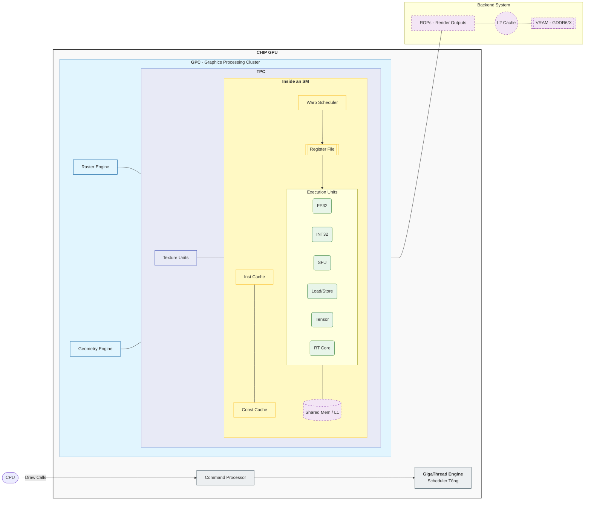
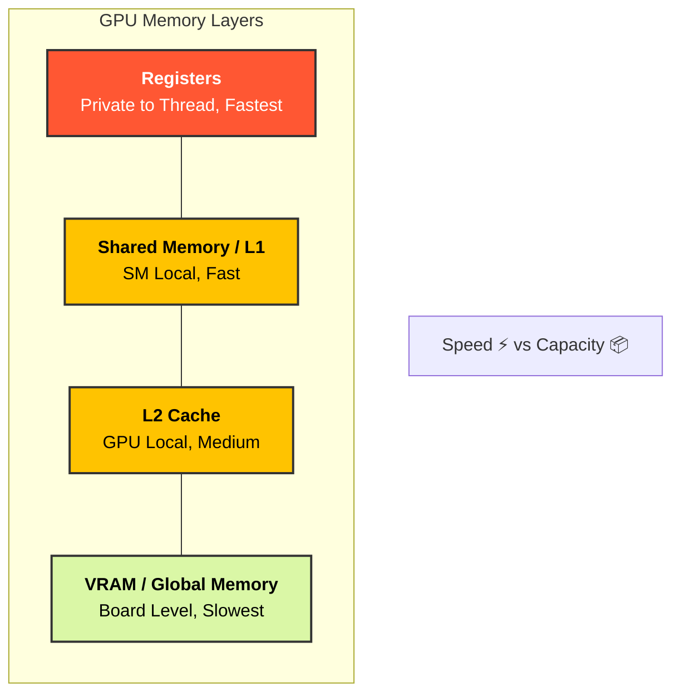

# Chương 4: GPU Architecture & Rendering Pipeline

> **Mục tiêu chương:** Hiểu kiến trúc phần cứng GPU khác CPU như thế nào, cách Rendering Pipeline biến dữ liệu 3D thành pixel, và tại sao mỗi quyết định trong Shader code ảnh hưởng trực tiếp đến hiệu năng game.

---

## 1. Tại sao cần GPU? — CPU không đủ cho đồ họa

### 1.1. Bài toán rendering

```
Render 1 frame Full HD (1920×1080) ở 60 FPS:

  Số pixel:        1920 × 1080 = 2,073,600 pixels
  Mỗi pixel cần:   ~50-200 phép tính (lighting, texturing, shadows, ...)
  Tổng phép tính:  2M × 100 = ~200 TRIỆU phép tính / frame
  Ở 60 FPS:        200M × 60 = ~12 TỶ phép tính / giây

  CPU 8 cores × 5 GHz × IPC 4 = ~160 tỷ ops/giây
  → CPU CÓ THỂ render, nhưng:
    - Hết sạch CPU cho graphics → không còn cho game logic
    - Mỗi pixel LÀ ĐỘC LẬP → song song hóa hoàn hảo
    - CPU chỉ có 8-16 cores → lãng phí tiềm năng song song

  GPU ~4000 cores × 1.5 GHz = không nhanh từng core, nhưng:
  → XỬ LÝ 4000 PIXELS CÙNG LÚC
  → Throughput (lượng công việc/giây) >> CPU gấp nhiều lần
```

### 1.2. Triết lý thiết kế: Latency vs Throughput

```
┌─────────────────────────────────────────────────────────────────────┐
│                CPU vs GPU — Hai triết lý đối lập                    │
├────────────────────────────┬────────────────────────────────────────┤
│         CPU                │              GPU                       │
│   "Làm 1 việc CỰC NHANH"  │   "Làm TRIỆU việc song song"         │
├────────────────────────────┼────────────────────────────────────────┤
│ ● 8-24 cores              │ ● 2,000-16,000 cores                  │
│ ● Clock cao: 4-6 GHz      │ ● Clock thấp hơn: 1.5-2.5 GHz        │
│ ● Out-of-Order execution  │ ● In-Order (đơn giản hơn)             │
│ ● Branch prediction       │ ● Branch = thảm họa                   │
│ ● Cache LỚN (32MB L3)     │ ● Cache NHỎ (6MB L2 shared)          │
│ ● Latency-oriented        │ ● Throughput-oriented                  │
├────────────────────────────┼────────────────────────────────────────┤
│                            │                                        │
│  Ẩn dụ:                    │  Ẩn dụ:                                │
│  1 giáo sư giải đề thi    │  10,000 học sinh lớp 1                 │
│  → CỰC NHANH từng bài     │  → Mỗi em giải 1 bài ĐƠN GIẢN       │
│  → Nhưng 1 người           │  → Tổng: xong 10,000 bài CÙNG LÚC    │
│                            │                                        │
├────────────────────────────┼────────────────────────────────────────┤
│ Phù hợp:                  │ Phù hợp:                               │
│ ✅ Game logic              │ ✅ Rendering (pixel processing)         │
│ ✅ AI phức tạp             │ ✅ Particle systems (100K particles)   │
│ ✅ Physics (broad phase)   │ ✅ Post-processing                     │
│ ✅ Networking              │ ✅ Compute Shaders (GPGPU)             │
│ ✅ File I/O                │ ✅ Machine Learning inference          │
└────────────────────────────┴────────────────────────────────────────┘
```

#### 1.2.1. So sánh cấp độ phần cứng (Hardware Hierarchy)

Để dễ hình dung sự tương phản cực hạn giữa hai thế giới, hãy nhìn vào cách chúng phân chia "quyền lực" từ thấp đến cao:

| Cấp độ | GPU (NVIDIA/AMD) | CPU (x86/ARM) | Bản chất sự tương phản |
| :--- | :--- | :--- | :--- |
| **Toàn bộ chip** | **Full GPU** (RTX 4090/RX 7900) | **Full CPU** (Intel i9 / Ryzen 9) | GPU là "Vận động trường", CPU là "Thư viện". |
| **Cụm lớn** | **GPC / Shader Engine** | **CCD / Core Cluster** | Cụm lớn chỉ có ở CPU cao cấp ( Ryzen / M4) để gom nhân dùng chung Cache. |
| **Đơn vị xử lý** | **SM / CU** (Multiprocessor) | **One Core** (Nhân CPU đơn lẻ) | 1 SM giải quyết ~1000 threads. 1 CPU Core giải quyết 1-2 threads. |
| **Đơn vị tính toán**| **CUDA Core / Stream Processor** | **ALU / Vector Unit (AVX)** | CUDA Core là "một con kiến". CPU ALU là "một con voi". |

> [!CAUTION]
> **Sai lầm phổ biến:** Đừng bao giờ so sánh **1 CUDA Core** với **1 CPU Core**. 
> Một CPU Core cực kỳ phức tạp và mạnh mẽ, nó tương đương (hoặc thậm chí thông minh hơn) cả một cụm **SM** của GPU. So sánh đúng phải là: **Hàng ngàn nhân tí hon (GPU) đấu với vài chục nhân khổng lồ (CPU)**.

> [!CAUTION]
> **Lưu ý về "Core Cluster":** Bạn nói đúng, với các CPU phổ thông (4-8 nhân), chúng thường được thiết kế "phẳng", nhân nào cũng như nhân nào. Tuy nhiên, ở các CPU hiệu năng cao hiện nay:
> - **AMD Ryzen:** Chia thành các **CCD** (mỗi cụm 8 nhân).
> - **Apple M4 / Intel Gen 14:** Chia thành cụm **P-Cores** (nhân mạnh) và **E-Cores** (nhân tiết kiệm điện).
> 
> Việc chia cụm này giúp CPU quản lý bộ nhớ đệm (L3 Cache) hiệu quả hơn, giống như cách GPU chia GPC để quản lý các SM vậy.

---

### 1.3. Control Unit — CPU có, GPU có không?

Câu trả lời là **CÓ**, nhưng cách thiết kế hoàn toàn khác nhau.

-   **Trong CPU:** Control Unit (CU) rất **LỚN và PHỨC TẠP**. Nó chiếm phần lớn diện tích chip để làm những việc như: Dự đoán rẽ nhánh (Branch Prediction), chạy lệnh không theo thứ tự (Out-of-order execution). CPU giống như "một bộ não siêu thông minh xử lý vài việc khó".
-   **Trong GPU:** Control Unit rất **NHỎ và ĐƠN GIẢN**. Thay vì một bộ điều khiển trung tâm khổng lồ, GPU chia nhỏ các bộ điều khiển nằm rải rác trong từng SM (thường gọi là **Warp Scheduler**).
-   **Tại sao lại khác nhau?**
    -   GPU muốn dành tối đa diện tích chip cho **ALU (nhân tính toán)**.
    -   Bằng cách loại bỏ các mạch điều khiển phức tạp, GPU có thể nhồi nhét hàng ngàn lõi tính toán, chấp nhận việc "kém thông minh" hơn CPU trong việc xử lý các logic rẽ nhánh khó.

---

### 1.3. Control Unit — CPU có, GPU có không?

(Nội dung đã có bên trên)

### 1.4. ALU (Arithmetic Logic Unit) — Quân đội tinh nhuệ vs Cỗ máy khổng lồ

ALU là nơi thực hiện các phép tính cộng, trừ, nhân, chia. Đây là "cơ bắp" của cả CPU và GPU.

-   **Trong CPU:**
    *   **Số lượng:** Rất ít (thường từ 1-100 nhân tính toán trên toàn bộ chip).
    *   **Sức mạnh:** Cực kỳ mạnh mẽ. Mỗi ALU của CPU có thể xử lý các phép tính phức tạp với độ chính xác rất cao (64-bit hoặc hơn) và độ trễ (latency) cực thấp.
    *   **Nhiệm vụ:** Giải quyết những bài toán hóc búa, cần kết quả ngay lập tức.
-   **Trong GPU:**
    *   **Số lượng:** Khổng lồ (hàng ngàn đến hàng chục ngàn nhân, ví dụ: CUDA Cores).
    *   **Sức mạnh:** Từng nhân đơn lẻ thì yếu hơn CPU, tập trung vào các phép tính đơn giản nhưng phổ biến trong đồ họa (như FP32 - số thực 32-bit).
    *   **Phân loại chuyên hóa:** GPU hiện đại chia ALU thành các đội quân chuyên biệt:
        *   **FP32:** Tính toán đồ họa thông thường.
        *   **INT32:** Tính toán số nguyên (chỉ số mảng, dữ liệu pixel).
        *   **Tensor Cores:** Chuyên cho ma trận (AI/Deep Learning).
        *   **RT Cores:** Chuyên tính toán tia sáng (Ray Tracing).

> [!IMPORTANT]
> **Điểm mấu chốt:** 
> Nếu bạn cần giải một phương trình vi phân phức tạp, hãy dùng **một vài ALU mạnh của CPU**. Nếu bạn cần cộng 2 triệu cặp số cùng một lúc (như thay đổi độ sáng của 2 triệu pixel), hãy dùng **hàng ngàn ALU nhỏ của GPU**.

---

### 1.5. Bản đồ các "ông lớn" GPU (Major Vendors)

Trong giới lập trình, không phải GPU nào cũng giống nhau. Mỗi hãng có một kiến trúc riêng, ảnh hưởng đến cách bạn viết shader.

| Thị trường | Hãng sản xuất | Kiến trúc tiêu biểu | Đặc điểm cho Dev |
| :--- | :--- | :--- | :--- |
| **Desktop / Server** | **NVIDIA** | Ada Lovelace (RTX 40), Blackwell (RTX 50) | Thống trị AI, CUDA cores, Ray Tracing cực mạnh. |
| | **AMD** | RDNA 3, RDNA 4 | Kiến trúc chiplet, mã nguồn mở (GPUOpen), Ray Tracing tốt. |
| | **Intel** | Xe-HPG (Arc), Xe3 | "Lính mới" đầy tiềm năng, tích hợp sâu với CPU Intel. |
| **Mobile / Tablet** | **Apple** | Apple silicon (A18, M4) | Unified Memory cực nhanh, Tile-Based Deferred Rendering (TBDR). |
| | **Qualcomm** | Adreno 8xx | Sliced Architecture, phổ biến nhất trên Android cao cấp. |
| | **ARM** | Mali, Immortalis | Kiến trúc chuẩn cho nhiều hãng (MediaTek, Exynos). |

---

## 2. Kiến trúc phần cứng GPU

Mặc dù có hàng ngàn cores, GPU không phải là một khối đồng nhất. Nó được chia theo cấu trúc phân cấp (Hierarchy) để quản lý việc truyền tải dữ liệu và lệnh hiệu quả.



### 2.1. Graphics Processing Cluster (GPC) — "Xưởng sản xuất" độc lập

Nếu GPU là một nhà máy khổng lồ, thì **GPC** là một phân xưởng gần như độc lập hoàn toàn. Một GPU mạnh sẽ có nhiều GPC để song song hóa công việc ở cấp độ cao nhất.

**SM nằm ở đâu trong GPC?**
Vị trí của SM trong GPC được tổ chức qua một lớp trung gian gọi là **TPC (Texture Processing Cluster)**. Thứ tự phân cấp như sau:
1. **GPC (Graphics Processing Cluster):** Cấp cao nhất, chứa các bộ máy quản lý chung (Raster Engine).
2. **TPC (Texture Processing Cluster):** Cấp trung gian nằm trong GPC.
3. **SM (Streaming Multiprocessor):** Nằm bên trong TPC. Một TPC thường chứa **1 hoặc 2 SM** tùy đời kiến trúc.

Mỗi GPC chứa các thành phần cốt lõi:
- **Raster Engine:** Biến các tam giác 3D thành các pixel (rasterization).
- **TPCs:** Đóng vai trò là "vỏ bọc" cho các SM và các đơn vị xử lý texture chuyên dụng.
- **Geometry Engine:** Xử lý việc tính toán hình học.

> [!TIP]
> **Mục đích của việc chia cụm (GPC vs CPU Cluster) có giống nhau không?**
> Về bản chất là **GẦN GIỐNG NHAU** — đều nhằm mục đích **quản lý sự hỗn loạn** khi số lượng nhân tăng lên quá lớn. Tuy nhiên, trọng tâm tối ưu hóa lại khác nhau:
> 
> | Đặc điểm | GPU (GPC) | CPU (CCD/Cluster) |
> | :--- | :--- | :--- |
> | **Mục đích chính** | **Scalability (Mở rộng):** Dễ dàng tạo ra card mạnh hơn bằng cách "gắn thêm" GPC mà không phải thiết kế lại chip. | **Cache Efficiency (Hiệu quả bộ nhớ):** Giúp các nhân trong cụm truy cập bộ nhớ đệm (L3) nhanh hơn so với việc đi tìm ở tận đầu kia của chip. |
> | **Quản lý công việc** | Một GPC là một "xưởng đồ họa" tự hành (có máy Raster riêng). | Một cụm nhân CPU chỉ là "nhóm làm việc chung" (vẫn dùng chung Control Unit của chính nó). |
> | **Giao tiếp** | Các GPC rất ít khi nói chuyện với nhau (mỗi ông render một vùng màn hình riêng). | Các nhân CPU phải nói chuyện với nhau liên tục (để đồng nhất dữ liệu - Cache Coherency). |
> 
> **Kết luận:** GPC giống như việc mở thêm **nhiều chi nhánh cửa hàng** độc lập, còn CPU Cluster giống như việc chia **nhân viên văn phòng vào từng phòng ban** để họ trao đổi tài liệu (cache) cho nhanh.

### 2.2. AMD RDNA Architecture: WGP và CU

Nếu bạn làm việc với GPU AMD (như RX 7000 series), thuật ngữ sẽ thay đổi nhưng triết lý song song vẫn tương đồng.

**AMD không dùng TPC/SM, họ dùng:**
1.  **Workgroup Processor (WGP):** Tương đương với cụm TPC của NVIDIA. Đây là đơn vị quản lý tài nguyên chính.
2.  **Compute Unit (CU):** Nằm bên trong WGP. Trong kiến trúc RDNA, **1 WGP = 2 CUs**.

> [!TIP]
> **Ẩn dụ: "Cặp bài trùng" trong xưởng sản xuất**
> Nếu NVIDIA coi mỗi **SM** là một đơn vị độc lập, thì AMD lại ghép đôi **2 CUs** vào một **WGP** để dùng chung các thiết bị "nặng" (như bộ nhớ đệm L1 rộng hơn, đơn vị điều phối dữ liệu).
> 
> Hãy tưởng tượng 2 người thợ (2 CUs) ngồi chung một bàn làm việc lớn (WGP). Họ có ngăn kéo riêng nhưng dùng chung bộ đèn siêu sáng và thùng dụng cụ chung. Việc này giúp họ trao đổi linh kiện cho nhau cực nhanh và tiết kiệm diện tích cho nhà máy (GPU).

**So sánh sự tương đương:**
| NVIDIA | AMD (RDNA) | Ý nghĩa |
| :--- | :--- | :--- |
| **GPC** | **Shader Engine** | Cụm phân xưởng lớn. |
| **TPC** | **WGP (Workgroup Processor)** | Cụm đơn vị tính toán (có 2 CUs). |
| **SM** | **CU (Compute Unit)** | "Bộ não" thực thi lệnh. |
| **Warp (32 threads)** | **Wavefront (Wave32/64)** | Nhóm threads chạy cùng một lệnh. |

### 2.3. Đơn vị xử lý cốt lõi: SM / CU

Trong NVIDIA, đơn vị này gọi là **SM**, trong AMD gọi là **CU (Compute Unit)**. Đây chính là "bộ não" thực sự. Một GPU mạnh (như RTX 4090) có khoảng 128 SMs.

Bên trong một SM chứa:
- **CUDA Cores / ALU:** Thực hiện các phép tính số thực (float) và số nguyên (int).
- **Special Function Units (SFU):** Tính các hàm toán học phức tạp như `sin`, `cos`, `log`, `sqrt`.
- **Register File:** Bộ bộ nhớ cực nhanh dành riêng cho mỗi thread. Nếu thread dùng quá nhiều biến, GPU sẽ giảm số lượng thread chạy song song (Occupancy).
- **Shared Memory / L1 Cache:** Bộ đệm tốc độ cao dùng chung giữa các threads trong cùng 1 SM.
- **Warp Scheduler:** "Người điều phối" quyết định nhóm thread nào được chạy tiếp theo.

### 2.4. Warp & Wavefront — Đơn vị thực thi cơ bản

Nếu SM là "phòng ban", thì **Warp** (NVIDIA) hay **Wavefront** (AMD) chính là "nhóm làm việc" cơ bản nhất.

-   **Định nghĩa:** Một nhóm gồm **32 threads** (NVIDIA) hoặc **32/64 threads** (AMD) luôn luôn di chuyển và làm việc cùng nhau.
-   **Quy tắc sắt đá:** Tất cả các threads trong cùng một Warp bắt buộc phải thực thi **cùng một lệnh** tại cùng một thời điểm (nhưng trên dữ liệu khác nhau).

#### Latency Hiding — Tuyệt chiêu "Che giấu độ trễ"

> [!QUESTION]
> **Hiểu đúng hay sai:** "Warp Scheduler bật một Warp khác và 'mặc kệ' Warp đang đợi VRAM?"
> **Trả lời:** **HOÀN TOÀN ĐÚNG!** (Và đây là điểm thiên tài của GPU).

Khác với CPU (phải tốn thời gian lưu trạng thái cũ ra RAM để chuyển sang việc mới), GPU có một kho thanh ghi (Register File) khổng lồ nằm ngay trên chip.
-   Khi Warp A cần lấy dữ liệu từ VRAM (mất ~500 cycles), nó sẽ bị đánh dấu là "Waiting".
-   Ngay lập tức (trong 1 cycle), Warp Scheduler chỉ tay sang Warp B đang có đủ dữ liệu và bảo: "Chạy đi!".
-   Warp A vẫn nằm đó, **không bị xóa đi, không bị chuyển ra RAM**, nó chỉ đứng im chờ dữ liệu về.
-   Khi dữ liệu về, nó lại giơ tay: "Em xong rồi!", và Scheduler sẽ quay lại xử lý nó khi rảnh.

→ **Zero-cost Context Switching:** Việc chuyển đổi này tốn **0 thời gian**. Đây là lý do GPU cần hàng chục ngàn threads để luôn giữ cho SM bận rộn trong lúc các threads khác đang đợi bộ nhớ.

> [!TIP]
> **Ẩn dụ: Ban nhạc giao hưởng**
> Hãy tưởng tượng một Warp là một ban nhạc gồm 32 nhạc công.
> - Ông chỉ huy (**Warp Scheduler**) giơ gậy bảo: "Tất cả đánh nốt Đô!". Cả 32 người cùng đánh nốt Đô.
> - Nếu có 16 người muốn đánh nốt Rê? Ông chỉ huy bắt 16 người đó im lặng, để 16 người kia đánh nốt Đô trước, sau đó mới đổi ngược lại. Đây chính là **Warp Divergence**.
> - Trong khi ban nhạc này đang nghỉ giải lao thay dây đàn (đợi dữ liệu từ RAM), ông chỉ huy sẽ quay sang điều khiển một ban nhạc khác ngay lập tức để sân khấu không bao giờ bị trống.

### 2.5. SIMT (Single Instruction, Multiple Threads)

Đây là mô hình thực thi của GPU, một biến thể nâng cao của SIMD (Single Instruction, Multiple Data).

- **Cơ chế:** Một lệnh duy nhất (ví dụ: `ADD`) được phát tới một nhóm threads (32 threads gọi là **Warp** ở NVIDIA, 64 threads gọi là **Wavefront** ở AMD).
- **Sự khác biệt với SIMD:** Trong SIMD (như SSE/AVX trên CPU), bạn phải viết code xử lý 1 mảng 4-8 phần tử thủ công. Trong SIMT, bạn viết code như thể cho **1 thread duy nhất**, và phần cứng tự động nhân bản nó lên 32-64 lần.

### 2.6. Warp Divergence — "Kẻ giết chết" hiệu năng

Vì 32 threads trong 1 Warp bắt buộc phải chạy **cùng một lệnh** tại một thời điểm, chuyện gì xảy ra nếu có lệnh `if-else`?

> [!CAUTION]
> **Ẩn dụ: Trung đội lính hành quân**
> Tưởng tượng 1 trung đội 32 lính đang đi đều bước.
> - Gặp ngã ba (`if-else`): 16 người rẽ trái, 16 người rẽ phải.
> - Nhưng vì họ phải "đi đều bước" theo hiệu lệnh chung, nên:
>   - **Phút 1:** 16 người bên phải phải **đứng im** chờ 16 người bên trái đi xong đoạn đường của họ.
>   - **Phút 2:** 16 người bên trái đi xong rồi thì **đứng im** chờ 16 người bên phải đi nốt.
> - Kết quả: Trung đội tốn gấp đôi thời gian để vượt qua ngã ba.

```hlsl
// Code Shader
if (distance < 10.0) {
    // Nhóm A: Làm việc nặng (Complex Lighting)
} else {
    // Nhóm B: Làm việc nhẹ (Simple Color)
}
```

**Hardware Reality:**
1. GPU không thể rẽ nhánh như CPU.
2. Nó sẽ chạy Nhóm A trước, trong khi Nhóm B phải **đứng im (masked out)**.
3. Sau đó nó chạy Nhóm B, trong khi Nhóm A **đứng im**.
4. → Tổng thời gian = Thời gian(A) + Thời gian(B). Hiệu năng giảm 50%!

> [!TIP]
> **Unity Optimization:** Trong Shader, hãy cố gắng dùng các hàm toán học như `step()`, `lerp()`, `clamp()` hoặc `math.select()` để thay thế `if-else`. Các hàm này thường tận dụng tốt Pipeline của GPU mà không gây Divergence.

---

## 3. Hệ thống bộ nhớ GPU (Memory Hierarchy)

GPU cực nhanh, nhưng nó luôn bị "đói" dữ liệu. Tốc độ tính toán của GPU tăng nhanh hơn nhiều so với tốc độ RAM (VRAM). Vì vậy, hiểu cách dữ liệu di chuyển là chìa khóa tối ưu.

> [!TIP]
> **Ẩn dụ: Đầu bếp trong nhà bếp**
> - **Registers (Trong tay):** Gia vị bạn đang cầm trên tay. Cực nhanh, dùng ngay.
> - **Shared Memory (Thớt):** Nguyên liệu đã để sẵn trên thớt. Cả nhóm đầu bếp (threads) có thể dùng chung.
> - **L2 Cache (Bàn bếp):** Đồ để ở góc bàn, cần với tay lấy một chút.
> - **VRAM (Tủ lạnh):** Phải đi ra mở tủ lạnh lấy (Xăng xe/Năng lượng tốn kém, mất thời gian ~500 cycles).
> - **System RAM (Siêu thị):** Cực xa, phải đi xe bus ra mua. GPU cực kỳ ghét việc này!



| Cấp bậc | Tốc độ | Phạm vi (Scope) | Đặc điểm |
| :--- | :--- | :--- | :--- |
| **Registers** | Siêu tốc | Private (1 thread) | Chứa biến cục bộ. Quá nhiều biến → Giảm threads. |
| **Shared Memory** | Rất nhanh | Group (1 SM) | Dùng để threads trao đổi dữ liệu (Compute Shaders). |
| **L1/L2 Cache** | Nhanh | Shared | Tự động lưu cache cho dữ liệu từ RAM. |
| **VRAM (GDDR6)** | Chậm (~500 cycle) | Toàn bộ GPU | Nơi chứa Texture, Mesh, Buffers. |

### 3.1. Bandwidth — Nút thắt cổ chai thực sự

(Nội dung đã có bên trên)

### 3.2. Data Alignment — "Xếp gạch" trong bộ nhớ

Khác với CPU có thể đọc dữ liệu ở bất kỳ địa chỉ nào (dù hơi chậm), GPU là một cỗ máy **cực kỳ khó tính** về việc sắp xếp dữ liệu (Alignment). Nó đọc bộ nhớ theo từng khối (thường là 16 bytes).

**Quy tắc "xếp gạch" (std140 / HLSL packing):**
-   Mỗi biến phải nằm gọn trong một ô 16-byte (bằng kích thước `float4`).
-   Không được "vắt chân" qua 2 ô khác nhau.

#### Vấn đề của `float3`:
Nhiều bạn nghĩ dùng `float3` (12 bytes) sẽ tiết kiệm hơn `float4` (16 bytes). **SAI LẦM!**

```csharp
// C# Struct (CPU)
struct MyData {
    public Vector3 pos;  // 12 bytes
    public float scale;  // 4 bytes
}; 
// Tổng = 16 bytes. Đẹp!
```

```hlsl
// HLSL Struct (GPU)
struct MyData {
    float3 pos;    // Chiếm 12 bytes, NHƯNG...
    // GPU tự động chèn 4 bytes padding vào đây để đủ align 16!
    float scale;   // Bị đẩy sang ô 16-byte tiếp theo.
};
// Tổng thực tế = 32 bytes (16 + 16). Lãng phí 50% băng thông!
```

> [!QUESTION]
> **Tại sao con số lại là 16 bytes?**
> Đây không phải là con số ngẫu nhiên. Nó đến từ phần cứng:
> 1.  **SIMD Architecture:** GPU được thiết kế để xử lý Vector (4 số float) cùng một lúc. Mạch tính toán của nó rộng 128-bit (4 x 32-bit floats = 16 bytes).
> 2.  **Memory Coalescing:** Các con đường dẫn dữ liệu (Memory Bus) từ VRAM vào SM cũng được thiết kế theo bội số của 16. Nếu bạn lấy đúng 16 bytes, GPU chỉ cần **1 lệnh** để xúc toàn bộ dữ liệu lên.
> 3.  **Chi phí rẻ nhất:** Nếu bạn dùng `float3` (12 bytes), GPU sẽ phải tốn thêm mạch logic để "cắt" 4 bytes thừa ra, hoặc phải tính toán địa chỉ phức tạp hơn. Thà nó "vứt bỏ" 4 bytes đó (padding) còn rẻ hơn là chế tạo thêm mạch xử lý phức tạp.
>
> -> **Kết luận:** 16 bytes (float4) là "đơn vị giao dịch" tự nhiên nhất của GPU.

> [!IMPORTANT]
> **Unity Best Practice:**
> 1.  Luôn cố gắng dùng **`float4`** hoặc gom dữ liệu cho chẵn 4 số (`float4` hoặc `float2` + `float2`).
> 2.  Tránh dùng `float3` trong struct gửi từ C# sang Shader. Nếu dùng, hãy tự chèn thêm 1 biến `float` vô nghĩa (padding) ở C# để khớp với cách GPU hiểu.
> 3.  **Quy tắc vàng:** Sắp xếp biến từ to đến nhỏ (Vector4 -> Vector3 -> Vector2 -> Float).

---

## 4. Rendering Pipeline — Chuỗi dây chuyền sản xuất Pixel

Rendering Pipeline là một chuỗi các bước biến dữ liệu 3D (Vertices, Textures) thành hình ảnh 2D trên màn hình. Hiểu pipeline giúp bạn biết nên tối ưu ở đâu (Vertex-bound hay Fragment-bound).

### 4.1. Các giai đoạn chính

1.  **Input Assembler (IA):** Thu thập các đỉnh (vertices) từ Mesh và nhóm chúng thành các hình cơ bản (Triangles, Lines).
2.  **Vertex Shader (Programmable):** Biến đổi tọa độ đỉnh từ không gian 3D sang 2D màn hình. Thực hiện các hiệu ứng như gió làm rung lá cây.
3.  **Rasterization (Hardware Fixed-Function):** Chia tam giác thành các **Fragments** (ứng viên cho pixel). Đỉnh nào nằm trong tam giác thì được giữ lại.
4.  **Fragment Shader (Programmable):** "Tô màu" cho từng fragment. Đây là nơi nặng nhất vì xử lý Lighting, Texturing, Shadows.
5.  **Output Merger:** Thực hiện Depth Test (cái nào che khuất cái nào) và Blending (trong suốt) để ghi kết quả cuối cùng vào Framebuffer.

### 4.2. Unity Context: Tối ưu giai đoạn nào?

-   **Nghẽn ở Vertex Shader:** Do Model quá nhiều poly (High-poly) hoặc dùng quá nhiều hiệu ứng uốn lượn trong shader.
-   **Nghẽn ở Fragment Shader:** Do dùng shader quá phức tạp, texture độ phân giải quá cao, hoặc hiệu ứng khói/lửa quá dày đặc.

---

## 5. Mobile GPU Architecture — Tile-Based Rendering (TBR)

Hầu hết GPU smartphone (Adreno, Mali, Apple GPU) không dùng kiến trúc **Immediate Mode (IMR)** như desktop (NVIDIA/AMD). Chúng dùng **Tile-Based Rendering (TBR)** để tiết kiệm pin.

### 5.1. Tại sao cần TBR?
Smartphone không có VRAM riêng biệt mà dùng chung RAM với CPU. Truy cập RAM ngoài cực kỳ tốn năng lượng (nóng máy, hao pin). 
**TBR giải quyết bằng cách:** Chia màn hình thành các ô nhỏ (Tiles - ví dụ 16x16 pixel) và xử lý gọn từng ô trong bộ nhớ đệm (Cache) cực nhanh trên chip trước khi ghi vào RAM.

### 5.2. Hai bước của TBR

1.  **Binning Pass (Geometry Pass):** GPU tính toán xem tam giác nào thuộc về ô (tile) nào. Kết quả lưu vào một danh sách (Tile List).
2.  **Rendering Pass:** GPU lấy từng ô ra, render tất cả các tam giác trong ô đó vào Cache, sau đó mới "đổ" (Resolve) kết quả vào RAM chính.

### 5.3. Unity Optimization cho Mobile

-   **Draw Call Batching là bắt buộc:** Mỗi Draw Call gây ra overhead lớn cho việc quản lý Tile List.
-   **Tránh Overdraw:** Tránh việc chồng chéo quá nhiều lớp kính/khói trong suốt. Trong TBR, overdraw cực kỳ tốn băng thông vì GPU phải tính toán màu sắc cho cùng một pixel nhiều lần trong cache.
-   **Alpha Testing (`clip()`):** Trên mobile, Alpha Testing (như làm tán lá) đôi khi chậm hơn Alpha Blending vì nó phá vỡ khả năng tối ưu hóa ẩn bề mặt (Early-Z) của kiến trúc Tile.

---

## 6. Tổng kết: Tại sao Shader Code ảnh hưởng đến Phần cứng?

Mỗi dòng code Shader bạn viết đều được "phun" vào hàng ngàn SM Cores cùng lúc.
- Lệnh `if` gây **Warp Divergence** → SM chạy chậm lại.
- Texture chưa nén gây **Bandwidth Bottleneck** → SM ngồi đợi dữ liệu.
- Shader quá dài gây **Register Pressure** → SM giảm số thread chạy song song.

**Quy tắc vàng:** Luôn nghĩ về **Throughput** (Làm sao để SM luôn bận rộn với dữ liệu liên tục).
